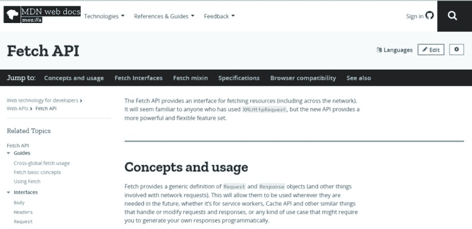
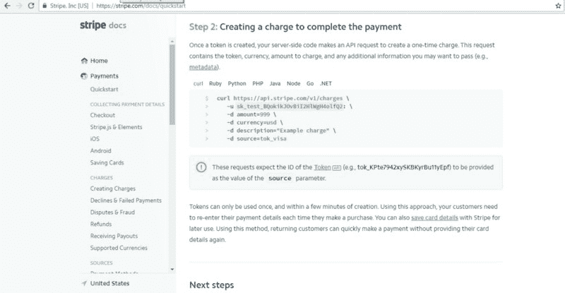
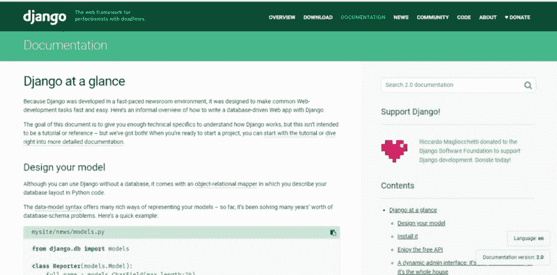

# 为什么文档很重要，为什么应该在代码中包含它

> 原文：<https://www.freecodecamp.org/news/why-documentation-matters-and-why-you-should-include-it-in-your-code-41ef62dd5c2f/>

谈到软件开发，有太多的缩略语。吻，干，固体…等等等等。但是，当涉及到记录或注释代码时，没有简单的口号。

这是为什么呢？

对于开发者来说，文档应该和开发的其他方面一样重要

在这篇文章中，我将讨论为什么记录你的代码会使你成为一个更好的开发者，并且有助于成为一个优秀的团队成员。

### 没人有时间做这个

代码没有文档化的主要原因是因为时间。

当开发一个需要在一定时间内完成的特性时，我们很少有时间停下来专注于记录我们的代码。

除了设计和编写代码本身，我们还需要经历代码审查、自动化测试和添加单元测试(仅举几例)。文档几乎被排除在等式之外。

对细节考虑最少的人在未来可能会有最大的不同。

不管你正在开发什么，有可能有一天你或你的一个同事将不得不重新审视它。当那一天到来时，你将不会如此清晰地记得你写了什么，为什么写。

如果你记得的话，可能会有一些不太明显的边缘情况或特定用途。显而易见的解决方案是**文档**。

花额外的时间来写一份关于你所做工作的适当描述将会在未来节省大量的时间。

下次有人想了解你的代码内部发生了什么，你所要做的就是把他们引向文档。这会为你节省时间，因为你不需要解释事情，也会为他们节省时间，因为他们不再依赖你。

毕竟，作为一名开发人员，当你需要了解编码的某个方面时，你会怎么做？

> ？你去看文档了吗？

### 好的代码不需要文档

是的，我知道，我知道…写得好的代码，简洁且经过深思熟虑，不需要记录在案。它读起来像一个故事。

虽然可能如此，但它并没有放弃对文档的需求，原因如下:

1.  我们都太熟悉组成特性的代码的健壮性了。查看代码的一个部分，可能无法清楚地看到与它有深层联系的其他部分。
2.  您创建的每个服务都有一个独特的 API。编写如何使用该 API 需要可以在代码之外阅读的文档。你不想用关于如何使用 API 的细节来夸大类本身。
3.  在不同部门工作的同事(他们可能不是开发人员)可能想了解您做了什么以及它是如何工作的。
4.  仅仅是行为本身就可能让你对你写的代码有不同的看法。解释你的代码是做什么的，会让你评估它的有效性，如果代码不符合你的期望，你可能会考虑修改代码。
5.  为了子孙后代

“A person writing with a pencil in a notebook with pencil shavings on it” by [Thought Catalog](https://unsplash.com/@thoughtcatalog?utm_source=medium&utm_medium=referral) on [Unsplash](https://unsplash.com?utm_source=medium&utm_medium=referral)

### 如何写好文档

好的文档就像一块好的代码。简短、简单、易懂。这里有一些你可以遵循的指导方针:

*   了解文档的目标对象。是不是只针对开发者？是否有更广泛的受众？理解这一点将会节省你的时间，因为你将会预先知道在你的解释中要详细阐述多少。
*   写一个简短但描述性的背景，解释你所构建的要点。这将有助于读者理解该功能的目的，并确定其与他们想知道的内容的相关性。
*   列出并描述您的功能的主要观点，确保指出与其他功能存在的任何依赖关系。
*   确保有时间戳，告诉读者文档的有效性。此外，如果您正在使用某些库，请确保也包含它们的版本。
*   慷慨地给出你的编码例子，详细说明如何正确地使用你编写的特性并展示预期的结果。

### 例子

为了进一步理解好的文档是怎样的，我们将回顾一些很棒的例子: [Mozilla 的开发者网络(MDN)](https://developer.mozilla.org/en-US/docs/Web/API/Fetch_API) 、 [Django](https://docs.djangoproject.com/en/2.0/) 和 [Stripe](https://stripe.com/docs) 。

Notice the quick links at the top for easier navigation

在 MDN 的文档中，您可以清楚地看到，每一页都以关于主题的简短解释开始。

然后，它继续详述用例及方法。最后，它显示了哪些浏览器与该功能兼容，并提供了相关资料的链接。

In Stripe’s documentation, each subject has code snippets that can be viewed in various coding languages

Django 的文档非常健壮。不管你的编码水平如何，他们都会给你一个概述和教程。

然后，他们仔细检查每个主题，详细描述它，给出简短的代码片段，演示需要做什么

我希望我已经强调了文档的重要性，并给了你一些如何开始编写代码的提示。如果你对文档的首字母缩写有什么想法，请在下面的评论中提出来。

也许孩子——Keep**I**t**D**ocumed？

如果你喜欢这篇文章，请鼓掌让其他人也能欣赏它！？？？