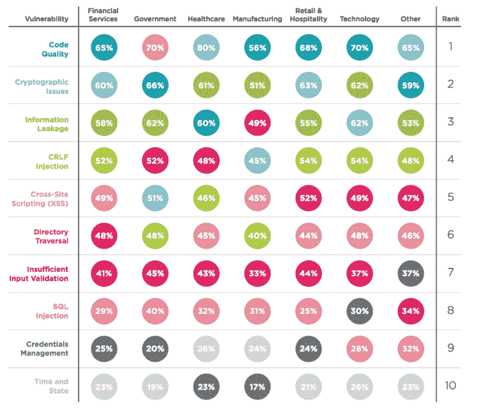
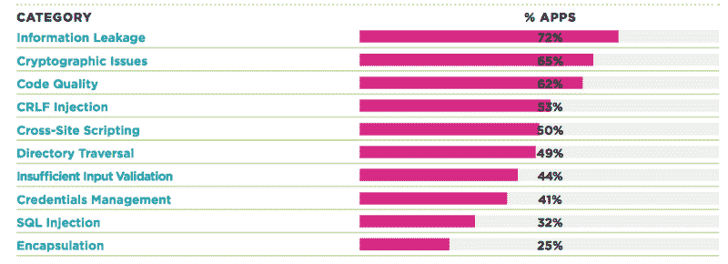
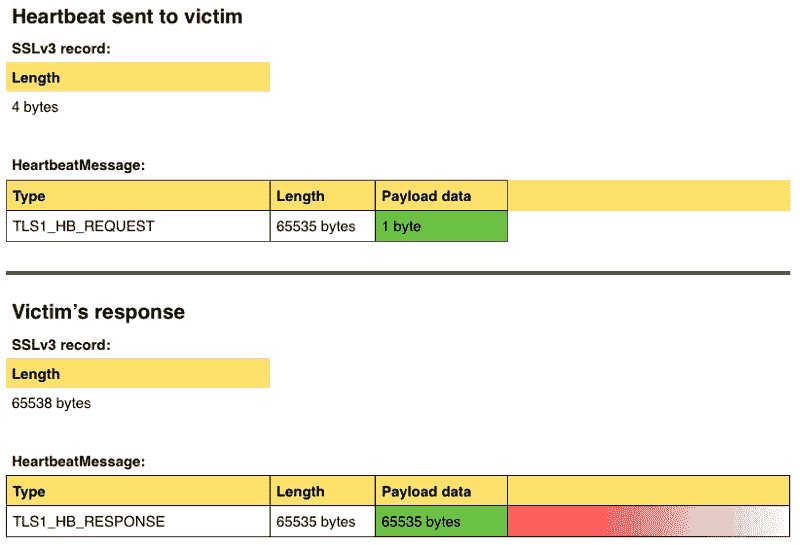
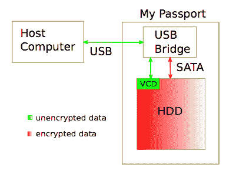
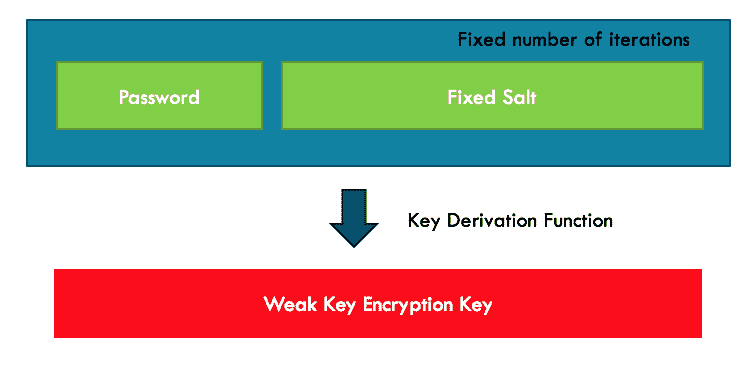
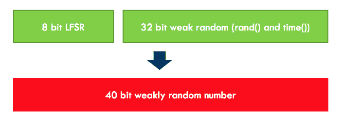
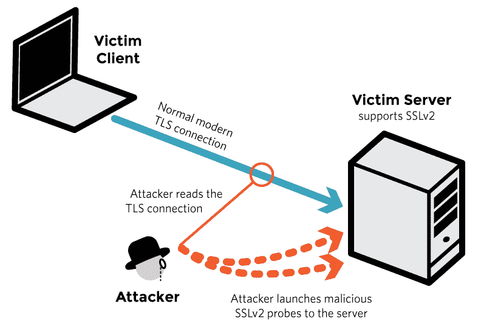
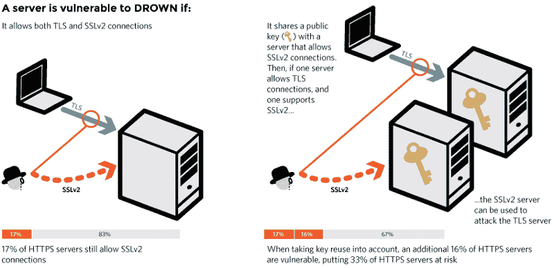

# 密码软件失败的方式有很多很多

> 原文：<https://www.freecodecamp.org/news/why-does-cryptographic-software-fail-often-d660d3cdfdc5/>

纳比尔·尤素福

# 密码软件失败的方式有很多很多


Breaking cryptographic software via methods other than cryptoanalysis

当加密软件失败时，该怪谁？

算法？

密码术库？

应用程序错误地使用这些库？

还是完全是别的什么东西？

我们每天都依赖加密算法和协议来实现互联网上的安全通信。我们能够在线访问我们的银行账户，因为密码术保护了我们。我们能够给我们的朋友发送私人信息，因为密码术保护我们。我们能够使用信用卡和比特币买卖东西，因为加密技术保护了我们。

让我给你举一个具体的例子。当您通过最喜欢的浏览器查看电子邮件时，浏览器和电子邮件服务器之间的连接使用 TLS(传输层安全性)协议进行保护，因此没有人能够在您不知情的情况下窃听或修改您的电子邮件。

简而言之，如果没有加密技术，我们今天所知道的互联网是不可能的。互联网上的法律和秩序依赖于密码学。

但是这个我们都非常依赖的工具也非常脆弱。我们的加密软件经常让我们失望。有时候[真的让我们失望。](http://money.cnn.com/2013/12/22/news/companies/target-credit-card-hack/)

你有没有想过为什么[加密软件](https://www.cl.cam.ac.uk/~rja14/Papers/wcf.pdf)——包括 TLS 协议的实现——[——一次又一次地失败](https://www.schneier.com/essays/archives/1998/01/security_pitfalls_in.html)？

根据 Veracode 的安全报告，我们的加密软件和两年前一样脆弱。



Veracode ranked cryptographic issues as #2 vulnerability found in apps in 2015



Veracode again ranked cryptographic issues as #2 vulnerability found in apps in 2o16

这些失败是因为底层加密算法的弱点吗？

好吧，过去的几次攻击([苹果 iOS TLS](https://www.imperialviolet.org/2014/02/22/applebug.html) 、 [WD 自加密驱动器](http://hardwear.io/wp-content/uploads/2015/10/got-HW-crypto-slides_hardwear_gunnar-christian.pdf)、 [Heartbleed](https://www.us-cert.gov/ncas/alerts/TA14-098A) 、 [WhatsApp 消息](https://www.theguardian.com/technology/2017/jan/16/whatsapp-vulnerability-facebook)、 [Juniper 的 ScreenOS](https://www.google.com/webhp?sourceid=chrome-instant&ion=1&espv=2&ie=UTF-8#q=juniper%20screenos%20vulnerability) 、 [DROWN](https://drownattack.com/) 、 [Android N-encryption](http://karl-voit.at/2016/02/27/android-encryption/) 等等)向我们表明，由于底层加密算法的弱点，我们的加密软件不太可能被破解。换句话说，密码分析是对我们的加密软件不太可能的威胁之一。


A sketch of the AES algorithm ([image credit](http://www.moserware.com/2009/09/stick-figure-guide-to-advanced.html)) AKA why you don’t want to roll your own cryptography.

你听说过攻击者破解 256 位 AES 加密算法来恢复隐藏在其中的秘密吗？据我所知没有。(当然，如果你使用易受攻击的过时加密协议，如 [DES](https://en.wikipedia.org/wiki/Data_Encryption_Standard) 或 [RC4](http://www.securityweek.com/new-attack-rc4-based-ssltls-leverages-13-year-old-vulnerability) ，密码分析可能有助于破解软件)。如果罪魁祸首不是密码分析，那是什么？


Your security is only as good as its weakest link.

除了密码分析什么都有。换句话说，密码分析并不是密码软件最薄弱的环节。坏演员使用许多其他薄弱环节来破解加密软件。

### **失败原因#1:加密库中的错误**

一个流行的例子是心脏出血病毒。


[心脏出血](http://heartbleed.com/)怎么了？这个错误([CVE-2014–0160](https://cve.mitre.org/cgi-bin/cvename.cgi?name=cve-2014-0160))是由于在广泛使用的 OpenSSL(占互联网的 66%)中 TLS 心跳扩展的不正确实现而引入的，OpenSSL 用于支持 web 服务器中的 TLS。这个扩展是做什么的？顾名思义，这是一个保持活动的特性，其中连接的一端发送任意数据的有效载荷，而另一端应该发送数据的精确副本，以证明一切正常。

这个 bug 原来是一个古老的错误，在使用非净化数据的`memcpy()`之前没有绑定检查。易受攻击的 OpenSSL 实现[不会根据实际有效载荷](http://www.theregister.co.uk/2014/04/09/heartbleed_explained/)来验证有效载荷长度。攻击者可以谎报长度，让受害者从其内存中发送更多字节，如下图所示。



Attacker sends only one byte payload but sets the length to 65535; the victim blindly copies 65535 from its memory and sends back to the attacker.

这反过来允许攻击者从浏览器内存中的任何网站获取会话密钥和其他秘密信息(如您的用户名和密码)。

让我给你看看代码。该修补程序本质上是添加到修补版本 1.0.1g 的绑定检查，如下所示。

```
====== Vulnerable code =======/* Enter response type, length and copy payload */*bp++ = TLS1_HB_RESPONSE;s2n(payload, bp);memcpy(bp, pl, payload);
```

```
====== Patched code =========hbtype = *p++;n2s(p, payload);if (1 + 2 + payload + 16 > s->s3->rrec.length)  return 0; /* silently discard per RFC 6520 sec. 4 */pl = p;
```

经验教训:在使用之前一定要检查你的琴弦。净化对于阻止不良输入进入您的系统至关重要。

### **失败原因#2:操作系统和应用**

你可能还记得 2014 年 2 月披露的苹果公司在 SSL/TLS 实现中的“goto”错误([CVE-2014–1266](https://cve.mitre.org/cgi-bin/cvename.cgi?name=CVE-2014-1266))。

带有“goto”bug 的苹果代码:

```
1 static OSStatus2 SSLVerifySignedServerKeyExchange(SSLContext *ctx, bool isRsa,                                  SSLBuffer signedParams,3                       uint8_t *signature, UInt16 signatureLen)4 {5   OSStatus err;6 …78   if ((err = SSLHashSHA1.update(&hashCtx, &serverRandom)) != 0)9     goto fail;10  if ((err = SSLHashSHA1.update(&hashCtx, &signedParams)) != 0)11    goto fail;12    goto fail;13  if ((err = SSLHashSHA1.final(&hashCtx, &hashOut)) != 0)14    goto fail;15  …1617 fail:18   SSLFreeBuffer(&signedHashes);19   SSLFreeBuffer(&hashCtx);20   return err;21 }
```

那么，这里的问题是什么？第 12 行的额外 goto 语句绕过了 iOS 和 Mac 设备中 SSL/TLS 连接的所有证书检查。这使得第 13 到 16 行实际上成为死代码。这个简单的实现错误接受任何无效的证书，使得连接容易受到中间人攻击。

我很想知道加密软件中的实现错误是否更多是由于加密库本身的错误，而不是应用程序使用它们的方式。麻省理工学院的研究人员分析了 2011 年 1 月至 2014 年 5 月间常见漏洞和暴露数据库中报告的 269 个加密漏洞。他们发现只有 17%的错误是由加密库本身引起的。其余 83%是由于应用程序开发人员滥用加密库。

但是，仅仅因为大多数错误是由于应用程序中误用加密库造成的，并不意味着我们可以责怪应用程序开发人员，继续我们的生活。

上述关于密码滥用的统计数据背后可能有许多原因。加密库本身可能不提供安全的默认选项，可能没有足够的文档，或者可能难以使用。此外，许多开发人员可能对在他们的软件中应用加密技术没有正式的理解，即使他们是软件开发本身的专家。这些都可能导致误用加密库。

经验教训:总是使用工具来分析你的代码。死代码分析工具应该已经捕捉到了这种特定的情况。

### **失败原因#3:不良设计**

2015 年，研究人员发现了 WD 自加密驱动器的一系列问题。他们在使用密码算法时存在严重的设计缺陷。我在[的上一篇文章](https://decentralize.today/encryption-is-useless-completely-useless-part-1-14a5e3bd069b#.h94ta28eu)中写了这个。让我在这里展示几个缺陷。



WD’s self encrypting drive architecture

遵循最佳实践，WD 确实使用了两级密钥来加密硬盘中存储的文件——主 KEK(密钥加密密钥)和每个文件 DEK(数据加密密钥)。此外，他们确实使用了一个密钥派生函数来从密码中派生 KEKs。

但是他们设计密钥派生函数的方式本身是完全不安全的。他们使用固定的盐和固定的迭代次数。因此，它容易受到基于预先计算的哈希表的攻击。攻击者能够比纯粹的暴力攻击更快地恢复密钥。



WD’s vulnerable key derivation algorithm

如果这个漏洞还不够，WD 使用了一个糟糕的随机数生成器来生成 kek。它不仅是可预测的，也没有足够的复杂性(只有 40 位)。

密码协议非常依赖于密码安全的伪随机数发生器。如果这些不够安全，任何使用这些随机数的加密算法或协议都很容易被破解。



WD’s weak random number generator

**经验教训:**对加密结构有很好的理解，并知道它们的局限性。遵循密钥派生的行业最佳实践。

### **失败原因#4:错误配置或不安全的默认配置**



Exploiting the weaknesses of SSLv2 ([source](https://drownattack.com/))

[通过 SSLv2 破坏 TLS 连接的淹没攻击](https://drownattack.com/drown-attack-paper.pdf)就是一个很好的例子。您可能使用相当安全的 TLS 连接与 web 服务器通信，但是如果 web 服务器仍然支持(它不应该支持)旧的 SSLv2，攻击者就可以利用它来破坏 TLS 提供的安全性，并获取您的密钥和其他敏感信息。

SSLv2 长期以来一直被认为是有问题的，现在没有一个客户端使用它进行安全连接。但是研究人员发现，在他们调查的 3600 万台 HTTPS 服务器中，有 600 万台(约 17%)仍然支持 SSLv2。



上述研究还揭示了另一种常见的懒惰做法，即在一个组织的不同服务器中使用相同的密钥对。它展示了即使一个服务器只支持 TLS，如果有其他服务器使用共享证书支持 SSLv2，那么只支持 TLS 的服务器也容易受到攻击。

**经验教训:**系统的安全性取决于其最薄弱的环节。试着保护你所有的系统，至少保护得相当好。

### 加密软件还有很多其他的失败方式

你能想出一些额外的方法吗？

它因用户而失败。怎么会？想想社会工程攻击。 [RSA SecureID 漏洞据说源自利用用户的钓鱼电子邮件和零日漏洞](http://www.theregister.co.uk/2011/04/04/rsa_hack_howdunnit/)。

它的失败是由于不切实际的威胁模型([破坏建立在加密数据之上的 web 应用](https://eprint.iacr.org/2016/920.pdf))。

由于硬件([破坏了硬件实施的技术，如带有虚拟机管理程序的 TPM](https://www.blackhat.com/docs/us-16/materials/us-16-Sharkey-Breaking-Hardware-Enforced-Security-With-Hypervisors.pdf))而导致失败。

由于侧信道([对 RSA、DH 和 DSS 算法的定时攻击](http://www.cryptography.com/resources/whitepapers/TimingAttacks.pdf))而失败。

如您所见，加密软件可能会由于多种原因而失败。我们真的注定永远无法得到正确的加密软件吗？或者我们至少可以减少这种失败的次数？为什么我们不能从过去吸取教训，避免同样的错误一再发生？什么工具可以帮助我们发现这些问题？

我们的情况实际上并没有那么糟糕。有一些方法可以防止上面讨论的大多数故障。在后续的文章中，我将探讨如何让加密软件更少失败的话题。

感谢阅读。如果你觉得这篇文章有用，请点击？以便其他人可以在媒体上看到。

#### **延伸阅读**

*   [安德森，为什么密码系统会失败，CCS 1993](http://Why Cryptosystems Fail - University of Cambridge Computer Laboratory)
*   [耶戈等人。艾尔。，为什么加密软件会失败？案例研究和未决问题，APSys，2014](https://www.google.com/url?sa=t&rct=j&q=&esrc=s&source=web&cd=1&cad=rja&uact=8&ved=0ahUKEwidioe4yOnRAhXIcBoKHYalBWAQFggbMAA&url=https%3A%2F%2Fpeople.csail.mit.edu%2Fnickolai%2Fpapers%2Flazar-cryptobugs.pdf&usg=AFQjCNGJvctaCQ8jDTUsZUgLX_AVl-LdKQ&sig2=jNxWe1fBL5LSymGIjNdhig)
*   [埃格尔等人。艾尔。《Android 应用中密码滥用的实证研究》，CCS，2013 年](https://www.google.com/url?sa=t&rct=j&q=&esrc=s&source=web&cd=2&cad=rja&uact=8&ved=0ahUKEwi_093EyOnRAhXDQBoKHVyBDEkQFggnMAE&url=https%3A%2F%2Fcs.ucsb.edu%2F~chris%2Fresearch%2Fdoc%2Fccs13_cryptolint.pdf&usg=AFQjCNEmwGK1lobalVteyWAzgvzThSPafg&sig2=5eV_mxv-XvkdcjprP_7SMQ)