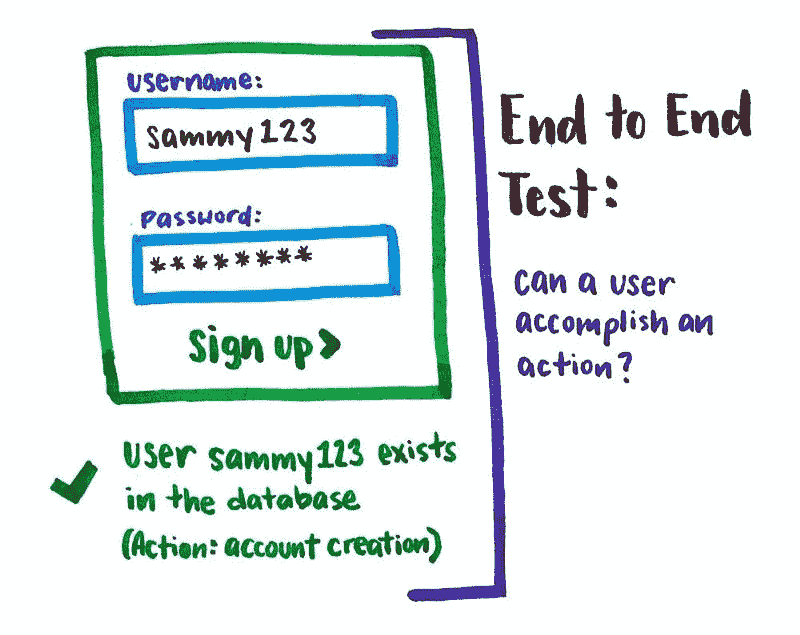
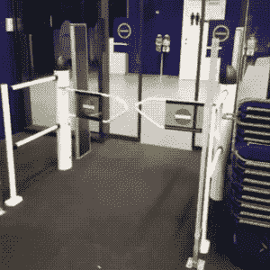
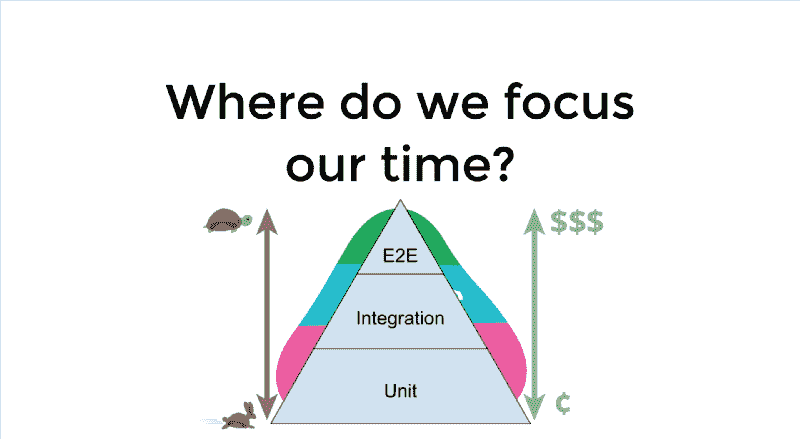
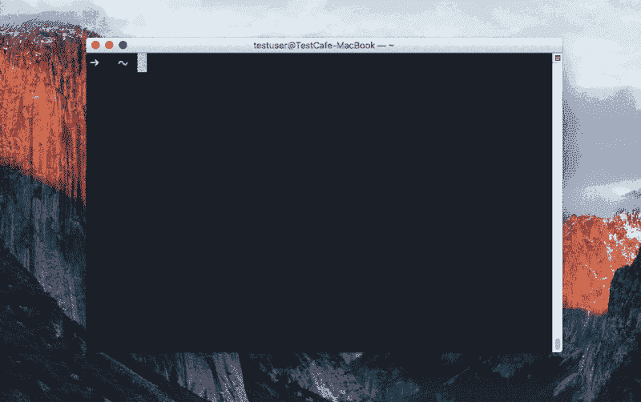
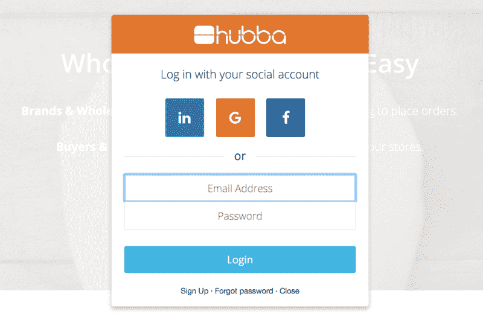
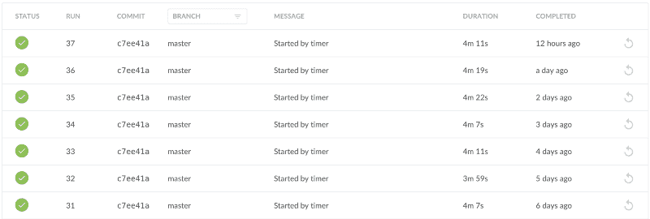

# 为什么端到端测试对您的团队很重要

> 原文：<https://www.freecodecamp.org/news/why-end-to-end-testing-is-important-for-your-team-cb7eb0ec1504/>

通过电话 huynh

# 为什么端到端测试对您的团队很重要

#### 我们的团队如何通过 4 个简单的步骤实现端到端测试

在 [Hubba](https://www.hubba.com/) ，我们的业务需求总是在不断发展，发展的速度需要跟上它。保持团队前进而不破坏一切的方法之一是端到端(E2E)测试。

拥有一个包含 E2E 测试的完整测试套件使我们能够快速行动。它允许开发人员**推送代码，而不用担心破坏东西**。让**放飞更有信心**。并且，**捕捉在手动回归测试中**遗漏的错误。

### E2E 在测试什么？

端到端测试是从头到尾测试整个应用程序的地方。它涉及到确保一个应用程序的所有组成部分都按照预期的那样工作。

端到端测试模拟真实的用户场景，本质上是测试真实用户将如何使用应用程序。

[E2E Test](https://twitter.com/Una/status/850451564527591424)

Hubba 案例的一个例子是用户注册的 E2E 测试案例。

测试将包括:

*   在浏览器中打开 Hubba 并搜索某些元素
*   执行一组点击和键盘类型
*   确保成功创建用户

### 你为什么要在乎？

在 Hubba，我们坚信测试自动化。我们目前为代码编写单元测试和集成测试。

这些测试用于:

*   指定我们的系统
*   防止错误和回归
*   执行持续集成

此外，这些测试尽可能频繁地运行，以提供反馈并确保我们的系统保持干净。

增加一层 E2E 测试的动机在于拥有一个完全自动化的测试套件的好处。这些好处包括**提高开发速度**，以及前面提到的其他好处。

Source: [Giphy](https://giphy.com/gifs/fail-technology-i5RWkVZzVScmY)

E2E 测试允许我们覆盖单元测试和集成测试没有覆盖的应用程序部分。这是因为单元测试和集成测试只提取了应用程序的一小部分，并孤立地评估这一部分。

即使这些部分单独工作得很好，你也不一定知道它们是否能作为一个整体一起工作。在单元测试和集成测试之上有一套端到端测试允许我们测试我们的整个应用程序。

> 代码失败得越快，我们在 QA 中发现的错误越少，我们的 QA 周期就越快- [爱德华·罗宾逊](https://medium.com/@earobinson)

[Test Automation Pyramid](https://blog.kentcdodds.com/write-tests-not-too-many-mostly-integration-5e8c7fff591c)

这是肯特·c·多德博客中的测试金字塔，它是来自[马丁·福勒博客](https://martinfowler.com/bliki/TestPyramid.html)和[谷歌测试博客](https://testing.googleblog.com/2015/04/just-say-no-to-more-end-to-end-tests.html)的金字塔的组合。

你的大部分测试都在金字塔的底部。随着你在金字塔上的移动，测试的数量变得越来越少。沿着金字塔向上，测试变得越来越慢，编写、运行和维护的成本也越来越高。

我们希望编写非常少量的端到端测试，因为它们运行缓慢，并且预计会发生变化。这一点尤其重要，因为作为一家初创公司，我们希望快速发展。

> Google 经常建议 70/20/10 的划分:70%的单元测试，20%的集成测试，10%的端到端测试。每个团队具体组合会有所不同，但总的来说，它应该保持金字塔形状。- [谷歌测试博客](https://testing.googleblog.com/2015/04/just-say-no-to-more-end-to-end-tests.html)

### 开始行动的 4 个步骤

#### 1.选择测试框架

我们开始采取的第一个行动是评估各种 E2E 测试框架。我们的评估并不包括查看一个框架的所有特性，更多的是一个高层次的印象。主要标准是选择一个易于建立和快速启动的框架。

我们快速浏览了以下框架: [CasperJS](http://casperjs.org/) 、[量角器](http://www.protractortest.org/#/)、[夜巡](http://nightwatchjs.org/)和 [Testcafe](https://devexpress.github.io/testcafe/) 。

我们决定使用 TestCafe，因为它易于安装和启动。这是相当新的，但越来越受欢迎。最值得注意的是，它很容易设置，因为它不需要 WebDriver。

由于不需要 WebDriver，所以不需要安装和维护额外的产品和浏览器插件。测试可以在 npm 安装后立即运行。这使我们能够快速编写概念证明/原型，让我们开始运行。

Running a [sample test](https://github.com/DevExpress/testcafe) in Safari

TestCafe 对测试文件使用 async/await 和 ES2017 代码。它还有一个隐式的自动等待机制，这意味着 TestCafe 会自动等待 XHR 请求和页面加载。所以你不需要在你的代码中处理它。

*   Pure Node.js - TestCafe 构建在 Node.js 之上，不使用 Selenium，也不需要插件在真正的浏览器中运行测试。它集成了现代开发工具，并能很好地与它们一起工作。
*   没有额外的设置或配置——test cafe 被设置为在`npm install`之后立即运行测试。
*   完整的测试工具——只需一个启动命令，TestCafe 就可以启动浏览器、运行测试、收集结果并生成报告。

#### 2.挑选重要的测试

第二步是确定我们将为应用程序编写的核心测试用例。

我们的一个痛点围绕着 QA 回归测试。我们的质量保证(QA)周期由手动测试组成，包括最后的回归测试。

这些回归测试是一个手动过程，需要很长时间，并且可能由于人为错误而遗漏一些东西。

Hubba’s Login

我们决定编写与那些回归测试相关的测试用例。对于 Hubba 来说，这包括基本但重要的功能，如用户注册/登录，以及创建产品。

第一批测试用例:

*   品牌/买家/影响者注册
*   注册
*   创造产品

#### 3.集成到 CI/CD 管道中

下一步是将其集成到持续集成和持续部署，或 CI/CD 管道中。向我们的管道中添加 E2E 测试的目标是在代码交付生产之前捕捉任何错误或失败的测试。

我们想了两种不同的方法将它整合到我们的系统中。

1.  每次新代码被推送到项目时运行测试。
2.  定期运行测试。

Jenkins

我们决定在每晚/每周的基础上运行我们的 E2E 测试，而不是作为 CD 管道的一部分在每一次代码变更时执行测试。这是因为 E2E 测试运行缓慢。

我们不希望这些测试减慢我们的管道，因为它将延迟我们的过程和周期，并影响不同环境的拉取请求、合并和部署。

我们需要一组可以定期运行的核心 E2E 测试，让我们知道是否有任何东西被关闭或损坏。这就是为什么我们决定通过 Jenkins [cron job](https://code.tutsplus.com/tutorials/scheduling-tasks-with-cron-jobs--net-8800) 每晚运行这些测试。

#### 4.创建概念证明/原型

最后一步是创建一个概念证明或原型来展示 E2E 测试的运行，然后将它们整合到我们的系统中。

我们还必须决定要么将 E2E 测试完全集成到我们当前的代码库，要么有一个独立于主要代码库的一次性项目。

对于最初的原型，我们将一个新的存储库与我们的主要代码库隔离开来，并在阶段环境中运行我们的测试。

总之，虽然 E2E 测试维护起来非常昂贵，但我们相信它们非常有价值，因为它们是对用户行为的极好模拟，有助于我们在 Hubba 上测试基本的用户功能。