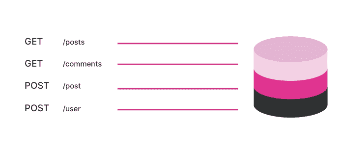
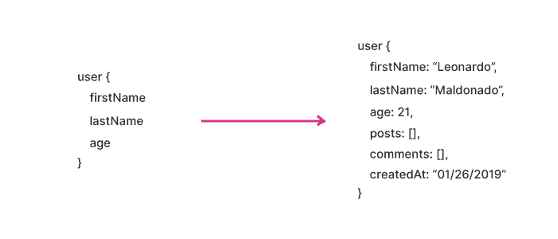
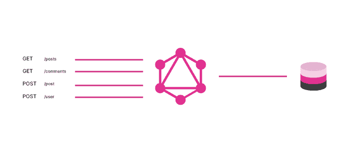
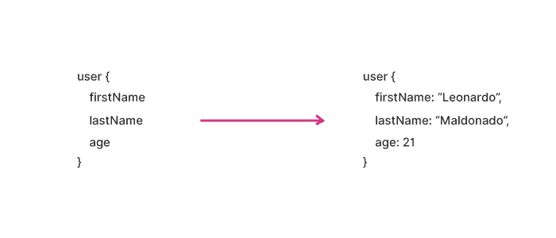
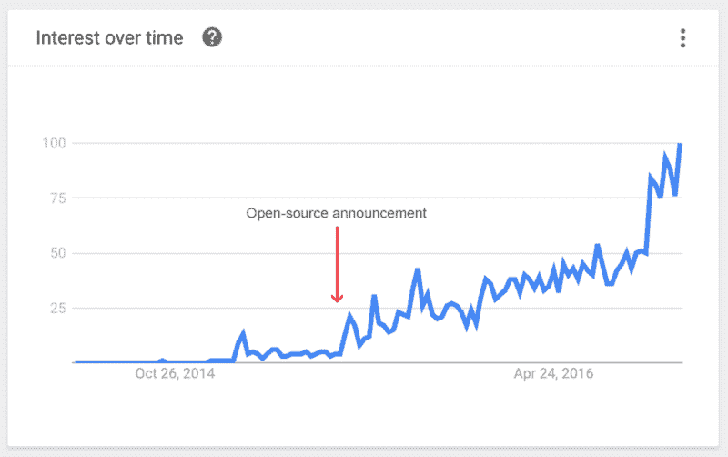

# 为什么 GraphQL 是 API 的未来

> 原文：<https://www.freecodecamp.org/news/why-graphql-is-the-future-of-apis-6a900fb0bc81/>

作者莱昂纳多·马尔多纳多

# 为什么 GraphQL 是 API 的未来


自从 web 出现以来，开发 API 一直是开发者的一项艰巨任务。我们开发 API 的方式必须与时俱进，这样我们才能始终构建良好、直观和设计良好的 API。

在过去几年中，GraphQL 在开发人员中越来越受欢迎。许多公司已经开始采用这种技术来构建他们的 API。GraphQL 是一种由脸书在 2012 年开发的查询语言，并于 2015 年公开发布。它已经获得了很大的吸引力。它已经被很多大公司采用，比如 Spotify、脸书、GitHub、纽约时报、网飞、沃尔玛等等。

在这一系列教程中，我们将研究 GraphQL，了解它是什么，并了解是什么特性使这种查询语言如此直观和易于使用。

所以，让我们从研究 REST 的问题以及 GraphQL 如何解决这些问题开始。我们还将了解为什么公司一直用 GraphQL 构建他们的 API，以及为什么它是 API 的未来。

### 哦，休息

很久以前，当我们将我们的 API 设计从 SOAP 更改为 REST 时，我们认为这种改变会给开发人员的工作带来更多的灵活性。我们不能否认，它在一段时间内运行得相当好，在当时是一个好的举措。随着应用程序和 web 变得越来越复杂，API 也自然地随着这些变化而发展。

但是，REST 确实有很多问题。让我们看看它们是什么:

#### 很多端点

REST 中的每个资源都由一个端点表示。因此，在现实世界的应用程序中，我们最终会有很多资源的很多端点。如果您想要发出一个 GET 请求，您将需要一个特定于该请求的端点，带有特定的参数。如果您想发出一个 POST 请求，您将需要另一个端点来完成该请求。



但是，这有什么问题呢？假设我们正在构建一个像脸书一样的大型社交媒体应用程序。我们最终将拥有大量的端点，这意味着开发人员将花费更多的时间来开发和维护这些 API。

#### 信息的过量提取和不足提取

困扰许多开发人员的一个实际问题是通过 REST APIs 获取过多和不足的信息。这是因为 REST APIs 总是返回固定的结构。除非我们为此创建一个特定的端点，否则我们无法确切地获得我们想要的数据。

因此，如果我们只需要很小一部分数据，我们就必须处理整个对象。例如，如果我们只需要在 REST API 中获取用户的`firstName`、`lastName`和`age`，那么我们不可能在不获取整个对象的情况下准确地获取这些数据。



还有一个信息提取不足的问题。如果我们想从两个不同的资源获取数据，我们需要对两个不同的端点进行不同的调用。在一个巨大的应用程序中，这并不能很好地扩展，因为有些情况下我们只需要获取特定的数据，而不是整个对象。现在，假设我们正在构建一个有 100 个端点的应用程序。想象一下我们需要编写的工作量和代码。随着时间的推移，这将变得更加困难。代码也变得难以维护，开发人员在这个过程中会感到失落。

#### 版本控制

在我看来，REST 的一个痛点是版本控制。有了 REST APIs，就很容易看到很多带有 v1 或者 v2 的 API。在 GraphQL 中不需要它，因为您可以通过添加新类型或删除旧类型来改进您的 API。

在 GraphQL 中，你需要做的就是编写新的代码来改进你的 API。您可以编写新的类型、查询和变化，而不需要发布另一个版本的 API。

因此，您不会看到具有如下端点的 GraphQL APIs:

```
https://example.com/api/v1/users/12312https://example.com/api/v2/users/12312
```

### 为什么 GraphQL 是未来

早在 2012 年，脸书在开发他们的移动应用程序时遇到了一个问题，这促使他们创建了 GraphQL。这些问题非常普遍，尤其是当我们谈论 RESTful API 设计的时候。如前所述，这些问题是:

*   性能差
*   很多端点
*   数据提取过多或不足
*   每当我们需要添加或删除某些内容时，就会发布另一个版本
*   理解 API 有困难

考虑到许多概念，来自脸书的开发人员开发了一种更好的设计 API 的方法，后来将其命名为 GraphQL。基本上，它是 REST 的替代品，有很多改进。

有了 GraphQL，我们获得了许多新特性，当您构建 API 时，这些新特性给了您超能力。让我们逐一检查它们:

#### 单端点

没必要建很多端点！使用 GraphQL，我们只能获得一个端点，这样，我们就可以在一个请求中获得尽可能多的数据。基本上，GraphQL 将您所有的查询、变异和订阅封装在一个端点中，并提供给您。它改进了您的开发周期，因为您不需要发出两个请求来从两个不同的资源获取数据。此外，假设我们正在构建一个巨大的应用程序，我们不会像 REST 那样有很多端点和大量代码。我们将获得一个端点，有了这个端点，我们可以发出任意多的请求。



此外，正如我上面所说的,“仅端点”方法使您的 API 自文档化，因为您的开发人员已经知道如何使用它，所以您不需要构建文档。他们只要看代码，或者看操场，就能理解 API。我们将在后面(本系列的下一个教程)了解更多。看似神奇，其实只是 GraphQL！

#### 使用 GraphQL，您可以只获取您需要的数据

不再出现信息提取过多或不足的情况。你只获取你需要的数据。还记得我们最初讨论的糟糕的性能问题吗？自从 GraphQL 提高了 API 的性能，尤其是在网络连接缓慢的情况下，我们就不再有这种问题了。



#### GraphQL 使得开始构建 API 和保持一致性变得容易

很多人认为 GraphQL 非常复杂，因为它涉及一个模式和一个端点。一旦你开始用它开发 API，你会发现它比你想象的要简单。当你开发你的网站/应用程序时,“端点专用”API 会有很大帮助。它使您的 API 更加自文档化，并且您不需要编写大量关于它的文档。

如果你不使用 JavaScript 作为你的主要语言，这不是问题。GraphQL 是一种不可知的查询语言，这意味着您可以将其用于任何语言。在撰写本教程时，GraphQL 已经支持超过 12 种语言。

### GraphQL 是未来

GraphQL 是一种开源查询语言，这意味着社区可以对它做出贡献并对它进行改进。当脸书将它发布到社区时，它获得了开发者的大量关注和认可。现在，随着越来越多的开发人员开始用它来构建 API，GraphQL 一直在快速增长。然而，有些人一直在问，这是否真的会取代 REST，或者成为为现实世界的应用程序构建 API 的新方式。



起初，我认为 GraphQL 只是炒作，只是创建 API 的另一种方式。然而，当我开始研究它时，我发现 GraphQL 具有为现代应用程序创建现代 API 所需的基本特性，因为它确实与现代堆栈配合得很好。

所以如果我现在可以对你说的话是:是的， **GraphQL 确实是 API**的未来。这就是为什么大公司都在赌它。

2018 年 11 月，GraphQL 与 Linux 基金会合作创建了 GraphQL 基金会。这种查询语言鼓励其开发人员为该语言构建更多的文档、工具和支持。这一基础将确保 GraphQL 有一个稳定、中立和可持续的未来。所以，这是认为 GraphQL 是 API 未来的另一个原因。

当然，它不会立即取代 REST，因为许多应用程序仍在使用它，并且不可能在一夜之间重写它们。随着越来越多的公司采用 GraphQL，UX 和 DX 都将得到改善。

### 结论

GraphQL 确实是 API 的未来，我们需要了解更多。这就是为什么我决定创建 4 个系列教程来展示我们如何使用最好的 GraphQL，从查询和变异开始，然后是订阅和认证。

在本系列的下一篇教程中，我将深入 GraphQL，展示 GraphQL 如何处理类型，并创建我们的第一个查询和变异。

所以，敬请期待，下期教程再见！

？在推特上关注我！

*本文最初发布于 Hashnode。如果你喜欢这篇文章，也可以在那里阅读，这样你就可以支持我，帮助我写更多的文章！Y [你可以在这里看](https://hashnode.com/post/why-graphql-is-the-future-of-apis-cjs1r2hhe000rn9s23v9bydoq)！*