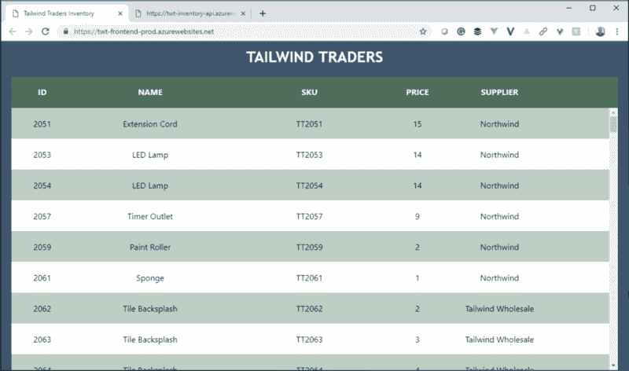

# 为什么 GraphQL 是远离技术债务的关键

> 原文：<https://www.freecodecamp.org/news/why-graphql-is-the-key-to-staying-out-of-technical-debt-7915f8f59a9/>

GraphQL(不要与 GraphDB 或 Open Graph 或者甚至是一个*实际的* graph 混淆)是一个非常有创意的解决方案，它解决了一个相对常见的问题:**如何让前端开发人员以他们需要的方式访问后端数据？**

快速示例:我们希望在网页上显示产品列表。因此，我们编写了一个返回产品列表的服务。我们让它超级宁静，因为有人在播客上说我们应该这样做。

```
{
    "items": [
        {
            "id": 2051,
            "name": "Extension Cord",
            "price": 15,
            "productType": "Electrical",
            "supplierName": "Northwind",
            "shortDescription": "Outlet not where you need it? Extend your power to the right place at the right time",
        },
        {
            "id": 2053,
            "name": "LED Lamp",
            "price": 14,
            "productType": "Hardware",
            "supplierName": "Northwind",
            "shortDescription": "Low power battery operated light",
        }
    ]
}
```

然后我们在页面上拍打所说的产品。继续想象一个拍打的声音。或者在这里随意使用这个…

[https://w.soundcloud.com/player/?visual=true&url=https%3A%2F%2Fapi.soundcloud.com%2Ftracks%2F239128911&show_artwork=true](https://w.soundcloud.com/player/?visual=true&url=https%3A%2F%2Fapi.soundcloud.com%2Ftracks%2F239128911&show_artwork=true)



现在我们已经完成了所有工作，有人决定我们还需要显示我们库存的每种产品的数量，因为他们当然会这样做。

好的。我想是的。我的意思是，你没有在最初的项目文件中说明这一点，但为什么没有。让我们把范围定为你想要的那样。

产品数量信息是数据库中的一个字段，但服务不会返回它。为了从前端获得它，我们必须修改服务的代码，然后重新部署，然后才能考虑在前端进行更改。对于一个领域。

同样，如果这个人(他似乎不能决定他们在生活中真正想要什么)决定我们不再需要 SKU，我们可以在前端忽略它，但它是 API 响应的一部分，所以它最终成为有效载荷中的垃圾数据，以及我们的用户不需要的无意义的比特。

**每一个项目**都只是这种不可预见的变化的来回。这就是“软件开发”的字面定义。我的意思是它不是，但我的观点听起来更好，如果我参考字典。

关键是，我们最终在前端和后端都做出了很多权衡，只是为了让事情正常运行并跟上变化的步伐。而权衡等于技术债。


这是 GraphQL 试图解决的问题的本质。

我最近才把 GraphQL 的所有部分放在自己的脑子里。直到我的同事[新美乐股份公司·科廷](https://twitter.com/simona_cotin)主动教我 GraphQL，我才恍然大悟，这也许是我在职业生涯的大部分时间里一直试图解决的一个问题的答案。

#### 和我们一起学习 GraphQL

新美乐股份公司和我一起做了三次教学，我们记录了每一次。在这三个视频中，你可以和我一起学习，从对 GraphQL 一无所知，到实现一个 GraphQL 接口，然后从一个 React 应用程序使用它。

每个视频都有一个 Github repo，你可以克隆它来获得完整的工作解决方案，以防你在途中迷路。

我们在这个视频系列中大量使用 Azure 函数，因为构建一个无服务器 API 比从头开始容易得多。如果你还没有一个免费的 Azure 帐户，就申请一个吧。

[**立即创建您的 Azure 免费帐户| Microsoft Azure**](https://azure.microsoft.com/free/?WT.mc_id=video-youtube-sicotin)
[*开始使用 12 个月的免费服务和 200 美元的点数。今天就在微软…*azure.microsoft.com](https://azure.microsoft.com/free/?WT.mc_id=video-youtube-sicotin)创建您的免费帐户

### 第 1 部分:介绍 GraphQL

在第一个视频中，新美乐股份公司向我介绍了 GraphQL 的概念以及它使用的古怪语法。我们还在这个视频中创建了 GraphQL API 并部署它。

[https://www.youtube.com/embed/x-imn__380s?feature=oembed](https://www.youtube.com/embed/x-imn__380s?feature=oembed)

[**simonaco/server less-graph QL-APIs-part 1**](https://github.com/simonaco/serverless-graphql-apis-part1)
[*通过在 GitHub 上创建账号，为 simonaco/server less-graph QL-APIs-part 1 开发做贡献。*github.com](https://github.com/simonaco/serverless-graphql-apis-part1)

### 第 2 部分:本地安装 Graphiql 并部署

在第 2 部分中，我让 [Graphiql](https://github.com/graphql/graphiql) 可视化 GraphQL 测试工具在我自己的机器上本地运行，然后将它部署到 [Azure Storage](https://code.visualstudio.com/tutorials/static-website/getting-started?WT.mc_id=freecodecamp-blog-sicotin) ，这样我就可以轻松地测试我的 GraphQL API，而不需要连接应用程序。

[https://www.youtube.com/embed/X2846rUj_P8?feature=oembed](https://www.youtube.com/embed/X2846rUj_P8?feature=oembed)

[**simonaco/server less-graph QL-APIs-part 2**](https://github.com/simonaco/serverless-graphql-apis-part2)
[*通过在 GitHub 上创建账号，为 simonaco/server less-graph QL-APIs-part 2 开发做贡献。*github.com](https://github.com/simonaco/serverless-graphql-apis-part2)

### 第 3 部分:在 React 应用程序中使用 API

我们通过研究如何从应用程序中实际调用这个 API 来结束这个系列。这是一个很重要的细节。

[https://www.youtube.com/embed/c2r_nUDUYe0?feature=oembed](https://www.youtube.com/embed/c2r_nUDUYe0?feature=oembed)

[**simonaco/server less-graph QL-APIs-part 3**](https://github.com/simonaco/serverless-graphql-apis-part3)
[*通过在 GitHub 上创建账号，为 simonaco/server less-graph QL-APIs-part 3 开发做贡献。*github.com](https://github.com/simonaco/serverless-graphql-apis-part3)

#### 了解有关 GraphQL 的更多信息

一旦你理解了 GraphQL 所解决的问题，你就会发现它无处不在。最棒的是，你不必从头开始使用它。事实上，*建议*在典型的 REST API 上使用它，所以你现在很可能是使用 GraphQL 的最佳时机。

如果你想在 GraphQL 和 React 上更进一步，可以查看一下 [Wes Bos 的](https://twitter.com/wesbos)课程。虽然是有偿的，但是一分钱一分货。这是一项投资，你会很高兴你做了。韦斯没有给我任何报酬让我这么说。但也许他应该。

[**高级 React&graph QL**](https://advancedreact.com/)
[*用 React 和 graph QL*advancedreact.com](https://advancedreact.com/)构建全栈应用