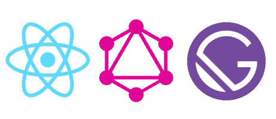
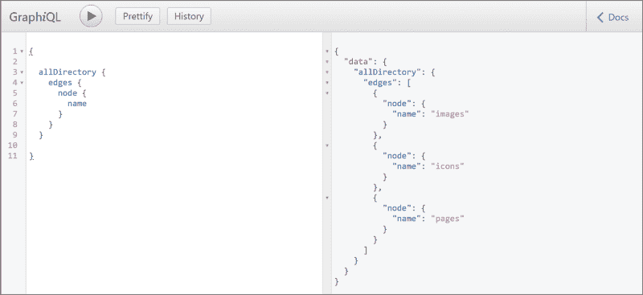

# 为什么我相信 Gatsby.js 拥有 JavaScript 的最佳图像优化工具——以及如何使用它们

> 原文：<https://www.freecodecamp.org/news/why-i-believe-gatsby-js-has-javascripts-best-tools-for-image-optimisation-and-how-to-use-them-939c82d05395/>

布雷特·卡梅伦

# 为什么我相信 Gatsby.js 拥有 JavaScript 的最佳图像优化工具——以及如何使用它们

#### 使用 Gatsby.js 和 GraphQL 进行图像优化的初学者指南


Image Credit: [Ryan Searle / Unsplash](https://unsplash.com/photos/BnTRzW95mnw)

像许多开发者一样，我的第一个全功能网站是博客。我把它建成了一个自定义的 WordPress 主题，并且我有一个宏伟的计划，要在主页上放满高质量的文章图片。

当 a 第一次推送网站时，我输入网址，然后…等待。这是一个主要的反高潮。随着画面慢慢变成现实，太多的时间过去了。

到目前为止，我还没有做任何重要的图像优化。对于一个相对较新的开发人员来说，这是重要的一课，我开始学习如何进行尽可能多的优化。但是优化图像尺寸，为不同的显示器配置不同尺寸和分辨率的图像，以及用一个漂亮的“淡入”动画设置延迟加载，这些都是大量的工作。尝试手动解决这些问题对学习有好处，但这肯定不是我想反复做的事情。

谢天谢地，有更好的方法。现在，作为一名 React 开发人员，我遇到了许多不同的图像处理系统和模块，它们使图像优化变得简单明了。但是——到目前为止——我没有遇到过比 Gatsby.js 更好的了。

使用几个 Gatsby 组件，您可以轻松优化您的图像交付——完成“模糊”动画或跟踪的 SVG 占位符——以及附加的优化，如为支持 WebP 图像格式的浏览器使用这些格式。它们以理想的分辨率快速加载，看起来非常流畅。



A powerful combination: React, GraphQL and Gatsby

### 介绍盖茨比形象优化

Gatsby.js 使图像优化变得简单，除了一件事:如果你以前从未使用过 GraphQL，这个过程可能也需要一点时间来适应。我花了一些时间来理解盖茨比的形象，主要是因为没有直接进入 GraphQL。

我也觉得很多教程(包括官方的)在解释如何处理多个图像时都有所欠缺。官方的 Gatsby starter 包含一个图像组件，如果您的站点只有少量的图像，这个组件会工作得很好。但是如果它有几十个或者几百个呢？

这就是本文要回答的问题。在这篇文章中，我们将一步一步地结合 Gatsby 和 GraphQL 的优势进行图像优化。我们将从渲染三幅图像开始，在最后一部分，我将讨论几种放大的方法。

### 逐步演练

#### 步骤 1:安装依赖项

盖茨比主要有两个形象成分:`gatsby-image`和`gatsby-background-image`。

要使用其中任何一个，您需要 Gatsby 项目的几个附加组件。(如果你是盖茨比的新手，你可以在这里找到如何开始一个项目的)。一旦您的 Gatsby 项目设置好了，您就可以通过 npm 安装所有必要的与映像相关的插件，方法是键入:

```
npm i gatsby-image gatsby-background-image gatsby-source-filesystem gatsby-plugin-sharp gatsby-transformer-sharp -s
```

这看起来可能很多，但是每个插件或多或少都做一件事:

*   `gatsby-image`用于显示图像
*   `gatsby-background-image`用于显示背景图像
*   `gatsby-source-filesystem`允许您使用 GraphQL 查询站点文件系统中的文件
*   `gatsby-transformer-sharp`是一个插件，可以让你通过查询创建多个大小和分辨率合适的图像
*   并且`gatsby-plugin-sharp`将夏普和盖茨比的插件连接在一起

#### 步骤 2:配置 Gatsby

安装完成后，你应该确保你的 web 应用根目录下的`gatsby-config.js`文件中存在上述插件。

在下面的例子中，我已经标识了两个目录，`images`和`pages`，我希望能够在其中查询我的文件系统。在本文中，我们将只关注`images`，但是查询您的`pages`目录也是很常见的！

```
module.exports = {  plugins: [    `gatsby-transformer-sharp`,    `gatsby-plugin-sharp`,    {      resolve: `gatsby-source-filesystem`,      options: {        name: `images`,        path: `${__dirname}/src/images`,      },    },    {      resolve: `gatsby-source-filesystem`,      options: {        name: `pages`,        path: `${__dirname}/src/pages`,      },    },  ],}
```

如果您习惯于安装和导入 npm 包，到目前为止，这可能感觉非常简单。在这一点上，事情开始看起来有点不寻常。

#### 步骤 3A:在 GraphQL 中测试查询

现在，我们将访问 GraphiQL 接口。默认情况下，盖茨比应用程序在`localhost:8000`运行。我们可以通过在域的末尾添加`/___graphql`来访问 GraphiQL 接口(这是一行中的 3 个下划线)。

在这里，我们可以在将数据提交到代码之前尝试不同的查询。这将为我们以后的调试节省时间，因为我们知道查询正在获取我们想要的数据。

首先，让我们检查一下我们的`gatsby-config.js`文件是否工作正常。在 GraphiQL 界面中输入以下代码，然后按播放图标(或`CTRL/CMD` + `ENTER`):

```
{  allDirectory {    edges {      node {        name      }    }  }}
```



I also have an “icons” subdirectory in my images folder, so that’s been returned as well.

如果你看到类似上图的东西，它正在工作。现在，让我们通过键入以下命令来查询 images 文件夹的内容:

```
{  allFile(filter:{ sourceInstanceName:{eq: "images"} }){    edges{      node{        relativePath        childImageSharp {          id        }      }    }  }}
```

如果“childImageSharp”属性返回一个 ID，那么这意味着我们可以对它使用 Gatsby 的图像优化。这将在 SVG 等文件上返回`null`，因为它们不能被进一步优化，但是它将为每个`jpg`和`png`提供一个字符串。

#### 步骤 3B:准备我们具体的图像查询

现在让我们抓住一些具体的图像。在对图像执行查询时，您需要告诉 Gatsby 该图像是`fixed`还是`fluid`。`fixed`图像有已知的尺寸，它们需要更少的过程来优化。`fluid`图像的尺寸会根据视窗大小和其他背景因素而变化。

我正在建立一个投资组合，我有我的每项服务的图像。假设我们要抓取三个图像，分别叫做`webdev.jpg`、`design.jpg`和`writing.jpg`，我们知道它们的尺寸是`fluid`。

```
{   webdev:file(relativePath:{eq:"webdev.jpg"}) {    childImageSharp {      fluid(maxWidth: 1600) {        base64      }    }  }    design:file(relativePath:{eq:"design.jpg"}) {    childImageSharp {      fluid(maxWidth: 1600) {        base64      }    }  }    writing:file(relativePath:{eq:"writing.jpg"}) {    childImageSharp {      fluid(maxWidth: 1600) {        base64      }    }  }  }
```

注意，每个冒号前的术语可以是我们想要的任何东西。在这里，坚持文件名是有意义的。我们还将 max-width 属性设置为 1600 像素，因此 Gatsby 知道它不需要为每个图像准备比这个更大的版本。

`base64`是包含我们图像的微小、模糊版本的属性，它几乎可以立即加载，然后被高分辨率版本平滑地替换。如果我们的查询为`base64`返回一个值，那么一切都正常。我们准备在代码中包含这个查询！

#### 步骤 4:导入组件并渲染

导航到您想要显示图像的任何组件。首先，您需要从文件顶部的`"gatsby"`导入`StaticQuery`和`graphql`组件，以及`Img`或`BackgroundImage`，如下所示:

```
import { StaticQuery, graphql } from "gatsby"import Img from "gatsby-image"import BackgroundImage from "gatsby-background-image"
```

我们的 React 组件应该返回一个`<StaticQue` ry >标签，该标签 `is a`查询属性`and a` 呈现属性。

```
<StaticQuery query={  graphql`{    # our GraphQL queries go here  `}   render={(data) => (    <>      {/* our JSX goes here */}    </>  )}/>
```

我们可以将上面的图像查询粘贴到`query`属性中，但是这一次我们将用我们想要呈现图像的片段替换`base64`。在这种情况下，我们将使用`...GatsbyImageSharpFluid`。

但是假设我们后来决定我们想要追踪 SVG 效果，并且我们想要在可能的情况下使用 WebP 格式。我们可以简单地用`...GatsbyImageSharpFluid_withWebp_tracedSVG`替换掉我们的片段。

我们的代码现在应该是这样的:

```
<StaticQuery query={  graphql`{    webdev:file(relativePath:{eq:"webdev.jpg"}) {    childImageSharp {      fluid(maxWidth: 1600) {        ...GatsbyImageSharpFluid      }    }  }    design:file(relativePath:{eq:"design.jpg"}) {    childImageSharp {      fluid(maxWidth: 1600) {        ...GatsbyImageSharpFluid      }    }  }    writing:file(relativePath:{eq:"writing.jpg"}) {    childImageSharp {      fluid(maxWidth: 1600) {        ...GatsbyImageSharpFluid      }    }  }  `}   render={(data) => (    <>      {/* our JSX goes here */}    </>  )}/>
```

最后，我们只需要在我们的 JSX 图像。

`Img`组件采用一个`fluid`属性(放置查询数据引用的地方)和一个`alt`属性。

```

```

`BackgroundImage`组件接受一个`tag`属性(如果留空，它将呈现一个`div`)、`fluid`属性和一个`backgroundColor`属性。

```
<BackgroundImage  tag="section"  fluid={data.webdev.childImageSharp.fluid}  backgroundColor={`#000`}&gt;  {/* the child elements that go above the background */}</BackgroundImage>
```

#### 将这一切结合在一起

这是一个完整的 Gatsby 组件，它为我们的`images`文件夹获取三幅图像并呈现它们:

### 扩大规模的战略

那么，当我们需要处理大量的图像时，我们如何做到这一点呢？这里有一些让你开始的想法。

#### 在文件夹中循环

假设我们有一个想要显示的图标列表。我们可以将它们放在各自的目录中，并使用循环遍历查询结果，而不是分别查询它们。例如，我们可以查询整个“icons”目录:

```
{  icons:allFile(filter:{ relativeDirectory:{eq: "icons"} }){    edges{      node{        name        relativePath        childImageSharp {          id        }      }    }  }}
```

然后，如果我们将`data.icons.edges`登录到控制台，我们可以看到一个可以迭代的项目数组。这是一个可能的例子。

```
data.icons.edges.map(item => (  ))
```

#### 传入动态数据

一个重要的方法是在查询中添加动态变量。GraphQL 对此有特定的语法。

为此，让我们使用关键字`query`为我们的查询命名为`findFile`。然后，在括号中，我们可以命名任意数量的新变量。

在 GraphQL 中，所有变量前面都必须有`$`。在变量名之后，我们使用冒号，然后指定类型:这里是一个`String`。最后，我们可以使用`=`来传入一个默认的回退值，这将允许我们在 GraphiQL 中测试查询。

```
query findFile($relativePath: String = "webdev.jpg") {  file(relativePath: {eq: $relativePath}) {    id    relativePath    publicURL  }}
```

可以通过使用指令`@include(if: Boolean)`和`@skip(if: Boolean)`向这些查询添加更多的逻辑。

如果我们希望用户能够动态过滤数据，GraphQL 变量就特别有用。但是对于任何我们可能想要从实际查询中分离出某些数据的原因，它们也很方便，例如，如果我们需要首先以某种方式修改它。

#### 创建自定义片段

还记得上面的`...GatsbyImageSharpFluid`吗？这是一个片段，本质上是一组可重用查询字段的简写。我们也可以定义自己的片段。

即使我们只调用三个查询字段——`id`、`relativePath`和`publicURL`——如果我们重复使用它们，这可能会增加很多行额外的代码。相反，我们可以定义一个自定义片段，允许我们重用查询字段。与其重复官方文档对如何做的描述，我建议你[去](https://graphql.org/learn/queries/#fragments)看看。

### 结论

总的来说，我希望这篇文章让您看到了 Gatsby.js 附带的强大的图像优化工具，并为如何将它们应用于大型项目提供了一些思路。

为了充分理解并最大限度地利用这些强大的工具，您需要掌握 React 和 GraphQL。当我第一次开始使用 Gatsby 时，我跳过了 GraphQL，没有意识到对它的理解——至少是基本的理解——对于充分利用 Gatsby 的图像优化功能是必不可少的。