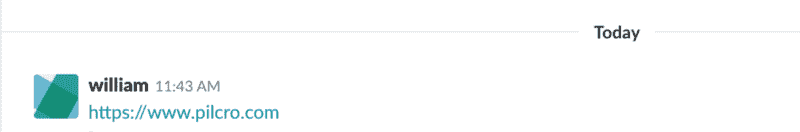
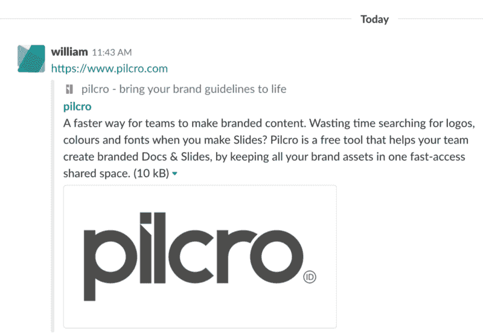
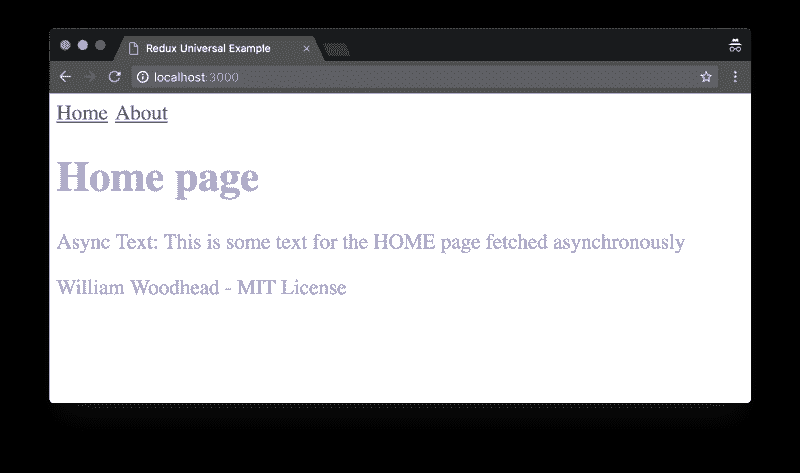

# 为什么我尽可能构建最简单的异步通用 React Redux 样板文件

> 原文：<https://www.freecodecamp.org/news/why-i-built-the-simplest-async-universal-react-redux-boilerplate-i-could-1b5ef6206d3d/>

威廉·伍德黑德

# 为什么我尽可能构建最简单的异步通用 React Redux 样板文件

React Redux

上周我给自己定了一个任务。

我查看了一些“入门”通用 [React](https://reactjs.org/) [Redux](https://redux.js.org/) 样板文件，发现它们中的许多真的很复杂。它们包括大量的依赖项，并且有可能需要数周时间才能解除的功能。

一般来说，样板文件对我来说有两个作用:

1.  更快开始，因为应用程序已经搭好架子了
2.  了解如何搭建应用程序

我对第二项更感兴趣。作为一名开发人员，我喜欢理解事物是如何组合在一起的，事物是如何在引擎盖下工作的。

因此我给自己设定了任务:

> 创建尽可能简单的异步通用 React Redux 样板文件。

听起来很棒，但这意味着什么呢？

**只想看代码？**看看这个 [GitHub 回购](https://github.com/william-woodhead/simple-universal-react-redux)。

### 什么是异步通用 React Redux 样板？

让我们一个一个地拆开每个单词。

#### 普遍的

本质上，Universal 描述了一个既有服务器端渲染，又有动态客户端路由的应用。

为什么这很重要？服务器端渲染对于 SEO 以及丰富的链接和元数据非常重要——就像你在 Twitter 或 Slack 上发布一个网络链接一样。

客户端路由为您的用户提供了流畅的网站体验，因为当用户在页面之间导航时，浏览器不必重新加载。

#### 异步ˌ非同步(asynchronous)

异步意味着我们希望在呈现页面之前从外部 API 获取数据。我们希望用异步请求的数据在服务器端呈现页面。

为什么这很重要？这对于数据或内容与网站代码分开存储的应用程序来说非常重要。假设我们在数据库中有数据，或者我们正在从 Twitter API 请求数据。我们希望在呈现页面之前得到这些数据。

#### 反应

React 是脸书团队开发的功能渲染库，可以在服务器端和客户端工作。React 为我们提供了在服务器端呈现页面所需的功能，但仍然需要在客户端初始化应用程序。

#### Redux

Redux 是一个状态管理包，它被开发成易于在服务器端和客户端使用。Redux 为我们提供了在服务器和客户端之间传递状态所需的功能。

#### 样板文件

由剑桥词典[定义为:](https://dictionary.cambridge.org/dictionary/english/boilerplate)

> 可以复制并在计算机程序中使用的文本，只需很小的改动。

### 为什么需要通用应用？

很多网站只是在客户端渲染。谷歌搜索现在可以索引在客户端呈现的页面，那么我们为什么需要经历创建通用应用程序的痛苦呢？

#### 丰富的链接和元数据

主要原因是为了丰富的链接和元数据。当你在 Twitter 或 LinkedIn 上发布一个页面时，它们会从服务器返回的页面的原始 HTML 中寻找元数据。

如果您的应用程序是在客户端呈现的，那么这些元数据对抓取器是不可用的，因为没有运行 JavaScript。

这可能是一个大问题。想象一下你的网页链接被渲染成文本和你的网页链接被渲染成丰富的图片和元数据之间的区别。这里有一个例子:

**pil cro 的松弛帖子没有元数据**

**pil cro 的松弛贴子，带有元数据—发现差异**

**注意:**去 howdoesitlookonsocial.com[看看你的元数据是如何呈现在社交网站上的。](http://howdoesitlookonsocial.com)

### 我能做的最简单的样板文件

创建通用应用程序真的很复杂。还没有一个标准化的方法来处理它。许多现有的样板文件都非常复杂。

这就是为什么我试图让最简单的样板文件在 Mac 和 Windows 上都能工作。

源代码里没有多余的东西。网页再简单不过了。看起来是这样的:

我希望开发人员能够解开其中使用的所有不同的功能和软件包，用它来破解，测试不同的部分，并最终在它的基础上构建伟大的通用应用程序。

所以这里是 [GitHub 回购链接](https://github.com/William-Woodhead/simple-universal-react-redux)。

检查它—克隆它，安装它，运行它。看你怎么想。我喜欢任何反馈。如果你喜欢它，一定要开始并分享它！

*如果你喜欢这个故事，请问？并请与他人分享。也请检查我的公司 p[ilcro.com。](https://www.pilcro.com/?utm_source=medium&utm_medium=boilerplate&utm_campaign=awareness) Pilcro 是 G-Suite 的品牌管理应用。*

