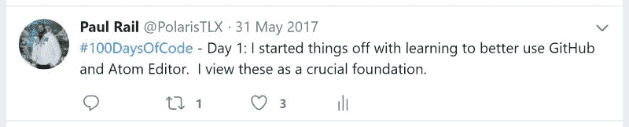
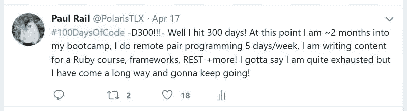
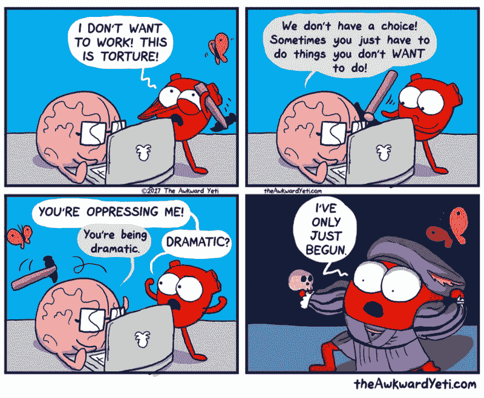
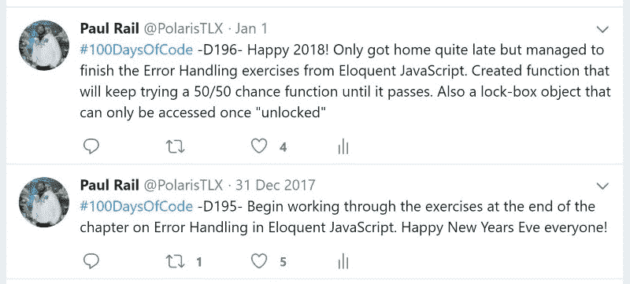
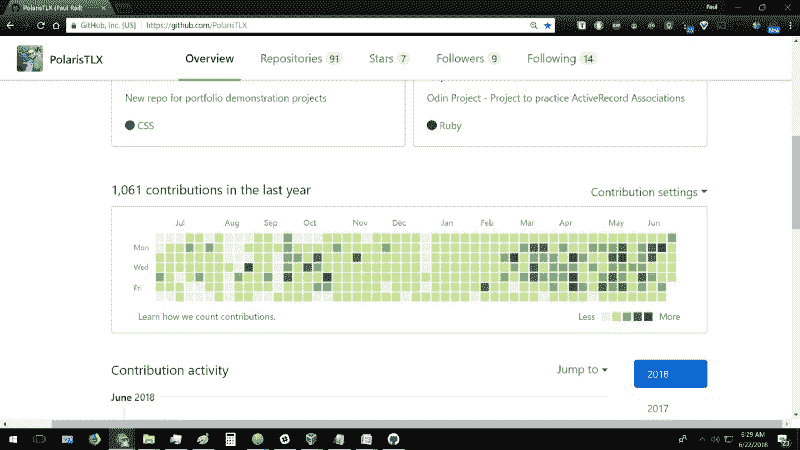

# 为什么我一年来每天都编码，我学到了什么，你也可以怎么做。

> 原文：<https://www.freecodecamp.org/news/why-i-coded-every-day-for-a-year-what-i-learned-and-how-you-can-do-it-too-aebe949dd178/>

由保罗铁路

# 为什么我一年来每天都编码，我学到了什么，你也可以怎么做。

我想换个职业。今天的世界与我们父母成长的世界完全不同。因此，我父母给我的许多职业建议与我们现在的情况不再相关。

我的职业生涯是在我喜欢的领域，但却是在一个正在消亡的行业。如今蓬勃发展的行业似乎屈指可数。我那些进入软件行业的朋友似乎对他们的职业相当满意。如果我当时知道我现在知道的事情，我会在 10 年前开始这个过程。我想去世界前进的地方，而不是它曾经去过的地方。

我下定决心要实现它。这样做意味着不要推迟。我打算立即开始，这样再过 10 年，我就不会回头说“我希望我能更早开始做这件事”。

所以我决定一年内每天都写代码。我来说说我的经历吧。

### **开头**

我开始做一些关于学习如何编码的研究。我找到了像代码学院(Codecademy)和 T2 免费代码营(freeCodeCamp)这样的免费资源。有很多东西要学，这将是一个需要严格自律的漫长旅程。但是，我想，我现在投入的越多，以后得到的回报就越多。

然后我发现了一篇关于这个挑战的文章，叫做 [**#100DaysOfCode**](http://www.100daysofcode.com) 。为了完成挑战,**有两个主要要求**:

1.  连续 100 天每天至少编码一小时
2.  用#100DaysOfCode 标签每天发布你的进步

因此，这是一个给你结构、方向和公共责任的系统，让你走上正轨。这似乎是激励自己并保持进步的好方法。

因此，我开始每天从我的账户[twitter.com/PolarisTLX](http://twitter.com/PolarisTLX)以及[脸书群组](https://www.facebook.com/groups/code100/)发微博。

想法是每天编码，把它变成一种习惯。你不能给自己找任何借口，而这些借口通常是你推迟做某事时会找的。随着时间的推移，这“迫使”你向前大步迈进，否则你将需要更长的时间才能实现，或者根本无法实现。

还有额外的好处。由于编码涉及不断建立在彼此基础上的概念，如果你几天不编码，大量的知识就会丢失。

除此之外，#100DaysOfCode 的创始人欢迎你把它变成你自己的。因此，为了真正加快我的学习，并在实现我获得开发人员工作的目标方面取得重大进展，我实际上致力于全职追求挑战，而不是每天只花一个小时。在那之后，我到达了神奇的 100 天。

然而，我仍然没有准备好工作。我需要学习的东西太多了。但是我取得了很大的进步，我决心继续下去，直到我最终得到那份工作。所以我决定继续坚持 150 天、200 天、250 天…

### 主要成就

就这样我达到了 365 天！以下是我在一年中每天编码所能完成的一些主要事情:

*   完成了几十个编码教程、课程和书籍
*   解决了 100 多个算法和面试编码挑战
*   获得 freeCodeCamp 颁发的“**前端开发人员”**和“ **JavaScript 算法和数据结构项目”**证书
*   参加了一个为期两天的黑客马拉松，该项目被选中提交给公司的董事会成员。然后他们决定把它推进到下一个发展阶段
*   以不到 1%的录取率被全职软件开发项目录取
*   为 freeCodeCamp beta 扩展课程做出了贡献
*   为 Odin 项目的新 Ruby 课程编写课程内容，以帮助其他有抱负的开发人员学习编码
*   构建了一个脸书的工作克隆，整个后端和前端完全从零开始，并在 Heroku 上作为我的投资组合中的一个特色项目
*   获得了我的第一笔固定收入，为一个客户远程工作，这导致了我被永久雇佣

最后一点，即**获得稳定的收入流和全职职位**，是我之前所有成就的亮点和顶点，它让我达到了这一点。但这不是一个可以掉以轻心的追求。

### 这不是一个简单的挑战

离开以前的工作去追求我的目标意味着我有更多的时间，但也意味着我有更多的时间。很多人怀着远大的抱负走进这一行，给自己定下自己无法达到的崇高目标。所以对许多人来说，坚持每天一小时的建议可能是最好的。

但我观察到的是，即使按照最基本的标准，大多数尝试这个挑战的人都失败了。许多人怀着得到一份程序员工作的愿望开始# 100DaysOfCode】(字面意思是来自世界各地的成千上万的人)，但很少有人真正实现他们的目标。

尽管有大量高质量的资源和指南，其中许多甚至是免费的。这只是一个简单的现实，大多数人没有看到他们的目标到底。**他们失败主要是因为缺乏决心和借口。**

我发现并加入了许多团体，里面都是试图学习编码的人。我发现其中一些是:

*   30 天的 JavaScript
*   30 天反应期
*   像 180 天代码这样的副产品
*   松弛渠道小组致力于研究特定的编码书，目标是每周做一章并讨论/比较笔记。

**在每一个这样的小组中，参与者都积极、热情，并下定决心要在第一周竭尽全力得到那份工作** … *。*

然后借口、拖延和失约开始迅速涌入。聊天会变得越来越安静，帖子和更新会变得不那么频繁。这些新的迷你社区开始时会像篝火一样咆哮，然后很快变暗，变成蜡烛，闪烁着熄灭。

**我甚至经常不遗余力地试图鼓励他人保持热情和动力。**我愿意为任何受困于某事或需要帮助的成员提供帮助。我会对他们苦苦挣扎的概念提供另一种解释(即使我不是管理员或团队领导)。

根据我一年来的观察，我估计全球每年每 10，000 名开始在线学习编程的人中，只有不到 100 人能坚持几个月。

那些放弃的人不会达到他们的目标。那些有决心并坚持下去的人将会得到工作。

### 那么，我是如何做到的呢——你又是如何做到的呢？

你可以做几件事来帮助你坚持下去并达到你的目标。其中一些已在上文描述，包括:

*   用#100DaysOfCode 这样的东西给你的进步一些结构和责任
*   设定小的增量目标，并一路达到目标
*   结对编程
*   寻找可以一起加入和学习的团体

尽管这些团体并没有真正地持续下去，并作为一个整体获得成功，但加入对我来说仍然是有益的。我不会让周围其他人的低参与度和失败影响我继续进步的决心。

### 我做的最重要的事情

你需要明白，当你有一个雄心勃勃的目标，比如教你自己如何编码，这将需要一些牺牲。你必须愿意这样做。

我的社交生活经常被放在次要位置，我的视频游戏时间也是如此，我也没有跟上网飞最新的热门节目。也有我真的不喜欢的日子，但我需要取得“一些”进步。你需要提醒自己，这一切都是为了延迟满足，为了长期收益做出短期牺牲。

What the heart wants VS what the brain wants - Source: theAwkwardYeti.com

### 其他对我有帮助的事情

我还用 [WakaTime](https://wakatime.com/) 和 [Clockify](https://clockify.me/) 来记录我每天花了多少时间编码。这给了我额外的鼓励，因为我的目标是打破每天或每周的平均水平。我甚至经常在他们的全球排行榜上名列前茅。

花钱买东西也是有话说的。很长一段时间，我设法找到完全免费的资源。一开始，**我强烈建议坚持使用免费资源，至少在前几个月**。这将给你一个机会去发现你是否真的喜欢这些东西，或者它是否不适合你。如果你决定它不适合你，或者你确实喜欢它，但你只是不能持续过去几个月，那么除了时间，你不会失去太多。

但是之后我发现有些付费的资源其实比一些免费的要好。实际上，花钱买某样东西本身就对一些需要额外激励的人有真正的激励作用。通常，如果你为某样东西付过钱，你就更有可能认真对待它。

### 免责声明

我诚实地承认，在那段时间里，我确实错过了一些日子。但是，在我的公开帖子中，我总是直言不讳。挑战赛的创始人在这个话题上说:

> “由于计划外的情况，你可以在这里或那里跳过一天，但不能更多……你可以错过一天(但然后通过在 100 天的末尾增加一天来弥补)。我们的目标是变得始终如一，不管生活会给你带来什么。”——亚历山大·卡拉威，100 天代码的创造者

进展和结果才是真正重要的，也是整个练习的重点。我发现承认错过的天数并继续比每次重置计数器更令人鼓舞。如果我休几天假，总体来说我会更有效率，只要这只是在**非常罕见的**场合，当我真的需要的时候。

一些间隙包括我妈妈的 60 岁生日、单身派对露营和圣诞节。**否则就没有借口了。**我在除夕和大年初一编码。我生病的时候就编了，**、**、**甚至是进手术室的前一天早上和手术后的第二天。？**

No excuses - I even found time to code through New Years

你几乎可以在我的 GitHub 个人资料页面上看到我错过了哪些日子:[https://github.com/PolarisTLX.](https://github.com/PolarisTLX.)但是一些间隙代表了我在偏远地区无法上网和无法向 GitHub 提交代码的时间。但我特意把一本编码书装到平板电脑上，并确保在离开前充满电。(这不是我最喜欢的学习代码的方式，但是偶尔改变一下学习方法，尝试不同的媒介也是不错的。)

最后，一组天早就不见了。发生这种情况是因为当我对合并冲突感到沮丧时，我删除了一个 GitHub 存储库，并决定删除该存储库并在一个新的存储库中替换数据。我没有意识到它会从记录中删除近一周的提交。***表格翻转***

### 我的 365 天进度总结

所以在 365 天里，我取得了以下成就:

*   学习如何使用代码编辑器和制作简单的静态网页
*   构建功能计算器和天气应用程序
*   构建简单的交互式 2D 平台游戏
*   熟悉使用多种语言、框架和操作系统的全栈开发，从头开始创建一个完整的 RESTful 社交网站(用户可以使用自己选择的密码注册、发布、喜欢和评论、上传自己的照片、创建活动、发送和接受好友请求以及其他用户的活动邀请等)
*   创建课程材料，帮助其他有抱负的开发人员学习如何编码。

我已经到了这样一个地步，科技领域的潜在客户和雇主现在把我视为一种资产。我现在通过编写代码获得报酬，因为我可以创造他们想要的东西，解决他们的问题，并提供真正的价值。工作有了回报，我会继续变得更好。

我希望你喜欢阅读我的旅程。我强烈建议您尝试#100DaysOfCode 挑战。如果你喜欢这个帖子，请鼓掌。去传播信息和激励他人。