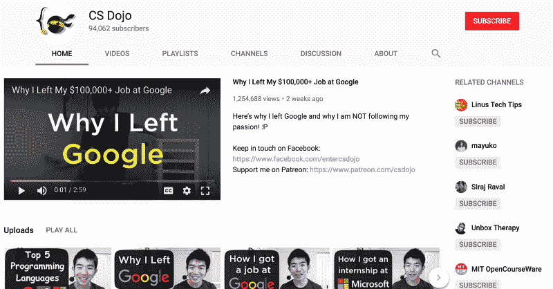

# 为什么我离开了谷歌 10 万多美元的开发工作

> 原文：<https://www.freecodecamp.org/news/why-i-left-my-100-000-job-at-google-60b5cf4ebefe/>

作者 YK·杉

# 为什么我离开了谷歌 10 万多美元的开发工作

#### 不要追随你的激情

我在蒙特利尔的谷歌做了一年左右的全职软件开发人员。

我喜欢在那里工作，但后来我决定离开这家公司，专注于我的 YouTube 频道。

My computer science education YouTube channel — CS Dojo

当我把这件事告诉我的朋友时，他们中的一些人说:“哇！你在追随你的激情！太棒了！”

但是，那不是我正在做的，真的。

我当然喜欢制作 YouTube 视频。但我辞职并不仅仅是为了追寻我的激情。

如果激情是我追求的，我现在可能会追求单口喜剧。(是的，我爱单口喜剧！)

但当我离开谷歌时，我所关注的是我发现的市场空白。

### 市场的空白

在我开始在谷歌工作之前，我开始在我的 YouTube 频道 CS Dojo 上工作。主要是关于软件工程师的面试。

它开始快速增长，当我在频道上只有 10 个视频时，我已经有了超过 10 万的浏览量和 5000 名订户。

A gap in the market (visualized with some high-tech equipment)

大约在同一时间，我也开始指导人们如何通过软件工程师面试。实际上他们开始付钱给我。

通过这次经历，我意识到我开始弥补人们想要的和他们得到的之间的差距。这是市场上的一个重大缺口。

因为我填补了这个市场空白，所以我能够快速发展我的渠道。通过我的渠道，我能够帮助成千上万的人。

能够帮助这么多人，并从他们那里得到积极的反馈，这感觉棒极了！

### 我为什么离开谷歌

然后我想，如果我把注意力全部放在我的 YouTube 频道上，也许我能更快地帮助更多的人。

这也是我离开谷歌的原因。

The awesome Google campus in Mountain View, California

我现在赚的钱少了很多，但能够直接看到我对人们生活的影响，这真是太棒了。

这实际上是我的工程工作中缺少的东西，尽管在谷歌工作很棒。

我不太确定我的渠道会如何发展，但我认为这里还有很大的潜力，我可以帮助更多的人。

所以，我向你们保证——我会尽可能长时间地坚持下去，这样我就能在未来帮助更多的人。

如果你想更好地了解我的频道，请观看我的几个视频: