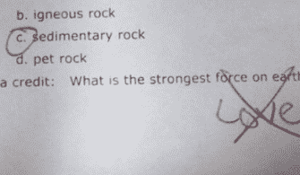

# 为什么我离开了谷歌，创建了一个向孩子们教授个人理财的应用程序

> 原文：<https://www.freecodecamp.org/news/why-i-quit-google-and-built-an-app-that-teaches-personal-finance-to-kids-f0d125e1f07b/>

我的许多朋友认为我离开谷歌的一个好职位去帮助父母和孩子了解金钱是疯狂的。也许他们是对的。

构建一个有创意的、吸引人的应用程序来教授孩子们金融知识是一项挑战。但这也是重要的工作。

鉴于许多学校还没有在课堂上教授个人理财，我觉得有必要将这项工作作为我的使命。

我创立 Pennybox 有一个简单而大胆的目标:教育孩子和家庭理财。在我开始编写代码之前，我和数百名家长交谈过，问他们这样一个问题:你教你的孩子关于金钱的知识吗？结果如何？

我了解到的情况令人惊讶:尽管所有父母都认为金融教育对孩子的幸福至关重要，但很少有人在家里积极教授金融话题，或者觉得自己有能力或有足够的技能这样做。

### 我的父母是如何教我钱的

当我年轻的时候，我的父母给了我一本关于赚钱和省钱的有趣方法的书。我记得我读了它，欣赏了钱的照片和一堆硬币如何随着时间的推移而增长的故事，如果管理得当。我从一开始就被迷住了。

我很幸运。我的父母花时间给我买了这本书，并确保我阅读和理解它。更好的是，他们为我提供了一个动手实践的环境，让我能够应用和实践我学到的知识。他们称之为“边做边学”

他们会给我少量的钱，让我做家务，在社区里帮忙。通过“边工作边学习”,我学到的东西变得栩栩如生。我能够更深入地理解一些重要的话题，比如如何预算和储蓄。

对于在家学不到钱的孩子来说，教室应该是一个显而易见的地方。但事实并非如此。美国只有 17 个州要求学生接受金融教育。最终，当孩子们对金钱“教育不足”时，社会会买单。

技术是帮助解决这个问题的完美媒介。

### 我正在建造一个围着盒子的课程

下面，我从我的理财经历中提炼出了关键的经验。这些是我学到的最重要的经验，我希望将这些知识传递给你或你自己的孩子，你有孩子的朋友，以及任何努力保持财务健康的人。这些是我对 Pennybox 的见解。

#### 第一课:做真正的事，赚真正的钱

*关键要点:挣一块钱是件好事*

当我在高中的时候，我有一份暑期工作。我的职责主要是看门，我挣的是最低工资。没有什么比计算我每小时挣多少钱，并用我工作的小时数乘以我的工资率更快地教会我钱的价值了。

我每天的实得工资大约是 25 美元。那份工作之后，我以一种完全不同的眼光看待价格标签——食物、衣服、旅行和教育。我不仅从金钱的角度考虑成本，还从时间的角度考虑成本。直到我第一次开始工作，开始做真正的事情赚真正的钱，我才意识到这种关系的重要性。

#### 第二课:节约

> 关键要点:不要像戈尔巴乔夫的经济那样结束

冷战期间，前苏联领导人米哈伊尔·戈尔巴乔夫被问及苏联经济的健康状况。他回答:“好。”当被要求用不止一个词来解释他的答案时，他回答说:“不好。”

这个故事让我想起了很多人对节约的态度。如果你问你的朋友存钱是否重要，他们都会回答是的。但是有多少人真的这么做了呢？

为了建立一个经济基础，实际上必须把真金白银存起来，放在一边。

#### 第三课:投资

> 要点:爱情是一种强大的力量，复利也是。为未来投资。

一个孩子曾经在一次考试中被问到:“地球上最强的力是什么？”他们的回答:“爱。”

尽管这种观点的确令人钦佩，但更科学的正确答案应该是强大的核力量。

我认为，还有另一种几乎同样强大的力量:复利。

明智的投资对你或你的孩子将来赚钱至关重要。阿尔伯特·爱因斯坦对此深有体会:

> “复利是世界第八大奇迹。懂的人赚，不懂的人赔。”——阿尔伯特·爱因斯坦

#### 第四课:深思熟虑地花钱

> 关键要点:无论速度快慢，冲过终点线都是值得纪念的。到达终点线。

金钱应该被赚取、储蓄和投资——按照这个顺序。剩下的钱应该慎重使用。

明智地分配资金类似于在长跑开始时保存体力。你需要消耗资源，但要确保你有足够的资源来完成任务。

知道自己想要什么，知道自己需要什么。区分两者，才能到达比赛的终点。

#### 关键的第五课:捐赠

> 关键要点:慷慨，善良。钱是工具。用它来帮助别人。

安妮·弗兰克写道:“没有人因为给予而变得贫穷。”

如果你正在读这篇文章，有几件事肯定是真的:

*   你有文化
*   你有互联网连接
*   你至少拥有一台设备。

以全球标准来看，你做得相当不错——而且有能力帮助他人。但是为什么要等到成年以后呢？孩子们必须知道，掌握财务知识就是拿一些钱，用这些钱去资助慈善机构、非营利组织或社区活动。孩子们可以像学习读写一样学习捐赠。

我非常感激我的父母在我小时候给了我一本书和一个动手的环境来学习基本的理财技巧。

一个人们接受金钱教育的世界——知道如何赚钱、储蓄、投资、谨慎消费和捐赠——是我想要生活的世界，也是我努力创造的世界。