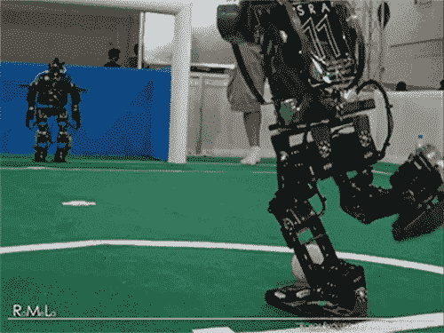
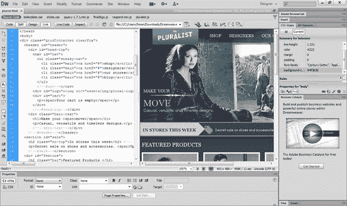
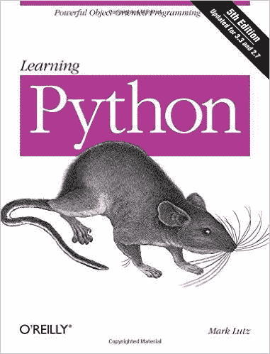

# 我花了 110，000 美元读研究生，却发现免费的在线资源实际上是…

> 原文：<https://www.freecodecamp.org/news/why-i-spent-110k-to-decide-not-to-go-to-school-7402e78c89ee/>

作者罗柏

# 我花了 110，000 美元读研究生，却发现免费的在线资源实际上更好

I spent $110k to Decide That the Free Option was the Better Option.Source: [https://unsplash.com/photos/gyKBzbiuiPg](https://unsplash.com/photos/gyKBzbiuiPg)

当我进入一个计算机科学硕士项目时，我感到欣喜若狂。终于，我的梦想开始实现了。我的日子充满了一种舒适的感觉——一种决定论的感觉。

这使得解释接下来发生的事情有点困难，但我会解释的:我退学了。

我退学不是因为这个项目太难，也不是因为我没有足够的时间来完成它。我退学是因为我发现实现编程梦想所需的资源已经免费提供给我了。正如我发现的那样，这些资源最终甚至比我“喜欢”的大学还要好。

让我们倒回去一点。在我开始攻读硕士学位之前，我几乎没有任何编程经验。嗯，老实说，我根本没有受过正式训练。

我是名真正的运动员。我靠足球奖学金顺利完成了大学学业，我没有选择计算机科学这个“难”的学位，而是选择了一个容易得多的历史学位。

但是我的大学经历给我留下了不好的印象。直到今天，我都不能强迫自己坐下来读一本历史回忆录，我对体育的厌恶随着每一届大学游戏日的到来而变得更加强烈。

Ugh.. not another mascot

我的祖父不仅对计算机感兴趣——他建造了一个分拣仓库机器人并为其编程，并且一直维护着它，直到他被诊断出患有脑癌的那一天。

我看到了他的动力，以及他对编程的激情，这激励了我。我也想编程。

not quite but you get the gist

所以我知道编程是我毕业后想做的事情。这似乎是我的人生道路。

问题是，在整个初中和高中时期，我完全厌恶数学。另外，我的父母太忙了，没有时间在晚上帮我做数学作业。我继续落后。

回过头来看，我可能只是因为教学风格而脱离。现在，人们可以使用像可汗学院这样的工具，许多学校都有专门的数学实验室。但我出生得太早，无法从这些中受益。

结果是——虽然我的身体在足球场上跑来跑去得到了足够的锻炼——但我大脑中分析解决问题的那一面却几乎没有伸腿。

不过，我所在的高中确实开设了网页设计课程。它以 Dreamweaver 为中心。Dreamweaver 无论如何都不是一个糟糕的产品，但它是实际编程的一个糟糕的替代品。不幸的是，这是我们学校提供的唯一一门编程课程。

Dreamweaver made web design easy. The price was you were always about 5 years behind the times.

当这门课开始让我的编程变得流畅时，它已经结束了，我去参加我的毕业典礼了。

接下来的五年是模糊的婚姻，五只猫，一个联盟冠军，和全国冠军。不要误解我——我很高兴这一切都发生了。

但是我总是觉得我的生活中缺少编程——以及它提供的创造性出路。

所以有一天，我决定终于挠痒痒了。我买了一本编程书。

The first programming book I bought. You can get it [here](http://www.amazon.com/Learning-Python-5th-Mark-Lutz/dp/1449355730/ref=sr_1_4/177-2199561-0857008?s=books&ie=UTF8&qid=1455863128&sr=1-4).

我向我爸请教学哪门编程语言(我爷爷此时已经过了)。他提到他的很多朋友都在使用 Python。他补充说，由于它的易用性，它被普遍认为是一种不错的入门语言。

长话短说，我至今仍在努力掌握 Python(你真的掌握过语言吗？)但是从那一点开始，我就迷上了。我从骨子里感觉到了这一点——我想用我的余生来编码。编程吞噬了我的生活。

所以我决定开始申请计算机科学硕士学位课程。唯一的问题是这个程序必须完全在线。我的妻子正在读护士学校，而我有一份全职工作。所以我选择了只在网上，因为我需要能够支付账单，她的学费，以及我不断扩大的猫收藏。这就是我犯错误的地方。

当时，我对免费期权一无所知。但不知何故，我偶然发现了 Reddit 的[learn programming subred dit](https://www.reddit.com/r/learnprogramming)，它支持各种免费资源，如 EdX、Coursera 和自由代码营。

我的在线硕士课程很好。但是我投入了那么多钱，我需要它比仅仅好要好得多。

所有这些免费资源让我质疑，为什么我要为一个甚至很少有顾问提供帮助的大学项目支付这么多钱——当我不知道一些事情时，顾问们经常不厌其烦地让我觉得自己像个白痴。

Kind of?

现在，不要搞错了，这不是一个“我真倒霉，我的大学对我很糟糕”的帖子。相反，这是一个“我在网上找到的免费资源比我花了一大笔钱去上的大学要有用得多”的帖子。

说真的，这似乎奇怪地违背了直觉，但我在自由代码营的聊天室接触到的人比那些表面上受过教学方法培训的有偿大学工作人员友好得多，也更有帮助。

最重要的是，我厌倦了申请学生贷款。我觉得我的个人财务状况永远失控了。不是什么好感觉。

总的来说，到毕业时，我将背负 55，000 美元的联邦学生贷款债务，以及另外 150，000 美元的私人贷款债务——这些贷款的利率极高(有一笔贷款的利率超过 10%)。

我坐下来，所有的数字都摆在我面前，凝视着我的财务前景。然后我回头看了一眼那些友好的人，他们正在免费改进他们的编程(并且一路上互相帮助)。

我的结论是，为我本来可以免费做的事情付费不再有意义。这不仅减轻了我的焦虑，而且让我再次感觉到自己的生活在自己的掌控之中。

目前，我的生活是不断工作的混合体，[在时间允许的情况下在 twitch.tv 上播放](http://www.twitch.tv/newtron54)，现在在媒体上写作。

就编程而言，我仍然在更好地使用 Python，学习越来越多的 Linux，并且我正在努力克服自由代码营早期的 web 开发挑战，以便进一步实践。

尽管我的生活可能会朝着十几个不同的方向发展——我的总体计划比以往任何时候都更加模糊——但我最终很开心，取得了进步，不再有睡眠问题。

我决定更多地关注 web 开发方面的事情，因为这是大多数好的免费在线资源的焦点。到目前为止，HTML 和 CSS 是我“流利”知道的主要东西。不过，我正在使用 Javascript 和 jQuery，以及 Git 和 SQL。

我不建议向任何人贷款读研究生。也就是说，到目前为止，我不会改变我的旅程。

这一次，我真的对我生活的方向感到兴奋。我希望你能到达一个让你感到类似兴奋的地方。即使这需要你放弃硕士学位才能实现。