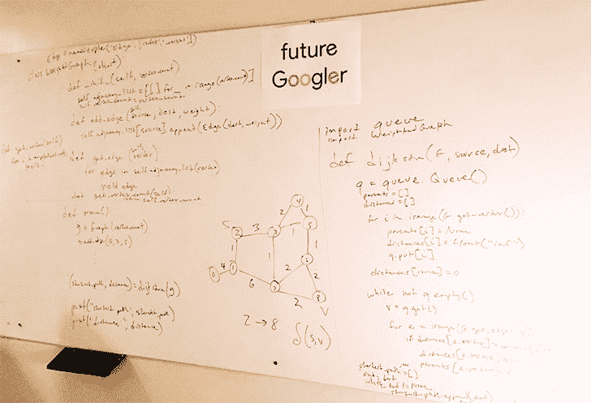
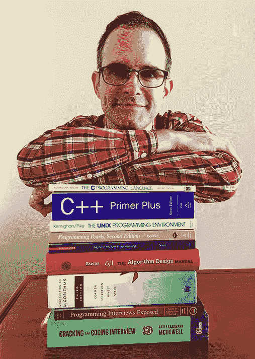
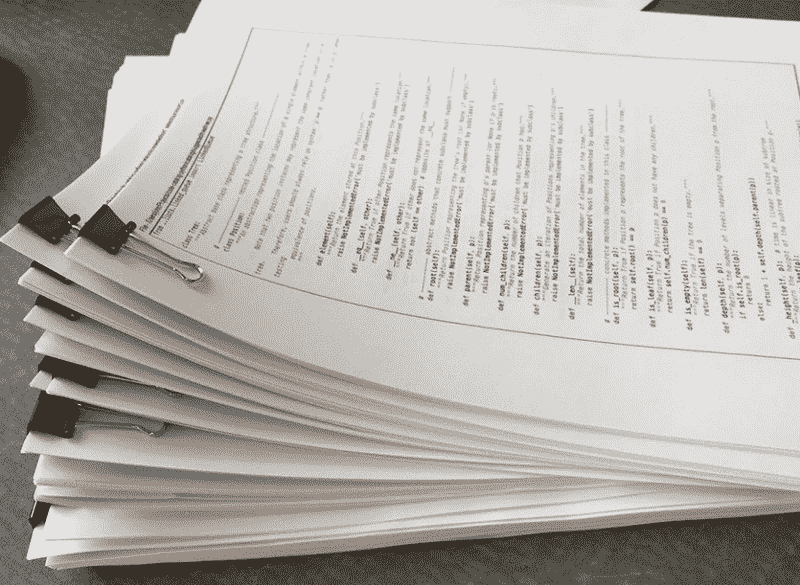

# 为什么我花了 8 个月的时间全职学习谷歌面试

> 原文：<https://www.freecodecamp.org/news/why-i-studied-full-time-for-8-months-for-a-google-interview-cc662ce9bb13/>

由谷歌作为见鬼

# 为什么我花了 8 个月的时间全职学习谷歌面试

My well-worn whiteboard, adorned with Dijkstra’s single-source shortest-paths algorithm.

是真的。我花了数千小时看书、写代码、看计算机科学讲座，都是为了准备谷歌软件工程师面试。

如果你想为谷歌面试做准备，这是我的学习计划:

[**jwasham/google-interview-university**](https://github.com/jwasham/google-interview-university)
[*Google-interview-university-学习成为 Google 软件工程师的完整日常计划。*github.com](https://github.com/jwasham/google-interview-university)

### 我是如何来到这里的

我在中学时开始编程，但到了上大学的时候，我开始攻读经济学学位。我的理由是，到我毕业的时候，会有太多的程序员在找工作。伙计，我错了。

后来，我参军成为一名程序员，但征兵人员说服我进入军事情报部门，我花了两年时间学习韩语。后来我在韩国服役了两年。

在我离开军队之前，我试图重新开始编程，并对其难度感到惊讶。我在中学学过 BASIC，并在整个高中期间一直在编程。但是我用 C++重新开始编程学习，这个飞跃太大了。我就是抓不住。

然而，我确实喜欢制作网站，但是我使用了一个类似 Word 界面的软件，我用它来发布我的网站。我不知道如何从零开始做网站。

退伍后，我决定留在韩国一年，教英语。我利用晚上和周末的时间学习 web 编程，使用 Perl、HTML、CSS(当时还很新)、JavaScript 和 SQL。

经过一年的紧张学习，我在西雅图地区找到了一份工作，从那以后我就一直呆在这里。

Doing some work from the balcony in beautiful Bellevue, WA.

我已经做了 15 年的网页开发员。我创办了 3 家公司，其中两家仍在运营并产生收入。我在大大小小的公司工作过，帮助初创公司起步和成长，招募和管理团队。我做过产品经理、首席执行官、设计师和营销人员。

我有一个成功的职业生涯，并在这个过程中学到了很多。但我还没说完。

### 寻求职业改变

还记得我没拿到计算机科学学位的那部分吗？这已经产生了影响。

几年前，我认为我可以在任何地方被雇用。我以为我是热门人物:难以捉摸的全栈 web 开发人员。但在 2013 年找工作的过程中，我意识到自己的技能有所欠缺。我花了太多时间在业余时间经营创业公司来追逐金钱，以至于我的技能萎缩了。我没有跟上技术的发展。

多年来，我学到的东西只够勉强度日。我有广泛的技能，但不是任何方面的专家。

不要误解我，我仍然可以被雇佣，但不是在我想从事的技术或领域。像我一样，我可能会在技术有些过时的领域被聘用。那里有很多钱，但我没有看到令人兴奋的前景。

这种认识在去年的一次招聘会上达到了顶峰。我有兴趣为一家当地公司工作，这些公司是由风险投资公司运营的创业实验室。然而，事实上，我没有计算机科学学位，也没有相关的技能和知识，这意味着我没有机会。

那时我全职经营我的生意，今天依然如此。

2016 年初，我决定是时候从 web 开发人员转行到软件工程师了。为了在几个月内获得计算机科学学位，我需要努力学习和实践，但一旦我做到了，我就可以开始新的职业生涯。

你可能看不出 web 开发和软件工程是不同的职位。这两者都涉及编程和工艺，但软件工程增加了数据结构和算法、编译语言、内存考虑因素的知识，并理解编码和架构决策对它们所在机器的影响。

招聘软件工程职位的大公司希望应聘者具备这方面的知识。

我联系了一位在谷歌工作的熟人，向他询问了一些关于他在谷歌工作经历的问题。我一直在阅读谷歌如何工作的*，对谷歌已经相当熟悉了。*

*通过另一个联系人，我收到了一份谷歌提供给面试候选人的辅导笔记。这成了我学习计划的基础。*

*谷歌是一个非常棒的工作场所，但在我知道之前，谷歌就是我的目标。*

### *为什么是谷歌？*

*谷歌为招聘设置了很高的门槛。他们只想雇佣最好的人。所以，如果我把目标定得很高(被谷歌录用)，即使我没有被选中，我在其他地方也很有可能被录用。*

*我对谷歌了解得越多，就越想去那里工作。*

*简而言之，谷歌是一家雇佣聪明、有创造力的人并善待他们的公司。谷歌奖励优点，鼓励大创意，并给予员工为用户做出好决定的自由。*

*招聘过程旨在引进聪明、热情的人。多年来，谷歌磨练了招聘和面试流程。脑筋急转弯的问题早就没有了。如今，候选人是根据编码能力、技术知识和谷歌度来选择的。这个词包含了很多东西。*

*

On a road trip in 2015, I visited the Mountain View HQ. That planted the seed.* 

*管理就不一样了。管理者不微观管理。他们相信工程师会做出正确的决定。信任员工改变了谷歌经理的角色，这与大多数人对管理的看法不同。此外，管理人员不能单方面雇用、解雇或晋升。许多可能被视为办公室政治的重要管理决策都由一个委员会来处理，以消除这种危险。*

*随着时间的推移，谷歌的人力资源(HR)已经知道什么是有效的，他们使用数据和员工反馈来改善评估系统、招聘流程、晋升、薪酬、福利等。阅读 [*工作规则！*](https://www.amazon.com/Work-Rules-Insights-Inside-Transform/dp/1455554790) 多由拉兹洛·博克(SVP 人，军令部)担任。*

*是的，好处是惊人的。我参观了位于华盛顿州柯克兰的谷歌办公室，它超出了我的预期。我的期望已经很高了。*

### *谷歌面试大学*

*还记得我收到的告诉我学什么的辅导笔记吗？这个主题列表看起来是可以管理的，即使我对列表上的内容一无所知。*

*我把笔记上的主题变成了一个大纲，并开始用麻省理工学院和加州大学伯克利分校的 YouTube 视频填充这些主题。在一个地方是关于链表的视频，在另一个地方是关于队列的视频。名单开始变长。*

*我在 Github 上发布了这份名单，因为我的 Github 账户相当空。由于我为我的业务和工作编写的所有代码都是私有的，我的 Github 帐户让它看起来像是我根本没有编写代码。我需要建立一个投资组合。我最初称这个项目为“9894 工程”。谷歌于 1998 年 9 月 4 日推出。因此得名。我后来把它改名为“[谷歌面试大学](https://github.com/jwasham/google-interview-university)”。*

*随着时间的推移，我添加了一些我在这个过程中发现的可选主题。*

*

My summer reading list. A little over the top.* 

*我很惊讶自己在职业生涯中走了这么远，却不知道 CPU 是如何处理程序的，内存是如何工作的，等等。我知道“刚刚够”就是成功。*

*我的小 Github 项目开始获得几颗星，我发表了一篇博文庆祝 20 颗星。*

*一天早上，我醒来发现它已经长到 120 颗星星了。某个名人在晚上发了关于它的推特，这导致它出现在 Github 每日趋势报告上。有几天我在 Github 上排名第一。*

*许多好心人伸出手来感谢和鼓励我。事实证明，有成千上万的人不仅想在谷歌工作，还想成为一名软件工程师，这份清单正是他们需要的待办事项清单。*

*它现在有超过 21，000 颗恒星。*

*我还是不敢相信。*

### *如果我得不到这份工作怎么办？*

*这不会是世界末日。*

*我把时间和精力投入到我的学习中，目标是成为谷歌的软件工程师，但即使我失败了，我仍然拥有在任何公司做软件工程师所需的技能和知识。*

*无论我最终在哪里，我都将成为一名入门级的软件工程师。我不会带着 15 年的软件工程经验进去，因为我根本没有。说到这种东西，我相当于一个新的计算机科学毕业生。*

*但我也有新毕业生的热情。这对我来说是一个新世界。我才刚刚开始。我不怕犯错误。我知道我会的。我也想尽我所能学习一切，成为任何团队的优秀补充。*

### *不要像我一样用功*

*是的，我花了 8 个月。但是我可以简化这个过程。像任何一个有大目标的创业公司一样，你会犯错误，会做一些浪费时间的事情。有很多事情我希望回到过去，用不同的方式去做。*

*我研究了我不需要的话题，有些是因为我认为我会在面试中用到它们，有些是因为我想在开始工作时手头有这些知识。我不想成为分配给我的团队的负担。原来我只是准备过度了。*

*我花了 3 周时间读了一本 1000 页的 C++书。我不记得有 1000 页，但我现在对 C++有了一些了解。结果是，我面试用的是 Python，不是 C++。我原以为我需要 C++、C 或 Java，但我错了。问是好的，不要想当然。*

*我读的书比我需要的多得多。我应该读过的书[只有 3、4 本](https://github.com/jwasham/google-interview-university#book-list)。*

*我有一个代码目录，里面有几十个我审查过的算法，其中大部分是我在面试中不会想到的。你不需要那样做。*

*

A stack of algorithms, printed out for review.* 

*我看了很多小时的 YouTube 视频，但本可以看得更少，并随着时间的推移分散话题。*

*我应该早点停止看书和看视频，早点开始解决编码问题。我本可以花更多的时间来应用我所学的主题。*

*间隔重复是记忆的关键。一旦你学会了什么，以后再复习，甚至以后再复习。每一次重复，你都在强化你的学习。一次花几个小时在优先队列上不会让你成为专家。随着时间的推移，通过重温和回顾，你会成为一名专家。如果你这样做，你会到无法忘记细节的地步。*

*为了帮助复习，我做了 1792 张抽认卡(数字抽认卡)。这太多了。每当我有空闲的时候(比如在圣诞购物期间)，我都会在手机或平板电脑上查看它们。抽认卡和间隔重复是密切相关的。一旦我在抽认卡上得到正确的答案，我不会把它标为已知。我把它放在卡片上，一旦我看过它并多次正确回答，我就把它标记为已知。*

*我的恐惧感(“如果他们问我一个关于红黑树的问题怎么办？”)让我研究了比我需要的多得多的课题。*

*但我不想只是为面试做准备，我想为在谷歌的职业生涯做准备，解决大规模的问题。这意味着要知道能够节省时间、空间和 I/O 计算资源的算法。*

*我可能永远不需要知道最大流算法(Ford-Fulkerson)，但很高兴知道如果情况出现，我有这个工具可用(不需要记住实现)，并且可以识别它在问题空间的应用。*

### *结论*

*早期，我希望我可以跳过所有这些学习，只是快点被录用，这样我就可以花时间为我加入的团队学习语言和工具。但是在这个过程中，我意识到这些知识是多么重要，尽管其中的大部分可能并不适用于日常生活，但我很高兴我付出了努力。我对计算的历史、该领域的伟人、数据结构和算法(以及它们如何互补)以及计算机系统如何在底层工作有了新的认识。*

*我很快就会递交我的申请。走到这一步是一个漫长的旅程——几乎整整一年。早在一月份就开始了，但是直到四月份我才开始全职学习。*

*我已经尽我所能准备好了。我不能一直学习，永远推迟申请。在某种程度上，我不得不迈出这一步。*

*我看到了光明的未来。*

*感谢您花时间阅读我的故事。*

**文章还有[阿拉伯语](http://www.sasapost.com/translation/google-interview-university/)、[越南语](https://techtalk.vn/tai-sao-phai-on-luyen-full-time-8-thang-cho-1-buoi-phong-van-voi-google.html)和[韩语](https://www.vobour.com/book/view/fiRGQMcmRkaw7pgpL)版本。**

### *更新:2017 年 1 月 10 日*

*我没被录用。 [**读上**](https://medium.com/@googleyasheck/i-didnt-get-hired-here-s-why-21f26d4784d5) 。感谢每一个人给予的惊人的、势不可挡的支持。*

### *更新:2017 年 3 月 6 日*

*这个故事有一个快乐的结局！我被亚马逊聘用，成为亚马逊网络服务的软件开发工程师！*

### *去哪里找我*

*我在隔壁的创业公司写博客。*

*Github 上的谷歌面试大学:*

*[**jwasham/google-interview-university**](https://github.com/jwasham/google-interview-university)
[*Google-interview-university-学习成为 Google 软件工程师的完整日常计划。*github.com](https://github.com/jwasham/google-interview-university)*