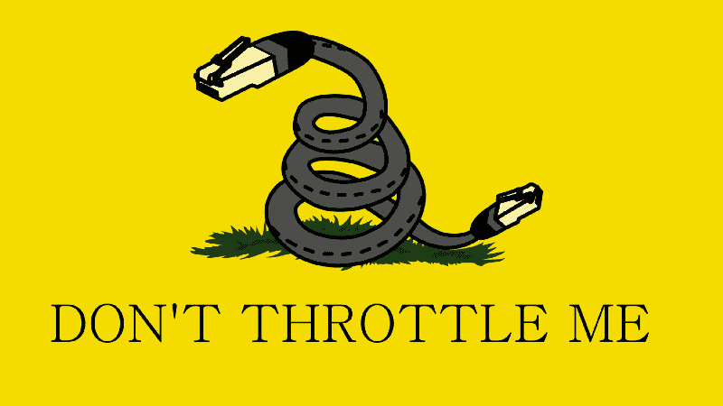

# 支持#网络中立=支持设计师和他们创建的创业公司

> 原文：<https://www.freecodecamp.org/news/why-i-support-netneutrality-aca410673678/>

作者 Lukasz Lysakowski

# 支持#网络中立=支持设计师和他们创建的创业公司

Image: [https://imgur.com/gallery/ORcHC](https://imgur.com/gallery/ORcHC)

我相信网络中立，我给联邦通信委员会写了一封简短的电子邮件，解释为什么宽带接入塑造了我的设计生涯。我的邮件是这样写的:

大家好，我叫 Lukasz Lysakowski，是一名在旧金山生活和工作的设计师。我支持网络中立，因为互联网接入允许我创造一个职业生涯。我是在线应用程序、产品和网站的设计师。

我在北卡罗来纳大学格林斯博罗分校开始了我的教育，主修媒体制作领域的文学学士学位。在 UNC-G，我有机会参加新数字媒体[设计项目](https://vpa.uncg.edu/art/degrees-and-programs/bfa-overview/bfa-in-new-media-design/)的设计课程。数字设计和互联网还处于起步阶段。

与设计计划相关的是对高速互联网的介绍。不再有拨号服务、BBS 论坛和美国在线，这就是宽带。对我来说，接入高速互联网是革命性的。我很快学会了如何建立和设计网站。那时，学习如何制作网站的最好方法是使用浏览器的“查看-源”功能。“查看源代码”也是一个原创功能，因为它允许任何用户查看和复制任何网站的底层代码。我可以毫无障碍地获取网站代码，并修改它来学习如何创作自己的作品。

这种对快速网络的访问和任何网站背后的底层代码允许我作为一名在线设计师建立我的基础。当然，我处于一个特权地位，因为我可以在美国的大学系统中使用高速互联网。

从 UNC-G 毕业后，我得以在网络热潮开始时跳入网页设计领域。当时的商业网络是自由形式的，没有框架、规则和系统。设计师和开发人员被雇佣来试验和理解网络。互联网迅速发展，普通大众都可以访问。在线浏览和互动成为商业、新闻和娱乐日常生活的一部分。

为了让网络能够被普遍使用，它还必须标准化它的形式和功能。幸运的是，[Web 标准项目(WaSP)](https://www.webstandards.org) 是一个由设计师和开发者组成的社区，他们说服微软和网景公司升级他们的浏览器以支持 W3C web 标准。W3C 标准组成了网站的代码。这些标准是由促进平等网络标准的公司、组织和个人组成的委员会制定的。WasP 还展示了热情的个人可以推动 web 在自由开放的标准上发展。

作为一名从业多年的设计师，我参与了网络从静态营销静态网页到动态在线软件平台的推动。互联网的这种演变也催生了初创公司。

科技初创公司通过自由试验新想法，加速了计算向日常生活和商业各个方面的扩展。初创公司也受益于平等的互联网接入。初创公司可以自由地专注于执行，而不必担心他们是否会受到交付的不公平惩罚。

我们仍然处于网络的初级阶段。我们刚刚开始看到 AR、VR 和混合现实的腾飞。这个领域以及许多其他新技术领域将需要更快的网络和更多的数据传输。现有的科技公司和创业公司将会竞相开发新的创意。挑战和改善现状的创业公司需要一个平等和公平的竞争环境。

简而言之:网络中立对于确保所有美国人在互联网上平等公平地获取知识和信息至关重要。网络中立支持美国的企业家，对加速我们的经济发展至关重要。

如果你读了这篇文章并感到鼓舞，请发电子邮件给 FCC 委员:

阿吉特·帕伊，主席

米农·克莱本，专员
[Mignon.Clyburn@fcc.gov](mailto:Mignon.Clyburn@fcc.gov)

迈克尔·奥赖利，专员
[Mike.O'Rielly@fcc.gov](mailto:mike.o'rielly@fcc.gov)

布伦丹·卡尔，专员
[Brendan.Carr@fcc.gov](mailto:Brendan.Carr@fcc.gov)

杰西卡·罗森沃尔塞尔，专员
[Jessica.Rosenworcel@fcc.gov](mailto:Jessica.Rosenworcel@fcc.gov)

为未来而战是学习如何捍卫网络中立的一个很好的起点。

[**为未来而战，捍卫我们的基本权利和自由**](https://www.fightforthefuture.org)
[*【为未来而战】致力于保护和扩大互联网在我们生活中的变革力量，作者:*www.fightforthefuture.org](https://www.fightforthefuture.org)

FCC 专员 Clyburn 整理了一份概况介绍，总结了网络中立性对消费者和企业的好处。