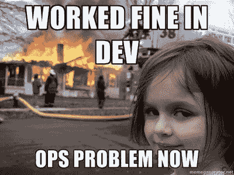

# 为什么我认为机器学习增强的软件系统是未来。

> 原文：<https://www.freecodecamp.org/news/why-i-think-machine-learning-enhanced-software-systems-are-the-future-5a1c978486b4/>

罗德里戈·阿劳霍

# 为什么我认为机器学习增强的软件系统是未来。

我从 2016 年开始酝酿用机器学习来改进软件系统的想法。这是相当模糊和广泛的，没有一个可操作的计划。我只是有直觉——软件配置和调整，尤其是在采用微服务之后，变得太复杂了。

#### 配置和调整系统的日益增加的复杂性

如果您在软件行业有足够的经验，那么很有可能您遇到过配置问题或调优问题。

配置和调优问题很常见，可能会导致非常严重的停机。它们通常发生在以下情况:

1.  系统的某些部分配置不良或错误，或
2.  以前有效的配置现在不起作用了，因为系统的环境已经改变了。

想一想大量的数据库副本及其写入方案。或者在 Postgresql 中，考虑共享缓冲区的数量、有效缓存大小以及最小和最大 wal 大小。

如果从一开始就配置错误，它在给定的上下文中就不会工作，简单明了。然而，更有趣的是，如果正确配置了*和*，它可能会在给定的时间工作。但是随着环境的变化——系统工作负载、系统资源使用、整体系统架构——系统将表现不佳。或者，更糟糕的是，可能会发生断电。

这将不可避免地导致手动执行操作和创建试探法。换句话说，它将导致:

> 哦，当工作负载为 T 时，我们应该将 X 设置为 A，但当工作负载为 T+100 并且我们的系统资源使用率超过 80%时，它应该为 A+10……我猜。或者让我们在这个组件前面排一个队列，队列可以解决一切问题，对吗？

现在将这个场景乘以数十或数百个服务。想一想这些配置带来的认知负担。

这不是一个新的问题。2003 年，Ganek 和 Corbi [讨论了](http://ieeexplore.ieee.org/document/5386835/?reload=true)自主计算处理管理软件系统复杂性的需求。他们指出，由于工程师在维护复杂系统时感受到的压力，管理复杂系统变得成本过高、劳动密集型，并且容易出错。这增加了系统停机的可能性，同时对业务产生影响。

即使是现在，系统的大多数配置和调整都是手动执行的，通常是在运行时执行的，众所周知，这是一种非常耗时且有风险的做法。查看这两个链接([这里](https://link.springer.com/book/10.1007/978-3-642-35813-5)和[这里](http://citeseerx.ist.psu.edu/viewdoc/download?doi=10.1.1.90.8651&rep=rep1&type=pdf))以了解更多信息。

#### 对自主计算的需求

大多数配置和调优系统的决策都是基于上下文做出的——有许多不同的变量，如工作负载、某些服务的实例数量、资源使用情况等等。那么，为什么不将这些任务委派给擅长于此的人呢？机器学习听起来是这项工作的可行工具。

在不列颠哥伦比亚大学开始攻读硕士学位后，我一直致力于这个想法。这看起来很有趣，虽然很奇怪，而且有时不切实际，无法实现。

令我惊讶的是，我意识到我并不孤单。一些非常有趣的人正在研究这些想法——所以这可能不是那么奇怪、不切实际和不可能的。

最近，Jeff Dean——我非常钦佩的一个人——[在 NIPS 2017 上做了一个关于系统的机器学习的演讲](https://news.ycombinator.com/item?id=15892956)，他说:

> 学习应该贯穿于我们的计算系统。传统的低级系统代码(操作系统、编译器、存储系统)今天没有广泛使用机器学习。这应该改变！

> 计算机系统充满了启发:编译器，网络代码，操作系统。试探法必须在“一般情况下”运行良好。[它们]通常不适应实际使用模式，也不考虑可用的上下文

> 在我们所有计算机系统的核心中学习将使它们变得更好/更有适应性。

当我读到这里的时候，我完全被吓住了。我最钦佩的一位工程师谈到了我一直在思考和努力的想法。

这让我想到，用机器学习来增强软件系统不仅有趣，而且很自然。在整个软件栈中，我们有许多试探法，尽管它们工作得很好，但可以通过机器学习来改进。

是否具有挑战性和潜在风险？是的，非常肯定。特别是考虑到可解释性显然已经成为机器学习社区的次要目标。我们如何解释和说明神经网络做出的决定？

然而，尽管如此，这些障碍不应该阻碍科技进步。是的，我们应该质疑旧的模式，并努力改进。

#### 机器学习增强的软件系统

正如杰夫·迪恩指出的:我们需要找到**实用的**方法让系统能够感知数据。我们需要收集关于自身的度量和元数据的系统。为了实现这一点，我们可以从系统可观测性和仪器的概念中学到一些东西。几十年来，我们一直在对系统进行检测，数据已经存在。

我们还需要找到**实用的**和**干净的**方法来**将**机器学习组件集成到软件系统中，让学习成为系统中的一等公民。这将导致**系统学习如何改进自己，**击败启发式和手动执行的操作。想一想这个。这听起来确实很酷*和*可行。

我还要补充一点，我们需要**实用的**和**干净的**方法来将学习到的模型做出的决策传播给系统的其余部分。这将允许系统具有自适应能力。在这里，我们可以从控制理论社区学到一些东西。

总的想法相当简单:让一个系统通过在它的上下文中训练一个模型来学习它的行为。然后允许它改变它的结构和配置，以便针对某个场景进行优化。现在以这样一种方式实现这个想法，使它有可能集成到多种系统中。

#### 摘要

我想到的最有趣的问题是:

1.  学习模型的自适应能导致更稳定、更快速、更安全的软件系统吗？它能否减少手动配置和调整系统的需求，让工程师专注于更重要的任务？
2.  这是否可以很容易地集成到软件系统中，只需要对代码库做很小的改动？
3.  这能以低开销工作吗？

值得注意的是，这种**不会**取代优秀的工程师，而是会解放工程师的认知能力，让他们专注于重要的事情。

我真的相信这将成为未来几年的趋势。我自己也在研究这些想法，作为我研究生学习的一部分，我将公布我的研究结果，所以[敬请关注](https://twitter.com/digorithm)。