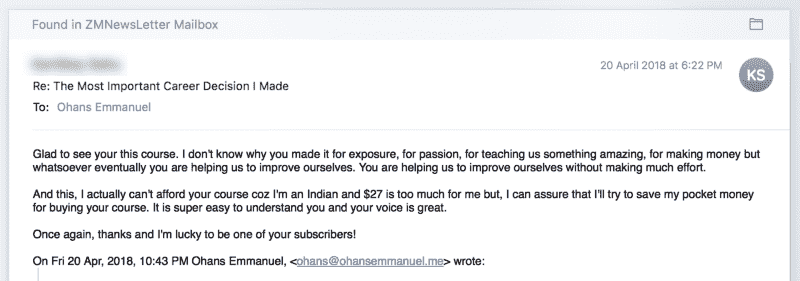
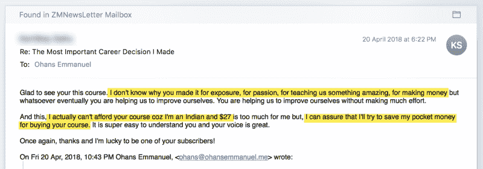
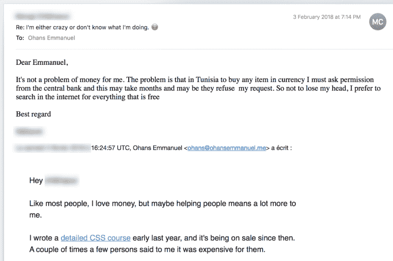
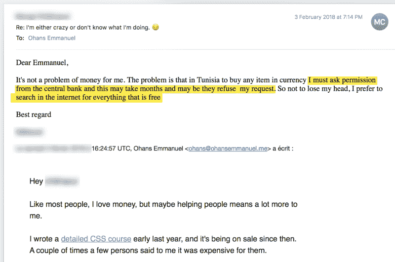
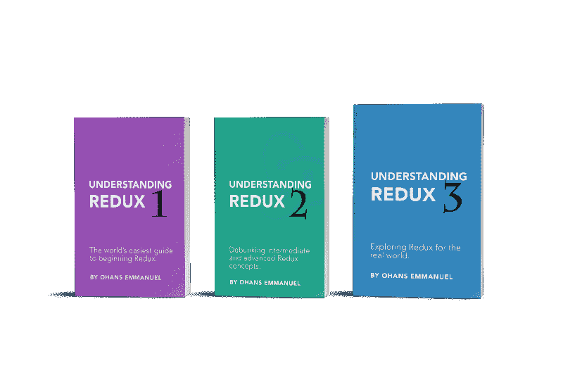
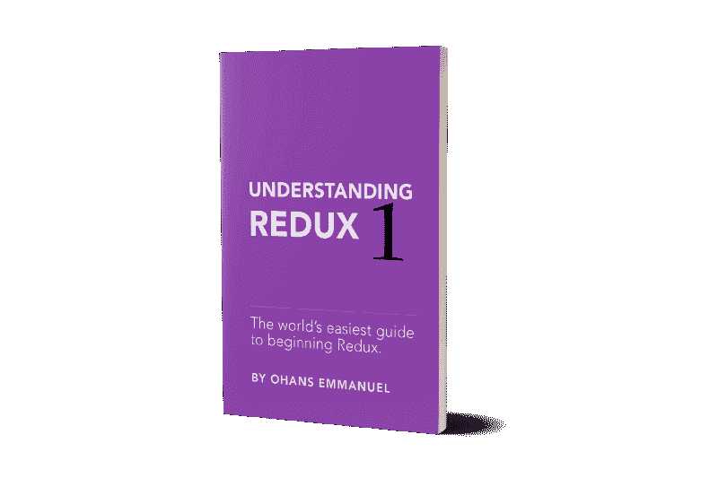
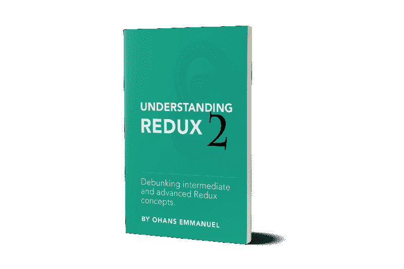
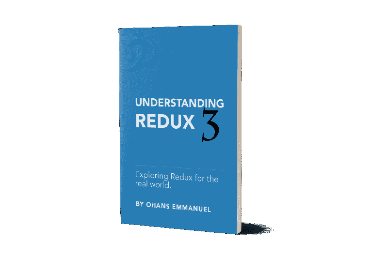

# 为什么我要赠送一本 650 页的技术书籍

> 原文：<https://www.freecodecamp.org/news/why-im-giving-away-a-650-page-technology-book-f1044ecb2541/>

所以，这是一个关于我如何写 ReduxJS 书的故事，你可以在上图中看到。

你可能关心的第一件事是，“你写的到底是什么技术？”

就是了。以防你不确定这项技术是关于什么的。

现在，更大的问题是:“为什么？”

为什么要花这么多时间写这个？

更大的问题是，为什么要放弃这一切？

让我在下面的部分回答这些问题。

### 我为什么写这些书

这些书首先是关于我的。是的，我。我努力学习 Redux，并寻求更好的教学方法。

几年前，我刚学会反应。我对此很兴奋，但同样，其他人似乎都在谈论另一个叫 Redux 的东西。

天哪！学习热潮会结束吗？

作为一名致力于个人发展的工程师，我想了解情况。我不想被遗漏。于是，我开始学习 Redux。

我检查了 Redux 文档。实际上，相当不错！

出于某种原因，它并不完全适合我。我也查了一些 youtube 视频。我找到的那些看起来很匆忙，也不详细。可怜的我。

说实话，我觉得我看的视频教程并不差。只是少了点什么。这本简单的指南是经过深思熟虑的，是为像我这样心智健全的人写的，而不是为一些虚构的人形生物写的。

我真的很纠结 Redux——很纠结。

看来我并不孤单。

我的一个好朋友，我当时正在指导的一个人，刚刚完成了 React 开发人员认证课程，他花了一大笔钱(超过 300 美元)为自己赢得了一个证书。

你猜怎么着？当我询问他对该计划的真实反馈时，他的话大致是这样的:

> 课程非常好，但我仍然不认为 Redux 对像我这样的初学者解释得很好。没有解释的那么好。

你看，还有很多和我朋友一样的，都在苦苦理解 Redux。

他们也许使用 Redux，但是他们不能说他们真正理解它是如何工作的。

我决定找到解决办法。

我打算深入了解 Redux，并找到一种更清晰的方法来教授它。

但是你知道吗？我对此超级兴奋。

我考虑了我和我认识的许多其他人的挣扎，写了一个我认为最“人性化”的指南，适用于所有技能水平。

### 改变我生活的电子邮件——以及我为什么要把这些书送人

4 月 20 日，我收到了一封电子邮件，这封邮件将彻底改变我对事物的看法！

下面是截图。请仔细阅读。

An email from a subscriber that changed my life — and how I see things.

这些是真正让我感动的部分:

Highlighted sections of an email from a subscriber that changed my life — and how I see things.

这是来自一个印度开发商，我无能为力。

因为我发布课程的平台，我甚至不能向他提供免费使用我的课程。所以，我提议通过 Paypal 给他汇款，这样他就可以购买课程。但他礼貌地拒绝了

他说:“我要自己攒钱。”。

我感到很无力。

**#编辑？？？**

我的无知战胜了我。我发布课程的平台其实早就可以处理这种情况了。事实上，他们就是这么做的！如果你来自印度、尼日利亚或突尼斯，我的高级 CSS 课程现在只需 9 美元。谢谢，[法希姆·哈克](https://www.freecodecamp.org/news/why-im-giving-away-a-650-page-technology-book-f1044ecb2541/undefined)

我写了一个详细的课程来帮助人们，但是我没能帮助他们充分利用它。

这只是许多故事中的一个。

每隔一段时间，我会决定降低我的课程价格，并发出一封电子邮件，这样人们就可以便宜地得到它。

但是我又一次震惊了。

**自己看看:**

Email from a Tunisian on why he cant buy anything online

这些是让我担心的部分:

其他一些来自突尼斯的开发者找到了我。据他说，他不能在网上购买任何东西。

但是为什么呢？

他继续解释说，这不是因为缺乏资金，而是因为他们的银行系统是如何运作的。

我震惊了。

看来事情并不是在所有地方都像在你的国家一样运作，是吗？

我可以在网上购物，所以我认为每个人都是这样。

天啊！

我很难过。

不要误会我的意思。赚钱很重要，我也喜欢赚钱。但是，如果你不能为急需帮助的人提供帮助，那么赚钱又有什么意义呢？

### 因此，我做了一个重大的决定

我本来打算写 ReduxJS 的书，但我会让每个人都能看得到。

任何人买的每本书，我都会免费送给印度、尼日利亚和突尼斯的一位开发者，他们自己买不起。

我要求这些地区的人[提交他们的详细信息](https://goo.gl/forms/zrm19tHdLK1GIRqg1)，这样我就可以联系到他们。

我不知道这是否行得通——但我有一种可能的感觉。我以前没做过这样的事。

然而，我确实有一个后备计划。

即使我们卖不出足够多的书，不能免费送给其他开发者一本，我很确定我会找到解决办法。

我有他们的详细资料，所以我总能以某种方式联系到他们。

### **关于书籍的更多信息**

[https://TheReduxJSBooks.com](https://TheReduxJSBooks.com)

我想接触更多的读者，所以我把这本书分成了三个不同的部分。这使得所有技能水平的开发人员都可以使用它。

绝对的初学者可以选择从第一本书开始，而更有经验的开发者可以跳过基础的东西，从他们认为合适的地方开始。

### **了解 Redux — 1**

这是给初学者的，解释得很好。你可以在这里找到它[。](https://medium.freecodecamp.org/understanding-redux-the-worlds-easiest-guide-to-beginning-redux-c695f45546f6)

The perfect starting point for beginners

**它包括以下内容:**

**？覆盖基础超级好**

**？深入了解核心冗余术语**

**？如何重构现有的 React 应用程序以使用 Redux**

**？学习从零开始建立一个 Redux 项目**

**？如何构建你的冗余代码**

**？处理错别字和副本**

**？设立 Redux 商店**

**？了解 Redux 减压器——以及它为什么被称为“减压器”**

**？更新 UI 以响应调度的动作**

**？保持一个规范化的状态，用简单易懂的语言来说这意味着什么**

**本书介绍了如何构建 Skype 克隆版，如下:**

The Skype clone you will learn to build as you read the book

### **第二册:了解 Redux — 2**

The perfect book for intermediate Redux developers.

第二本书更上一层楼。它包含关于以下内容的综合论述:

**？如何像专业人士一样管理 Redux 状态**

**？持续冗余状态**

**？通过 Ajax 获取数据并处理异步动作创建者**

**？介绍 Redux devtools、测井和时间旅行**

**？处理动态动作类型**

**？了解 Redux 中间件**

**？创建定制的中间件来集中 Redux 应用程序的功能**

**？Redux 应用中的高级错误处理**

**？使用 React-redux 实现更高性能的 UI 渲染**

**？为什么不变性很重要，以及在 Redux 应用中处理不变性的高级方法。**

**？仔细观察高阶元件**

**？了解与 redux 相关的公共库。想想重新选择，重复思考，重复承诺，重复坚持等等。**

**？通过冗余路由器路由**

**？如何在 Redux 应用程序中处理认证**

**？如何链接和取消 API 请求**

**？还有很多……**

**你可以在[官网](https://thereduxjsbooks.com)上了解更多关于*了解 Redux — 2* 有哪些项目在建。**

### **第三册:了解 Redux — 3**

这是拼图的最后一块。

The perfect place to deepen your knowledge for the real world use cases.

为了使这篇文章简短，如果你有兴趣了解这些书，我建议你去官方网站看看。

### **结论**

感谢您的阅读，我真的很期待未来。我迫不及待地想把这些书交到印度、尼日利亚和突尼斯的开发者手中。

**[加入我的](https://thereduxjsbooks.com)。**