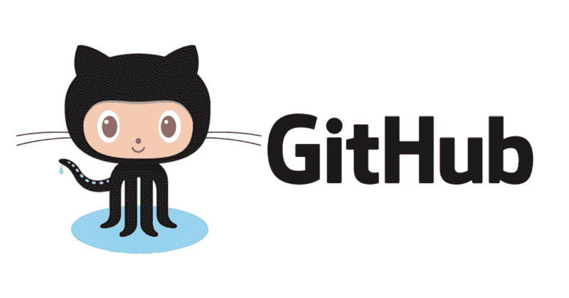

# 为什么我不用你的 GitHub 库

> 原文：<https://www.freecodecamp.org/news/why-im-not-using-your-github-repository-2dff6c7ac7cf/>

山姆·韦斯特雷奇博士

# 为什么我不用你的 GitHub 库

Your bad Github repo management disappointed this cat. You did this. Photo by [FuYong Hua](https://unsplash.com/@hhh13?utm_source=medium&utm_medium=referral).

作为一名生物信息学家，我处于开发者和最终用户之间的一个有趣的中间地带。我的背景培训是生物学，不是计算机科学。

但近年来，生物学已经向计算机科学靠拢。许多类型的生物数据太大，无法手工分析，必须使用计算机处理。基因组测序成本的不断降低带来了大量的序列数据。所有这些数据都需要收集、比较、搜索和注释。

生物学家越来越需要计算机。

更具体地说，生物学家需要计算机程序。听着，如果我从一个微生物组中获得了一堆序列数据，我想把它们与不同的起源物种进行匹配，我不会坐下来从头开始构建我自己的比对工具。我将拿起一个以前用过的现成的工具，祈祷它安装起来相当简单，然后插上电源。

在研究生院，我犯了一个错误。我让计算机世界的快节奏诱惑着我。“不再需要在实验室工作台上进行长达数周的实验！”我对自己宣布。“我将一头扎进生物学的计算机领域，成为两个世界之间的桥梁——一名生物信息学家*！”*

*理论上，生物信息学家分析生物学家收集的数据，发现新的结论，建立新的联系。*

*实际上，一个生物信息学家安装了很多程序，并诅咒创建这些程序的开发者。*

*我已经放弃了许多程序——我认为其中一些是非常好的程序——因为无意义的指令、糟糕的代码或可怕的文档。*

*这已经到了我可以浏览 GitHub 库并对你的工具有一个很好的感觉的地步。*

*一些回购注入了信心。其他人让我充满恐惧。*

*有时候，我发现有一个工具非常糟糕，以至于我甚至拒绝尝试安装这个工具(除非我的老板要求)。*

*以下是我看到的最大问题，以及如何避免它们。*

### *原因 1:没有文档*

*

No one knows how to use your program unless you write it out for them. Photo by [Beatriz Pérez Moya](https://unsplash.com/@beatriz_perez?utm_source=medium&utm_medium=referral).* 

*我见过文档的所有变体:*

*   *自述文件中编写的文档。*
*   *自述文件中的“快速操作”,以及单独的 PDF 或 Word 文档中的详细信息。*
*   *GitHub wiki 的链接。*
*   *指向外部站点的链接，其中包含编写的文档。*
*   *到外部网站的链接，那里有另一个下载 PDF 的链接。(为什么不直接把 PDF 放在回购里？)*
*   *最糟糕的是… **没有文档。***

*是的，我知道写文档很糟糕。我建立了管道和工具，我强迫自己写文档。我已经忘记了边缘情况和命令的细节，有时会收到用户令人尴尬的提醒。*

*如果您构建了一个工具并将其公开，您的文档至少应该包括:*

1.  *使用工具的要求和依赖关系。这包括硬件要求(RAM 和磁盘大小)和软件要求(操作系统和其他程序)。*
2.  *如何安装您的工具？*
3.  *你的工具能做什么。*
4.  *如何使用示例命令让您的工具做这些事情。*

*我还强烈建议您包括:*

1.  *“常见问题”部分。*
2.  *测试—这包括测试数据和应该在该测试数据上使用的确切命令(达到应该将命令复制/粘贴到命令行上的级别)。*
3.  *输出示例。*
4.  *执照。*
5.  *截图，如果适用。*
6.  *确认、您是否愿意接收请求以及联系信息，以便用户可以报告问题。*

*糟糕或不完整的文档是我停止使用工具的首要原因。你知道你的工具是如何工作的，但是其他人都不知道——不要强迫别人去弄清楚。给出清晰简单的说明。*

### *原因 2:依赖地狱*

*

“Each of these is a dependency. Be sure to unpack them all in the right order!” Photo by [chuttersnap](https://unsplash.com/@chuttersnap?utm_source=medium&utm_medium=referral).* 

*我曾经发现一个工具(DNA 序列注释的管道)有六个依赖项。*

*“这还不是最糟糕的，”我心想。"我可以安装六个依赖项来使用这个工具."*

*不幸的是，这些依赖关系中的大多数都有其他的依赖关系。那些人甚至有更多的依赖，包括一些拒绝彼此友好相处的人。*

*当我放弃最初的工具时，我已经遇到了 19 个需要安装的不同的依赖项，特别是为了使用这个管道。*十九*！*

*有大量有用的工具可以作为更复杂程序的构建模块，这很好。使用一个已经存在的、已经被认可的依赖要比重新发明轮子自己做好得多。*

*但是如果您选择这条路线，请为我找到一个更简单的方法来安装您的工具的依赖项。*

*给我一个安装脚本，我可以运行这个脚本来获得所有的依赖项——如果我需要半打 Python 或 R 包，这个脚本特别好用。如果可能的话，给我一个依赖项的档案，这样我就不需要去寻找它了(假设依赖项的许可证允许这种级别的再分发)。*

*不要让我陷入依赖地狱——如果你这样做了，准备好看到许多用户放弃使用你的程序。没有人想在地狱里度过时光。*

### *原因 3:遗弃问题*

*

“No one’s made updates to this repo for a long, long time.” Photo by [Nathan Wright](https://unsplash.com/@cozmicphotos?utm_source=medium&utm_medium=referral).* 

*当一个 GitHub 项目是新的和新鲜的，没有问题。它是新的，干净的，还没有人偶然发现这些漏洞。*

*在接下来的几个星期到几个月，当用户找到并测试程序时，他们会提出问题。幸运的是，GitHub 在每个存储库上都有一个页面专门记录这些问题。这叫做“问题”*

*这里，在这个页面上，用户评论说当他们尝试各种任务时，他们得到一个错误消息。有时候，这是一种过时的依赖。有时候，是代码中的一个错别字。有时，这是用户错误——他们有另一个工具的错误版本，他们的输入是错误的格式，或者他们使用了非法选项并且没有阅读帮助消息。*

*从表面上看，这是一个很大的特点。但是这个问题页面也可以是一个警告——或者一个威慑。*

*问题页面可能会抛出两个红旗中的一个，或者一个绿旗:*

*   *危险信号 1:没有问题。从来没有任何问题。没有人用过这个工具，它被废弃了，积满了灰尘。*
*   *危险信号 2:有几个悬而未决的问题，主要是关于错误，回购所有者没有解决方案。这个工具被废弃了，坏掉了，主人也不在乎。*
*   *绿色标志:很少有开放的问题，其中大部分被标记为增强——但是有很多关闭的问题。**所有者正在积极修复错误，帮助用户，并计划添加更多功能。***

*因为我在 GitHub 上发布过程序，所以我知道维护它们并不好玩。创造新事物很有趣。对奇怪的错误消息和迟钝的用例进行故障诊断并不有趣。翻遍一页页的旧代码，找出一个超级特定的条件导致失败的原因，这一点都不好玩。*

*但是最好的程序(以及最值得信赖的 GitHub repos)来自于那些愿意做枯燥乏味工作的创作者。这包括解决问题和为用户提供支持。*

*如果其他问题得到了回答，我会更有信心，我自己的问题会得到解决，我将能够自信地使用这个工具来实现我自己的目的。*

### *向我推销你的计划*

**

*不管你喜不喜欢，你的 GitHub 库经常是你程序的“面孔”。你的回购需要把你的程序卖的容易安装，容易运行，容易理解。*

*一个伟大的 GitHub 回购是一件美好的事情。作为一个半熟练用户，我喜欢自述文件确切地告诉我安装该工具的命令，如何使用它，以及如何解决最常见的问题。一本详细而简单的手册让我喜笑颜开。一步到位的依赖项安装脚本让我松了一口气。您支持您的工具并修复 bug 的迹象让我充满了信心。*

*让我用一下你的工具。*

*让我引用你的工作，向我的同事们歌颂你。*

*让我尊重你和你建立的伟大程序。*

*避免这些问题——并在下一个面向公众的 GitHub 存储库中避免这些错误。*

*Sam Westreich 是一名在硅谷工作的微生物科学家，他花了数年时间沉浸在科学和最无聊的追求中。他的博客涉及科学、生物学、微生物和微生物组，以及他对研究生院和寻找成功的想法。*