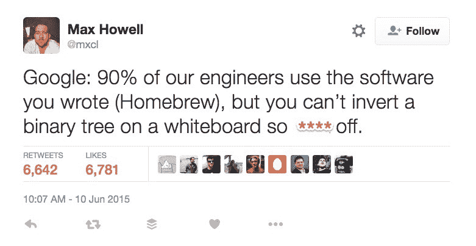
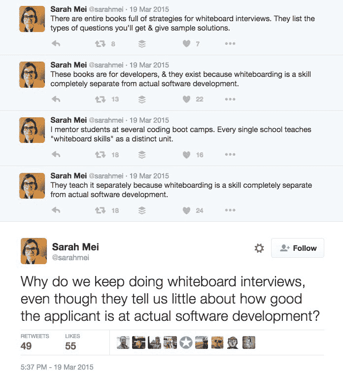
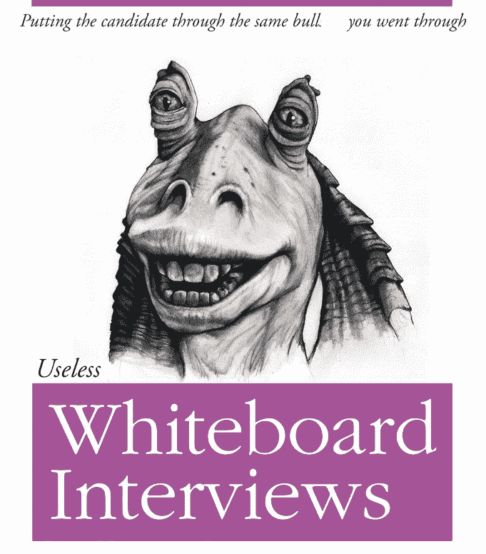

# 为什么招聘断了？从白板开始。

> 原文：<https://www.freecodecamp.org/news/why-is-hiring-broken-it-starts-at-the-whiteboard-34b088e5a5db/>

开源杰出人士 Sahat Yalkabov 在经历了一系列技术面试后，已经放弃了寻找前端开发人员的工作，他向我描述这是一个“羞辱和非人性化的过程”

过去几个月里，各种招聘人员在六家不同的公司为他安排了面试。他的每一次面试都围绕着在白板上潦草地写算法展开，其他开发人员站在旁边评判他是否适合这份工作。

每次面试后，他都会收到一封简短的电子邮件，通知他公司决定不再考虑他的候选资格，但没有任何进一步的解释。

萨哈特并不是局外人。他拥有计算机科学学位，曾在雅虎担任开发人员，是最多产的开源贡献者之一。

Sahat’s open source contribution activity [on GitHub](https://github.com/sahat).

在大型科技公司争相寻找有能力的开发人员的时候，为什么他在获得工作机会方面有这么多困难？

答案部分在于大型科技公司如何面试开发者。

你可能会认为，在这个高科技行业中，面试官会使用新奇的工具来分析代码样本的质量，或者看看候选人的代码在多大程度上作为依赖项包含在像 npm 这样的包生态系统中。这就是学术研究者的工作将如何被评判——被多少其他学者引用。

不幸的是，大型科技公司的面试实践并不那么科学。是否雇佣开发人员的决定通常取决于候选人走向白板，背诵自 20 世纪 70 年代以来就没有改变过的算法，就像一只(经典的)受过训练的猴子。

Sahat 不是唯一一个对大多数主要软件公司使用的以白板为中心的技术面试过程感到沮丧的人。事实上，与我交谈过的每个开发人员都同意，一个人在白板上凭记忆编写算法的能力与真正的日常开发工作几乎没有任何关系。

#### 白板面试是如何工作的

白板上最常见的任务是回忆算法并将它们无错误地写在白板上。

通常有时间压力的因素。如果你不记得算法或者从来没有学过(也就是说，从来没有用过)，你的面试官可能会让你猜测你的工作实现方式。

你的面试官可能会问时间复杂度，看你能否将运行算法的时间从 O(n log(n))减少到 O(n)。

请记住，这是白板，而不是代码编辑器。您不能实际运行代码来查看它是否工作，更不用说对它进行基准测试了。因此，你的面试官充当着法官、陪审团和(字面上)你的代码的执行者。

好消息是你可以为白板面试做准备，就像你可以为大学入学考试临时抱佛脚一样。还有专门帮助你在白板面试过程中胜出的书籍和网站的山寨产业。

白板面试问题通常来自大约 200 个可预测的问题，这些问题的答案都可以在[破解代码面试](http://www.amazon.com/gp/product/0984782850/ref=as_li_tl?ie=UTF8&camp=1789&creative=9325&creativeASIN=0984782850&linkCode=as2&tag=out0b4b-20&linkId=CPE5JO5PB2MAJLZA)中找到。这本书是最接近白板面试剧本的东西。它的作者是根据她采访谷歌、亚马逊、微软和苹果开发人员的经验写的。

当然，你的面试官没有义务问你一个你已经努力准备好的问题。如果你运气不好，他们可能会让你写出一个你从未听说过的算法。这就是“算法问题抽奖”的精髓。

开发人员通常会为白板面试辩护，称其为精英面试。任何想花几个月的时间把算法记在脑子里的人都可以去谷歌找份工作。

这些算法中的大部分已经作为计算机科学本科项目的一部分被触及。

那么问题出在哪里？

#### 反对白板面试的理由

问题是在白板上写算法和现代软件开发几乎没有任何关系。

在现实生活中，你很少会在编码过程中凭记忆即兴创作一个算法。您几乎总是要使用一个现有的库，它有自己的测试套件，并且通过了其他开发人员的审查。

你真正需要能够回忆起算法的唯一世界将是一个后世界末日的世界，在那里，所有连接到互联网的计算机的硬盘都被烧毁，所有基础学术论文和计算机科学教科书的副本都被化为灰烬。

白板面试是一项独立的技能，就像记住圆周率的小数点后一千位一样。编程专业的学生花费了大量的时间来掌握这一技能，而不是通过构建项目、维护遗留代码或贡献开源来实践真正的软件开发。

这最终会降低入门级员工的质量，因为普通面试官很难看出谁擅长开发软件，谁只擅长白板面试。

它也冻结了许多在软件开发领域中代表不足的人。如果你忙于工作和抚养孩子，你会想尽可能多地利用你有限的时间来学习编码——而不是死记硬背，一旦你开始工作，这就无关紧要了。

即使你能负担得起补习班的费用(有些会用你未来的工资来装饰，而不是预先要求现金)，你仍然需要从繁忙的生活中拨出时间来参加。

白板面试也惩罚了更有经验的开发人员，他们忙于做真正的软件开发，以至于放下一切，临时抱佛脚一个月。他们还惩罚那些没有计算机科学学位的人，或者那些很久以前就完成了计算机科学学位的人，他们已经忘记了大多数这些(很少需要的)算法。

白板面试有利于理论密集型计算机科学专业的应届毕业生。但很难相信这些人会在高度协作、务实的 21 世纪开发人员工作场所中表现最佳。

#### 那么我们为什么要做白板面试呢？

白板面试类似于一种戏弄仪式——一种在加入一个组织之前必须经历的仪式——因为那里的其他人都经历过。“当我来到这里时，我经历了一系列的白板面试，为什么这个人不应该呢？”

白板面试的支持者会争辩说，它测试一个人在压力下解决问题的能力，或者说它测试基本能力。

白板面试为面试官提供了一个合理的理由来拒绝他们直觉告诉他们不喜欢的候选人。面试官可以告诉他们自己和他们的上司“她只是不知道如何倒置二叉树”，而不是将不予录用的决定归因于糟糕的“文化契合度”

这也给面试官提供了一个机会，让他感觉自己很聪明，并通过批判性地检查一个想要加入的局外人的工作，来验证“他们仍然得到了它”以及他们自己不是一个冒牌货。

由于这些力量，白板访谈可能会持续很长时间，就像一个报应的循环——上一代开发人员遭受的折磨，会反过来影响下一代。

#### 一个好的开发者如何应对白板面试？

这里只有两个好的选择(除了放弃去养羊)。

方案一:接受现实，死记硬背。

每一个负责任的学术项目都在鼓励新的开发者学习这些算法。[自由代码营的课程](http://freecodecamp.com/map)中的几十个算法直接来源于常见的白板面试问题。

我们的许多学生告诉我，他们之前在这些特定算法问题上的经验对他们获得第一份开发工作至关重要。

我们还制作了许多专注于时间复杂性和数据结构的视频，并正在开发一个通过我们的平台进行现场模拟编码面试的系统。

选择 2:避开做白板面试的公司

许多有经验的开发人员已经断然拒绝了涉及白板的面试。这些开发人员中有许多是如此优秀，以至于他们常常可以更有选择性。

Four Square 已经公开放弃白板面试，转而选择带回家的作业。

> 我们担心[白板面试]过程会因为能力以外的原因过滤掉许多其他伟大的工程师。一些可能的原因包括面试官之间的差异、候选人的紧张或白板编码的不自然。

通过这样做，Four Square 已经摆脱了“算法问题抽签”可能导致的随机假阴性

[Pivotal Labs](https://www.youtube.com/watch?v=x6MnEZlW7pU) 因其以结对编程为中心的面试而闻名。你早上来到他们的办公室，和他们的一个开发人员配对一整天。我们的一个学生经历了他们的面试过程，很喜欢，并接受了那里的一份工作。

无论你做什么，不要放弃，去养羊。不管大型科技公司顽固的招聘方式如何，这个世界需要更多优秀的开发者！所以继续为正义而战。

我只写编程和技术。如果你在推特上关注我，我不会浪费你的时间。？