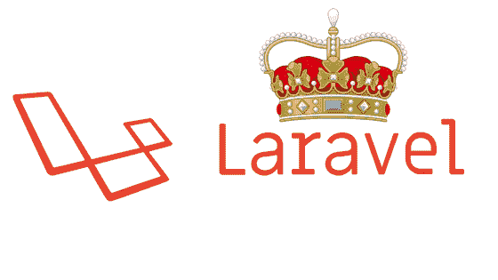

# 为什么 Laravel 是 2020 年最好的 PHP 开发框架

> 原文：<https://www.freecodecamp.org/news/why-laravel-is-the-best-php-framework-to-use-in-2020/>

大量的网站——将近 135，000 个——都是建立在 Laravel 而不是其他 PHP 框架上的。那么为什么会这样呢？让我们找出答案。

## 拉勒维尔规则

Laravel 比其他 web 框架得分更高，因为它的高级特性和开发工具有助于快速的 web 应用程序开发。

Laravel 还帮助网站开发人员用干净和可重用的代码简化他们的开发过程。它是为数不多的具有灵活性和丰富特性的框架之一，使其成为创建网站和在线应用程序的完美平台。

### Laravel 的市场份额

Image Source: [Dev.to](https://dev.to/techticsolutions/why-businesses-use-laravel-framework-how-they-benefit-the-most-with-it-4j73)

使用 Laravel 的公司通常在信息技术服务、房地产和零售行业。

现在，让我们了解 Laravel 的一些技术优势，以及为什么它仍然是软件开发人员在 2020 年使用的最佳 PHP 框架。

## 1.MVC 架构提供卓越的支持和性能

Laravel 带有模型-视图-控制器(MVC)架构模式。它易于使用，因此为构建大型或小型商业应用程序提供了一种极其方便的方式。有了它，web 技术人员可以组织包含五个以上文件的大型项目，以提高可维护性。

当你从事一个大型项目时，你必须处理大量的非结构化代码。使用 MVC 可以简化你的编码结构，让你更容易使用。

在处理大型项目时，MVC 支持也使得在文件的逻辑目录中查找文件变得更加容易。有了它，你可以控制你的应用程序在现实世界中出现的过程，这样你就可以为了品牌的目的而改进应用程序。

## 2.出色布局的模板引擎

编程任务通常涉及到模板引擎的使用，模板引擎是一种工具，用于处理 web 应用程序中的大量文本数据。简而言之，模板引擎连接数据模型，处理源模板中给出的代码，并将输出定向到特定的文本文件或流。

Laravel 带有刀片模板引擎。它是一个强大的、轻量级的、预装的模板引擎，通过其出色的布局，帮助 web 开发人员使开发过程变得平稳和容易。

刀片模板引擎允许数据显示和扩展布局，而不会影响应用程序的性能和速度。它帮助您使用内容播种功能创建创新和惊人的布局。

除此之外，它还提供了自己的结构来创建和查看包含条件语句和循环的文件。您也可以使用主模板创建一个简单的布局，该布局可以由其他文件扩展。

## 3.Artisan CLI 用于极其简单快速的命令

Laravel 有自己的 Artisan 命令行界面(CLI ),让您的开发过程简单、容易、快速。它使用一个强大的 Symfony 控制台组件来构建应用程序。该工具还有助于数据迁移、数据库管理，您可以创建[框架代码](https://en.wikipedia.org/wiki/Skeleton_(computer_programming))、模型、控制器等等。

Laravel 的 Artisan 工具消除了开发人员以前必须手动执行的那些繁琐和重复的编码任务。此外，它还可以通过创建自己的命令来生成 MVC 文件和管理数据配置。

它是由应用程序认证服务所需的所有记录项目组成的少数工匠类型之一。

## 4.雄辩的 ORM 便于与应用程序数据库交互

您可以使用 Laravel 中的[模型](https://laravel.com/docs/7.x/eloquent)轻松增强任何业务应用程序的性能。它是唯一一个通过使用雄辩的 ORM 提供构建和定制这些模型的简单方法的 PHP 框架。

ORM 代表对象关系映射器，Laravel 口若悬河的 ORM 很牛逼。顾名思义，它允许您使用雄辩或富于表现力的语法来维护与应用程序数据库对象的轻松交互。

对于 web 开发人员来说，它是最好的 ORM 工具之一，因为它允许他们用简单的 PHP 语法执行数据库查询。所以没必要花很多时间用 SQL 写复杂的代码，这样会节省你很多时间。

## 5.足够的应用程序测试功能

Laravel 附带了一组特定的特性，用于通过 PHPUnit 对您的 web 应用程序/移动应用程序执行单元测试。它自动设置 phpunit.xml 文件，用于在 web 开发中执行单元测试。

它在两个目录上运行测试，包括 Feature 和 Unit。第一种，单元测试，是针对小代码部分的。特性测试是针对有几个对象的较大代码库的。

Laravel 可以同时运行多个单元测试，以确保您所有的新更改都得到正确的测试。因此，当测试你的应用程序时，单元测试更好，因为它使开发者更容易执行应用程序测试。

如果使用得当，Laravel 的测试特性会让您的应用程序无 bug 且性能极高。

与其他 PHP 框架相比，Laravel 的成本更低，因为它具有 MVC 架构和单元测试特性。这使得 web 开发人员可以在有限的预算内构建可伸缩的业务应用程序。

## 包扎

你可以尝试一下 [Laravel 7.12](https://laravel-news.com/laravel-7-12-0) 的更多新特性，比如 Truehosts 中间件、基础函数、重新绑定方法，以及在路由中使用默认 URL。例如，Truehosts 中间件允许您创建大量逻辑。此外，您可以使用重新绑定方法和路由中的默认 URL 来修复编码错误。

这些是 Laravel 7.12 的一些新特性，它们将提高您的 web 应用程序的性能、功能、可伸缩性和安全性。所以现在我希望你计划在 2020 年创建一个基于 web 的 Laravel 应用程序！

想雇一个熟练的 Laravel 开发人员？我在 Syncrasy Tech 的团队为你的网络开发提供了一些最好的服务。

我希望您发现这篇文章很有用，并且能够在今天构建一个出色的 web 应用程序。如果你真的喜欢这篇文章，请在所有社交媒体平台上分享。

**感谢阅读！**