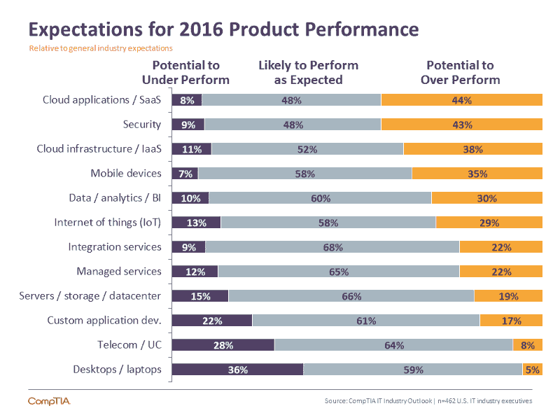
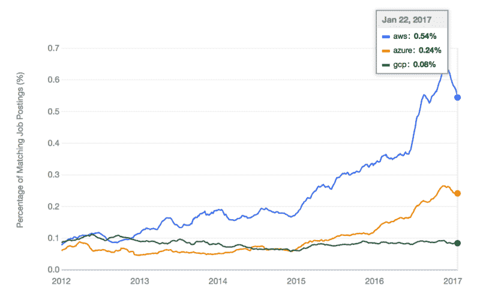
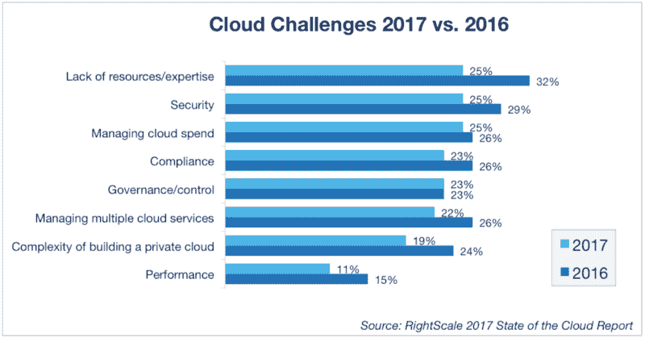

# 为什么学习编写 Alexa 技能是获得云计算工作的途径

> 原文：<https://www.freecodecamp.org/news/why-learning-to-code-alexa-skills-is-the-gateway-to-a-cloud-computing-job-fa13c1c0c853/>

正在发生根本性的经济转变。社会正从基于商品的资本转向知识资本。不仅重复性的制造业工作将被淘汰，平凡的白领工作也将被淘汰。

未来的工作将是那些不能由机器人完成或被人工智能取代的工作。

> “我们有机会填补数十万没有实现自动化的美国空缺职位。这些工作包括告诉那些机器做什么。编程工作。”昆西·拉森

那么这些编程工作会存在于哪里呢？对于那些愿意投资开发在新经济中竞争所必需的智力资本的人来说，所有趋势都指向公共云。

2017 年，预计将有 1225 亿美元投资于公共云服务。云领域正在快速增长，预计到 2020 年，支出将每年增长 30%，达到 2030 亿美元。

> 人们对云应用和云基础设施表现优异的预期最为乐观。随着客户追求数字业务战略，他们对 IaaS 和 SaaS 云组件的需求将会加速增长。

所有这些在公共云上的支出创造了对技能的巨大需求。在 CompTIA 最近的展望中，他们提到 IDC 预计将有 700 万个与云相关的工作岗位——其中许多来自现有岗位，这些岗位将进行重组，重点关注云。

Top 3 Public Cloud Provider Job Posting Trends from Indeed.com

但是云人才供不应求——云计算技能的稀缺现在是拥有大型云计划的公司的头号障碍。因此，云计算开发人员现在掌握着一些收入最高的工作。

2016 年[薪酬最高的 IT 认证是与云相关的亚马逊网络服务](https://www.forbes.com/sites/louiscolumbus/2016/02/21/15-top-paying-it-certifications-in-2016-aws-certified-solutions-architect-leads-at-125k/)，平均薪酬为 125871 美元。

> “美国和世界各地的许多人缺乏必要的教育和技能，无法参与软件革命带来的伟大新公司。除了教育，没有其他办法解决这个问题，我们还有很长的路要走。”— [马克·安德森](http://a16z.com/author/marc-andreessen/)

Lack of cloud expertise is the #1 cloud challenge

### 建立技能来建立技能

> “今天，另一个转变正在发生，向事件驱动的功能转变，因为潜在的约束条件已经改变，成本已经降低，实现价值的时间有可能得到根本的改善。”阿德里安·科克罗夫特

云也正在经历一场彻底的变革——一场模仿从基于商品的资本向知识资本的经济转变。重复性的虚拟机将被淘汰，平凡的白领维护脚本将被淘汰。未来的云将由“功能即服务”驱动，这是基于服务器的基础设施或平台服务无法实现的。

探索云计算服务和事件驱动的“无服务器”功能新概念的一种简单而有趣的方式是开发定制的 Alexa 技能。这是进入 API 驱动的云计算世界和新兴的无服务器架构模式的一个有趣且引人入胜的切入点。

虽然 Alexa 仍处于采用的早期阶段，但很明显，语音交互是一项突破性的技术。自从亚马逊向开发者开放 Alexa 以来，已经为这项服务开发了超过 10，000 种技能。

Alexa 增长的基础是亚马逊网络服务的一项关键创新，这项创新推动了大多数定制技能——一项名为 Lambda 的服务。

> AWS Lambda 是一个事件驱动的无服务器计算平台，由亚马逊提供，作为亚马逊网络服务的一部分。它是一种计算服务，运行代码以响应事件，并自动管理代码所需的计算资源。

当用户调用亚马逊 Alexa 技能时，它会通过 API 调用触发一个事件。AWS Lambda 使得执行函数来响应事件变得很容易。由于 AWS Lambda 目前支持用 Node.js、Python、C#和 Java 编写的函数，对于已经熟悉这些通用语言的开发人员来说，构建函数很容易。

### 你好世界

为了开始使用 Amazon Alexa 和 AWS Lambda，我鼓励你采取一些简单的步骤来建立适销对路的云技能。

1.  一位云专家提供了一个免费的[*Alexa 系列*](https://acloud.guru/series/alexa-devs)*，它将带你经历整个开发过程——从创建账户到发布技能。*
2.  *一旦你掌握了技能发展的基本概念，探索 [Alexa Github 模板库](https://github.com/alexa)来尝试更复杂的技能。*

*[**Alexa Devs**](https://acloud.guru/series/alexa-devs)
[*这个来自 ACG 的新系列技术导师 Nick Triantafillou 将教你所有你需要知道的搞笑知识…* acloud.guru](https://acloud.guru/series/alexa-devs)*

#### *奖金*

*在发布你的技能后，只需填写一个简单的表格就可以获得一份[免费的 Alexa 赠品](https://developer.amazon.com/alexa-skills-kit/alexa-developer-skill-promotion)。亚马逊每个月都会推出新的促销活动。*

**感谢阅读！如果你喜欢你所读的，按住下面的**按钮**按钮**按钮**，这样其他人也可以发现。你可以在推特上关注我。**