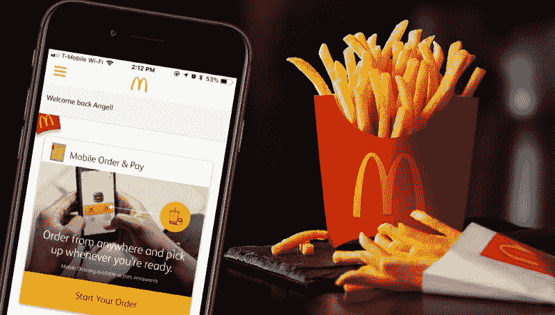

# 手机上的麦当劳和星巴克:为什么手机应用现在是菜单上的第一项

> 原文：<https://www.freecodecamp.org/news/why-mcdonalds-starbucks-are-all-in-on-native-mobile-apps-2faabc85b719/>

作者詹姆斯·许

# **手机上的麦当劳和星巴克:为什么手机应用程序现在在菜单上排在第一位**

今年 7 月的一个星期五，我对麦当劳感到兴奋。太兴奋了，早上上班前我在一家餐馆停下来，带着薯条和一杯咖啡离开了。

早餐吃薯条。

麦当劳刚刚宣布，它将在每周五免费发放中号薯条，最低消费为 1 美元，通过…