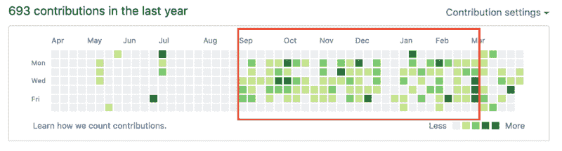

# 为什么新开发人员应该在小型创业公司工作

> 原文：<https://www.freecodecamp.org/news/why-new-developers-should-work-at-a-small-startup-79790e2d93ff/>

我在这个行业工作的第一年(实习 6 个月，全职 6 个月)，我在不到 10 人的初创公司工作。我是仅有的两三个开发者之一，而且通常是第一批。在创业公司工作的这一年里，我学到了很多，也失败了很多。最重要的是，我经历了职业生涯和技术能力的惊人增长。以下是在创业公司工作的一些最大好处:

### 所有权

作为开发团队中为数不多的人之一，我总是能够对代码库产生相当大的影响。在我的一份工作中，我几乎完全是自己创建应用程序的前端。在另一个版本中，我重新编写了应用程序的整个前端。

作为一名新的开发人员，我能够拥有这种级别的所有权，很简单，因为没有其他人来做这件事。通过拥有代码库，我很快就学到了很多重要的东西。如果我写了一个超过 10 行的方法或者有超过 100 行的组件(我在之前的职位上使用 React ),我知道我必须对所有的东西进行注释。如果我下个月看代码，要记住我做了什么和为什么做，会很费时间。我写了关于我们做出的某些决定的完整文档——无论是为了重构代码、实现新功能，还是仅仅升级 React ( [我实际上写了一篇关于如何升级到 React Router 4 的文章，React Router 4 就是从这个](https://medium.com/@lesurasani/a-guide-to-upgrading-to-react-router-4-bc064f3cbdb9)中诞生的)。

出于对自己编写的代码的责任感，我吸取了这些教训。这是我的，我的工作就是确保在未来，我，或者任何在我之后看到它的人，能够很容易地看到它在做什么。

### 快节奏

当我开始这些工作时，我的经理没有浪费任何时间让我开始。到工作的第二周，我通常已经做了一两个公关，并为 sprint 分配了一些任务。在工作的一个月内，或者一旦我觉得对代码库足够熟悉了，我就已经有了自己实现新特性的任务。我们有一个又一个的截止日期，从来没有任何工作或有趣的事情要做。我不断地学习新东西，很少感到无聊。我的 GitHub 提交分享同样的故事:

Contributions I made while I was working there are shown in the red box

这些贡献说明了对存储库的默认分支所做的更改。主要是通过 PRs 添加的提交。难得的一天，我没有为某件事做公关。通常是因为我在做一个特别大的项目。

### 师徒制

这是在小公司工作的最大优势之一。我的经理只关注一个人——我！每当我需要帮助或对某事感到困惑时，我所要做的就是向我的经理求助。

当我的经理需要做出决定时——无论是 UI/UX 的决定还是下一步要关注什么的决定，我们通常会就此进行讨论。

我学到了很多关于 UI/UX、产品管理、招聘和创建技术路线图的知识，因为我的经理愿意和我进行这样的对话。毕竟，他还能和谁谈呢？进行这样的对话对我们双方都有好处——我学到了很多东西，我的经理也给了我一个建议。

### 影响

当你是一家公司十到十五个人中的一员时，你的工作会对公司的整体发展产生影响。尤其是如果你对公司的使命充满热情，你会每天都积极地为这个使命做出贡献。你的工作不仅仅是一台更大的机器的一小部分——你的工作*就是*这台机器。

### 警告

创业公司可能很难驾驭——有毒行为和负面环境在创业公司中很普遍，因为还没有人追究他们的责任。所以，如果你正在考虑为他们中的一员工作，有一些危险信号你应该留意！

*   **缺乏清晰的领导** —创始人和你的经理对他们希望公司走向哪里有愿景吗？他们做决定快吗？他们知道自己想要什么吗？
*   缺乏发展——他们上一次雇人是什么时候？他们计划在未来 3 个月内雇佣多少人？6 个月怎么样？销售怎么样？公司和团队发展的下一步是什么？
*   低估员工的价值 —我见过一些初创公司试图在薪酬和福利方面大幅降低员工的价值。知道你的最低或预期工资/股权是多少，如果你有理由相信接受低于你预期的报价会有回报，运用你的判断和与你信任的人交谈。
*   **不合适的导师** —我之前提到的导师方面，只有有了好的导师才有价值！确保你的经理知识渊博，有耐心，并且愿意指导你。
*   超负荷工作的员工 —询问员工每周需要工作多少小时。问问你是否会经历不寻常的(深夜/周末)工作时间。我通常一周只工作 40-45 小时。有几次我需要晚呆一两个小时。

你通常可以在面试时找到这些信息——通过观察或直接提问！

除了问这家初创公司是否适合工作，你还应该问自己它是否也适合你！

*   当你在大公司工作时，你通常知道你会得到什么。你可能有朋友或远房表亲在这些公司工作，人们的经历都有很好的记录或建立。你可以预期，从你接受工作到你开始工作的 5 年时间里，不会有太大的变化。但当你在一家初创公司时，事情会在日常基础上发生变化。你可能不知道你会得到什么，直到你到达那里。此外，[很多创业失败](https://www.failory.com/blog/startup-failure-rate)——你的公司可能不会像你希望的那样存在很久！
*   你想要的是你职业生涯的经验，而不是你的银行账户。一个失败的创业公司价值 0 美元，就像你的股权一样。
*   **你喜欢快节奏的环境** —快节奏的环境并不适合所有人！知道什么样的环境最适合你，如果“快节奏”不是你描述的理想环境，那么你可能不想加入创业公司。在一天结束的时候，你需要做对你和你的职业最有利的事情——这意味着处在一个对你最有利的环境中。

这就是为什么你应该考虑为一家初创公司工作，尤其是作为一名新的开发人员。我在 dev 界见过很多离开大学追逐声望的人。他们只在谷歌、脸书、微软或 IBM 之类的公司找工作。

当然，想要为大型、成功和创新的公司工作并没有错。我认为这是你寻找第一份工作时应该考虑的另一个选择！即使你不是创业环境的狂热爱好者，或者你似乎找不到一个好的环境，你也可以在稍微成熟一些(50-100 人之间)的创业公司或小公司找到很多这样的好处。

如果你对创业公司或为创业公司工作有任何问题/意见，欢迎在下面发表评论！