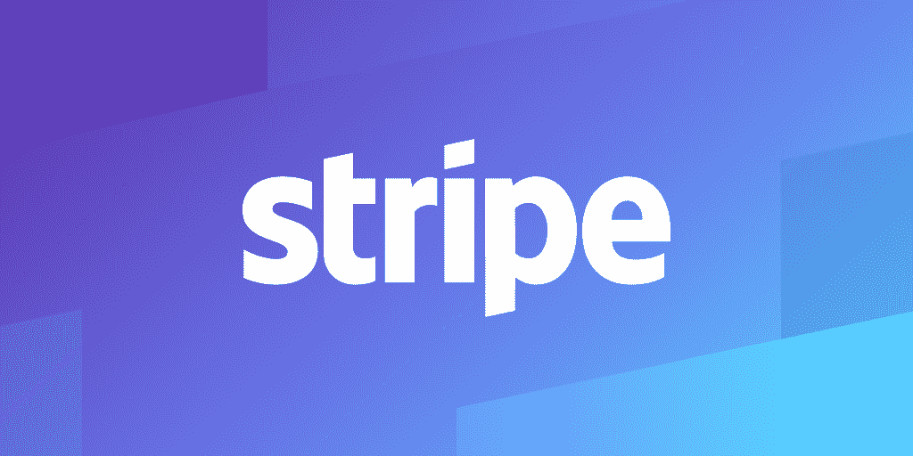

# 为什么不外包一个功能呢？

> 原文：<https://www.freecodecamp.org/news/why-not-just-outsource-a-feature/>

软件发布后，应用程序已经准备好，但还没有行业就绪。建议进行第三方测试，以符合软件使用的行业标准。

为什么要进行第三方测试？第三方测试交叉检查软件需求，检测软件中的错误，并评估软件的可接受性(王，赵，石&张，2013)。

不仅如此，他们还通过了认证，并拥有评估软件是否符合行业标准的专业知识。此外，第三方测试机构有专门和复杂的测试。所有这些不仅有助于软件公司，也有助于行业中法规遵从性的管理机构或监管机构(如 FERPA、HIPPA、ISO)。最后，由第三方测试的软件也增加了消费者对软件的信任(Councill，1999)。

为了快速有效的测试，将你的不同功能组件化，这样就可以很容易的测试出符合性测试所需要的某些功能。为了保护您的 IP，请确保不要暴露您的业务逻辑代码。与第三方测试的合同，审查是彻底的，可能会避免漏洞，并允许您的第三方测试机构负责任何合规性问题。

我们对合规性进行第三方测试。但是与其构建一个需要第三方测试的特性，为什么不使用一个兼容的第三方特性来集成到你的软件中呢？例如，与其构建您的信用卡支付并让第三方测试 PCI DSS 合规性，为什么不使用提供信用卡支付集成服务的公司，如 [Stripe](https://stripe.com/) ？

通过 PCI QSA 的审核，Stripe 已经符合 PCI DSS。随着责任的转移，贵公司的监管团队可以专注于其他任务，如提高透明度和质量合规数据(EPA 测试第三方软件在 CWA 合规监控中的使用，2011)。

****参考文献****

w . t . Council(1999 年)。第三方测试和软件组件的质量。 *IEEE 软件*，16(4)，55–57。doi:http://dx . doi . org . proxy . cityu . edu/10.1109/52.776949

EPA 测试使用第三方软件进行 CWA 合规性监控。(2011). *InsideEPA。从 http://proxy.cityu.edu/login?的[检索到的水监管警报](http://proxy.cityu.edu/login?url=https://search-proquest-com.proxy.cityu.edu/docview/922598559?accountid=1230)*URL = https://search-proquest-com . proxy . cityu . edu/docview/922598559？accountid=1230

王，洪，赵广海，石，张福军(2013)。信息系统软件的第三方测试分析。*应用力学与材料*，427–429，2325。doi:http://dx . doi . org . proxy . cityu . edu/10.4028/www . scientific . net/AMM . 427-429.2325

张文伟，马春霞，莫，张俊生(2013)。电力嵌入式软件测试的发展与应用。*应用力学与材料*，401–403，1680。doi:http://dx . doi . org . proxy . cityu . edu/10.4028/www . scientific . net/AMM . 401-403.1680