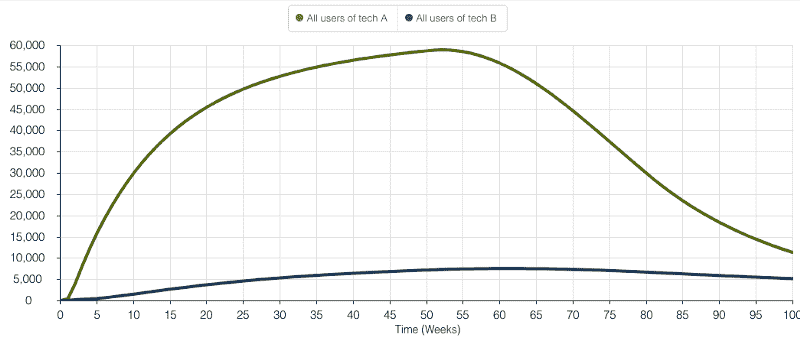
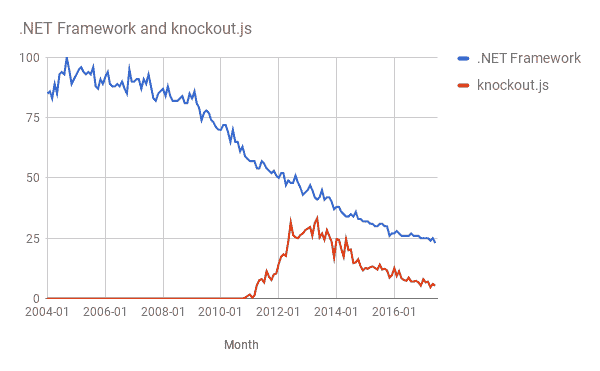

# 为什么开源项目(可悲地)青睐新用户，你能做些什么

> 原文：<https://www.freecodecamp.org/news/why-open-source-projects-sadly-favor-new-users-and-what-you-can-do-about-it-ba586038949e/>

菲利普·赫拉切克

# 为什么开源项目(可悲地)青睐新用户，你能做些什么

所有开发人员的产品(SDK、框架、API)都必须在支持现有用户或新用户之间做出选择。用一些默认的魔法让初始的应用程序对初学者来说“刚刚好”？你损害了大型应用程序的可调试性。为你的超级用户介绍一个特性？新来者将不得不应对更陡峭的学习曲线。

四月，我写了关于[“你好世界”谬论](https://medium.com/@filiph/the-hello-world-fallacy-ef4f43ca8b7e)。这是一种无意识的假设，如果技术 A 比技术 B 更容易上手，那么 A 就比 B 好。

这是不好的，因为大多数开发者，大多数时候，不写 hello world 应用。他们爱上了构建演示的简单性。然后，几个月后，他们在努力构建一个实际的产品。

但情况变得更糟了。

不仅仅是感知。如果你正在构建一个开源库或框架，支持“Hello World”场景**实际上从长远来看是值得的** 。可悲的是，你最好牺牲长期用户的生产力来让新用户更容易使用。

这是因为技术采用的动态性:

Simplified diagram of developer tech adoption.In the diagram above, we have two competing technologies, A and B. Their adoption is proportionate to the buzz (blogposts, talks, Github repos) around them, and to their perceived value as reported by current users.

这里有一个**强化反馈回路**。尝试这项技术的人越多，围绕这项技术产生的讨论就越多，于是就有更多的人尝试这项技术，以此类推。

一段时间后，开发人员停止使用该技术，转而使用其他技术。这种流失与他们对技术及其年龄的不满成正比。

问题在于**延迟**。来自新用户的强化反馈循环几乎是即时的。仅仅几周之后，第一批博客就开始出现了。但是搅动和更有见识的文章出现得更晚，在许多个月之后。建立真实的东西需要时间。在以一种有见识的方式谈论底层技术之前，你需要建立一些真实的东西。

假设技术 A 为初始易用性进行了优化(“hello world”和小应用)。针对长期用户优化的技术 B(真正的应用程序)。如果技术 A 从新用户那里获得的初步评价是技术 B 的两倍，而技术 B 获得的知情评价是技术 A 的两倍，那么技术 A 仍然会胜出——以较大的优势。这是因为，在我们的小模型中，知情的议论比最初的议论平均落后 12 周。这就够了。技术 A 会以更快的速度吸引新用户。它也将比技术 b 更快地失去用户，但这种流失发生得更晚，而且一般来说，比采用阶段更慢。

Result of a simple simulation.

等到技术 A 失去优势，一切都结束了。这两种技术都在慢慢退出历史舞台。那时，使用技术 A 的开发人员几乎是现在的两倍。**尽管在构建真正的应用方面表现不佳**。

说技术 B 一路。它极大地优化了长期用户体验，并完全降低了“hello world”场景的优先级。结果更令人难过:

不管你怎么摆弄数字，技术 B 总是输。强化的反馈循环和流失的延迟将一直存在。

让我们来看看我所说的“为新用户优化”和“为长期用户优化”到底是什么意思

#### 对新用户来说什么是重要的(最初几周或几个月):

*   首次设置的时间长度和简易性
*   默认值和 automagic(能够在最普遍的初始场景中“正常工作”)
*   小型应用程序的大小
*   小型应用程序的性能
*   自由(“用你习惯的任何东西”)

#### 对长期用户来说什么是重要的(一旦他们构建了一个大型应用):

*   易于重构
*   明确性(“不要让程序员吃惊”的原则)
*   可定制性
*   大型应用程序的大小
*   大型应用的性能
*   标准化

### 为什么这是一个开源问题？

开源的一大好处是它是免费的。在这种情况下，这也是问题的一部分。

付费 SDK 和框架永远不会像开源软件那样被广泛采用。但它们也是某人的事。比起不确定的新线索，企业往往更喜欢持续的长期客户。如果 technology A 是一家公司，它的日子不会好过。

请注意:我不是说我们应该现在就开始为框架付费。我只是在解释为什么开源特别容易受到这个问题的影响。

顺便说一下，我相信这是网络世界中“JavaScript 疲劳”的原因之一。那个生态系统自然选择容易开始的技术。这造成了一场军备竞赛:新一代的库和框架对新来者来说更容易，但更难扩展。

不为“hello world”优化的技术注定会默默无闻。你最终会得到一系列快速的创新技术，但是这些技术并不适合构建大型软件项目。

Comparison of the lifetime of .NET versus the lifetime of knockout.js.

当然，不仅仅是 JavaScript 生态系统。整个开发者产品世界正在经历更快的转变。的。NET Framework 今年 15 岁了，还在用。那是旧时代的残余。今天，即使在网络生态系统之外，我们也看到框架“统治”了 18 个月，然后死去。

### 我们能做些什么呢？

我希望我已经表明这不是关于框架和库所有者不诚实、短视或愚蠢。这个问题是生态系统固有的。它源于反馈延迟——没人能真正解决这个问题(除非他们有一台时间机器)。

作为一个库所有者，如果你“选择不玩”，你将极大地损害你的项目成功的机会。你会成为技术 b。

也就是说，框架所有者*能够*意识到这一点。他们可以教授软件可伸缩性。他们可以找到最大的“客户”,并与他们密切合作。他们可以有意识地、透明地强调大型应用而不是技术演示。我希望整个行业开始这样做。这符合所有人的利益。

对于这些框架(以及 SDK、库、API)的消费者，建议非常简单:

不要听信那些没有用他们所谈论的技术开发出超大型应用的人。

(*应用程序的大小取决于您想要构建的内容。)

这条建议的问题可能很明显。如果你以此为生，你会错过每一项很酷的新技术。等到有人造出足够大的东西，因此有资格说话的时候，你可能已经来不及参加派对了。

所以我有一些不太光彩但更实际的建议给你:

*   记下项目中的人和他们的记录。过去的行为是未来行为的最佳预测者。
*   **忽略“hello world”体验。**要知道，你 99.99%的时间与技术打交道的是*而不是*“你好，世界”
*   警惕隐含的“魔力”这几乎无法与真正的应用程序很好地融合。
*   只开发小型应用或概念验证的人推荐的折扣。
*   如果你想变得有趣，可以构建“应用生成器”,在你评估的技术中自动生成非常大的代码库。有了这个，你可以在一个下午的时间里制作一个大约 100KLOC 的应用程序。查看生成的大型应用程序如何运行，以及工具如何保持这种规模。(这是谷歌 AngularDart 团队用来衡量自己的框架在其他框架中的地位的方法。)

如果你有其他想法，请在评论中分享。我很乐意把上面最好的加进来。