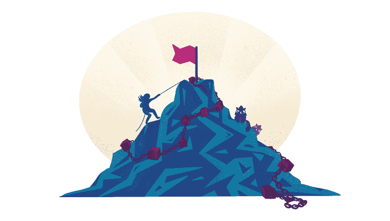

# 为什么渐进式分权是区块链最大的希望

> 原文：<https://www.freecodecamp.org/news/why-progressive-decentralization-is-blockchains-best-hope-31a497f2673b/>

阿瑟·卡迈尔

# 为什么渐进式分权是区块链最大的希望

#### 不变性是区块链最大的优势和最大的障碍。逐步分权可能是答案。

当我们一年前发布 [CryptoKitties](https://www.cryptokitties.co) 时，我们选择不通过 ICO 预先为其提供资金，而是建立一个可持续的收入模式。这个模型是这样的:我们从游戏中的每笔交易中收取 3.75%的费用。鉴于我们一旦推出就无法改变费用——CryptoKitties 是在以太坊区块链建造的——人们经常问我们是如何得出这个数字的。

这听起来像是一个聪明、合理的选择。我可以编一个引人注目的故事，讲述我们如何用先进的预测模型进行模拟，以找到能够产生最佳回报的费用。

但事实并非如此。

事实是我们做了一个有根据的猜测。我们选择了一个公平的数字，并致力于此。

### 不变性既可怕又可怕

我们很容易选择错误，因为一旦你把它加入区块链，你就不能改变它，这将是*猫天文*。幸运的是，对于隐猫来说，我们的社区是如此热情，猫是如此可爱，3.75%工作得很好。

不变性，即不能被编辑，既是区块链最大的优势，也是其有意义的采用的最大障碍。不朽代码的压力使开发人员陷入瘫痪:你可以永远修补测试环境，但总会有你无法预料的真实世界的变量。捂着眼睛打发射是没有办法取得突破的。它更有可能产生故障。

我们的费用只是众多决定中的一个:养一只小猫需要多长时间？它们的繁殖冷却时间应该以什么速度减慢？一只 0 代猫应该值多少钱？在区块链，即使是一个看似微小的选择也可能造成严重、甚至关键的后果。

权力下放给日常生活中的人们带来了巨大的好处:永久和普遍规则的公平性，准则和行为的透明性，这些结合在一起，创造了安全。然而，因为它通常以全有或全无的不变性来实现，区块链使得敏捷开发变得不可能，并使团队慢如蜗牛。

敏捷需要迭代。快速迭代是构建最佳产品的关键，而最佳产品会引发大规模采用。

### 进入渐进式分权

我们自己在构建 CryptoKitties 时遇到了这些障碍，这迫使我们在构建一些有用的东西时，要考虑分散的功能。从那时起，我们开始探索发展中的逐步分权，这是我们不久前简要介绍的一个想法。

现在让我们深入探讨一下。

简单地说，渐进式分权主张分阶段放松分权，而不是一头扎进去。这看起来像是在智能合约中建立机制，预先赋予创造者特殊权力，然后以透明和系统的方式逐步锁定这些权力。

关键条件是锁定机制必须是公共的，并且从一开始就是不可变的。创造者不能决定以后修改条款并无限期地扩展他们的权力。这种平衡是至关重要的:如果做得正确，渐进的去中心化允许创建者在不损害契约的去中心化特性的情况下灵活地修复他们的代码。

### 逐步权力下放可以采取多种形式

没有一种正确的方法来实施渐进式分权。有几十个变量需要考虑，最佳方法会因项目而异。

以下是开发人员实现渐进分散化的几种方法:

1.  创作多个契约，适当分离关注点，并能够替换其中的一些契约。一些去中心化的应用程序(d apps)，如[去中心化的](https://decentraland.org/)，以可升级的合同为特色，已经在使用这个了。
2.  可配置的变量和独立更改这些值的权限。例如，[将特殊权限](https://github.com/Etheremon/smartcontract/blob/master/EtheremonERC721.sol#L125)授予成为版主的用户组。
3.  在契约中加入一组预定义的递增级别，每个级别都允许创建者拥有特定的能力。水平只能增加，不能减少，所以回溯不是一个选项。例如，在第一关，契约拥有者可以玩所有的游戏变量。在第 2 级，他们修改核心变量的能力终止了。最后，合同取消了他们所有的特权。

对于顽固的分散主义者来说，其中一些听起来可能过于集中。但这只是起点。还有进一步的措施来平衡去中心化和迭代。该解决方案结合了目的的透明性以及合同中的条件和约束。这些限制可能包括:

1.  **选择:**不是所有的东西都可以修改，只有我们需要迭代的具体条目。
2.  **范围:**对于很多围绕游戏经济的问题，我们可能有一个大概的概念，但不知道精确的答案。将配置限制在某个范围内可以向用户保证迭代将在合理的范围内进行。
3.  **方向:**类似于上面的“级别”概念，允许某些变量只向一个方向移动，减少或增加，但永远不要回溯。

### 追究创作者的责任

所有这些在理论上听起来都很棒。但是，我们如何确保创作者忠实于他们的路线图，并达到他们的合同的完全去中心化版本？在保证系统是渐进式去中心化的应用的情况下，用户如何能够尽早选择加入？我们怎么知道我们不会以另一个有缺陷的中央集权系统而告终？

渐进式权力下放包括让创造者负起责任的原则:

*锁定某些配置值，撤销所有者的能力，或者在超过某个时间或块号后进入下一个成熟度级别。一旦达到这一点，合同就会自动改变。*

*例如，想象一下，CryptoKitties 有一个 360，000 个街区的跑道(大约 60 天的时间)，从它开始调整 Kitties 的繁殖*冷却*变量开始。我们可以调整冷却机制直到那一点，给我们自己喘息的空间来完善平衡，同时仍然向玩家保证我们不会无限期地拥有那种力量。*

#### ****基于使用的成熟度****

*一旦完成一定数量的用户或事务，就锁定这些功能。这种选择需要仔细考虑，以避免被利用，但我们可以，例如，在 CryptoKitties 中建立可配置的费用，在 10，000 次交易后锁定。*

#### ****经济激励****

*将创造者的激励与增加的去中心化结合起来。在这种情况下，当契约变得更加分散时，创造者获利更多。也许费用会随着开发者每升一级而上升，当他们达到完全去中心化时锁定在最高费用。或者，在完全分权到位之前，他们可能根本赚不到钱。这种经济回报激励开发者以合理的速度实现去中心化。*

### *在区块链上建筑没有最好的方法*

*“渐进式分权”实际上是一把伞，包含许多策略、机制和工具，使在区块链的建设更加可行。应用渐进式分权的最佳方式总是取决于项目，并使用上述概念的组合。*

*渐进式分权并不完美。理想的智能合同简单明了，而这些措施增加了复杂性。如何纳入以及纳入多少是一个权衡问题，需要根据具体情况进行评估。*

*尽管这可能会激怒强硬的去中心化主义者，但我们相信，从长远来看，渐进的去中心化对用户来说更好:通过给予开发者调整的灵活性，消费者得到了更有用的产品。这意味着他们会真正使用它，一旦它给他们的生活带来价值，他们会向周围的人歌颂它。大规模采用就是这样开始的。*

*作者:[亚瑟·卡马拉](https://medium.com/@arthur_camara)，[迪特·雪莉](https://medium.com/@dete73)，格雷迪·米切尔*