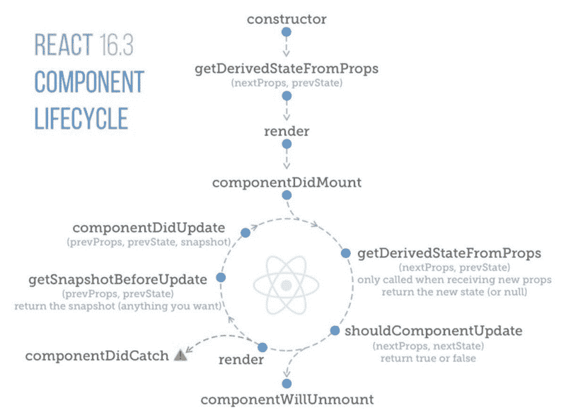

# 为什么 React16 是 React 开发者的福音

> 原文：<https://www.freecodecamp.org/news/why-react16-is-a-blessing-to-react-developers-31433bfc210a/>

哈什·马卡迪亚

# 为什么 React16 是 React 开发者的福音


就像人们对更新他们的移动应用和操作系统感到兴奋一样，开发人员也应该对更新他们的框架感到兴奋。不同框架的新版本带来了开箱即用的新特性和新技巧。

以下是将现有应用从 React 15 迁移到 React 16 时应该考虑的一些好功能。

> 是时候说再见了？

### 错误处理


Error Handling be like :)

React 16 引入了*错误边界*的新概念。

错误边界是 React 组件，**在其子组件树的任何地方捕捉 JavaScript 错误。它们记录这些错误，并显示一个回退 UI** 而不是崩溃的组件树。错误边界在渲染期间、在生命周期方法中以及在它们下面的整个树的构造函数中捕捉错误。

如果一个类组件定义了一个名为`componentDidCatch(error, info)`的新的生命周期方法，它就会变成一个错误边界:

然后你就可以把它作为常规组件使用了。

```
<ErrorBoundary>     <MyWidget /></ErrorBoundary>
```

`componentDidCatch()`方法的工作方式类似于 JavaScript `catch {}`块，但是是针对组件的。只有类组件可以是错误边界。在实践中，大多数情况下，您希望声明一次错误边界组件。然后，您将在整个应用程序中使用它。

注意**错误边界只捕捉树**中其下组件的错误。错误边界不能捕捉自身内部的错误。如果错误边界尝试呈现错误消息失败，错误将传播到其上最近的错误边界。这也类似于 JavaScript 中的`catch {}`块的工作方式。

查看现场演示:

有关错误处理的更多信息，请点击此处的。

### 新的渲染返回类型:片段和字符串

渲染时不要将组件包装在 div 中。

现在可以从组件的`render`方法中返回一个元素数组。与其他数组一样，您需要为每个元素添加一个键，以避免键警告:

```
render() {  // No need to wrap list items in an extra element!  return [    // Don't forget the keys :)    <li key="A">First item</li>,    <li key="B">Second item</li>,    <li key="C">Third item</li>,  ];}
```

从 React 16.2.0 开始，它支持不需要密钥的 JSX 的特殊片段语法。

支持返回字符串:

```
render() {  return 'Look ma, no spans!';}
```

### 门户网站

门户提供了一种一流的方法来将子组件呈现到父组件的 DOM 层次结构之外的 DOM 节点中。

```
ReactDOM.createPortal(child, container)
```

第一个参数(`child`)是任何[可呈现的 React 子元素](https://reactjs.org/docs/react-component.html#render)，比如元素、字符串或片段。第二个参数(`container`)是一个 DOM 元素。

#### **如何使用**

当从组件的 render 方法返回一个元素时，它会作为最近的父节点的子节点装载到 DOM 中:

```
render() {  // React mounts a new div and renders the children into it  return (    <div>      {this.props.children}    </div>  );}
```

有时将子对象插入 DOM 中的不同位置很有用:

```
render() {  // React does *not* create a new div. It renders the children into `domNode`.  // `domNode` is any valid DOM node, regardless of its location in the DOM.  return ReactDOM.createPortal(    this.props.children,    domNode  );}
```

门户的一个典型用例是当父组件具有`overflow: hidden`或`z-index`风格，但是您需要子组件在视觉上“突破”它的容器。例如，对话框、悬停卡和工具提示。

### 自定义 DOM 属性


React15 用于忽略任何未知的 DOM 属性。它会跳过它们，因为 React 不认识它。

```
// Your code:<div mycustomattribute="something" />
```

会用 React 15:

```
// React 15 output:<div />
```

在 React16 中，输出将如下所示(*自定义属性将被显示，根本不会被忽略*):

```
// React 16 output:<div mycustomattribute="something" />
```

### 避免在状态中设置 NULL 时重新呈现


有了 React16，你可以从`setState()`开始阻止状态更新和重新渲染。你只需要让你的函数返回`null`。

```
const MAX_PIZZAS = 20;function addAnotherPizza(state, props) {  // Stop updates and re-renders if I've had enough pizzas.  if (state.pizza === MAX_PIZZAS) {    return null;  }  // If not, keep the pizzas coming! :D  return {    pizza: state.pizza + 1,  }}this.setState(addAnotherPizza);
```

点击阅读更多[。](https://x-team.com/blog/react-render-setstate/)

### 创建参考

用 React16 创建 refs 现在容易多了。为什么需要使用参考文献:

*   管理焦点、文本选择或媒体播放。
*   触发命令式动画。
*   与第三方 DOM 库集成。

使用`React.createRef()`创建引用，并通过`ref`属性将其附加到 React 元素。构造构件时，通常会将参照指定给实例属性，以便可以在整个构件中参照它们。

```
class MyComponent extends React.Component {  constructor(props) {    super(props);    this.myRef = React.createRef();  }  render() {    return <div ref={this.myRef} />;  }}
```

#### **访问参考**

当一个 ref 被传递给`render`中的一个元素时，对该节点的引用在 ref 的`current`属性中变得可访问。

```
const node = this.myRef.current;
```

ref 的值根据节点的类型而不同:

*   当在 HTML 元素上使用`ref`属性时，用`React.createRef()`在构造函数中创建的`ref`接收底层 DOM 元素作为其`current`属性。
*   当在定制类组件上使用`ref`属性时，`ref`对象接收组件的挂载实例作为其`current`。
*   **你不能在功能组件**上使用`ref`属性，因为它们没有实例。

### 上下文 API

上下文提供了一种通过组件树传递数据的方式，而不必在每一层手动向下传递属性。

#### `React.createContext`

```
const {Provider, Consumer} = React.createContext(defaultValue);
```

创建一个`{ Provider, Consumer }`对。当 React 渲染一个上下文`Consumer`时，它将从树中它上面最匹配的`Provider`中读取当前上下文值。

当消费者在树中没有匹配的提供者时，`defaultValue`参数是消费者使用的唯一的**。这有助于在不包装组件的情况下单独测试组件。注意:将`undefined`作为提供者值传递不会导致消费者使用`defaultValue`。**

#### `Provider`

```
<Provider value={/* some value */}>
```

允许消费者订阅上下文更改的 React 组件。

接受要传递给作为该提供者后代的消费者的`value`属性。一个提供者可以连接到许多消费者。可以嵌套提供程序以覆盖树中更深层次的值。

#### `Consumer`

```
<Consumer>  {value => /* render something based on the context value */}&lt;/Consumer>
```

订阅上下文更改的 React 组件。

需要一个[函数作为子函数](https://reactjs.org/docs/render-props.html#using-props-other-than-render)。该函数接收当前上下文值并返回一个 React 节点。传递给函数的`value`参数将等于树中上述上下文的最近提供者的`value`属性。如果上面的上下文没有提供者，`value`参数将等于传递给`createContext()`的`defaultValue`。

### `static getDerivedStateFromProps()`

在调用 render 方法之前调用`getDerivedStateFromProps`。在初始安装和后续更新时都是如此。它应该返回一个对象来更新状态，或者返回 null 来不更新任何东西。

这种方法存在于[罕见的用例](https://reactjs.org/blog/2018/06/07/you-probably-dont-need-derived-state.html#when-to-use-derived-state)，其中状态依赖于道具随时间的变化。例如，在>组件上实现一个`<Transiti`来比较它的上一个和下一个子组件，以决定它们中的哪一个将被动画化。

派生状态会导致冗长的代码，并使您的组件难以理解。

[确保你熟悉更简单的选择:](https://reactjs.org/blog/2018/06/07/you-probably-dont-need-derived-state.html)

*   如果您需要**执行副作用**(例如，数据获取或动画)来响应道具的变化，请使用`[componentDidUpdate](https://reactjs.org/docs/react-component.html#componentdidupdate)`生命周期。
*   如果你想在道具改变时重新计算一些数据，[使用记忆助手代替](https://reactjs.org/blog/2018/06/07/you-probably-dont-need-derived-state.html#what-about-memoization)。
*   如果你想在一个道具改变时**“重置”一些状态，考虑或者让一个组件[完全受控](https://reactjs.org/blog/2018/06/07/you-probably-dont-need-derived-state.html#recommendation-fully-controlled-component)或者用一个`key` 代替[完全不受控。](https://reactjs.org/blog/2018/06/07/you-probably-dont-need-derived-state.html#recommendation-fully-uncontrolled-component-with-a-key)**

此方法不能访问组件实例。如果您愿意，您可以通过提取组件 props 的纯函数和类定义之外的状态，在`getDerivedStateFromProps()`和其他类方法之间重用一些代码。

注意，这个方法在每次渲染时都会在*上触发，不管是什么原因。这与`UNSAFE_componentWillReceiveProps`形成对比。它仅在父对象导致重新渲染时触发，而不是作为局部`setState`的结果。*

我们比较`nextProps.someValue`和`this.props.someValue.`，如果两者不同，那么我们执行一些操作，`setState`

```
static getDerivedStateFromProps(nextProps, prevState){   if(nextProps.someValue!==prevState.someValue){        return { someState: nextProps.someValue};  } else return null;}
```

它接收两个参数`nextProps`和`prevState`。如前所述，你不能在这个方法中访问`this`。你必须将道具储存在状态中，以便将`nextProps`与之前的道具进行比较。在上面的代码中，比较了`nextProps`和`prevState`。如果两者不同，那么将返回一个对象来更新状态。否则将返回`null`,指示不需要状态更新。如果状态改变，则调用`componentDidUpdate`，我们可以像在`componentWillReceiveProps`中那样执行所需的操作。

### 额外收获:对生命周期事件做出反应



生命周期信用—[https://twitter.com/dceddia](https://twitter.com/dceddia)

这些是你在使用 React16 时一定要尝试的一些特性！

快乐编码？？