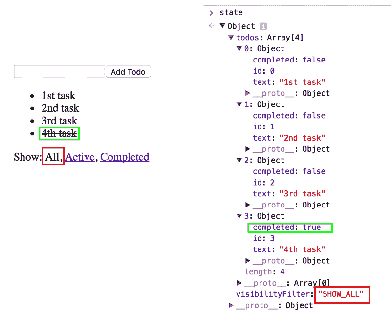
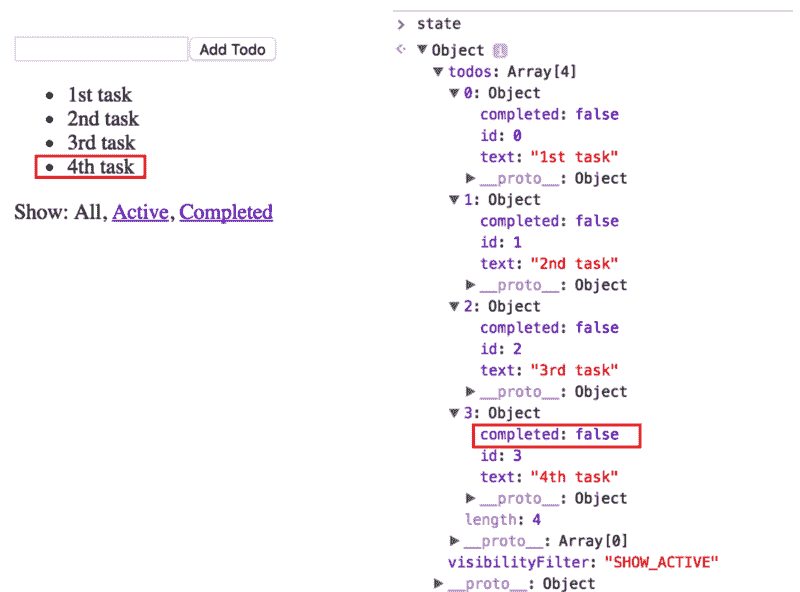
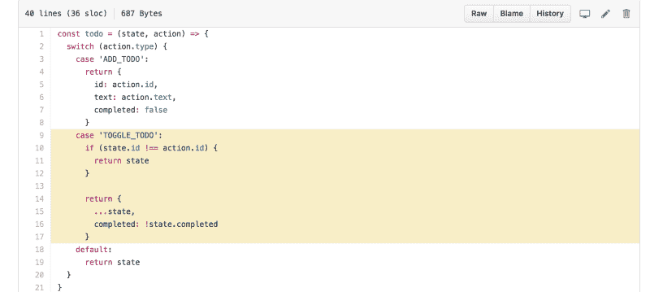
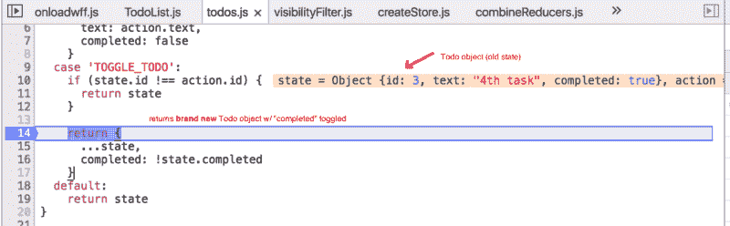
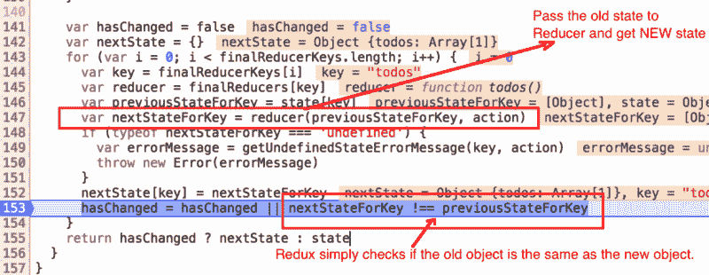

# 为什么 Redux 需要归约器是“纯函数”

> 原文：<https://www.freecodecamp.org/news/why-redux-needs-reducers-to-be-pure-functions-d438c58ae468/>

作者 rajaraodv

# 为什么 Redux 需要归约器是“纯函数”


你可能听说过 Redux 依赖于来自函数式编程的“纯函数”。那到底是什么意思？

下图是一个简单的 Todo app，来自 [Redux examples](https://github.com/reactjs/redux/tree/master/examples/todos) 。它目前有四项任务。它将第四个任务显示为已完成，并设置为显示“所有”任务—包括已完成和未完成的任务。

右侧显示了存储在 Redux 中的当前状态。这是一个简单的 JavaScript 对象，在一个地方捕获所有的细节。

这就是 Redux 的妙处。



LEFT: Todo app ← →RIGHT: Redux stated

现在，假设您将第四个任务切换为未完成。下面是应用程序在新的 Redux 状态下的样子:



Redux updates it’s state when the app changes

现在，如果您查看“TOGGLE_TODO”的缩减器(它将 TODO 项目的状态在已完成和未完成之间切换)，它看起来像下面这样([这里是源代码](https://github.com/reactjs/redux/blob/master/examples/todos/src/reducers/todos.js#L9-L17)):



当您切换 Todo 项目的状态时，会发生以下情况:reducer 函数获取一个表示“旧”状态的对象(即函数的输入)，然后通过将所有旧对象的详细信息复制到 it 中来创建一个全新的对象(如 **id** 和**文本**，并用新属性覆盖旧属性(**已完成**属性)。



### 纯函数

从根本上来说，任何不改变输入数据、不依赖于外部状态(如数据库、DOM 或全局变量)并始终为相同的输入提供相同输出的函数都是“纯”函数。

例如，below **add** 函数不改变“a”或“b”，不依赖于外部状态，并且总是为相同的输入返回相同的输出。

```
const add = (a, b) => a + b //pure function
```

现在，如果你看看我们的 reducer 函数，它是一个“纯”函数，因为它具有相同的特性。

### 但是*为什么*减速器要做“纯”功能？

让我们看看，如果我们让我们的减速器“不纯”会发生什么让我们注释掉创建新对象的部分，取而代之，让我们直接改变状态的完成道具。

```
case 'TOGGLE_TODO':      if (state.id !== action.id) {        return state;      }
```

```
 // return {      //   ...state,      //   completed: !state.completed      // }
```

```
 state.completed = !state.completed;//change original object      return state;
```

```
default: ...
```

现在，如果我们在此更改后尝试切换 TODO，什么都不会发生！

让我们看看 Redux 的源代码中发生了什么。



Redux 获取一个给定的状态(对象)并将其传递给循环中的每个 reducer。并且如果*有任何*变化，它期望从减速器得到一个*全新的*对象。如果没有变化，它还希望取回旧对象。

Redux 只是通过比较两个对象的内存位置来检查旧对象是否与新对象相同。因此，如果您在一个 reducer 中改变旧对象的属性，“新状态”和“旧状态”都将指向同一个对象。因此 Redux 认为什么都没有改变！所以这个不行。

但是，它仍然没有回答一些关键问题，例如:

*   Redux 为什么要这样设计？
*   为什么 Redux 不能在其他地方复制旧状态，然后从 reducers 中比较对象道具？
*   为什么 Redux 要把这个负担放在个人开发者身上？

答案是:只有一种方法可以知道两个 JavaScript 对象是否具有相同的属性。深入比较它们。

但是这在现实世界的应用程序中变得非常昂贵，因为对象通常很大，并且需要比较它们的次数很多。

因此，一个解决办法是**有一个策略**要求开发者每当有变化时创建一个**新的**对象，然后将它发送给框架。如果没有变化，就原样发送回旧对象。**换句话说，新的物体代表新的状态。**

请注意，您必须使用 slice(或类似的机制)克隆旧状态，以便将旧值复制到新对象中。

现在，有了这个策略，您可以使用`!==`比较两个对象的内存位置，而不必比较每个对象中的每个属性。如果这两个对象不相同，那么您知道该对象已经改变了状态(也就是说，JavaScript 对象中某处的某个属性已经改变)。这正是 Redux 让事情运转的策略。

这就是为什么 Redux 需要“Reducers”是纯函数！

感谢您的阅读！如果你喜欢这个帖子，请？并在推特上分享！？？

### 我的其他一些帖子

#### 反应性能:

1.  [*两种快速缩减 React App 生产规模的方法*](https://medium.com/@rajaraodv/two-quick-ways-to-reduce-react-apps-size-in-production-82226605771a#.6lepbl7ae)
2.  [*用 Preact 代替 React*](https://medium.com/@rajaraodv/using-preact-instead-of-react-70f40f53107c#.7fzp0lyo3)

#### 函数式编程

1.  [*JavaScript 是图灵全集——解释*](https://medium.com/@rajaraodv/javascript-is-turing-complete-explained-41a34287d263#.6t0b2w66p)
2.  [*JS 中的函数式编程—结合实例(上)*](https://medium.com/@rajaraodv/functional-programming-in-js-with-practical-examples-part-1-87c2b0dbc276#.fbgrmoa7g)
3.  [*JS 中的函数式编程—结合实例(下)*](https://medium.com/@rajaraodv/functional-programming-in-js-with-practical-examples-part-2-429d2e8ccc9e#.r2mglxozr)
4.  [*Redux 为什么需要还原器是“纯函数”*](https://medium.com/@rajaraodv/why-redux-needs-reducers-to-be-pure-functions-d438c58ae468#.bntrywxrf)

#### 是六个

1.  [*ES6*](https://medium.com/@rajaraodv/5-javascript-bad-parts-that-are-fixed-in-es6-c7c45d44fd81#.7e2s6cghy)中修复的 5 个 JavaScript“坏”部分
2.  [*ES6 中的“类”是新的“坏”的部分吗？*](https://medium.com/@rajaraodv/is-class-in-es6-the-new-bad-part-6c4e6fe1ee65#.4hqgpj2uv)

#### 网络包

1.  [*Webpack —令人困惑的部分*](https://medium.com/@rajaraodv/webpack-the-confusing-parts-58712f8fcad9#.6ot6deo2b)
2.  [*Webpack &热模块更换【HMR】*](https://medium.com/@rajaraodv/webpack-hot-module-replacement-hmr-e756a726a07#.y667mx4lg)*(引擎盖下)*
3.  [*Webpack 的 HMR 和 React-Hot-Loader —失踪手册*](https://medium.com/@rajaraodv/webpacks-hmr-react-hot-loader-the-missing-manual-232336dc0d96#.fbb1e7ehl)

#### Draft.js

1.  [*为什么选择 Draft.js，为什么要投稿*](https://medium.com/@rajaraodv/why-draft-js-and-why-you-should-contribute-460c4a69e6c8#.jp1tsvsqc)
2.  [*draft . js 如何表示富文本数据*](https://medium.com/@rajaraodv/how-draft-js-represents-rich-text-data-eeabb5f25cf2#.hh0ue85lo)

#### 反应和还原:

1.  [*逐步构建 React Redux 应用指南*](https://medium.com/@rajaraodv/step-by-step-guide-to-building-react-redux-apps-using-mocks-48ca0f47f9a#.s7zsgq3u1)
2.  [*React Redux CRUD App 构建指南*](https://medium.com/@rajaraodv/a-guide-for-building-a-react-redux-crud-app-7fe0b8943d0f#.g99gruhdz) *(3 页 app)*
3.  [*在 React Redux 应用中使用中间件*](https://medium.com/@rajaraodv/using-middlewares-in-react-redux-apps-f7c9652610c6#.oentrjqpj)
4.  [*添加一个健壮的表单验证来反应 Redux 应用程序*](https://medium.com/@rajaraodv/adding-a-robust-form-validation-to-react-redux-apps-616ca240c124#.jq013tkr1)
5.  [*用 JWT 令牌保护 React Redux 应用*](https://medium.com/@rajaraodv/securing-react-redux-apps-with-jwt-tokens-fcfe81356ea0#.xci6o9s6w)
6.  [*在 React Redux 应用中处理交易邮件*](https://medium.com/@rajaraodv/handling-transactional-emails-in-react-redux-apps-8b1134748f76#.a24nenmnt)
7.  [*解剖一个 React Redux App*](https://medium.com/@rajaraodv/the-anatomy-of-a-react-redux-app-759282368c5a#.7wwjs8eqo)
8.  [*Redux 为什么需要还原器是“纯函数”*](https://medium.com/@rajaraodv/why-redux-needs-reducers-to-be-pure-functions-d438c58ae468#.bntrywxrf)
9.  [*两种快速缩减 React App 生产规模的方法*](https://medium.com/@rajaraodv/two-quick-ways-to-reduce-react-apps-size-in-production-82226605771a#.6lepbl7ae)

#### 销售力量

1.  [*在 Salesforce 的 Visualforce 中开发 React Redux 应用*](https://medium.com/@rajaraodv/developing-react-redux-apps-in-salesforce-s-visualforce-3ad7be560d1c#.f6bao6mtu)