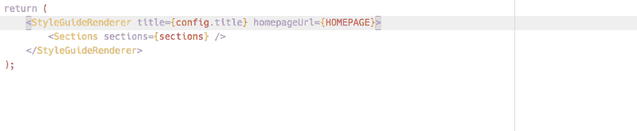

# 为什么机器人应该为我们格式化代码

> 原文：<https://www.freecodecamp.org/news/why-robots-should-format-our-code-159fd06d17f7/>

作者:Artem Sapegin

# 为什么机器人应该为我们格式化代码


Photo by [yours truly](http://unsplash.com/photos/b18TRXc8UPQ?utm_source=unsplash&utm_medium=referral&utm_content=creditCopyText) on [Unsplash](https://unsplash.com/?utm_source=unsplash&utm_medium=referral&utm_content=creditCopyText)

我曾经认为个人代码风格对程序员来说是一件好事。这表明你是一个成熟的开发者，知道好的代码应该是什么样的。

我的大学教授告诉我，他们知道我的一些同学在工作中使用我的代码，因为代码风格不同。现在我想这是因为我的代码至少被格式化了，而其他人的都是一团糟。

从那以后，我花了很多时间讨论代码风格，并配置工具来实施它。是改变的时候了。

#### 几个例子

读完《程序员之石》后，我像这样戴了很长时间的牙套:

```
if (food === 'pizza'){    alert('Pizza ;-)');  }else{      alert('Not pizza ;-(');}
```

但后来我意识到，我可能是前端社区里唯一一个这么做的人。其他人都使用这种风格:

```
if (food === 'pizza') {    alert('Pizza ;-)');  } else {    alert('Not pizza ;-(');}
```

或者这个:

```
if (food === 'pizza') {    alert('Pizza ;-)');  }else {      alert('Not pizza ;-(');}
```

所以我把我的风格改成了最后一种。

我非常喜欢这种链接方式:

```
function foo(items) {  return items    .filter(item => item.checked)    .map(item => item.value)  ;}
```

我看到了与[结尾逗号](https://medium.com/@nikgraf/why-you-should-enforce-dangling-commas-for-multiline-statements-d034c98e36f8)相同的重构好处:

```
const food = [  'pizza',  'burger',  'pasta',]
```

但是比起戴牙套，我可能更孤独。没有人会给我发这种风格的代码来审查，也没有 linter 可以强制执行。所以我也不得不停止使用它来更接近真实世界。

还有一件事除了我没人做。我总是在行尾注释前加两个空格:

```
const volume = 200;  // ml
```

我认为它提高了可读性。但它实际上使代码库不一致，因为其他开发人员只放了一个空格。

#### JavaScript 开发人员做什么

不幸的是，JavaScript 没有官方的代码风格。有几个[流行的代码风格](http://blog.sapegin.me/all/javascript-code-styles)像 [Airbnb](http://airbnb.io/javascript/) 或者 [Standard](https://standardjs.com/) 。您可以使用它们让其他开发人员对您的代码更熟悉。

您可以使用 [ESLint](https://eslint.org/) 来加强代码风格，甚至在某些情况下自动套用代码。但不会让你的代码库 100%一致。带有 Airbnb 配置的 ESLint 将仅规范化我的第一个示例，并允许其他两个示例中的不一致。

#### JavaScript 开发人员应该做什么

一些语言有严格的代码风格和工具来格式化代码。所以开发者不会浪费时间争论代码风格。查看 [Refmt](https://reasonml.github.io/guide/what-and-why) 查找原因，查看 [Rustfmt](https://github.com/rust-lang-nursery/rustfmt) 查找生锈原因。

看起来 JavaScript 终于有了解决这个问题的方案。一个叫做的新工具会使用自己的规则重新格式化你的代码。它完全忽略了代码最初是如何编写的。

让我们[用我的例子来试试更漂亮的](https://prettier.github.io/prettier/):

```
if (food === 'pizza') {  alert('Pizza ;-)');} else {  alert('Not pizza ;-(');}function foo(items) {  return items.filter(item => item.checked).map(item => item.value);}const volume = 200; // ml
```

你可以不同意这种风格。例如，我不喜欢`else`的位置，在一行中写函数链是有问题的。但是我认为采用更漂亮的有很大的好处:

*   几乎不需要做决定——beauty 几乎没有选择。
*   如果你在团队中工作，不要争论特定的规则。
*   不需要为贡献者学习你的项目的代码风格。
*   无需修复 ESLint 报告的样式问题。
*   可以在文件保存时设置自动格式。

#### 结论

React 已经被 React 和 Babel 等一些热门项目采用。我开始[将我所有的项目](https://github.com/tamiadev/eslint-config-tamia)从我的定制代码风格转换成更漂亮的风格。我会推荐它而不是 Airbnb 代码风格。

起初，我有很多“啊，太丑了”的时刻。但是当我想到我不得不，例如，当我添加另一个道具并且它不适合一行时，手动将 JSX 代码从单行重新格式化为多行——我意识到这是完全值得的。



Prettier is formatting your code when you save a file

阅读如何在你的项目中[设置更漂亮的](https://survivejs.com/maintenance/code-quality/code-formatting/)。

页（page 的缩写）看看我的新工具，它将简化向你的项目添加 ESLint、Prettier 和其他工具，并保持它们的配置同步。

**订阅我的简讯:[https://tinyletter.com/sapegin](https://tinyletter.com/sapegin)**