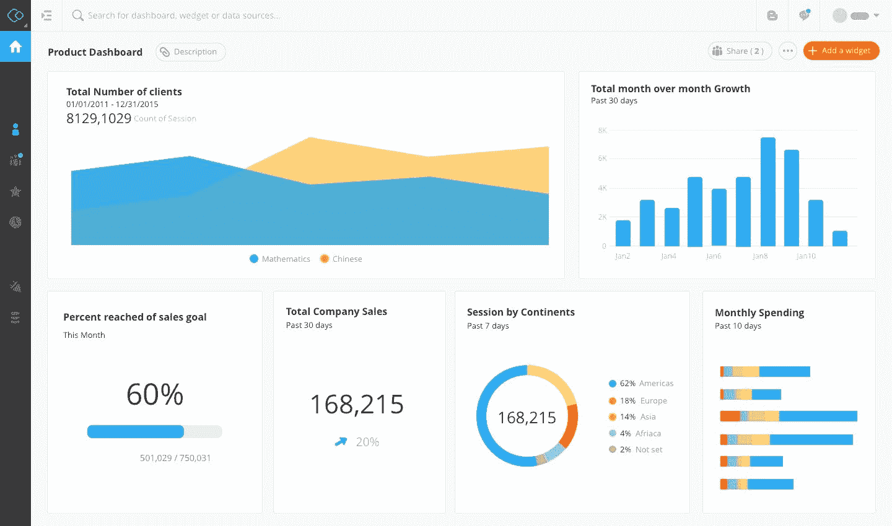

# 为什么你应该学习数据分析

> 原文：<https://www.freecodecamp.org/news/why-should-you-learn-data-analysis/>

利用数据洞察的机会从未像现在这样多。

人类倾向于每天生成大量数据——从心率到最喜欢的歌曲、健身目标和电影偏好。你可以在商业的每个抽屉里找到数据。

数据不再仅仅局限于科技公司。人寿保险机构、酒店和产品管理公司等各种各样的企业现在都在使用数据来制定更好的营销策略、改善客户体验、了解业务趋势或只是收集对用户数据的见解。

在当今快速发展的世界中，我们必须分析生成的数据，并为企业做出更好的决策提供见解。

[Forbes](https://www.forbes.com/sites/bernardmarr/2018/05/21/how-much-data-do-we-create-every-day-the-mind-blowing-stats-everyone-should-read/#4821ead760ba) 说每天有 2.5 万亿字节的数据产生，我从之前的一些随机阅读中得知，只有 0.5%的数据被分析！这是一个令人难以置信的统计数据。

有人说:

> 数据是未来

> 21 世纪的燃料

> 明日职业

> 企业的驱动力

> 数据是新的前沿

所有这些都是真的！

事实上，今天的一切都依赖于数据；从大型跨国公司到小型企业。人们对研究和理解商业趋势的渴望从未如此强烈。

**现在是数据的时候了！**

随着今天产生的大量数据(准确地说是以十亿字节为单位)的出现，数据和相关技能的价值开始上升，为数据分析师创造了更好的工作机会和职业选择。这使得现在成为开始大数据分析世界之旅的最佳时机

### 数据分析

那么，到底什么是数据分析？

数据分析专注于从原始数据中得出深刻的结论。数据分析的许多技术和过程已经被自动化为机械过程和算法，这些过程和算法处理供人类消费的原始数据。

从本质上来说，分析都是为了解决问题。

我可以写几页关于数据分析的定义，有很多网站都是这么说的。所以，事不宜迟，让我们快速跳转到 2019 年是什么让数据分析成为一项众所周知的技能！

## 学习数据分析的 5 个理由

### **1。数据分析现在是顶级组织的首要任务**

随着业务竞争的加剧、经济形势的严峻以及业务驱动的决策制定，顶级组织现在不得不求助于[数据分析](https://bigdata-madesimple.com/5-examples-predictive-analytics-travel-industry/)来识别新的市场机会、业务改进的空间、服务和产品的改进以及与竞争对手的业务比较。

目前，77%的顶级组织认为数据分析是其业务绩效的一个非常重要的组成部分。业务绩效通过分析来衡量。这意味着数据专业人员通常会对公司政策、决策和营销战略产生巨大影响

### **2。你将处于公司决策的核心**

最受欢迎的工作期望之一是决策权。通常，缺乏决策权会让工作变得不满意，就像大公司车轮上的另一个齿轮。

然而，作为一名数据分析专业人员，您是公司决策的核心。事实上，你将成为业务决策和未来战略不可或缺的一部分，因为你研究趋势，你对未来的改进范围提供有意义的见解，从而给你在组织中的重要角色和目标。

### **3。你将有各种各样的职位可以选择**

数据分析专家有大量的职位和领域可供选择。由于如今大数据几乎无处不在，您可以选择成为:

> 度量和分析专家

> 数据分析师

> 大数据工程师

> 运营分析师

> 销售分析师

> 金融分析师

> 营销分析师

> 数据分析顾问

我个人热爱财务分析！:P

### 4.高薪和更多的工作机会

数据才是真正的慷慨之王。更多的需求和更少的供给意味着数据专家是有价值的。

我怎么强调数据及其分析所带来的机会都不为过。公司现在专注于在商业周期中全面整合数据分析。正如没有社交媒体，企业无法创造卓越的品牌体验一样，没有数据分析，企业绩效评估也是不完整的。

### 5.大量行业开放

很明显，数据分析师并不局限于几个行业领域——他们的贡献遍及整个垂直行业。

向数据分析的过渡是平稳的。没有特定的域；数据分析师为每个人工作。麦当劳到 IBM 到沃尔玛到雅诗兰黛。所以你可以在你选择的任何领域工作。它可以是金融、制造、信息技术、通信、物流、零售、汽车等垂直行业。这就是为什么选择正确的数据分析培训可以让一切变得不同。

> “能够查看各种数据并得出结论可能是任何员工都应该具备的最有价值的技能，令人惊讶的是，这种技能在其他技术先进的员工中往往缺失。”

### 结尾注释

数据分析师的角色是让你为之工作的组织发生重大变化的角色。它是关于为你帮助企业做出正确的决策、实现真正的目标、完成使命和愿景而感到自豪。

数据是当今世界的圣杯。数据具有帮助任何公司找到其真正使命的力量，因此数据分析师的工作是将数据解读到这样的程度，即组织的其他部门将直接受益于您的这一真正天赋。

* * *

# 了解你的作者

Rashi 是一名研究生，也是一名数据分析师、用户体验分析师和顾问、技术演讲者和博客作者！她渴望建立一个组织，将商界女性与资源海洋联系起来，让她们对工作和世界充满热情，无所畏惧。请随意给她留言[这里](http://rashidesai2424@gmail.com/)！