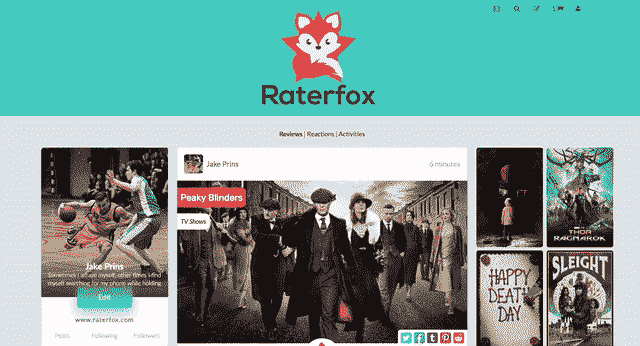

# 为什么副业如此重要

> 原文：<https://www.freecodecamp.org/news/why-side-projects-are-so-damn-important-239ba37209e/>

杰克王子

# 为什么副业如此重要

Trello、Craigslist、Unsplash、AppSumo、Twitter、Gmail……所有这些成功的公司有什么共同点？

是的，他们都可以追溯到他们卑微的开始，我们可以称之为“副业”。

副业有很多形式，有很多不同的目的。有些人开始他们创造一个好的产品，并最终建立一个成功的公司，但还有许多其他原因为什么兼职项目非常重要。

### 加速你的学习。

学习和掌握一项新技能可能会很艰难，但只要有足够的毅力和动力，我们就能取得很多成就。就像学习如何编码一样，它可能很难，令人沮丧，而且很耗时。最后，最重要的是坚持走下去，积累经验。

当然，如果你擅长数学、逻辑思维，并且拥有计算机科学的大学学位，这会有所帮助。但是对于像我这样没有技术背景的人来说，只要有足够的动力和坚持，仍然有可能成为伟大的开发人员。

根据我自己的经验，我发现在业余时间从事兼职项目不仅有趣，而且对开发我的编码技能非常有帮助。

每当我在博客上读到一些有趣的东西，或者在工作中面临挑战，或者从同事那里学到一些新东西，我都想在我的一个兼职项目中实现它。

了解存储图像的更好方法？我们试试吧！学会了如何使用 AJAX？让我们 Ajax 化一切！偶然发现一颗巨大的红宝石？让我们把它捆起来！

每次我提高技能时，我都想重写一些东西来使用更好或更干净的代码，这让我越来越关心它。

#### **RaterFox**

作为开发人员的第一年，我学到了很多东西。我还相信，我在晚上或周末做的兼职项目极大地提高了我的学习能力和动力。

到目前为止，我花时间最多的一个项目叫做 [RaterFox](https://www.raterfox.com/) 。这是一个电影和电视节目的社交平台，除了其他功能之外，它还允许你对标题进行评级和评论，或者向你的朋友推荐它们。

我已经使用了 [TMDb](https://www.themoviedb.org/) API 来获取电影和电视数据。我使用 [Giphy](https://giphy.com/) API 创建了一个 gif picker，这样用户就可以创建“反应”来展示他们对电影或电视剧的最初想法。

我仍在努力改进(因为一个项目什么时候才能完成？)，但如果你感兴趣的话，你可以在这里查看一下。(BTW，欢迎并高度赞赏任何反馈！联系我:jake@raterfox.com)。

My side project: [RaterFox](http://www.raterfox.com)

### 当侧面项目发光时

从事副业可能有不同的目的。这些可以是提高一些技能，尝试新技术，测试一个产品想法或建立一个创业公司。

但是不管目标是什么，这都是创造新事物的完美方式。兼职项目不同于“常规”工作，因为压力更小，没有截止日期，也没有规则。你可以随意摆弄，想换什么就换什么。

这种自由有时可能会导致非生产性的，故障的和半工作的“产品”，但它也可以导致一些创造性的，鼓舞人心的和创新的东西。这也是一个副业项目的美丽将会闪耀的时候。

在我工作的公司，我们每个月都有一个“实验日”。这对于尝试一些有趣的技术来说是很棒的。许多科技公司都有类似的想法，原因显而易见。

例如，脸书的“喜欢”按钮最初是“棒极了按钮”，是在脸书的一次黑客马拉松中创建的。这个简单的功能现在是一个核心特性，并且在所有类型的数字产品中以各种形式使用。

在黑客马拉松期间，创造者并不知道他们正在构建一个会产生如此影响的按钮，但它确实产生了影响。

像脸书和谷歌这样的科技巨头激励小公司在副业上花更多的时间，因为结果随处可见。

Gmail、Google talk、AdSense 和 Google News 都是诞生于谷歌著名的“20%政策”的成功项目。这使得员工可以利用他们在谷歌一周工作时间的 20%从事他们自己的项目。

### 更多成功案例

除了我们很多人日常使用的令人敬畏的产品，如 Gmail 或 Instagram，还有更多创业公司的成功故事是从副业项目中建立起来的。

就拿 [Unsplash、](https://unsplash.com/)这个副业项目来说吧，它所做的超出了创作者的想象:它拯救了他们的创业公司。Unsplash 提供无版权和高质量的图像，最初是一个招聘自由设计师和开发人员的市场。直到他们的辅助项目(最初在一个下午建成)开始启动，它才获得牵引力。

Unsplash 旁边的公司 Crew team 推出了许多其他副业项目，这些项目已成为 Crew 网站推荐流量的主要来源。

> “在几个小时内关心我们的人比去年一整年还多。”

如果你是一名开发人员，你可能在 Github 上有一个账户，Github 是一个基于 Web 的 Git 版本控制库托管服务(哦，还是一家市值十亿美元的公司)。

创始人克里斯·万斯特拉斯和 PJ·海特对改变开源代码的困难感到沮丧，所以他们建立了自己的知识库。他们在晚上和周末建立了自己的兼职项目，现在为超过 2000 万用户提供服务。

> "这一切都始于一个域名、Slicehost 的一份廉价切片和一些库存艺术品."

当你开始一个副业的时候，你永远不知道你最终会得到什么。

以 The Point 为例，这是一个社交网络，它将那些希望团结起来支持特定事业的用户联系在一起。

当创始人埃里克·莱夫科夫斯基看到用户聚集在一起批量购买一件商品并获得折扣时，他为自己的项目制定了一些新计划，并最终建立了 Groupon……你知道，这家每日交易网站在推出两年内估值达到 10 亿美元。

你可能听说过的另一个日常交易方是 [AppSumo](http://www.appsumo.com) 。这家创业公司表明，你不需要很多钱就可以启动。创始人诺亚·卡根(Noah Kagan)有一个为在线公司建立折扣网站的想法，但开始时只有 50 美元来建立一个登录页面和收集电子邮件。通过投入时间和精力，他最终创办了一家第一年销售额达 100 万美元的初创公司。

现在，读到这些成为伟大公司的副业项目是令人敬畏的，但是正如我之前提到的，从事副业项目可以带来许多不同的好处。

有大量的例子表明，人们仅仅通过兼职项目就学会了如何编码。因此，如果你想学习一门新的编程语言，提高你现有的技能，或者用你的创造力来解决你所面临的问题，开始新的东西永远不会晚。那么，如何开始呢？

### 如何开始

偶尔，我们都有好主意在脑海中闪过，但大多数时候我们不会付诸行动。

原因并不神秘。想法并不总是现实的，但是没有必要让你被我们一些想法的规模和实际构建它的想法所淹没。如果你想开始一个新项目，要记住三件事:

#### 1.从小处着手

最简单的开始方式是选择一个你会感兴趣的小项目，或者将会解决你的一个问题。然后把它分解成更小的组件，直到其中一个看起来容易实现。完成该部分并重复该过程，直到您拥有解决原始问题所需的所有部分。

#### 2.保持简单

最好的方法是保持简单。你的项目应该具有最小的复杂性，最少的编码，并且专注于它所服务的主要目的。如果它是一个让你找到新食谱的应用程序，它不需要聊天功能。你总是可以在以后添加新的东西，但是当你刚刚开始的时候，你应该把功能减到最少。

#### 3.没有压力

开始一个新项目可能会令人兴奋。尽管阅读那些成功的项目转化为成功的公司的成功故事很有趣，但是从事副业如此有趣的原因之一是它不应该给你赚钱的压力。

这意味着即使失败也没关系。没有截止日期和完全的创作自由意味着你可以选择你认为你的项目应该走哪条路。当你在工作中积累经验，做你喜欢的事情时，你可以建立一些你关心的事情，当有更多的工作要做时，这些事情会让你继续回来。

不要把你的兼职项目仅仅看作是你兼职做的事情。它可以成为你做的让你开心和兴奋的事情。你的小副业也许有一天会演变成你的“主要项目”。从小处着手，耐心点，边学边改进。你可能会得到一些意想不到的产品，而这个世界并不知道自己需要这些产品。

感谢阅读！希望这些信息是有帮助的。在 Medium 上关注我以获取更多文章，或者在 Twitter 和 Instagram 上关注我。