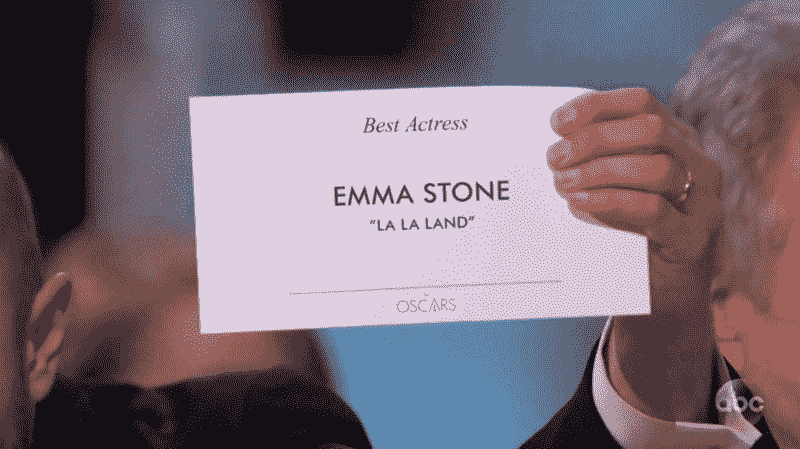
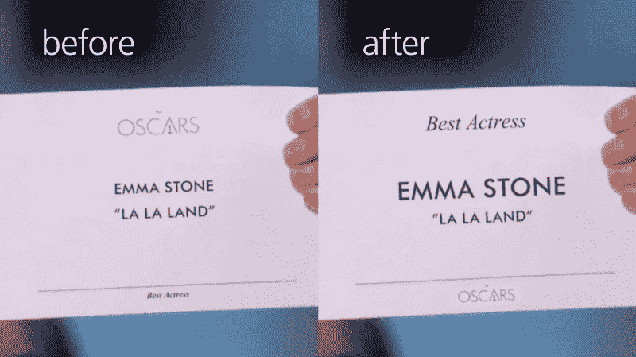
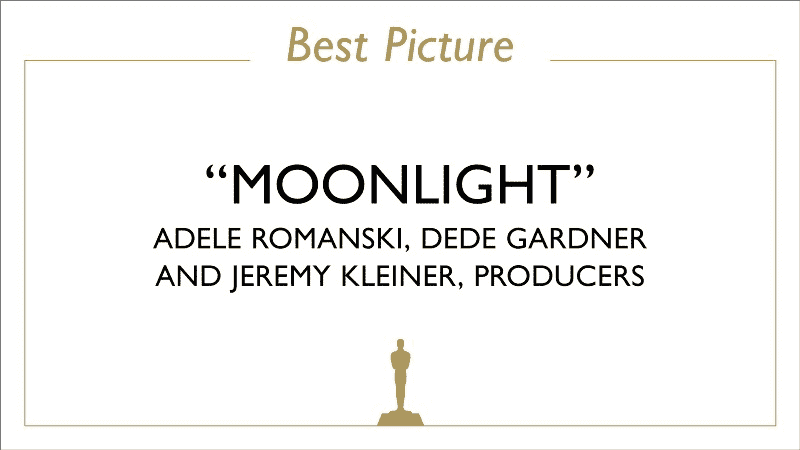
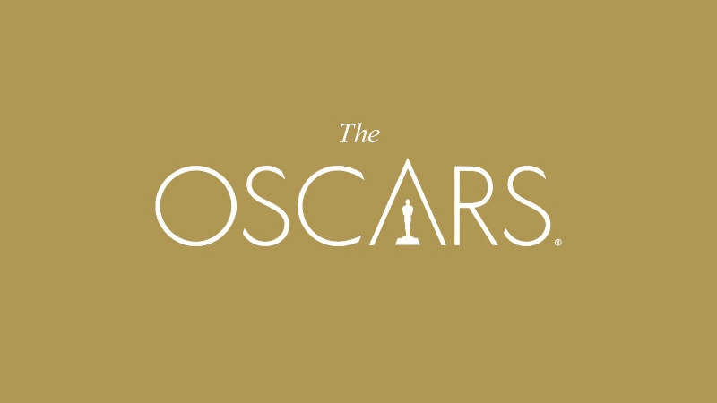
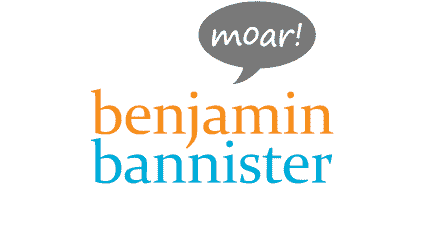

# 为什么排版很重要——尤其是在奥斯卡颁奖典礼上

> 原文：<https://www.freecodecamp.org/news/why-typography-matters-especially-at-the-oscars-f7b00e202f22/>

本杰明·班尼斯特

# 为什么排版很重要——尤其是在奥斯卡颁奖典礼上

**The difference between making an embarrassing mistake, and recognizing one.** Image: [benjamin bannister](http://www.benjaminbannister.com/)

在 2017 年奥斯卡最佳影片奖的最后，有一个*重大*扭曲的结局和一个*重大*混乱。*宣布了错误的获胜者。如果你回头看看[片段](http://www.slate.com/blogs/browbeat/2017/02/27/moonlight_wins_best_picture_as_incredible_twist_ending_makes_2017_oscars.html)并加以分析，你可以在宣布最佳影片奖之前从沃伦·比蒂的脸上看出不对劲。*

让我们快速回顾一下当时发生的事情:

1.  沃伦·比蒂和费·唐纳薇出来颁发最佳影片奖，但却被错误地授予最佳 T2 女演员奖。
2.  沃伦读了卡片，然后停下来再读一遍以确保无误(观众认为这很滑稽)。他甚至检查信封里是否还有其他东西。
3.  然后，他继续给费·唐纳薇看这张卡片，他的面部表情可能是这样的:“是这样吗？”
4.  他还没来得及对她说什么，Faye 就自动读了卡片(看起来她没有完全读完)，并宣布了错误的赢家。
5.  奥斯卡 88 年来最大的失误已经成为历史。

我可以想象会有很多冗余，这样类似的事情就不会发生——尤其是在奥斯卡颁奖典礼上！但是对于今年的获奖卡，有一件事学院可能没有考虑到，或者忘记了:**排版**。

> “**印刷术**是一种编排字体的艺术和技术，使书面语在展示时清晰、易读、有吸引力”——[维基百科](https://en.wikipedia.org/wiki/Typography)

下面是最佳影片得主卡的原始截图，它打破了我刚才引用的很多规则:

**Original televised screenshot.** Image: ABC

首先，它清晰可辨，你可以区分所有的字母。第二，多少有些可读性，但是《月光》和制作方的视觉分量是对等的，融合在一起的。最后，尽管这只是一张胜利者的卡片，但它在视觉上并不吸引人。我认为客观上说它平淡无奇是公平的。

基于*那张*卡片的设计，我重新制作了沃伦和法耶 ***会看到的*，**他们*收到的那张*:

那是**可怕的**排版。我再强调一下恐怖。**恐怖的**。或者变得更好——不太好。再看一遍。当然，任何人都可能犯同样诚实的错误！

> “最佳女演员”几个小字就在最下面。

全世界数百万人都在看你上电视。你有点紧张，还要看一张牌。你很可能会从*顶部到底部*(视觉层次)阅读，而不会质疑卡片是否正确。沃伦脸上的表情是，“这上面写着‘艾玛·斯通’。”Faye 一定是跳过了那部分，被激动的情绪所吸引，脱口而出，"啦啦地。"

我不怪菲伊或沃伦。这是两个实体的错:谁负责设计获胜的卡片(这真的是一个设计吗？得了吧)，还有那个给他们拿错信封的不幸的人。

一个设计清晰的卡片*和*信封(甚至不要让我从那个金色的红色信封开始)会阻止这一切。

以下是赢家卡的三个主要问题:

1.  我们都知道这是奥斯卡，但标志不需要在卡的顶部。
2.  “女演员”类别在底部，用小字印刷。
3.  获胜者的名字，主要是要读的东西，和第二行一样大，同等重要。

现在，让我们想象一下**另一条时间线**，在这条时间线上，主持人给了*这张修改版*的*错误*卡片，使用了与原始卡片相同的元素:

**Modified version of the wrong card.** Image: [benjamin bannister](http://www.benjaminbannister.com/)

对于普通人来说，这可能看起来没什么，但是改变文本的大小、位置和粗细会带来很大的不同。一个足够大的差异，这个尴尬的错误是可以避免的。

让我们分析一下原始卡片和我修改后的卡片之间的差异，并对细微但重要的变化进行对比。

**Same text, same elements, but different styling.** Image: [benjamin bannister](http://www.benjaminbannister.com/)

根据我刚才提出的三个批评，以下是应该改变的地方:

1.  标志不需要在顶部。每个人都知道这是奥斯卡。**我们将奥斯卡标志移到底部**在这种情况下最不重要的地方。
2.  “最佳女演员”这一奖项被移到了第一位，因此这是任何人看到和读到的第一件事。没有混淆是什么类别，因为它清楚地表明**第一**。
3.  艾玛·斯通的名字比标题“啦啦土地”更响亮，因为她是这个类别的冠军。***获奖者*应该是卡片上最强调的东西**，其他所有信息，如电影名称，用较小或不太粗的字体(我知道文本只能大到让所有卡片看起来一致，同时容纳较长的名称)。

就是这样。这就是设计师需要做的一切。这三样东西。我猜今年的预算里没有雇佣一名卡片设计师。

有了一张修改过的卡片，*即使*主持人拿错了，这一切都不会发生，因为主持人会看到它，会发生两件事中的一件:他们的眼睛会看到“最佳女演员”或“艾玛·斯通”阅读其中任何一个都会表明这个*不是*最佳影片*的卡，他们会要求吉米·基梅尔或制片人到舞台上纠正它。*

> 卡片需要以一种方式书写和设计，让读者只清楚基本的信息。

作为一名创作者，字体设计的重要性是一项需要了解的绝对技能，人们——不仅仅是设计师——应该考虑学习它。当写一份结构良好的简历、创建一份看起来令人兴奋的报告、设计一个具有直观层次结构的网站时，字体设计会非常有帮助——尤其是在设计颁奖典礼获奖卡时。

最后，对于 [*美国电影艺术与科学学院*](http://oscar.go.com) ，我想提交我的第 90 届奥斯卡金像奖获奖者卡片的设计模板(我的佣金非常合理，这只是许多想法中的一个)。对于任何演示者来说，卡片都是清晰易读的，只有相关的信息。甚至“奥斯卡”这几个字也不需要出现在上面(读起来字数更少)。雕像图形工作正常。

#### 还有大大的恭喜 [**月光**](https://www.google.com/url?sa=t&rct=j&q=&esrc=s&source=web&cd=5&cad=rja&uact=8&ved=0ahUKEwjH3PXivLLSAhVCOCYKHYXrBIQQFghiMAQ&url=http%3A%2F%2Fwww.imdb.com%2Ftitle%2Ftt4975722%2F&usg=AFQjCNEKlw9X-GVd3KZQmViAEJPfv0cGnw&sig2=behgfWoU-cFoQh-1kRiX6Q&bvm=bv.148073327,d.eWE) 获得*最佳影片*！

**Oscar Winner Card, front mockup.** Image: [benjamin bannister](http://www.benjaminbannister.com/)

**Oscar Winner Card, back mockup.** Image: [benjamin bannister](http://www.benjaminbannister.com/)

> 请为这篇文章鼓掌、发微博、分享来表达你的支持，并关注我来发现新事物。

[**benjaminbannister.com**](http://www.benjaminbannister.com/)

**本杰明·班尼斯特:**

*   [iPhone X 的未来:从现实到荒谬](https://medium.com/@benjaminbannister/the-future-of-the-iphone-x-from-the-realistic-to-the-absurd-f33bee3288ea)
*   苹果 MacPad Pro 会是什么样子？
*   我是如何学会烹饪的。一个月后。