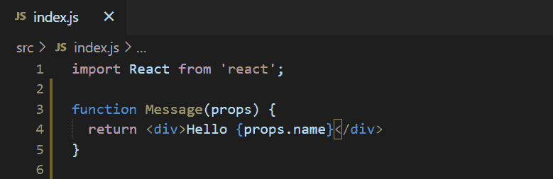
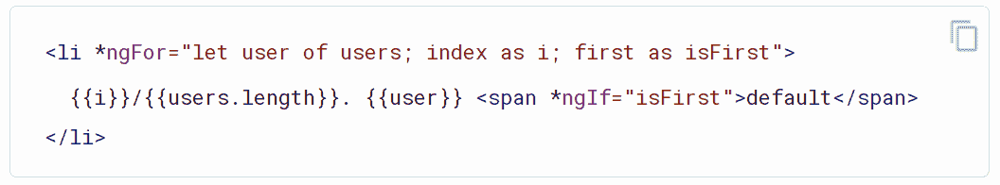
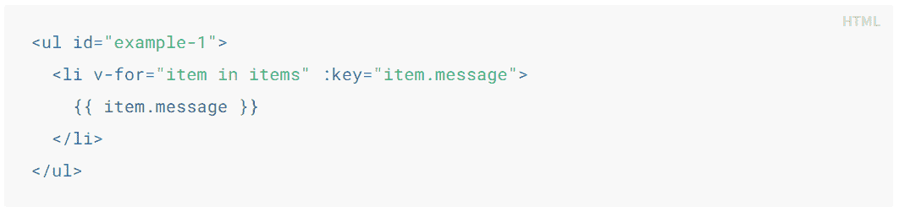
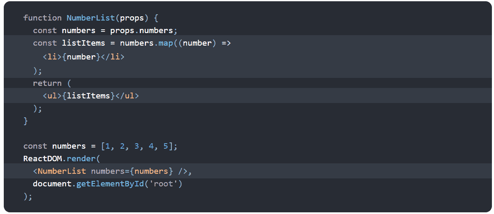
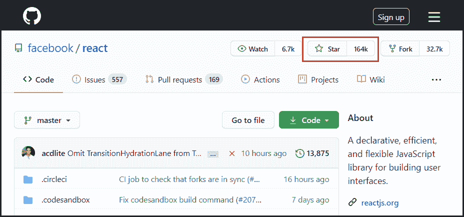
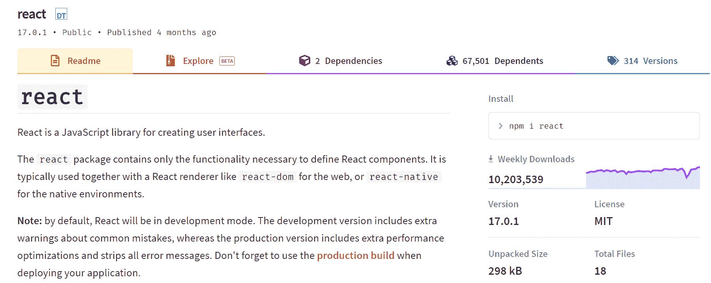
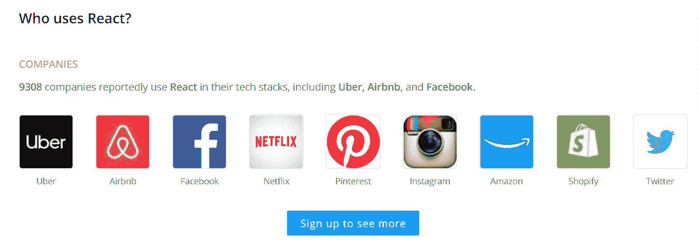
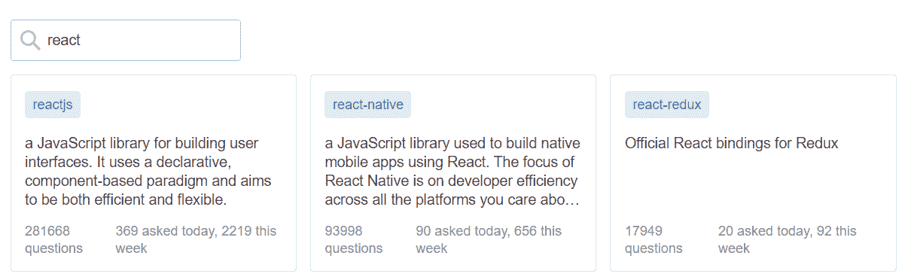

# 为什么应该使用 React.js 进行 Web 开发

> 原文：<https://www.freecodecamp.org/news/why-use-react-for-web-development/>

如果您是 React.js 的新手，您一定想知道为什么它如此受欢迎，为什么您应该在您的应用程序中使用它。如果是这样，那么你来对地方了。

让我们讨论是什么让 React.js 如此伟大，以及为什么应该在项目中使用它。

# 目录

*   React.js 简史
*   为什么应该使用 React？
*   反应是灵活的
*   React 拥有出色的开发人员体验
*   React 拥有脸书的支持/资源
*   React 还拥有更广泛的社区支持
*   React 具有出色的性能
*   React 很容易测试

## React.js 简史

脸书在 2011 年创建了 React.js 供自己使用。如你所知，脸书是当今世界上最大的社交网站之一。

2012 年，Instagram 也开始使用它，它是脸书的子公司。

2013 年，脸书开源了 React.js。最初，开发人员社区拒绝了它，因为它在一个文件中使用了标记和 JavaScript。但是随着越来越多的人尝试它，他们开始接受以组件为中心的方法来分离关注点。

2014 年，许多大公司开始在其生产环境中使用 React.js。

2015 年，脸书开源了 React Native。这是一个允许我们使用 React.js 在 Android 和 iOS 中创建原生移动应用的库。

2016 年，有了 15 版本，React.js 开始使用语义版本化。这也有助于向开发者社区传达 React 更加稳定的信息。

今天，React.js 被许多财富 500 强公司使用。脸书有全职的 React 开发人员。他们定期发布错误修复、增强、博客帖子和文档。

## 为什么应该使用 React？

你一定想知道为什么你应该使用 React.js。毕竟，随着 JavaScript 的[用途在最近几年增加，我们现在在市场上有多种选择，如](https://www.tutorialfunda.com/js/introduction-javascript-and-modern-uses/) [Angular](https://angular.io/) 和 [Vue.js](https://vuejs.org/) 。那么，为什么要反应呢？

让我们探讨一下使用 React.js 的六个关键原因。

## 反应是灵活的

React 非常灵活。一旦你学会了它，你就可以在各种各样的平台上使用它来构建高质量的用户界面。React 是一个库，不是框架。它的库方法使得 React 发展成为如此出色的工具。

React 的创建只有一个目的:为 web 应用程序创建组件。一个 [React 组件](https://www.freecodecamp.org/news/how-to-write-better-react-components/)可以是 web 应用程序中的任何东西，比如按钮、文本、标签或网格。

但是随着 React 越来越受欢迎，它的生态系统也发展到涵盖各种用例。

你可以使用像 [Gatsby](https://www.gatsbyjs.com/) 这样的工具用 React 生成一个静态站点。您可以使用 React Native 构建移动应用程序。你甚至可以使用像[电子](https://www.electronjs.org/)这样的工具来创建桌面应用程序，这些应用程序可以在 mac 和 windows 上使用 React.js 技术运行。

React 还支持使用像 [Next.js](https://nextjs.org/) 这样的工具对其组件进行服务器渲染。还可以使用 React.js 创建一个虚拟现实网站，以及使用 React VR 的 360°体验。

> “学会一次反应，到处写”——Reactjs.org

你也可以在你现有的应用中使用 React。React 的设计考虑到了这一点。你可以使用 React 修改现有应用程序的一小部分，如果这种修改有效，那么你可以开始将整个应用程序转换成 React.js。脸书使用了相同的方法。

> 与框架相比，使用库的主要优势在于库是轻量级的，并且可以自由选择不同的工具。这个框架由一个完整的生态系统组成，用来构建一个应用程序，你没有一个简单的方法来使用框架之外的任何其他工具。”

## React 拥有出色的开发人员体验

当你的团队开始在 React 中编码时，他们会爱上 React。快速开发和 React 的小 API 结合起来创造了一个奇妙的开发者体验。

React 的 API 非常简单易学。它需要学习的概念很少。下面是 React 组件的一个小示例:

React Component

你只需要导入 React 库。**消息**是接受 props(输入)并返回 JSX 的组件。

JSX 是一种特殊的语法，看起来像 HTML，它转换 React 的 API 调用，最终呈现 HTML。

像 Angular 和 Vue 这样的传统框架为 HTML 提供了动力。他们在 HTML 中使用 JavaScript。他们创建了 HTML 属性，赋予它额外的功能。

这种方法的主要问题是，您必须学习那些新的 HTML 属性，或者总是查看官方文档。

这是一个角度循环的例子。查看 ***ngFor** 属性:

Angular Loops Example (Source : [Angular](https://angular.io/))

这里有一个在 Vue.js 中循环的例子。看看 **v-for** 属性:

Vue Loops Example (Source : [vuejs.org](https://vuejs.org/))

React 使用相反的方法。它在 JavaScript 中使用 HTML (JSX)。我喜欢这种方法，因为在这里，您可以处理纯 JavaScript 和 HTML。

下面是 React.js 中循环的一个例子

React Loops Example (Source : [Reactjs.org](https://reactjs.org/))

React 组件 **NumberList** 使用纯 JavaScript 代码(map 函数)。此外，你可以看到 JSX 是一个简单的众所周知的 HTML 标签，没有花哨的属性。render 函数只是在 HTML 文件的根元素中呈现 NumberList 组件。

如果你有一个可以处理纯 JavaScript 和 HTML 的平台，并且仍然可以构建一个交互式 UI，那么作为开发人员，你还需要什么呢？

**注意:** *我说的“纯 JavaScript”并不意味着你会在 React 中使用普通的 JavaScript。React 是一个 Javascript 库，它在 JavaScript 之上有自己的层。但是，正如我所说的，React API 非常小，并且很容易学习。棱角分明的& Vue 把他们的规则强加在你身上。React 更概念性。它向您展示了如何以 React 方式更好地利用普通 JavaScript。*

React.js 还给了我们 [create-react-app 包](https://www.freecodecamp.org/news/how-to-build-a-react-project-with-create-react-app-in-10-steps/)，可以让你瞬间开始开发。

## React 拥有脸书的支持/资源

React 在脸书应用程序、网站和 Instagram 中被大量使用。这就是脸书坚定致力于此的原因。他们在生产环境中使用了 50k 多种 React 组件。GitHub 上排名前四的 React 贡献者都是脸书的全职员工。

Top React.js Contributors

此外，React 团队维护着一个[博客](https://reactjs.org/blog/all.html/),不断地为您提供每个版本的详细信息。

由于脸书对 React 在生产中的深度承诺，当 React 中出现突破性变化时，脸书始终如一地提供自动化变化的 [Codemod](https://github.com/reactjs/react-codemod) 。

Codemod 是一个命令行工具，可以自动修改您的代码库。当一个新的规范进入 React 时，Codemod 自动用新的规范替换旧的组件。

## React 也获得了更广泛的社区支持

自 2015 年以来，React 的人气稳步增长。它有一个巨大的活跃社区，它的 GitHub 库有超过 164，000 颗星星。它是 GitHub 上排名前五的仓库之一。

React Git Repository.

React 的 [NPM 包](https://www.npmjs.com/package/react)也有数百万的周下载量。

超过 9K 家公司在 [Stackshare](https://stackshare.io/react) 上报告他们正在使用 React。你甚至可以看到世界 500 强公司。

Companies Using React

[React flux](https://www.reactiflux.com/)是专门为 React 开发者打造的社区。超过 110，000 名社区成员参与帮助解决和分享与 React 相关的问题。

软件开发人员中最受欢迎的网站之一是 StackOverflow。你可以看到有超过 25 万个关于 React 和相关库的问题。

React on Stackoverflow 

在某些情况下，您甚至不需要创建组件。网上已经有很多免费和成熟的组件库。

以下是一些例子:

*   微软已经创建了 [Fluent UI](https://developer.microsoft.com/en-us/fluentui#/) 组件库，让你有机会开发自己的 UI(类似于 [office](https://www.office.com/) )。
*   Material-UI 提供 React 组件，实现 Google 的 Material UI 指南。
*   [React-Bootstrap](https://react-bootstrap.github.io/) 包含 React 组件，使得使用 Bootstrap 变得容易。
*   另外，查看 GitHub 上的 [Awesome React 组件](https://github.com/brillout/awesome-react-components)列表，找到更多 React 组件。

也有成熟的相关项目/库可以和 React 一起使用。

*   如果你想要路由，那就去找[反应路由器](https://reactrouter.com/)。如果你想管理一个更复杂的数据系统，那么使用 [Redux](https://redux.js.org/) 和 [MobX](https://mobx.js.org/README.html) 。
*   对于自动化测试，使用 [Jest](https://jestjs.io/) ，它也来自脸书。
*   对于 RESTful API 调用，使用 [GraphQL](https://graphql.org/) 。
*   对于 React 组件与 node 的服务器端渲染，使用 [Express.js](https://expressjs.com/) 。

所有这些库和工具都很重要，因为如果你想在 React 中构建一些东西，你会在网上找到大量的帮助和解决方案。

## React 具有出色的性能

React 团队意识到 JavaScript 很快，但是更新 DOM 会使它变慢。React 最小化 DOM 更改。它已经找到了更新 DOM 的最有效和最智能的方法。

在 React 之前，大多数框架和库都会愚蠢地更新 DOM 以反映新的状态。这导致页面的重要部分发生了变化。

React 用[虚拟 DOM](https://reactjs.org/docs/faq-internals.html) 监控每个组件的状态值。当组件的状态改变时，React 会将现有的 DOM 状态与新的 DOM 状态进行比较。之后，它会找到最便宜的方法来更新 DOM。

这似乎不太容易，但 React 在幕后处理得非常好。它有很多好处，比如避免布局垃圾化，当 DOM 元素改变时，浏览器必须重新计算所有内容的位置。

此外，由于大多数应用程序都在移动设备上使用，因此它们需要非常高效。所以，节省电池和 CPU 功率是非常重要的。

React 的简单编程模型允许它在数据更新时自动改变状态。这发生在内存中，所以速度很快。

React 的库大小也很小。小于**6kb**(gzip 时小于 3kb)。这明显小于其竞争对手。

## React 很容易测试

React 的设计对于测试来说非常用户友好。

*   传统的 UI 浏览器测试设置起来很麻烦。另一方面，在 React 中进行测试时，您需要很少或不需要配置。
*   传统的 UI 浏览器需要浏览器来进行测试，但是您可以使用 node 命令行快速轻松地测试 React 组件。
*   传统 UI 浏览器测试速度慢。但是命令行测试速度很快，您可以一次运行相当多的测试套件。
*   传统的 UI 浏览器测试通常非常耗时，维护起来也很困难。React 测试可以使用 Jest & [Enzyme](https://enzymejs.github.io/enzyme/) 这样的工具快速编写。

网上有各种各样的 JavaScript 测试框架可以用来测试 React.js(因为它也是一个 JavaScript 库)。一些流行的测试框架有[摩卡](https://mochajs.org/)、[茉莉](https://jasmine.github.io/)、[磁带](https://github.com/substack/tape)、 [QUnit](https://qunitjs.com/) 和 [AVA](https://github.com/avajs/ava) 。

## 结论

React 是一个优秀的工具，可以用来为移动、web 和其他平台创建交互式应用程序。

React 的受欢迎程度和使用量与日俱增是有原因的。作为一名开发人员，在 React 中编码会让你更擅长 JavaScript，这种语言占据了当今 web 开发份额的近 90%。

*感谢您阅读本文。在 [LinkedIn](https://www.linkedin.com/in/suraj-surve/) 上联系我，在我的[博客](https://www.tutorialfunda.com/)上阅读更多关于网络开发的内容。*