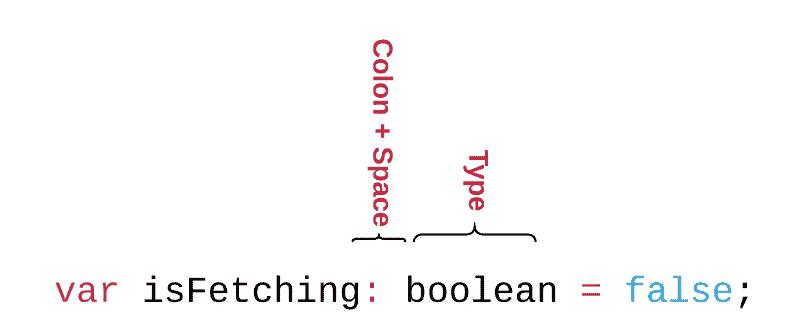

# 为什么在 JavaScript 中使用静态类型？(关于静态流分型的 4 部分初级读本)

> 原文：<https://www.freecodecamp.org/news/why-use-static-types-in-javascript-part-1-8382da1e0adb/>

作者:Preethi Kasireddy

# 为什么在 JavaScript 中使用静态类型？(关于静态流分型的 4 部分初级读本)

[Image credit](http://anglescomic.blogspot.com)

作为一名 JavaScript 开发人员，你可以整天编码而不会遇到任何静态类型。那么，为什么要费心去了解它们呢？

事实证明，学习类型不仅仅是一种思维拓展的练习。如果你愿意花一些时间来学习静态类型的优点、缺点和用例，这将极大地帮助你的编程。

感兴趣吗？你很幸运——这就是这个四部分系列的其余部分。

### 首先，一个定义

理解静态类型的最快方法是将它们与动态类型进行对比。具有静态类型的语言被称为**静态类型语言**。另一方面，具有动态类型的语言被称为**动态类型的**语言。

核心区别在于，**静态类型的**语言在**编译时**进行类型检查，而**动态类型的**语言在**运行时**进行类型检查。

这给你留下了另一个概念:什么是"**类型检查"**？

为了解释，让我们看看 Java 和 Javascript 中的类型。

**【类型】**指正在定义的数据类型。

例如，在 Java 中如果你定义一个`boolean`为:

`boolean result = true;`

这有一个正确的类型，因为`boolean`注释匹配赋予`result`的值，而不是整数或其他任何值。

反之，如果你试图声明:

`boolean result = 123;`

…这将无法编译，因为它的类型不正确。它显式地将`result`标记为`boolean`，但随后将其定义为整数`123`。

JavaScript 和其他动态类型的语言有一种不同的方法，允许上下文确定正在定义的数据类型:

`var result = true;`

长话短说:静态类型语言要求您在使用它们之前声明构造的数据类型。动态类型语言不会。JavaScript 隐含了数据类型，而 Java 直接声明了数据类型。

如你所见，类型允许你指定程序的不变量，或者程序执行的逻辑断言和条件。

**类型检查**验证并强制一个构造的类型(常量、布尔、数字、变量、数组、对象)与你指定的不变量相匹配。例如，您可以指定“此函数总是返回一个字符串”当程序运行时，您可以放心地假设它将返回一个字符串。

当发生类型错误时，静态类型检查和动态类型检查之间的差异最重要。在静态类型语言中，类型错误发生在编译阶段，即编译时。在动态类型语言中，错误只在程序执行一次时出现。也就是在**运行时**。

这意味着用动态类型语言(如 JavaScript 或 Python)编写的程序可以编译，即使它包含类型错误，否则会阻止脚本正常运行。

另一方面，如果用静态类型语言(如 Scala 或 C++)编写的程序包含类型错误，那么在错误被修复之前，它将无法编译。

### JavaScript 的新时代

因为 JavaScript 是一种动态类型的语言，所以你可以声明变量、函数、对象和任何东西，而不用声明类型。

方便，但不总是理想的。这就是为什么像 [Flow](https://flowtype.org) 和 [TypeScript](https://www.typescriptlang.org/) 这样的工具最近介入，给 JavaScript 开发者提供了使用静态类型的选项。

[**Flow**](https://flowtype.org/) 是一个开源的静态类型检查库，由脸书开发并发布，它允许你在你的 JavaScript 代码中增加类型。

另一方面, [**TypeScript**](https://www.typescriptlang.org/) 是一个编译成 JavaScript 的超集——尽管它本身感觉就像一种新的静态类型语言。也就是说，它的外观和感觉都非常类似于 JavaScript，并且不难掌握。

在这两种情况下，当您想要使用类型时，您可以明确地告诉工具要对哪个(哪些)文件进行类型检查。对于 TypeScript，您可以通过编写扩展名为`.ts`而不是`.js`的文件来做到这一点。对于 Flow，您可以在文件顶部添加一个带有`@flow`的注释

一旦声明要对文件进行类型检查，就可以使用它们各自的语法来定义类型。这两个工具之间的一个区别是 Flow 是一个类型“检查器”而不是编译器。另一方面，TypeScript 是一个编译器。

我真的相信像 Flow 和 TypeScript 这样的工具代表了 JavaScript 的一代转变和进步。

就我个人而言，通过在日常生活中使用类型，我学到了很多。这就是为什么我希望你能和我一起踏上这个短暂而甜蜜的旅程，进入静态类型。

这篇 4 部分文章的其余部分将涵盖:

第一部分[流语法和语言的快速介绍](https://medium.com/@preethikasireddy/why-use-static-types-in-javascript-part-1-8382da1e0adb#.prtc7vhrr)

第二和第三部分。[优点&静态类型的缺点(有详细的演练示例)](https://medium.com/@preethikasireddy/why-use-static-types-in-javascript-part-2-part-3-be699ee7be60#.9ywoivqaz)

第四部分。在 JavaScript 中是否应该使用静态类型？

注意，在本文的例子中，我选择了 Flow 而不是 TypeScript，因为我对它比较熟悉。为了您自己的目的，请做研究并选择适合您的工具。TypeScript 也很棒。

事不宜迟，我们开始吧！

### 第 1 部分:流语法和语言的快速介绍

为了理解静态类型的优点和缺点，您应该首先对使用 Flow 的静态类型的语法有一个基本的了解。如果您以前从未使用过静态类型的语言，语法可能需要一段时间来适应。

让我们从探索如何将类型添加到 JavaScript 原语以及数组、对象、函数等构造开始。

#### 布尔型

这在 JavaScript 中描述了一个`boolean`(真或假)值。

请注意，当您想要指定类型时，您使用的语法是:

#### 数字

这描述了一个 IEEE 754 浮点数。与许多其他编程语言不同，JavaScript 没有定义不同类型的数字(如整数、短整型、长整型和浮点型)。相反，数字总是存储为双精度浮点数。因此，您只需要一个数字类型来定义任何数字。

`number`包括`Infinity`和`NaN`。

#### 线

这描述了一个字符串。

#### 空

这描述了 JavaScript 中的`null`数据类型。

#### 空的

这描述了 JavaScript 中的`undefined`数据类型。

注意`null`和`undefined`的处理是不同的。如果你试图做:

流将抛出一个错误，因为类型`void`应该属于类型`undefined`，而类型`undefined`与类型`null`不同。

#### 排列

描述一个 JavaScript 数组。你使用语法`Array<`；描述一个数组，它的元素是某种类型的

注意我是如何用`string`替换`T`的，这意味着我将`messages`声明为一个字符串数组。

#### 目标

这描述了一个 JavaScript 对象。向对象添加类型有几种不同的方法。

您可以添加类型来描述对象的形状:

您可以将对象定义为映射，将字符串映射到某个值:

您也可以将一个对象定义为`Object`类型:

最后一种方法让我们可以无限制地在对象上设置任何键和值，所以就类型检查而言，它并没有真正增加多少价值。

#### 任何的

这可以代表任何类型。`any`类型实际上是未检查的，所以除非绝对必要，否则应该尽量避免使用它(比如当您需要退出类型检查或者需要退出时)。

您可能会发现`any`很有用的一种情况是当使用扩展另一个系统原型的外部库(如 Object.prototype)时。

例如，如果您使用一个扩展 Object.prototype 并带有`doSomething`属性的库:

您可能会得到一个错误:

为了避免这种情况，您可以使用`any`:

#### 功能

向函数添加类型的最常见方法是向函数的输入参数和(相关时)返回值添加类型:

您甚至可以向异步函数(见下文)和生成器添加类型:

注意我们的第二个参数`getPurchaseLimit`是如何被注释为返回一个`Promise`的函数的。并且`amountExceedsPurchaseLimit`被注释为也返回一个`Promise`。

#### 类型别名

类型别名是我最喜欢的使用静态类型的方式之一。它们允许您使用现有的类型(数字、字符串等。)来构成新类型:

上面，我创建了一个名为`PaymentMethod`的新类型，它的属性由`number`和`string`类型组成。

现在如果你想使用`PaymentMethod`类型，你可以这样做:

通过将基础类型包装在另一个类型中，还可以为任何基元创建类型别名。例如，如果您想键入别名 a `Name`和`EmailAddress`:

通过这样做，你表明`Name`和`Email`是不同的东西，而不仅仅是字符串。由于姓名和电子邮件实际上是不可互换的，这样做可以防止你不小心把它们搞混了。

#### 无商标消费品

泛型是对类型本身进行抽象的一种方式。这是什么意思？

让我们来看看:

我为类型`T`创建了一个抽象。现在您可以使用任何类型来表示`T`。对于`numberT`，`T`属于`number`类型。同时，对于`arrayT`，T 是类型`Array<numb` er >。

是的，我知道。如果这是你第一次看到类型，这将是令人眼花缭乱的东西。我保证“温柔”的介绍快结束了！

#### 可能

也许类型允许我们对潜在的`null`或`undefined`值进行类型注释。他们有一些类型`T`的类型`T|void|null`，这意味着它要么是类型`T`，要么是`undefined`或`null`。要定义一个`maybe`类型，您需要在类型定义前面加上一个问号:

在这里，我说这个消息要么是一个`string`，要么是`null`或`undefined`。

你也可以使用 maybe 来表示一个对象属性将是某种类型的`T`或`undefined`:

通过将`?`放在`middleInitial`的属性名旁边，您可以指出这个字段是可选的。

#### 不相交并集

这是另一种强大的数据建模方式。当您的程序需要同时处理不同种类的数据时，不相交的联合非常有用。换句话说，数据的形状可以根据情况而有所不同。

从我们之前的泛型例子中扩展`PaymentMethod`类型，假设你有一个应用程序，用户可以选择三种支付方式中的一种。在这种情况下，您可以这样做:

然后，您可以将 PaymentMethod 类型定义为包含三种情况的不相交并集。

支付方式现在只能是这三种形式中的一种。属性`type`是使联合类型“不相交”的属性。

在第二部分的后面，您将看到更多不相交联合类型的实际例子。

好了，快好了。在结束本介绍之前，还有几个 Flow 的其他特性值得一提:

**1)类型推断**:流在可能的地方使用类型推断。当类型检查器可以自动推断表达式的数据类型时，类型推断就开始了。这有助于避免过多的注释。

例如，您可以写:

即使这个类没有类型，Flow 也可以对它进行充分的类型检查:

这里我试图将`area`定义为`string`，但是在`Rectangle`类定义中，我们将`width`和`height`定义为数字。所以根据`area`的函数定义，它必须返回一个`number`。即使我没有为`area`函数显式定义类型，Flow 还是捕捉到了错误。

需要注意的一点是，流程维护者建议，如果您要导出这个类定义，您应该添加显式的类型定义，以便当该类没有在本地上下文中使用时，更容易找到错误的原因。

**2)动态类型测试**:这基本上意味着流有逻辑来确定一个值在运行时的类型，因此能够在执行静态分析时使用这些知识。它们在一些情况下变得有用，比如当 flow 抛出一个错误，但是你需要让 Flow 相信你所做的是正确的。

我不会说太多细节，因为这更像是一个高级特性，我希望单独写出来，但是如果你想了解更多，值得通读一下[文档](https://flowtype.org/docs/dynamic-type-tests.html)。

### 我们已经完成了语法

我们在一节中涵盖了很多内容！我希望这种高层次的概述是有帮助的和可管理的。如果你想更深入地了解，我鼓励你深入到[写得很好的文档](https://flowtype.org/docs/)中去探索。

语法说完了，让我们最终进入有趣的部分:[探索使用类型的优点和缺点](https://medium.com/@preethikasireddy/why-use-static-types-in-javascript-part-2-part-3-be699ee7be60#.9ywoivqaz)！

接下来:[第二部&第三部](https://medium.com/@preethikasireddy/why-use-static-types-in-javascript-part-2-part-3-be699ee7be60#.9ywoivqaz)。