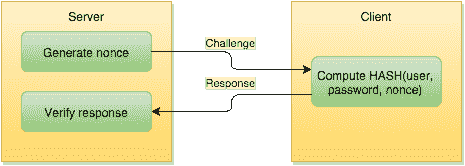

# 为什么我们需要新颖的认证方案？

> 原文：<https://www.freecodecamp.org/news/why-we-need-novel-authentication-schemes-6d5139e0cd9/>

哥萨克实验室开发故事

# 为什么我们需要新颖的认证方案？

揭示 5 种主要身份验证方法中的安全漏洞

### 简介:一句话传递

密码是多样性和安全性的终极守护者。从古罗马时代到现在，它们被用来证明自己有资格获得一些别人不拥有的特权，无论他们多么强烈地渴望获得。一个“神奇的词”，一个人知道而其他人不知道，打开了机会的大门，使个人从一大群人中选择他们。

可以说密码是最古老也是使用最广泛的身份认证支柱，在 21 世纪的互联网中被广泛使用。它的重要性甚至比以前更大，因为现在越来越多的人在看不到或听不到对方的情况下进行远程通信，使用远程手段来访问自动化系统。因此，他们只能依靠密码来验证远程方并证明自己的身份。只要知道别人的密码，你就可以成为别人眼中的那个人，以他们的名义做任何你想做的事情，获得他们在自动化系统中的特权。这就是为什么正确保护密码如此重要。

然而，今天用于身份验证的大多数方案都有其自身的弱点——尽管其中一些是理论上的，但在快速变化的世界中，理论上的威胁经常变得非常实际。

#### 通信是秘密的主要威胁

保持秘密安全的理想方法是不使用它:如果你从不使用它，没有人会截获它。然而，这使得这样的秘密毫无用处。既然秘密给了你特权，你就想不时地获得并行使这些特权。

为此，你必须证明你知道这个秘密。这个过程包括将秘密传达给另一方，最终暴露全部或部分秘密。行使秘密涉及至少两方:证明者(你)和验证者(最终决定你的秘密是否是真正正确的，以及你是否应该得到你所要求的特权的实体)。但是，如果您不能直接与验证者通信，您必须使用一个或多个中间实体，在这种情况下，这些实体也知道秘密。

现在让我们回到 21 世纪和互联网的真实世界:在通信时，你可能会使用成千上万的中间链接来传递数据，所以一旦你将秘密发送给验证者，它就不再是秘密了。

### 现有的认证方法

现有的方法提供了某种程度的保护，或好或坏，但每种方法都有明显的缺点。迄今为止，大多数当前的系统和安全协议只使用了三种类型的密码原语:加密、密钥协商和数字签名。更高级的任务，如认证，是通过在协议中以某种方式组合这些原语来实现的。

互联网认证从非常简单的密码开始:用户在 web 表单中输入密码，密码通过 HTTP 发送到服务器，服务器验证密码并让用户进入。那是在小型互联网的早期。在那个时候，攻击者由于对互联网的工作原理缺乏经验而受到限制。即使有些人具备基本的网络知识，他们也没有设备、工具或软件(当时非常昂贵)来进行攻击。此外，攻击本身是毫无意义的，因为当时在互联网上传播的信息几乎没有商业价值。最终，互联网的发展以及知识、软件和工具的可用性创造了第一个网络攻击者:HTTP 密码很容易被最简单的被动网络嗅探器和协议分析器窃取。

下一步是将密码改为一些对被动窃听者无用的值:人们开始散列密码。由于服务器和用户都有相同的密码，他们可以产生相同的散列值并进行比较，用户将散列值发送给服务器。攻击者似乎无法获得密码，因为从计算上来说，逆转一个散列函数“几乎是不可能的”。这个解决方案挽救了这一天…只是一小会儿！攻击者使用两种方法来克服这一点:

*首先:*许多人让他们的密码“容易记忆”，所以他们攻击者散列一大组流行词，通过知道散列，可以很容易地“查找”原始密码，如果它碰巧来自产生的“字典”:字典攻击被发明。

*第二:*即使有人使用了复杂的密码，攻击者也只是用“修改过的浏览器”直接用哈希向服务器认证。他们没有在表单中输入密码，而是直接在 HTTP 流中注入 hash:发明了一种主动攻击。

现在很清楚，HTTP 流量必须加密。然而，由于通信双方相距很远，所以使用了一个密钥协议，并最终被攻击者破坏:中间人被提出。

历史还在继续:保护密码传输的方案越复杂，破解它们的攻击就越好，也越聪明。完全避免传输密码不是很好吗？

#### 1.自定义哈希交换协议

大多数刚开始开发加密工具的工程师，当他们第一次成功地使用某个密钥将一段数据转换成看起来随机的字符串并恢复原始数据时，似乎都非常高兴。问题是大部分工程师都止步于此。从施奈尔定律我们知道:

任何人，从最无知的业余爱好者到最好的密码学家，都可以创造一个他自己都无法破解的算法。

他们认为，如果输出看起来确实是随机的，并且没有人知道密钥，那么他们是安全的。因此，人们总是可以找到低安全性的加密方案、硬编码的密钥或初始向量、加密模式的不当使用等。即使在生产软件中。而且，尽管你的输出看起来像是随机的，但一个拥有适当工具和数学背景的老练的攻击者肯定会发现模式、旁道泄漏、执行密码分析并最终恢复数据。即使是大公司也会因此陷入困境，那么你有什么特别之处呢？

涉及 bcrypt、pbkdf2 或任何“加密然后比较”框架的不同方案仅提供了安全系统的一部分，而不是完整的解决方案。这根本不能提供足够的安全性。

#### 2.HTTP 认证

HTTP 中仍然广泛使用密码来允许用户访问受限资源。然而，尽管认证协议的更新历史悠久，但仍然存在一些攻击的空间。如果网站不提供用于输入此类凭据的 HTTPS 连接，具有安全意识的用户将永远不会尝试在该网站上输入他们的密码。这意味着，即使在今天，HTTP 认证机制本身也相当脆弱。让我们来看看 HTTP 身份验证的简化高级图:

On first glance it seems OK, but if taken more thought many concerns may come up to one’s mind:

*   首先，服务器认证客户端，但是客户端不认证服务器。因此，客户端不知道他们将凭证发送给了谁。而且 HTTP 认证并没有定义机密性，所以任何人只要观察流量，至少可以知道某个 web 资源有一定的用户群。
*   虽然在最近的认证协议中，用户不直接发送密码，而是发送他们密码的散列(单向不可逆函数)，但被动窃听者仍然可以收集这些信息，并使用更复杂的技术(如[字典攻击](https://en.wikipedia.org/wiki/Dictionary_attack)来恢复密码)。
*   以前的认证机制不使用服务器随机数，所以简单的[重放攻击](https://en.wikipedia.org/wiki/Replay_attack)是可能的。即使在今天，出于兼容性原因，许多浏览器支持这种旧机制，所以一个[中间人](https://en.wikipedia.org/wiki/Man-in-the-middle_attack)可以在客户端和服务器之间伪造消息，并执行[降级攻击](https://en.wikipedia.org/wiki/Downgrade_attack)。

#### 3.麻省理工学院开发的安全认证系统

一种懒惰的方法:与其互相认证，为什么不让其他人来做呢？因此创建了一个实体，所有客户端和服务都在那里注册它们的密钥，当特定客户端和服务器之间需要通信时，它们只需“请求服务”。乍一看似乎不错，但也有一些缺点，其中最主要的是，随着基础架构的增长，所有缺点都变得越来越糟糕:

*   获得对 kerberos 服务器的初始信任(初始客户端和服务注册)的方法不完善
*   大多数对称加密用于协议信息，由于协议是已知的，因此存在已知明文攻击的公开可能性
*   Kerberos 下的开发和测试很困难:开发和生产环境需要单独的域和单独的 Kerberos 设置
*   经验不足的管理员可能会误配置和使用弱加密
*   最重要的是:在 Kerberos 服务器安全之前，一切都是好的。一旦遭到破坏，整个安全生态系统就会爆炸。因为安全漏洞迟早会发生，所以使用 Kerberos 就像在您的后院放置了一个安全定时炸弹。

#### 4.SSL/TLS

SSL/TLS 是事实上的互联网认证标准协议。使用 TLS，客户端(例如，浏览器)对服务器进行身份验证，并且可选地，服务器可以对客户端进行身份验证。该协议是公认的，但是也有一些缺点:

*   需要已建立的[公钥基础设施](https://en.wikipedia.org/wiki/Public_key_infrastructure)，这在技术上难以设置和维护，而且成本高昂
*   该协议很复杂，因此在实现方面的可审计性很差(大量的实现攻击证明了这一点)
*   有长期的更新和改进历史，这是由兼容性原因以及发现的协议攻击所驱动的
*   仍然有弱点(部分原因如上)

尽管当前版本被认为是安全的(然而人们很少使用最新的 TLS 版本，而是淹没在旧的密码和 SSLv3 等易受攻击的版本中)，但被动观察者仍然可以从协议结果中收集到许多信息:

*   无论协议成功与否
*   哪一方正在通信(通过检查证书字段)
*   客户端和服务器上的软件的现代化程度如何(通过检查交流的 TLS 版本和支持的密码套件列表)
*   可能是各方是否使用专用硬件来存储私钥

#### 5.OAuth

有人可能会认为我们忽略了 OAuth，这是一种流行的委托授权协议，现在经常用于身份验证。

然而，该协议:

*   它的一个主要设计者[辞职，对安全级别有负面反馈](http://hueniverse.com/2012/07/26/oauth-2-0-and-the-road-to-hell/)
*   [在其核心设计中发现多个](http://www.thread-safe.com/2012/01/problem-with-oauth-for-authentication.html) [缺陷](http://leastprivilege.com/2013/03/15/common-oauth2-vulnerabilities-and-mitigation-techniques/)
*   [繁](http://homakov.blogspot.com/2012/07/saferweb-most-common-oauth2.html) [实现](http://homakov.blogspot.com/2013/03/oauth1-oauth2-oauth.html) [错误](http://insanecoding.blogspot.com/2013/03/oauth-great-way-to-cripple-your-api.html) [模式](https://conference.hitb.org/hitbsecconf2013ams/materials/D2T1%20-%20Andrey%20Labunets%20and%20Egor%20Homakov%20-%20OAuth%202.0%20and%20the%20Road%20to%20XSS.pdf)
*   …在像 Github、T2、脸书和 T3 这样的大型部署中浮动

简而言之，您可能会从以前的方法中挑出所有最差的点(未经身份验证的客户端、糟糕的传输安全性)，添加新的点(主动的侧面攻击！)并将其作为“认证”协议。

如果出于某种不幸的突发奇想，您不得不最终使用 OAuth 进行身份验证，请投入一些时间在[上尽可能地强化它](https://github.com/homakov/oauthsecurity)。

### 随着复杂性的增加，新的问题出现了。

除了协议本身的问题之外，新的网络拓扑和关系方案也出现了，具有特别的网络布局、混合的角色以及承载来自过去的重要信任基础设施的能力。新的漏洞类型和新的漏洞检测技术使得新的攻击媒介更加高效。

我们如何应对这些挑战？

不多。通过引入多因素身份认证，我们进一步提高了复杂性。我们添加了具有非常糟糕属性的认证令牌(如指纹，由 iPhone 中的特殊相机拍摄)。我们引入物理设备。

然而，由于这些认证信道中的每一个都有它们自己的缺陷，虽然当每个部分都足够强时，整个方案的总体强度更好，但是当认证信道中的任何一个被破坏时，安全性会急剧下降。此外，由于这些新的身份验证通道的基础设施尚未稳定，您甚至可能不知道您的令牌以及整个身份验证方案已经受损。

### 有解决办法吗？

前面提到的所有方法在某种程度上都是强有力的，并且具有某些不同的弱点。如果你愿意坚持这些方法，至少通过应用现有的最佳实践，努力保护它们免受其弱点的影响。作为密码学家，我们努力寻找理论上安全的方法，而不仅仅是“从未被证明是不安全的”，也就是所谓的实际安全的方法。

然而，我们为愿意尝试新事物的人准备了更有趣的东西。不仅实际上很强，数学上也很强。

在哥萨克实验室，我们正在研究新的请求认证方案，当存在对象标识符(A)和唯一对象属性(B)时，该方案是有效的。毫不奇怪，这些对象中包括登录/密码对。这种方法不依赖于传统的加密属性，传统的加密属性仍然包括通过网络以一种或另一种形式发送密码(并且具有某种理论上的被泄露的可能性)，而是新颖的加密数学的相当实际的实现，其根本不泄漏凭证，无论是以直接形式还是散列形式。

请继续关注下一篇关于安全认证器的教育文章和科学论文，这是一种检查用户密码的新方法，不会被拦截。

附:本文最初发表在我们的[博客](https://cossacklabs.com/why-we-need-novel-authentication-methods.html)上。