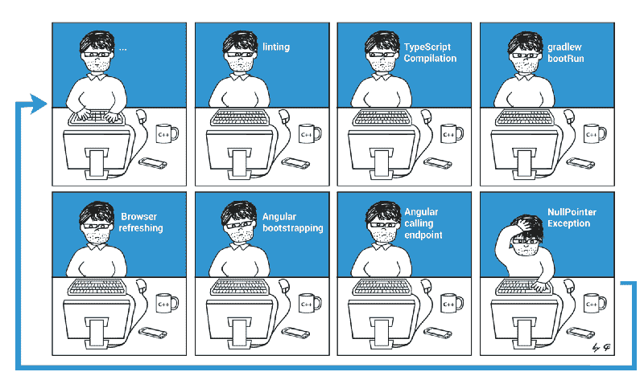

# 为什么我们要测试——用测试驱动的开发更快地做事情

> 原文：<https://www.freecodecamp.org/news/why-we-test-do-things-faster-with-test-driven-development-ce00141680e2/>

赖纳·哈内坎普

# 为什么我们要测试——用测试驱动的开发更快地做事情

Photo by [Erlend Ekseth](https://unsplash.com/photos/0a5VbkqqFFE?utm_source=unsplash&utm_medium=referral&utm_content=creditCopyText) on [Unsplash](https://unsplash.com/search/photos/test?utm_source=unsplash&utm_medium=referral&utm_content=creditCopyText)

众所周知，单元测试为我们提供了某种安全网。他们给了我们一个程序，我们可以用它来验证一个系统是否按照预期的方式工作——尤其是在我们进行修改或扩展之后。

通过编写这些测试，您已经做了大量的前期工作。如果您认为真正的好处来自于维护和扩展工作，那么您会将测试视为美化或清理的一部分。

在这篇文章中，我想说明，在一个普通的 web 应用程序的环境中，典型的验证过程比你想象的要长得多，在实际代码之前编写测试会让你更快地完成工作。

#### 你可能认为人工检查很快

验证对通用 web 应用程序的修改的通常方法是在浏览器中验证其行为，就像最终用户会做的那样。这意味着你改变代码，重新加载浏览器，点击一个按钮，看看是否会出现预期的结果。

这个过程的持续时间在很大程度上取决于您的环境和您正在使用的应用程序部分。如果您“有幸”使用 Angular 和 Spring 这样的框架，那么它们支持大型项目的能力是以每次引导和编译为代价的。考虑这个乐观的例子:

*   10 秒自举
*   5 秒钟编译
*   5 秒钟重新加载和测试

所以我们已经有 20 秒的时间进行人工检查。这假设您的客户端和服务器端构建工具，如 Webpack 和 Maven，已经过优化。

Manual Checks require more time than you might think

#### 但是支票需要的时间比你想象的要长

然而，很多时候其他事情会大大延长验证时间。有时我们开发人员在第一次运行时会忽略错别字。在第二种情况下。(还是第三！)每一个都成倍的增加了你检查代码的时间。

考虑一个更严重的情况，您正在一家在线商店中开发某种支付功能。检查按钮是否触发适当的动作可能需要很少的时间。但是包含要填写的字段的典型结帐过程将花费更多的时间。如果您正在处理长时间运行的任务，它很容易超过一分钟。

你可能会说使用解释语言可能会加快速度。这是真的，但是这里的要点是，您很容易结束手动测试周期，每次持续一分钟，多次。这只是为了验证某些代码行是否达到了预期的效果。

#### TDD 加快了速度

正确地进行测试驱动开发(TDD)——首先编写测试，然后编写代码——可以让您在几秒钟内运行独立代码的任何特定部分。

记住单元测试只是测试一个类。该类的所有依赖项都是模拟的——特别是对于 I/O 操作，如数据库、文件系统或网络。

用这些测试代替手动验证极大地提高了速度。你最终也会得到质量更好的代码，但是在后面的文章中会有更多的介绍。最后一次验证运行将是手动运行。这是您在浏览器中实际检查事情是否如最终用户所想的那样的地方。

#### 是的，即使是那些特殊情况

您总是会遇到一些情况，您会发现应用 TDD 是完全违背直觉的。

想一想我所说的“实验工作”——你不得不做的反复试验，以发现如何使用你不太熟悉的库或服务。您已经在处理一个未知组件。为什么要在你的主要代码周围引入一个测试框架层来使它变得更复杂呢？

或者考虑一个 web 应用程序的开始阶段，您通常在前端部分工作—主要是 HTML 和 CSS，一小部分服务器端代码只将数据从数据库“移动”到浏览器。

在这两种情况下，您应该从一开始就应用 TDD。为“实验性工作”创建单元测试可以让您更快地完成试错部分，并为您提供一个工具集，您可以随时回头使用。您的“将数据从数据库移动到浏览器”代码将随着时间的推移而增长，从而导致不可测试的代码库，您无法运行彼此隔离的代码部分。您将不得不自己进行耗时的手工测试。

#### TDD 是值得努力的

你有责任找到可测试的代码，并将其集成到你的工作过程中。有人以专家的身份付钱给你。那个人不明白为什么你坐在那里等待应用程序启动或者你点击按钮——这是一个不太熟练的人也能做的工作。

以正确的方式编写单元测试是一项你通常在大学或普通编程教育中学不到的技能。第一次是困难的，需要几个小时来适应，但是你会很快看到第一个结果，并且不会回头。

从一开始就投资于好的单元测试来节省你的时间，并且从第一次提交开始就使用模块化的应用程序。

*最初发表于 2017 年 3 月 15 日[www.rainerhahnekamp.com](https://www.rainerhahnekamp.com/en/why-we-test-do-things-faster-with-test-driven-development/)。*