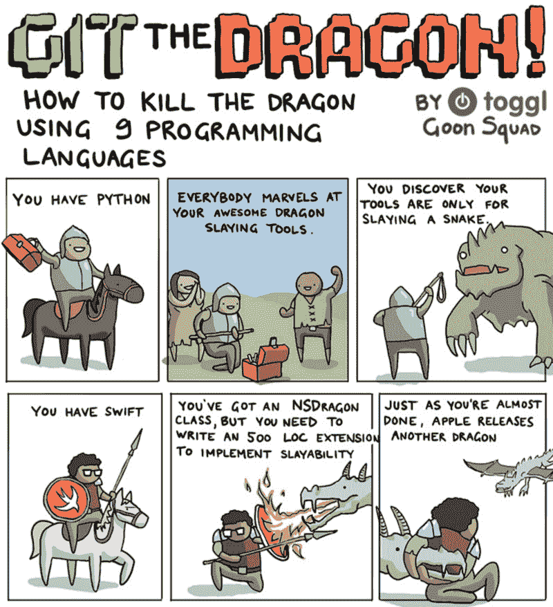
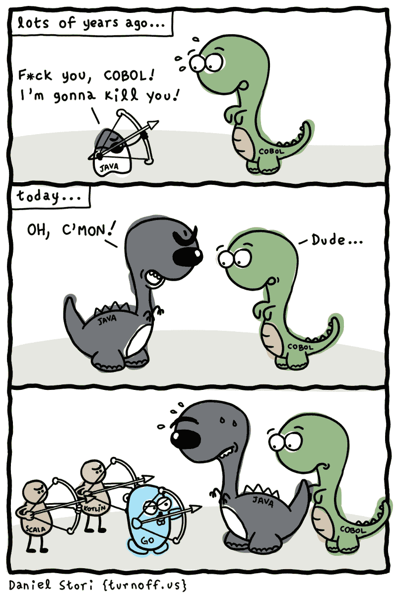

# 为什么我们总是需要新的编程语言

> 原文：<https://www.freecodecamp.org/news/why-we-will-always-need-new-programming-languages-3415869ea37e/>

作者:马尔钦·莫斯卡拉

# 为什么我们总是需要新的编程语言


哈罗德·艾贝尔森和杰拉德·让伊·萨斯曼的《计算机程序的结构和解释》是有史以来最好的编程书籍之一。它领先了它的时代很多年。

那里强调的函数式编程的优点仍然是演讲者、教师和其他作者的灵感源泉。它展示了面向对象编程年轻时的强大和缺陷。多亏了面向对象编程的狂热分子，这种能力很快被广为宣传。另一方面，社区花了很多年才看到这些缺陷。

最后一章完全致力于另一个在流行对话中仍未被讨论的概念:对新编程语言的需求。即使这本书同情 [Lisp](https://en.wikipedia.org/wiki/Lisp_(programming_language)) ，但它明确声称它不是最终的编程语言。任何语言都不会。

我们总是需要新的编程语言来提高我们的表达能力。这不是一个无足轻重的说法，为了理解其背后的含义，我们需要深入两个层次。

### 什么是编程语言？

参见以下功能:

```
fun square(a: Int) = a * a
```

```
// Usageprint(square(10) + square(20))
```

定义了`square`是什么意思？

从技术角度来看，这只是一种简化，身体可以代替所有的呼叫:

```
// Kotlinprint(10 * 10 + 20 * 20)
```

从程序员的角度来看，`square`要多得多。我们可以定义这样一个函数，这不仅是一种更简单的运算方法，而且还可以让我们表达平方的概念。这个函数是某种抽象。

如果它更复杂，它将允许我们把所有这些复杂性隐藏在一个简单的函数调用后面。这就是编程:不同的编程语言特性允许我们以不同的方式表达事物。

### 编程语言的演变

编程行业在发展，编程语言也在发展。想想 for 循环。最初，只有一个 when 循环。

很快程序员注意到一个常见的模式:

```
// Cint i = 0;while(i < n) {    i++;    // ...} 
```

表达式被一次又一次地用来迭代某些东西——主要是数字、地址或迭代器。

所以我们引入了 for 循环:

```
// C++for (int i = 0; i < n; i++) {    // ...}
```

很快业界发现 for 循环主要用于遍历列表中的元素。

这就是为什么语言引入了 for-loop 的新变体，它被设计成在`list`上迭代:

```
// Kotlinfor(e in list) {    // ...}
```

### 所以我们需要新的功能

#### 但是语言在进化，为什么不坚持下去呢？

语言确实在进化。在某些情况下，像 C++、Java 或 JavaScript 这样的老语言能够很好地支持它们并不是为之设计的函数式编程元素，这确实令人印象深刻。但问题是新功能不会取代旧功能，而是被添加上去的。

就编程语言特性而言，越多不一定越好。当我们可以用许多不同的方式表达同一个概念时，这是令人困惑的。

想到 [Scala](https://www.scala-lang.org/) 。Scala 最大的反对意见是太多不同的特性使得非常难以理解一个有点太多创造力的开发者的代码中发生了什么。

Go 编程语言因简单而广受欢迎。这不是关于一些语言有多少特性，而是关于拥有一套完美的特性。

在我看来，这也是大家如此喜爱[科特林](https://kotlinlang.org/)的原因。它是我所知道的设计得最好的编程语言。

这是有充分理由的:

*   它已经测试了 6 年，并且在整个过程中不断迭代发展
*   它是由 JetBrains 设计的，他们多年来一直掌握着对编程语言以及人们如何使用它们的理解

在测试阶段，有一些重要的特性被完全实现了，但是在 1.0 之前它们被移除了。其中就有元组。科特林全力支持他们！然而，Kotlin 团队在 Kotlin 1.0 之前移除了对元组的支持，因为他们的分析和实验表明，元组弊大于利，人们应该使用数据类来代替。这说明 JetBrains 明白好设计的重要性。

另一种设计良好的语言是 [Swift](https://swift.org/) 。它的开发速度要快得多，设计它的开发人员犯了很多错误。然而，苹果只是在几乎每个主要版本发布时都改变了设计。他们并不真正关心遗产。

开发者在发牢骚，但从设计的角度来看，这是很棒的。尽管他们不能长期这样做。Swift 中的东西越多，设计变更的成本就越大。此外，我不认为他们能够改变主要的功能。



Source: [https://getbadges.io/blog/12-gamification-platforms-that-help-learn-coding](https://getbadges.io/blog/12-gamification-platforms-that-help-learn-coding)

### 所以如果我们有设计良好的新语言，它们是最终的语言吗？

一点也不。行业在发展。我们的思维在进化。所以编程语言也需要进化。

一件事是，新功能和思维方式的想法将会诞生，因此设计完美的语言将不再完美。

第二件事是我们学到了更多关于编程的知识。在 Java 中，类和方法默认是打开的。Kotlin 默认将它们都设为 final，因为开发人员在不应该的时候过度使用了继承。

默认情况下，Java 类成员是包私有的。这个修饰语几乎从未使用过。Kotlin 根本不允许这样做，而是默认情况下类成员是公共的，因为这是它们最常见的修饰符。我们改变我们的习惯，我们学习，所以语言也应该随着我们改变。

第三件事是范式改变了。我在编程范例方面看到了停滞，但是我们仍然有一些可以引入到日常实践中。

逻辑编程去哪了？请注意，您可以使用这种范式，只需为网站提供一组约束，并期望网站会基于这些约束自动构建。这是有可能实现的。而且，新的范式迟早会诞生。不可能什么都探索过了。

最后，新技术诞生了，以前的语言所代表的旧的思维方式可能已经不够用了。

想起[区块链](https://en.wikipedia.org/wiki/Blockchain)。当我与考虑转换的人交谈时，他们希望使用他们最喜欢的语言，如 Java 或 JavaScript。尽管当我和区块链的开发者交谈时，他们声称区块链需要用专门为它设计的语言来开发。

例如，契约是一个在编程中没有对等物的概念。可以用类来模拟，但这对于人们的思考方式是有害的。当我们试图用旧词表达新事物时，这是有害的。这就像把一辆汽车命名为“钢铁之马”，并试图用兽医来制造机械师。

### 关闭

想想数学。平衡可以用一种描述性的方式来表达:

二加三等于五

尽管这和用数学符号表达完全不同:

**2 + 3 = 5**

这并不是可读性和空间的唯一优化。这两种符号表示相同的东西，但是它们代表完全不同的概念。从计算机的角度来看，这并不重要——它可以很容易地将描述性形式转化为数学形式——但对我们人类来说，这是最重要的事情。

如果不重要，我们会在汇编程序上操作，而不是 Java、JavaScript、Python 或 Kotlin。但这很重要。这就是为什么我们需要越来越好的表达，我们需要新的编程语言。



### 关于作者

[马尔金·莫斯卡兹拉](http://marcinmoskala.com/)([@马尔金莫斯卡拉](https://twitter.com/marcinmoskala))是一名培训师兼顾问，目前专注于在 Android 和高级 Kotlin 工作坊中给予 Kotlin(更多详情，[申请此处](https://marcinmoskala.typeform.com/to/iwKnN9))。他还是一名演讲者，撰写了关于 kot Lin Android 开发的文章和书籍。

