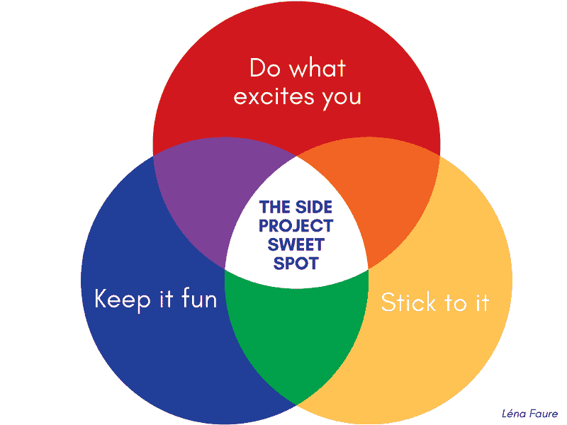
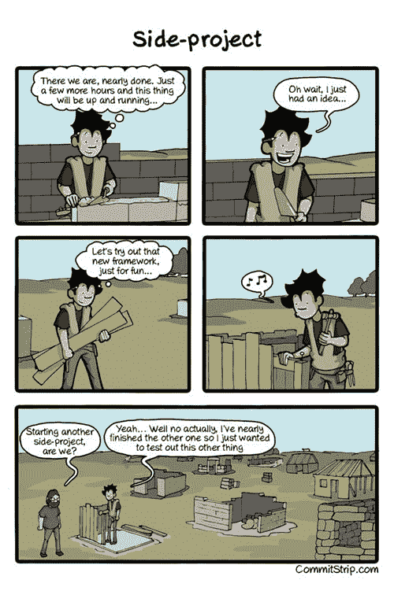

# 作为一名开发人员，为什么兼职项目是你最好的选择

> 原文：<https://www.freecodecamp.org/news/why-working-on-a-side-project-is-your-best-move-as-a-developer-3b5b68035ac6/>

由列娜·福尔

# 作为一名开发人员，为什么兼职项目是你最好的选择

Originally published on [**lenafaure.com**](http://www.lenafaure.com)

编辑:我的兼职项目 [timeshake.io](https://timeshake.io/) 的测试版——一个在线日历生成器——上线了！请随意创建一个帐户，测试应用程序并给出反馈:)

作为一名开发人员，我学到最多的时刻是我构建东西的时候。对于我在工作中积累的东西来说是这样，但当我在做某件事情时，我会选择去做，这是一个真正让我兴奋的兼职项目，我会用自己的时间去做。

编写一个特性或完整产品的代码通常是一个一个解决问题的过程，有些问题比其他问题更容易解决。

最困难的问题，那些起初看起来不可克服的问题，迫使我更深入地研究一项技术的工作原理，是那些让我学到的东西永远伴随着我。

这就是为什么我坚信学习新技术的最好方法是做。不仅如此，正如在 [Indrek Lasn'](https://medium.freecodecamp.org/@wesharehoodies?source=post_header_lockup) 的文章中解释的那样，**我们应该努力创造有用的东西，以此作为取得进步的途径。**

如果像我和许多开发人员一样，你喜欢构建东西，从事你感到兴奋的事情是你能拥有的最光荣的经历之一。

[unsplash.com](https://unsplash.com/)

我们开发者非常幸运。我们开始使用我们的创造力来生产其他人可以使用的东西，并享受应用我们的工艺来完成事情的纯粹行为，同时在这个过程中变得更好。

当我们创造的东西也给其他人带来价值时，回报是巨大的。

### 从事副业项目的好处

做副业有很多好处。以下是我最喜欢的几个:

#### **让你保持动力**

一个让你兴奋的副业让你前进，激发你的创造力。这是你的东西，你的孩子，你的汗水和泪水。有了耐心和努力，你甚至可能最终为它的用户带来很多价值，并将其转化为一项业务。

> “为了学习，你必须这样做。你必须尝试一些东西，打破一些东西，为你曾经尝试过而后悔，克服你的懒惰，并把它完成。”安德烈·佩纳

#### **推动您更快、更深入地学习新技术**

当你试图让事情运转起来时，你的学习要比仅仅阅读、观看或跟着编码深入得多。弄脏你的手，把技术当作一种手段来达到你想要的地方，这是从理论到可操作的知识的最有效的方法。

#### **开创新机遇**

拥有一个副业项目和对你正在使用的技术的特别兴趣是让你在技术上和个人上都脱颖而出的东西。

> ***“谈论副业是非常有益的。它们充分展示了你的工作方式。”——[坦纳](https://www.freecodecamp.org/news/why-working-on-a-side-project-is-your-best-move-as-a-developer-3b5b68035ac6/undefined)***

[这篇文章](https://medium.freecodecamp.org/how-to-talk-about-your-side-projects-18b96f192817)详细解释了即使作为初学者和/或自学的开发人员，从事和谈论你的副业项目如何对你的职业生涯产生巨大影响。

#### **提高你的其他技能**

它帮助你更好地掌握其他重要技能:产品设计、UX/用户界面、市场营销等等。

在你的职业生涯中，你不会经常从头到尾参与一个项目。但是对于你的副业项目，你负责构思和设计产品，开发它，部署它和营销它。找到一种方法来学习足够的知识以达到你想要的结果的责任落在了你的身上。

### **如何选择自己的副业项目**

当你找到自己的最佳点时，你选择的副业可以极大地促进你的创造力和成长。

The side project sweet spot

下面，我将讨论你如何在兼职项目的不同阶段获得最大收益。

#### **对运输的恐惧**

对运输的恐惧、拖延和抵制已经被大量记录下来。它们是大量项目从未诞生并最终成为废弃项目的主要原因之一。这意味着**仅仅是完成一个项目并把它带给用户的事实就已经让你与众不同了**。

然而，由于没有什么重要的利害关系，你可以将压力保持在最低限度。副业就是按照你自己的速度，按照你自己的方式慢慢取得成功。

在职场环境中，失败会带来现实生活中的后果(裁员、失去客户)，而在副业空间，你可以尝试、定义自己的成功衡量标准、在不危及任何人的职业生涯或收入的情况下失败，并在这个过程中获得乐趣。

#### 放松点

Tobias van Schneider 说副业应该是愚蠢的或者琐碎的:

> “副业成功的唯一途径是，如果人们允许自己想得简单，改变他们的想法，失败——基本上，不要太认真。

> 当你认为某件事很愚蠢的时候，你会从中得到乐趣，你不会在它周围设置太多的结构。你可以享受不同类型的成功。"

你应该把你的兼职项目当作实验，不要让严重的问题和疑虑扼杀了还没有成为现实的项目。换句话说:

> “我的第一条建议是去做吧。”-托拜厄斯·范·施奈德

[unsplash.com](https://unsplash.com/)

这是一个你可以失败而不承担后果，想打多少枪就打多少枪的地方。

这也是一个你可以朝着让你兴奋的目标取得切实的、可衡量的进步的地方。这会让你保持活力，也会让你更快乐。

#### 找到想法

你如何为副业项目找到点子？

*   **搔自己的痒处:**如果你不断遇到让你说“为什么这个还不存在？”或者“我可以做得更好”，如果需求还没有得到满足，是时候做一点研究并努力实现它了。
*   那个一直困扰你的想法:你已经想了几个月或几年了。它不断回来，乞求你帮助它来到这个世界。无论是将你喜爱的应用程序的一个功能转化为一个产品，还是为了不同的目的克隆一个现有的产品，如果你感到有动力去做它，这是一个好迹象，你必须开始做了。
*   **执行他人提供的想法:**这里有两篇文章，都是你可以考虑的想法，[如何想出副业想法](https://blog.producthunt.com/how-to-come-up-with-side-project-ideas-4a2c8049deba)作者[瑞安·胡佛](https://www.freecodecamp.org/news/why-working-on-a-side-project-is-your-best-move-as-a-developer-3b5b68035ac6/undefined)(产品搜寻创始人)和[帮助你挑选接下来工作的最佳副业项目的快速指南](https://hackernoon.com/a-quick-guide-to-help-you-picking-up-the-best-side-project-to-work-next-30e284e2b2f7)作者[安德烈·佩纳](https://www.freecodecamp.org/news/why-working-on-a-side-project-is-your-best-move-as-a-developer-3b5b68035ac6/undefined)

#### 哇效果

虽然发布一个运行良好的原型应该是你的主要目标，但是这个目标也是为了取悦产品的用户。记住，你只有一次机会留下好的第一印象。

[Wayne Chang](https://www.freecodecamp.org/news/why-working-on-a-side-project-is-your-best-move-as-a-developer-3b5b68035ac6/undefined) 介绍了 MLP 的概念——最可爱的产品——为您的首批用户提供卓越体验的原型。

> “MLP 是一种如此直观、如此令人满意的产品，以至于你的客户群会情不自禁地告诉别人他们的体验。”——韦恩·张

即使只有最少的功能，构建一个漂亮的原型也能让你脱颖而出，让你置身于 wow 的三角洲。

### 深入了解技术

我正从我离开的地方重新拾起我的[计划，成为一个更好的开发者](https://hackernoon.com/a-120-days-plan-to-become-a-better-developer-120daysbetterdev-4c3bbbdf31ee)。我不得不暂停它 6 个月，因为[正在为巴黎市](https://medium.freecodecamp.org/the-developers-workflow-in-practice-how-we-built-our-mvp-in-30-days-c60d804695a8)建立一个创业公司。

现在是我投入反应的时候了。永远不会太晚，对吗？？这是我很久以来一直想做的事情，但一直没有好好解决。

当我试图学习新的东西时，我真的很无聊，默认的教程应用程序是另一个博客或待办事项，最终会在我电脑的文件夹墓地中结束。相反，我可以用这些时间去创造一些有意义的东西。

从事副业项目帮助我拥抱技术，因为我把它作为达到目的的手段，把我的想法转化为产品的有形版本，一个我满意的版本。

[unsplash.com](https://unsplash.com/)

### 记录流程

如果你喜欢写作，记录你的旅程本身也是一个非常有益的练习。

我发现写文章是记录你的进步、阐明你的想法、让你看到自己如何进步的好方法。写日记有助于记住概念，同时让你头脑清醒。

[unsplash.com](https://unsplash.com/)

### 尽力尝试；努力去做

有一个让你兴奋的副业会让你保持动力，你会发现自己在这个过程中会挤出越来越多的时间来实现你的目标。

坚持一个项目并完成它，同时学习一项新技术。从小处着手，慢慢成功。无论结果如何，你将会提高你的许多技能，并且会为创造了一些重要的东西而感到自豪。

-列娜·福尔雷

#### 感谢阅读，我希望你喜欢这篇文章。[在 Twitter 上打招呼](https://twitter.com/lenafaure)或查看[我的网站](http://lenafaure.com/)。

*最初发表于[lenafaure.com](http://lenafaure.com/)*