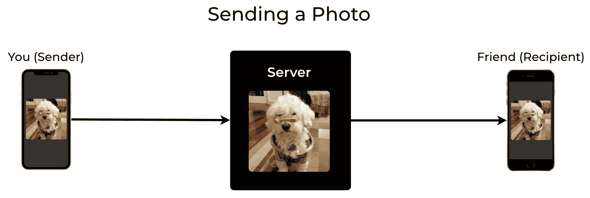
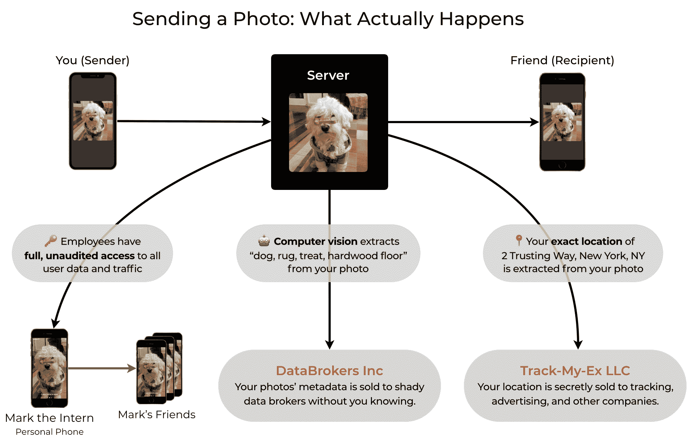
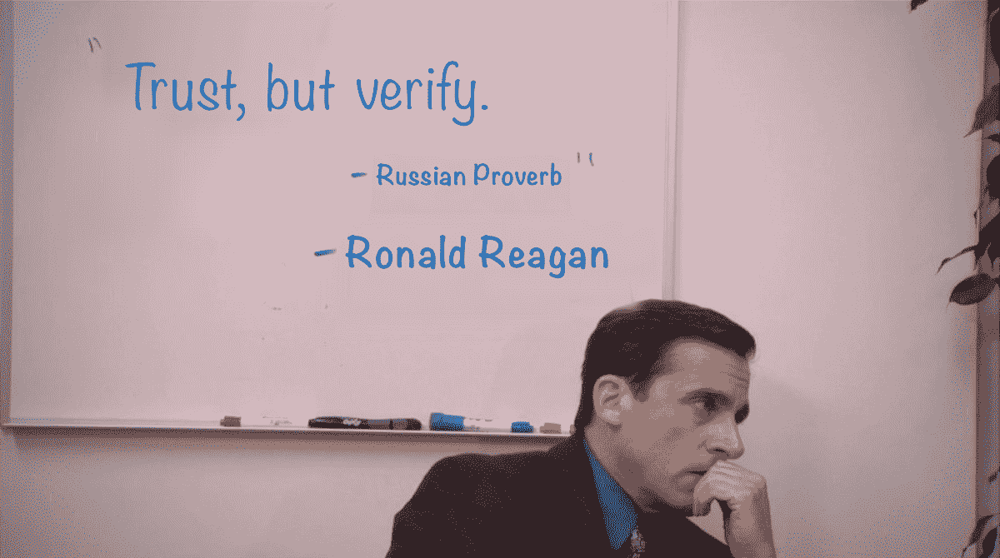
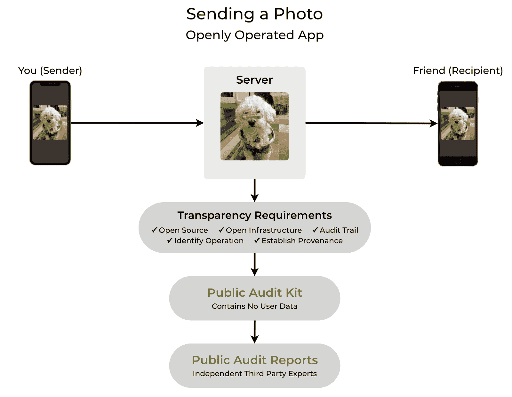
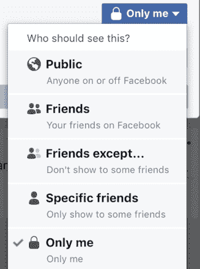

# 为什么你现在不能信任应用程序，以及如何解决这个问题

> 原文：<https://www.freecodecamp.org/news/why-you-cant-trust-apps-today-and-how-to-fix-it/>

## 亲爱的每一个技术公司，请窃取这个想法

当您向某人发送照片时，您的信息应用程序实际上会先将照片发送到应用程序的服务器，然后服务器会将照片发送给他们:

当然，在 90 年代，当互联网刚刚开始变大时，这可能已经发生了。但是沿着这条线的某个地方，有人想出了如何从用户数据中获利，所以现在这里是*实际上*发生的事情:

这只是发送一张照片。2019 年，你让应用程序访问你的相机、位置、麦克风、联系人、浏览习惯，甚至你的医疗记录。当你点击“允许”一次后，一个应用程序甚至可以在你睡觉时将你的整个照片和视频库上传到后台的服务器上。

互联网正在促成一场[疯狂的](https://theintercept.com/2017/04/24/stop-using-unroll-me-right-now-it-sold-your-data-to-uber/) [自由的](https://www.theverge.com/2018/4/24/17275994/yahoo-sec-fine-2014-data-breach-35-million) [争夺](https://www.forbes.com/sites/kashmirhill/2014/10/03/god-view-uber-allegedly-stalked-users-for-party-goers-viewing-pleasure/#75ddf2383141) [我们的](https://www.npr.org/sections/thetwo-way/2017/03/14/520123490/vibrator-maker-to-pay-millions-over-claims-it-secretly-tracked-use) [个人](https://www.reuters.com/article/us-facebook-privacy-firing/facebook-employee-fired-over-bragging-about-access-to-user-information-idUSKBN1I334E) [数据](https://www.clickondetroit.com/news/concerns-over-misuse-of-childrens-online-data-grow-as-apps-illegally-collect-sell-information)，潜在后果变得[更糟](https://www.nytimes.com/2018/03/04/technology/fake-videos-deepfakes.html)。应用程序甚至利用这些数据和[行为科学](https://www.ibtimes.com/how-uber-other-digital-platforms-could-trick-us-using-behavioral-science-unless-we-2791467)从用户身上榨取每[美元](https://clark.com/shopping-retail/mac-users-being-fed-pricier-hotel-searches/)或每[分钟](https://www.businessinsider.com/how-app-developers-keep-us-addicted-to-our-smartphones-2018-1)，而这显然[违背了](https://www.washingtonpost.com/news/monkey-cage/wp/2018/08/06/its-no-accident-that-facebook-is-so-addictive/?utm_term=.1058706f817b)[用户的最大利益](https://www.vox.com/the-goods/2018/10/30/18044678/kids-apps-gaming-manipulative-ads-ftc)。如今，公司有充分的动机利用我们的数据获利，却没有动机保护我们的隐私。

由于随着时间的推移，我们只会越来越依赖应用程序，所以关键问题是:

## 如何知道一个 app 是否可以信任？

### 通过隐私政策获得信任

当你问一家公司如何保护你的数据时，他们会告诉你阅读他们的隐私政策，这是一份他们写的(或[复制粘贴的](https://duckduckgo.com/?q=privacy+policy+generator))文件，承诺他们会保护你的数据。

但是等等，这不是循环逻辑吗？我应该相信他们在保护我的数据，因为…他们有一份文件说他们会保护我的数据？我如何知道他们在做隐私政策中声称的事情？

事实证明，不可能知道一家应用公司是否违反了他们的隐私政策(或违反了一般的隐私法规)，因为没有什么可以阻止他们:他们是隐私*政策*，而不是隐私*证据*。不仅如此，它们实际上并没有[的法律约束力](https://ir.lawnet.fordham.edu/iplj/vol27/iss1/5/)，而且在极少数情况下，当企业实际上*做*被抓的时候，[的](https://www.abine.com/blog/2012/facebook-privacy-violated-by-new-ads/) [处罚](https://www.theverge.com/2018/4/24/17275994/yahoo-sec-fine-2014-data-breach-35-million)[轻得令人难以置信](http://www.consumerwatchdog.org/blog/google-ruling-shows-need-do-not-track-and-strong-antitrust-action)。正如最近政府对数据泄露、互联网服务提供商隐私规则和网络中立 T21 的行动所显示的，通常根本没有惩罚。

隐私政策和法规不会产生真正的信任，它们只会提供一种虚假的安全感或隐私感。

### 通过定价获得信任

这是互联网上的一句俗语:“如果产品是免费的，那么你就是产品。”虽然这有时是正确的，因为收入必须来自某个地方，但有些人会犯[逻辑谬误](https://en.wikipedia.org/wiki/Denying_the_antecedent)认为反过来也是正确的:“如果产品不免费，那么你就不是产品。”

由于这个错误，一些人在选择应用程序时使用价格作为标准，通过寻找非免费的应用程序，并错误地假设非免费产品不会利用他们的数据来盈利。

当然，一家公司很有可能既向你收取应用费用，同时又从你的数据中获利或安全性差。因此，对于找到一个你可以信任的应用来说，定价是一个糟糕的标准。

### 通过美学的信任

哇，那些应用程序截图看起来太光滑了！而且他们的网站是如此的丰富多彩和有品味的设计，有着美丽的动画，你根本无法抗拒。为什么可爱的卡通熊会对你撒谎？这可能吗？

不幸的是，是的——卡通人物一直在撒谎。因为他们是由人类创造的，他们的对话是由人类写的，一只可爱的卡通熊不太可能利用你的个人数据来获利。虽然这样做看起来更可爱。

一个网站的美学可能会告诉你，他们花了 20 美元买了一个 SquareSpace 主题(或盗版)，但对一个应用程序或服务的可信度只字不提——甚至有可能该公司在数据安全上做手脚，以便在网站的设计和动画上花更多的钱。

### 受欢迎程度带来的信任

如果你所有的朋友都从数字桥上跳下来，你会吗？雅虎一度拥有超过 30 亿账户，2013 年，他们打破了世界纪录？有史以来最大的数据泄露，由一个非常长的镜头[。自那以后，其他公司数千万或数亿账户遭到破坏的情况越来越多。而且这些只是计算已披露和已知的违规行为——没人知道真正的数字是多少。](https://www.csoonline.com/article/2130877/the-biggest-data-breaches-of-the-21st-century.html)

流行度并不是一个应用程序可信度的可靠指标。事实上，甚至有诈骗应用进入了应用商店的[排行榜](https://medium.com/@johnnylin/how-to-make-80-000-per-month-on-the-apple-app-store-bdb943862e88?source=friends_link&sk=6880a1d40db8c1019257c7a417840d27)。

### 信任通过“4096 位军用超加密犀牛 HTTPS 橡胶滚轴？？？？？？？？?"

流行语很酷，但是——等等不，流行语很糟糕，而且极其不诚实。公司和营销人员经常使用[技术术语](https://en.wikipedia.org/wiki/Technobabble)或者故意误用和误用术语，以给人一种技术成熟和合法的印象。很多时候，如果你不明白某件事，要么是因为解释者在解释这件事上做得很糟糕，要么是因为解释者故意试图迷惑你让你屈服。无论是哪种情况，技术术语都会让你更加警惕，更加不信任解释者。

## 那么到底是什么创造了信任呢？

Source: [Wikipedia](https://en.wikipedia.org/wiki/Trust,_but_verify), Credit: [NBC](https://ew.com/tv/2019/04/23/michael-scott-paper-company-investigation/)

应用程序应该*赢得用户的信任*，尤其是当公司有如此强大的财务激励去撒谎和滥用用户数据的时候。

为了赢得用户的信任，应用程序应该完全透明——公众应该能够看到应用程序及其服务器正在做的一切，这样任何人都可以验证没有疏忽、不诚实甚至恶意的活动。换句话说:通过透明获得信任。

## 通过透明获得信任

完全透明意味着将一个应用的整个操作公开并可验证，从你手机或电脑上的应用代码，到云上的服务器代码和基础设施，到公司员工的行动，*加上*就是所有这些的证明。是*的一切*触动了你的数据。一切。

如果从我们每天使用的应用程序中获得完全和可验证的透明度似乎是一个激进的想法，那是因为我们长期以来一直被训练对公司的期望很低。我们被训练上传我们的个人数据，祈祷好运，并简单地希望一切都好。事实是，如果我们向公司提供我们最敏感的个人信息，为什么我们不应该期待他们给我们证据来证明他们到底在做什么？

### 透明度的标准

需要明确的是，*部分*透明是不充分的，也是误导性的，因为它仍然允许隐藏“坏的比特”，违背了透明的目的。例如，一个只隐藏了一小部分服务器代码的公司仍然能够秘密地将所有用户数据从他们的服务器复制到未知的第三方。

那么，我们如何知道一个应用程序是完全透明的，还是部分透明或完全不透明的呢？

完全透明的标准现在还不存在，所以我们正在创建一个并免费提供。

这个新标准叫做 [**开放操作**](https://openlyoperated.org/) ，因为全透明要求一个 app 的整个*操作*都是*开放*且可验证的。这包括公开所有应用源代码、服务器代码、基础设施和员工行动，以及提供准确性和有效性的证明。这就像给了公众对应用程序运营商的管理控制台的只读访问权限(例如这里的)。

这与当今的应用程序有何不同？这是从头开始的照片发送示例——除了这一次，该应用程序是公开操作的:

与之前的例子不同，公开操作的[认证过程](https://openlyoperated.org/how-to)迫使应用程序完全和可验证地透明，防止应用程序的运营商隐藏隐私和安全问题。这个过程在高层次上是:

1.  该应用满足特定的 [**要求**](https://openlyoperated.org/how-to#fulfill-requirements) 以展示完全透明，并使用对[源代码](https://openlyoperated.org/how-to#open-source)、[基础设施](https://openlyoperated.org/how-to#open-infrastructure)和其他证据[的直接引用来证明该应用的隐私或安全声明](https://openlyoperated.org/how-to#claims-with-proof)。
2.  将这些要求和索赔证明组合成一个公开操作的 [**审计工具包**](https://openlyoperated.org/how-to#assemble-audit-kit) ，任何人都可以公开查看和验证。
3.  与独立的[审计员](https://openlyoperated.org/auditors)进行匹配，他们对审计工具包进行验证，以生成公开操作的 [**审计报告**](https://openlyoperated.org/reports)**详述他们的验证并提供摘要。**

**这让每个人都参与到“通过透明获得信任”中来:技术水平较高的用户可以通过深入审计工具包中的具体细节来自己执行验证，而技术水平较低的用户可以阅读独立的审计报告和摘要。Openly Operated 的透明度与现状相反，应用程序只是告诉用户阅读他们完全未经证实和验证的隐私政策。**

**[公开运营](https://openlyoperated.org/)是免费认证。[我们的使命](https://openlyoperated.org/about-us)是让所有应用程序通过透明赢得信任，因此所有[文档](https://openlyoperated.org/how-to)都是免费提供的，公司无需支付任何费用来获得认证许可。我们甚至[构建了例子](https://openlyoperated.org/reports)来表明开放操作的应用是可能的。这些不仅仅是概念验证——它们已经投入生产，功能齐全，并在真实用户中大规模运行。**

## **一切都应该公开操作**

**长期以来，公司在如何处理和保护用户数据方面一直公然不诚实。从创建到现在，脸书已经为贴有“只有我”标签的用户墙帖子设置了隐私。对任何普通人来说，“只有我”有一个简单的意思:一个人，他们自己，实际上没有其他人。**

**但是在过去的十年里，我们艰难地认识到脸书对“只有我”有着非常不同的定义。对脸书来说，“只有我”是指“我和[所有的](https://www.cbsnews.com/news/facebook-your-personal-info-for-sale/) [的](http://content.time.com/time/nation/article/0,8599,1532225,00.html) [的广告主](http://fortune.com/2017/10/27/facebook-russian-election-ads/)和[他们的](https://www.bloomberg.com/news/articles/2018-04-04/facebook-scans-what-you-send-to-other-people-on-messenger-app) [合作伙伴](https://www.axios.com/facebook-whatsapp-targeted-ads-user-privacy-c1e18e9b-ed76-4954-ab74-a64a88647e8c.html)和部分[脸书的](http://fortune.com/2018/04/03/facebook-videos-delete-personal-data/)[25000 名](https://motherboard.vice.com/en_us/article/bjp9zv/facebook-employees-look-at-user-data) [员工](https://thehackernews.com/2015/02/facebook-acccount-password.html)和部分[未知数量的](https://www.theverge.com/2019/5/6/18530887/facebook-instagram-ai-data-labeling-annotation-private-posts-outsourced) [承包商](https://www.reuters.com/article/us-facebook-privacy-firing/facebook-employee-fired-over-bragging-about-access-to-user-information-idUSKBN1I334E)和[脸书朋友](https://www.rappler.com/technology/news/200508-cambridge-analytica-other-facebook-quiz-apps-brittany-kaiser)或[我用过的](https://www.cnbc.com/2018/04/08/cubeyou-cambridge-like-app-collected-data-on-millions-from-facebook.html)**

**

Probably need a smaller font to fit the truth here.** 

**隐私和安全丑闻每周都会发生，这不是因为公司是邪恶的，而是因为像其他任何事情一样，公司是靠激励运作的。在一个无法验证应用程序的安全性或隐私声明的世界里，为什么一个公司应该诚实并赚更少的钱，而他们的竞争对手却不诚实并赚更多的钱？当前的激励措施让不诚实和不安全的公司获得了优势，可以更快地发展，更有效地竞争，在营销上投入更多，并获得最多的客户。**

**公开运营为公司提供了一种结构化的方式来证明他们的隐私和安全声明。通过要求向其提供个人数据的应用程序透明，用户不会有任何损失，反而会有所收获。问题不应该是“为什么我使用的应用应该是透明的？”—应该是“为什么我使用的*应用程序*不是透明的？他们在隐瞒什么？”**

### **你能做什么**

**这是 Openly Operated 的官方发布公告。如果你认为完全的、可验证的透明度标准很重要，以下是帮助你的方法:**

1.  **与你的朋友和家人分享这个故事。许多人仍然停留在旧的思维方式中，认为隐私政策、审美或受欢迎程度是信任的有用指标。向他们展示完全透明才是真正重要的，而且这实际上是可能的。**
2.  **订阅公开运营的[简讯](https://openlyoperated.org/blog)接收每月更新。你的电子邮件地址是保密的，绝不会与第三方共享——参见 OpenlyOperated.org 的[审计工具包](https://openlyoperated.org/report/openlyoperated)和[审计报告](https://openlyoperated.org/report/openlyoperated#audit-reports)中的[证据](https://openlyoperated.org/report/openlyoperated#email-address-privacy)。**
3.  **在 OpenlyOperated.org 了解更多信息。无论你的专业技术水平如何，总有适合你的东西，无论你是对透明的[诸多好处](https://openlyoperated.org/user-benefits)好奇的用户，还是构建人们可以信任的应用的工程师[，还是希望在增强安全性的同时](https://openlyoperated.org/how-to)[赢得客户的公司](https://openlyoperated.org/for-companies)。**

**—**

**我们是林剑衡和拉胡尔·万德，自由透明认证[的联合创始人。我们希望回答你的问题，阅读你的评论——给我们发电子邮件到 hi@openlyoperated.org 的](https://openlyoperated.org/)，或者通过[电报](https://t.me/openlyoperated)找到我们。**

**这篇文章最初出现在公开运营的博客[这里](https://openlyoperated.org/blog)。**