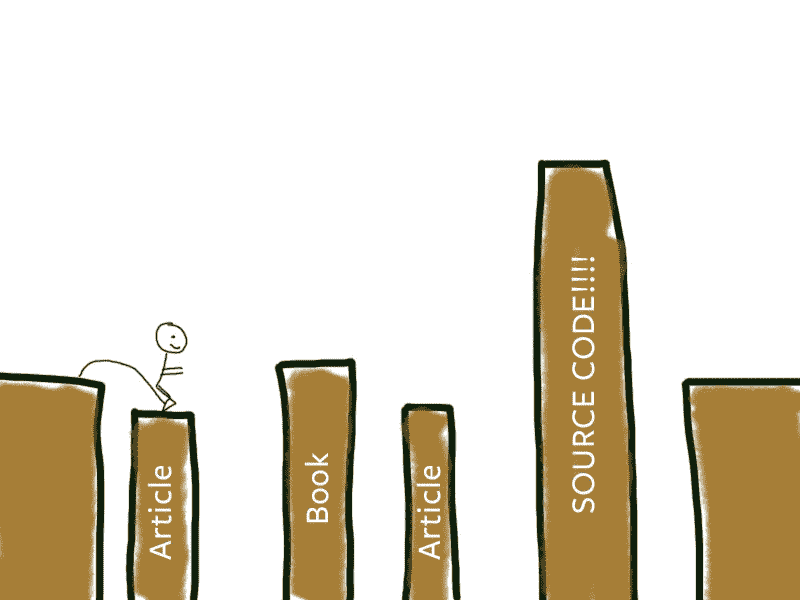
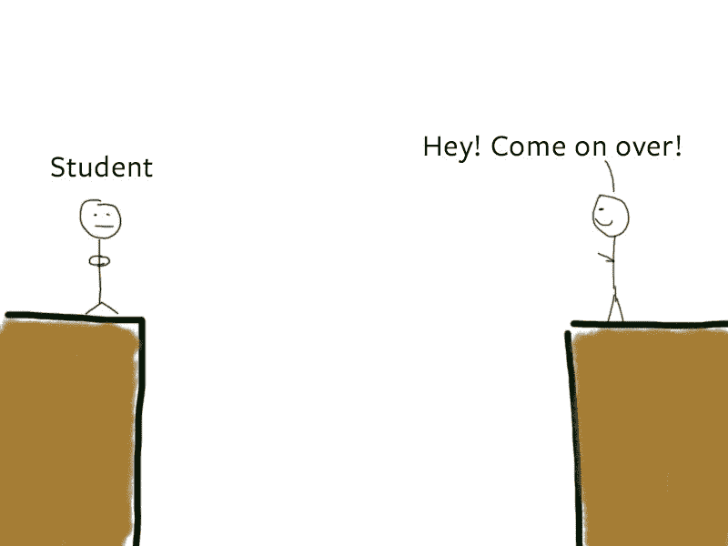
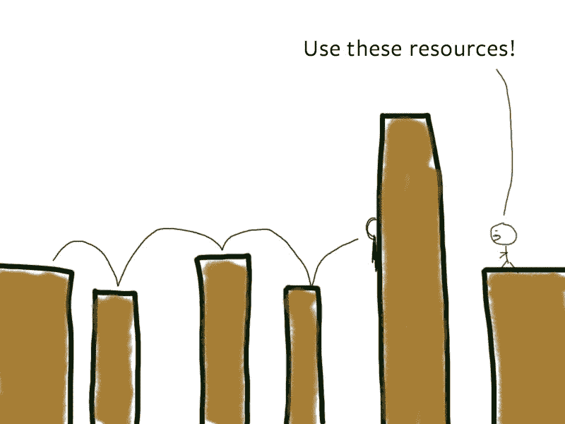
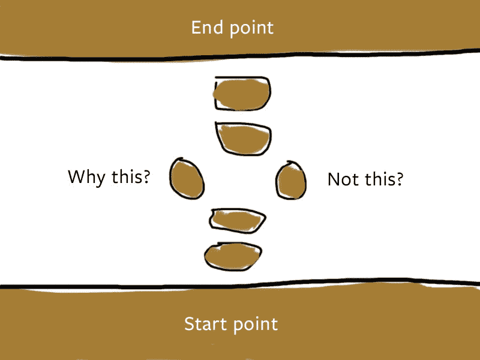
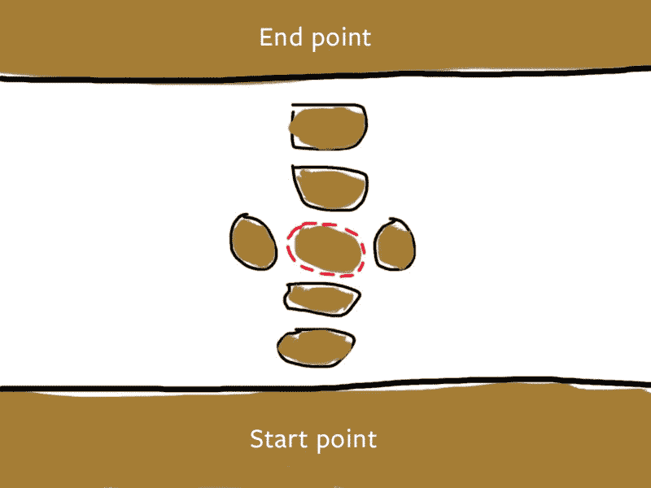
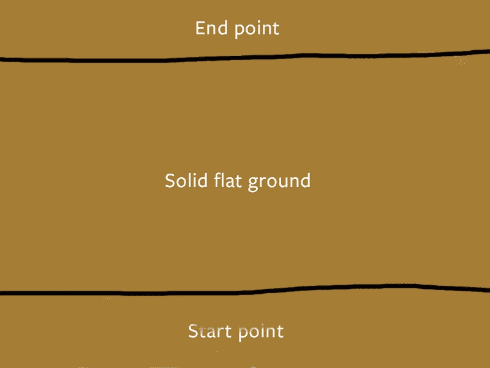
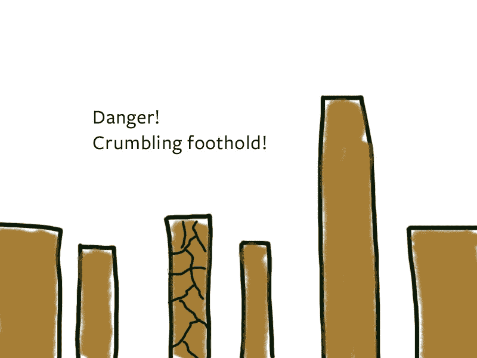
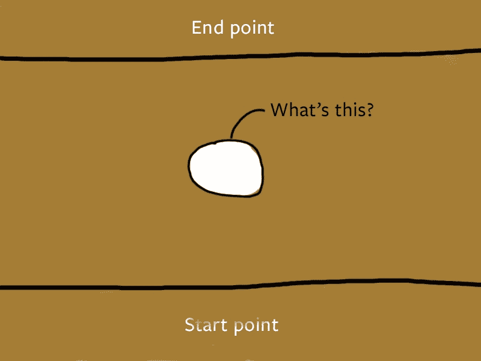

# 为什么你在教学中学习

> 原文：<https://www.freecodecamp.org/news/why-you-learn-when-you-teach-d722e9b95902/>

作者 Zell Liew

# 为什么你在教学中学习

Photo by [NESA by Makers](https://unsplash.com/photos/BVr3XaBiWLU?utm_source=unsplash&utm_medium=referral&utm_content=creditCopyText) on [Unsplash](https://unsplash.com/search/photos/teach?utm_source=unsplash&utm_medium=referral&utm_content=creditCopyText)

最好的学习方法是教书。

你听过很多人这么说。但这是真的吗？

我知道教书有好处。比如你教书，人们就会知道你的存在。人们也许可以从你的经历中学习。但是学？我持怀疑态度。

但我意识到这句话是真的。你教书的时候学得最好。在教了多年前端开发之后，我可以担保这一点。

这篇文章解释了我对为什么教别人有助于你学习的想法。

要理解为什么教有助于你学习，我们首先要谈谈学习。没学过的东西是教不出来的。

### 学习过程

假设你想学 JavaScript。你只知道你在悬崖的一边。终点在悬崖的另一边。

你还不知道如何跨越鸿沟。

当我试图学习 JavaScript 时，我阅读了无数的书籍和教程。我甚至查看源代码，看看人们是如何编码的。我还搜索了最佳实践。

我遇到的每一点材料都是我到达彼岸的小小立足点。有些材料很容易理解。其他的很难。

有时立足点相距太远。我错过了我的脚步，我掉进了山谷，我又试了一次。

有时我会碰壁。我看不懂我读的文章。我掉进了山谷，我又试了一次。

在尝试了足够多(失去了足够多的生命)之后，我锻炼了腿部肌肉。我可以比以前跳得更远更高。我把看不懂的文章又试了一遍。

有时我成功地度过了我停滞不前的阶段。

我到了另一边。

才意识到还有更多要走…

不过没关系。总是有更多的路要走。这就是学习的乐趣所在。

### 教学帮助你获得洞察力

直到开始教 JavaScript，我才知道自己走了多远。我以为我知道的很少。无论如何还不足以成为“专家”。

但事实证明我知道很多。足以甚至制作一个关于 JavaScript 的[超级综合课程。](https://learnjavascript.today/)

所以这是教书的一个附带好处。

当你学习时，你专注于从一个悬崖移动到另一个悬崖。你不知道自己走了多远，因为你没有停下来思考。

但是当你教书的时候，你就停止了。

你停下来，回顾过去，意识到自己走了多远。你获得了视角，这种视角让你对自己的能力充满信心。

你知道的比你想象的要多。

### 教学过程

当你教书的时候，你试图帮助别人越过你越过的悬崖。

教导的一个方法是引导人们找到你所经历的资源。他们可能会面临和你一样的困难。他们会碰壁，他们会错过他们的脚步。希望他们能获得足够的力量自己越过障碍。

但这不是教学。这仅仅是…让人们看到你所使用的资源。你可以帮助缩短他们的学习曲线，但你不是在教学。还没有。

**为了教书，你倒退着走。你站在学生的旁边，帮助他们通过间隙。**

你可以在等待他们提问的时候给他们指一个教程。迟早，他们会问一些让你吃惊的问题，比如“为什么是这个而不是那个？”

有时候，一种方式比另一种方式更好。有时候，两种方式都有可能。你知道还有另一条路可以穿过悬崖。

有时候，你会想到一个更好的例子来帮助他们更容易地跨越鸿沟。当你这样做时，你为自己建立了另一个立足点。

这就是为什么你在教学中学习——你建立了更多的立足点。

也许有一天，当你回答了足够多的问题时，你会建立如此多的立足点，以至于你会填补这个空白。

那是你的知识坚如磐石的时候。

再也不需要立足点了。你可以直接走过去。你教的学生也可以走过去。

### 你能教谁？

你不需要成为专家来教。你可以教任何想越过你所越过的悬崖的人。

最好是马上帮忙，因为你知道过了悬崖是什么感觉。你知道学生需要注意的危险点。

有时人们会问你问题，你会说，“我不知道”。

没关系。你可能还不能填补所有的空白。但现在你知道你少了一块。你可以通过做更多的研究来填补它。

有时候你不能马上填补空白。你不知道的事情太多了。

那也可以。当你前进到另一个悬崖时，也许你会找到你需要的那块石头。它会很明显。

当你看到它的时候，你可以回去把它装满。

这是你在教学时学习的另一个原因——你会发现你的知识有差距。

### 想更好地学习教学？

有些开发人员不擅长教学。他们会把资源扔给你，让你自己想办法解决。其他人用你很难理解的外星语言交谈。

不要责怪他们。他们已经尽力了。也许他们对教学不感兴趣。这没关系。

但是如果你想的话，你可以教得很好。

写了几年教程，我对教学略知一二。我想和你分享更多这些事情。

你会感兴趣吗？如果是的话，我想听听:

1.  你为什么想教书
2.  你教书的最大障碍是什么

迫不及待地想在下面的评论中听到你的消息:)

感谢阅读。这篇文章对你有什么帮助吗？如果我有，[我希望你考虑分享它](http://twitter.com/share?text=Why%20you%20learn%20when%20you%20teach%20by%20@zellwk%20?%20&url=https://zellwk.com/blog/why-you-learn-when-you-teach/&hashtags=)；在阅读这篇文章之前，你可能只是帮助了和你有同样感受的人。谢谢你。

*最初发表于[zellwk.com](https://zellwk.com/blog/why-you-learn-when-you-teach/)。*