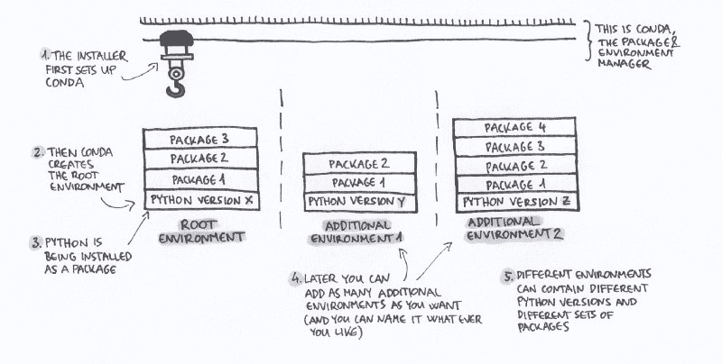
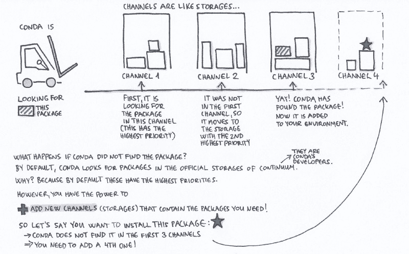
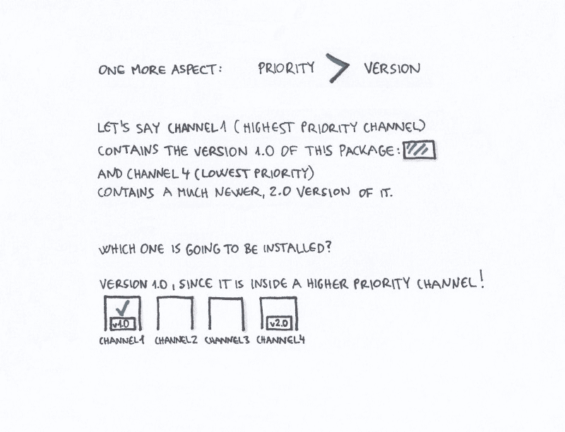

# 为什么需要 Python 环境以及如何用 Conda 管理它们

> 原文：<https://www.freecodecamp.org/news/why-you-need-python-environments-and-how-to-manage-them-with-conda-85f155f4353c/>

作为一名开发人员，我有超过二十年的专业经验，我知道各种各样的框架和编程语言，其中我最喜欢的是 Python。我教它已经有一段时间了，根据我的经验，**建立 Python 环境**是一个**具有挑战性的话题**。

因此，我写这篇文章的主要动机是帮助当前和潜在的 Python 用户对如何管理这样的环境有一个**更好的理解**。

如果您已经打开了这篇文章，那么您可能已经知道 Python 是什么，为什么它是一个伟大的工具，并且您甚至已经在您的计算机上安装了 Python。

那么**你到底为什么需要 Python 环境**？你可能会问:我不应该只安装最新的 Python 版本吗？

### 为什么需要多个 Python 环境

当你开始学习 Python 的时候，用你需要的或者想玩的最新版本的包来安装最新的 Python 版本是一个很好的起点。然后，最有可能的是，你沉浸在这个世界中，从 [GitHub](https://github.com/search?l=Python&q=python&type=Repositories&utf8=%E2%9C%93) 、 [Kaggle](https://www.kaggle.com/) 或其他来源下载 Python 应用程序。这些应用程序可能需要其他版本的 Python/包，而不是您当前使用的版本。

这种情况下，你需要设置不同的所谓**环境**。

除了这种情况之外，还有更多其他环境可能会派上用场的用例:

*   你有一个**应用程序**(由你自己或其他人开发的)**曾经出色地运行过**。但是现在你试着运行它，它不起作用。也许其中一个包不再与你程序的其他部分兼容(由于所谓的**突破性变化**)。一个可能的解决方案是为您的应用程序设置一个新的环境，其中包含 Python 版本和与您的应用程序完全兼容的包。
*   您正在**与其他人**协作，并且您想要确保您的应用程序在您团队成员的计算机上运行，反之亦然，因此您也可以为您同事的应用程序设置一个环境。
*   您正在**向您的客户**交付一个应用程序，同样，您希望确保它在您客户的计算机上能够顺利运行。

一个环境由某个 Python 版本和一些包组成。因此，如果您想要**开发或使用具有不同 Python 或包版本需求**的应用程序，您需要设置不同的环境。

既然我们已经讨论了环境为什么有用，那就让我们深入讨论一下管理环境的一些最重要的方面。

### 包和环境经理

设置环境的两个最流行的工具是:

*   [**PIP**](https://pip.pypa.io/en/stable/) (一个 Python 包管理器；有趣的是，它用 [**virtualenv**](https://virtualenv.pypa.io/en/stable/) (创建隔离环境的工具)代表“Pip 安装包”)
*   **康达**(一名包装和环境经理)

在本文中，我将介绍如何使用 **Conda** 。我更喜欢它，因为:

1.  **结构清晰**:很容易理解它的目录结构
2.  **透明文件管理**:不安装目录外的文件
3.  灵活性:它包含许多包(PIP 包也可以安装到 Conda 环境中)
4.  **多用途**:它不仅用于管理 Python 环境和包，还可以用于 R(一种用于统计计算的编程语言)

在撰写本文时，我使用的是 Conda 的 4.3.x 版本，但也有新的 4.4.x 版本。

就 Conda 4.4 而言，最近有一些影响 Linux/Mac OS X 用户的变化。在这个[变更日志条目](https://github.com/conda/conda/blob/master/CHANGELOG.md#recommended-change-to-enable-conda-in-your-shell)中描述了它们。

### 如何选择合适的康达下载选项

**安装 Conda 系统**比从 Unsplash 下载一张好看的图片或者买一本新的电子书要复杂一些。这是为什么呢？

#### 1.安装程序

目前，有三种不同的安装程序:

*   蟒蛇(免费)
*   [迷你康达](https://conda.io/miniconda.html)(免费)
*   Anaconda Enterprise platform (这是一个商业产品，允许组织在企业环境中应用 Python 和 R)

让我们仔细看看免费工具， **Anaconda** 和 **Miniconda** 。这两者的主要区别是什么？

他们有哪些共同之处？它们都是在你的电脑上安装的

*   **康达**(包&环境管理系统)和
*   所谓的**【根环境】**(稍后再详述)。

至于主要的区别， **Miniconda** 需要大约 400MB 的磁盘空间，它只包含几个基本包。

Anaconda 安装程序需要大约 3GB 的磁盘空间，它安装了超过 150 个科学软件包(例如，用于统计和机器学习的软件包)。它还设置了 Anaconda Navigator，这是一个 GUI 工具，可以帮助您管理 conda 环境和包。

**我更喜欢 Miniconda，**因为我从未使用过 Anaconda 默认包含的大多数包。另一个原因是，应用 Miniconda 允许更平滑地复制环境(例如，如果我想在不同的计算机上使用它)，因为我只在两台计算机上安装我的应用程序所需的软件包。

从现在开始，我将描述 Miniconda 是如何工作的(在使用 Anaconda 的情况下，过程几乎是相同的)。

#### 2–3.平台(操作系统和位数)

除了这 3 种不同的安装程序，还有基于位数的子类型: **32 位和 64 位**安装程序。当然，这些也有不同操作系统的子类型: **Windows、Linux 和 Mac OS X** (除了 Mac OS X 版本只有 64 位)。

在本文中，我将重点放在 Windows 版本上(Linux 和 Mac OS X 版本只是略有不同。例如，安装文件夹的路径和一些命令行命令不同)。

**那么 32 位还是 64 位？**

如果您有 4GB 或更大内存的 64 位操作系统(OS ),您应该安装 64 位版本。此外，如果您计划应用的包需要 64 位版本的 Python，您可能需要 64 位安装程序。例如，如果你想使用 tensor flow——更准确地说，是官方所谓的二进制文件——你需要一个 64 位的操作系统和 Python 版本。

如果您有 32 位操作系统，或者您计划使用只有 32 位版本的软件包，那么 32 位版本是您的最佳选择。

#### 4.Python 版本(用于根环境)

如果这三个维度还不够(安装程序、32/64 位和操作系统)，还有第四个维度基于**不同的 Python 版本**(包含在安装程序中，因此包含在根环境中)！

所以让我们来谈谈不同的可用 Python 版本。

目前，对于根环境中的 Python，您的选择是**版本 2.7** 或**版本 3.x** (在撰写本文时，是 3.6)。对于附加的环境，您可以选择任何版本——最终，这就是为什么您首先要创建环境的原因:在不同的环境和版本之间轻松切换。

**那么 2.7 或者 3.x 版本 Python 适合我的根环境？**

让我来帮你快速决定:

由于 **3.x 是更新的**，这应该是你的默认选择。(2.7 版本是遗留版本，发布于 2010 年，不会有更新的 2.7 主要版本，只有修复。)

然而，如果

*   你大部分都是 2.7 版本的代码(你使用 2.7 版本开发或使用应用程序)
*   你需要使用没有 Python 3.x 版本的**包，**

您应该安装一个基于 Python 2.7 的根环境。

你可能会问:**为什么我不基于这两个 2.7 和 3.x 版本创建两个环境呢？很高兴你问了这个问题。原因是您的根环境是在安装过程中创建的，默认情况下它是**激活的**。**

我将在下面的一节中解释如何激活一个环境，但基本上这意味着根环境是更容易访问的一个，所以**仔细选择您的根环境**将使您的工作流更有效。

在整个安装过程中，Miniconda 会让您更改一些默认设置的**选项**(例如，您可以选中/取消选中一些复选框)。当您第一次安装 Conda 时，我建议您保持这些选项不变(除了安装目录的路径)。


Choosing an appropriate installer for Conda

这里我想再提一件事。虽然您可以在同一台计算机上同时拥有多个包含不同版本 Python 的环境，但是您不能使用同一个 Conda 管理系统来设置 **32 位和 64 位环境**。将它们以某种方式混合在一起是有可能的，但是这并不容易，所以我将为这个主题专门写一篇文章。

### Python 环境:根和附加

现在你已经为自己选择了一个合适的安装程序，干得好！现在让我们看看不同类型的环境以及它们是如何创建的。

Miniconda 为你设置了两个东西: **Conda** 和**根环境。**

这个过程看起来是这样的:安装程序首先安装 Conda，正如我已经提到的，它是包和环境管理工具。然后，Conda 创建**一个根环境，它包含两个东西:**

*   某个版本的 Python 和
*   一些基本的包装。

在根环境旁边，您可以根据需要创建任意数量的附加环境。关键是这些额外的环境**可以包含不同版本的 Pythons 和其他包**。因此，这意味着，例如，如果您宝贵的小应用程序在您刚刚设置的最新、最先进的环境中不再工作，您可以随时“返回”并使用一些包的另一个版本(包括 Python——Python 本身就是一个包，稍后会详细介绍)。

正如我在文章开头所总结的，应用附加环境的主要用例是:

*   您**开发具有不同 Python 或包版本需求的应用程序**
*   您**使用具有不同 Python 或包版本需求的应用程序**
*   你**与其他开发者合作**
*   您为客户端创建 Python 应用程序

**

Root and additional environments** 

**在深入环境管理的基础知识之前，让我们来看看您的 Conda 系统的目录结构。**

### **目录结构**

**正如我上面提到的，Conda 系统安装在一个目录中。在我的例子中，这个目录是:`D:\Miniconda3-64\`。它包含根环境和两个重要的目录(其他目录现在不相关):**

*   **`\pkgs`(包含压缩和未压缩格式的缓存包)**
*   **`\envs`(它包含环境——除了根环境——在单独的子目录中)**

**Conda 环境中最重要的**可执行文件和目录**(位于`\envs\environmentname`目录中)有:**

*   **`\python.exe` —用于命令行应用程序的 Python 可执行文件。例如，如果你在`Example App`的目录中，你可以通过`python.exe exampleapp.py`来执行它**
*   **`\pythonw.exe` —用于 GUI 应用程序或完全无 UI 应用程序的 Python 可执行文件**
*   **`\Scripts` —作为已安装软件包一部分的可执行文件。在激活环境时，该目录被添加到系统路径中，因此可执行文件在没有完整路径的情况下变得可用**
*   **`\Scripts\activate.exe` —激活环境**

**如果你已经安装了 Jupyter，这也是一个重要的文件:**

*   **`\Scripts\jupyter-notebook.exe` — Jupyter 笔记本启动器(`jupyter`套装的一部分)。简而言之，Jupyter Notebook 创建了所谓的包含可执行部分(例如 Python)和人类可读部分的笔记本文档。需要另一篇文章来更详细地研究它。**

**所以现在您应该已经在您的计算机上成功安装了至少一个 Python 环境。但是你如何开始利用它呢？让我们仔细看看。**

### **GUI 与命令行(终端)**

**正如我上面提到的，Anaconda 安装程序还安装了一个名为 Anaconda Navigator 的图形用户界面(GUI)工具。我还指出，我更喜欢使用 Miniconda，它不会为您安装 GUI，所以您需要使用基于文本的界面(例如命令行工具或终端)。**

**在本文中，我将重点关注**命令行工具** (Windows)。虽然我只关注 Windows 版本，但是这些例子也适用于 Linux 和 Mac OS X，只是安装文件夹的路径和一些命令行命令不同。**

****要打开命令行**，在 Windows 的开始菜单中选择“Anaconda 32 位”或“Anaconda 64 位”(取决于您的安装)，然后选择“Anaconda 提示符”。**

**我建议通读官方的 [**Conda 备忘单**](https://conda.io/docs/_downloads/conda-cheatsheet.pdf) (pdf)，因为它也包含了 Windows 和 Mac OS X/Linux 之间的命令差异。**

**在接下来的章节中，我将给出一些基本命令的**示例，并指出它们的结果。希望这些能帮助您更好地管理您的新环境。****

### **管理环境**

#### **添加新环境**

**创建一个名为`mynewenv`(您可以随意命名)的新环境，它包括 Python 版本 3.4。，运行:**

```
`conda create --name mynewenv python=3.4`
```

**您可以通过使用我在下一节中描述的包管理命令来更改环境的 Python 版本。**

#### **激活和退出(停用)环境**

**在一个新的 Conda 安装中，默认情况下根环境是激活的，所以您可以不激活就使用它。**

**在其他情况下，如果您想要使用一个环境(例如管理包，或者在其中运行 Python 脚本)，您需要首先`**activate**`它。**

**下面是激活过程的**逐步指南**:**

**首先，打开命令行(或者 Linux/Mac OS X 上的终端)。要激活`mynewenv`环境，根据您的操作系统使用以下命令:**

*   **在 Windows 上:**

```
`activate mynewenv`
```

*   **在 Linux 或 Mac OS X 上:**

```
`source activate mynewenv`
```

**环境激活后， ****命令提示符会改变**** 。例如，它变成了`(mynewenv) C:\>` 或`(root) D:\>`，因此作为激活的结果，它现在包含了活动环境的名称。**

**活动环境的**可执行文件的目录被添加到系统路径**(这意味着您现在可以更容易地访问它们)。您可以使用以下命令离开环境:**

```
`deactivate`
```

**在 Linux 或 Mac OS X 上，使用下面这个:**

```
`source deactivate`
```

**根据 Conda 的官方文档，在 Windows 中，在激活一个环境之前先停用另一个环境是一个很好的做法。**

**需要提到的是，在停用环境时，根环境会自动激活。**

**要**列出 Conda 安装中的可用环境**,运行:**

```
`conda env list` 
```

**示例结果:**

```
`# conda environments:#mynewenv                 D:\Miniconda\envs\mynewenvtensorflow-cpu           D:\Miniconda\envs\tensorflow-cpuroot                  *  D:\Miniconda`
```

**由于这个命令，您可以列出您的所有环境(根环境和所有附加环境)。**活动**环境标有**星号**(在每个给定时刻，只能有一个活动环境)。**

#### **你如何学习你的康达版本？**

**检查**您使用的是什么版本的 Conda】，以及您的环境的其他参数是什么，这是非常有用的。下面我将向你展示如何轻松地列出这些信息。****

**要**获得当前活动环境的 Conda 版本**，运行以下命令:**

```
`conda --version`
```

**示例结果:**

```
`conda 4.3.33`
```

**例如，要获得关于环境的信息的**详细列表:****

*   **康达版，**
*   **平台(操作系统和位数— 32 位或 64 位)，**
*   **Python 版本，**
*   **环境目录，**

**运行以下命令:**

```
`conda info`
```

**示例结果:**

```
`Current conda install:`
```

```
`Current conda install:

platform : win-64
          conda version : 4.3.33
       conda is private : False
      conda-env version : 4.3.33
    conda-build version : not installed
         python version : 3.6.3.final.0
       requests version : 2.18.4
       root environment : D:\Miniconda  (writable)
    default environment : D:\Miniconda\envs\tensorflow-cpu
       envs directories : D:\Miniconda\envs
                          C:\Users\sg\AppData\Local\conda\conda\envs
                          C:\Users\sg\.conda\envs
          package cache : D:\Miniconda\pkgs
                          C:\Users\sg\AppData\Local\conda\conda\pkgs
           channel URLs : https://repo.continuum.io/pkgs/main/win-64
                          https://repo.continuum.io/pkgs/main/noarch
                          https://repo.continuum.io/pkgs/free/win-64
                          https://repo.continuum.io/pkgs/free/noarch
                          https://repo.continuum.io/pkgs/r/win-64
                          https://repo.continuum.io/pkgs/r/noarch
                          https://repo.continuum.io/pkgs/pro/win-64
                          https://repo.continuum.io/pkgs/pro/noarch
            config file : C:\Users\sg\.condarc
             netrc file : None
           offline mode : False
             user-agent : conda/4.3.33 requests/2.18.4 CPython/3.6.3 Windows/10 Windows/10.0.15063    
          administrator : False`
```

**现在，您已经了解了一些管理环境的基本命令。让我们看一下如何在环境中管理包。**

### **管理包**

**根据您选择的安装程序，您将从一些基本的(在使用 Miniconda 的情况下)或许多(在使用 Anaconda 的情况下)包开始。但是如果你需要**

*   **一个**新包**或**
*   **已经安装的软件包的另一个版本？**

**conda——您的环境和软件包管理工具——将助您一臂之力。让我们更详细地看看这个。**

#### **包装渠道**

****通道是仓库的位置**(在图中我称之为仓库)**，Conda 在那里寻找包裹**。在 Conda 安装时，Continuum(Conda 的开发者)的频道是默认设置的，因此无需任何进一步的修改，这些是您的 Conda 将开始搜索软件包的位置。**

****频道以层级顺序存在**。具有最高优先级的信道是 Conda 检查的第一个信道，寻找您要求的包。您可以更改这个顺序，也可以向其中添加频道(并设置它们的优先级)。**

**将频道添加到频道列表中作为最低优先级项目的**是一个**好习惯。这样，您可以包含不属于默认设置的“特殊”包(~Continuum 的频道)。结果，你将得到所有的默认包——没有被低优先级通道覆盖的风险——和你需要的“特殊”包。******

**

This is how channels work** 

**要安装在这些默认频道中找不到的某个包，可以在这个[网站](https://anaconda.org/anaconda/repo) 上搜索那个**“特殊”包。并非所有的软件包在所有的平台上都可用(=操作系统&位计数，例如 64 位 Windows)，但是，您可以**将您的搜索**缩小到特定的平台。如果您找到一个包含您要查找的包的频道，您可以将其添加到您的频道列表中。****

**为了给**添加一个具有最低优先级**的**通道**(例如命名为`newchannel`)，运行:**

```
`conda config --append channels newchannel`
```

**要添加一个具有最高优先级的**通道(名为`newchannel`，运行:****

```
`conda config --prepend channels newchannel`
```

**需要提到的是，在实践中，你最有可能设置最低优先级的通道。对于初学者来说，添加具有最高优先级的通道是一种边缘情况。**

**要**列出活动通道及其优先级**，使用以下命令:**

```
`conda config --get channels`
```

**示例结果:**

```
`--add channels 'conda-forge'   # lowest priority
--add channels 'rdonnelly'
--add channels 'defaults'   # highest priority`
```

**还有一个方面我想在这里总结一下。如果**多个通道包含一个包**，并且一个通道包含一个比另一个新的版本，通道的层次顺序决定了这两个版本中的哪一个将被安装，即使较高优先级的通道包含旧版本。**

**

The version inside the higher priority channel is going to be installed** 

#### **搜索、安装和删除软件包**

**要列出当前活动环境中所有的**安装包**，运行:**

```
`conda list`
```

**该命令会产生匹配的软件包名称、版本和通道列表:**

```
`# packages in environment at D:\Miniconda:
#
asn1crypto                0.22.0           py36h8e79faa_1  
bleach                    1.5.0                     <pip>
ca-certificates           2017.08.26           h94faf87_0

...

wheel                     0.29.0           py36h6ce6cde_1  
win_inet_pton             1.0.1            py36he67d7fd_1  
wincertstore              0.2              py36h7fe50ca_0  
yaml                      0.1.7            vc14hb31d195_1  [vc14]`
```

**要**搜索**某个包的所有**可用版本，可以使用`search`命令。例如，要列出所有版本的`seaborn`包(它是一个数据可视化工具)，运行:****

```
`conda search -f seaborn`
```

**类似于`conda list`命令，这个命令产生一个匹配的包名、版本和通道的列表:**

```
`Fetching package metadata .................
seaborn           0.7.1                    py27_0  conda-forge     
                  0.7.1                    py34_0  conda-forge     
                  0.7.1                    py35_0  conda-forge

...

                  0.8.1            py27hab56d54_0  defaults        
                  0.8.1            py35hc73483e_0  defaults        
                  0.8.1            py36h9b69545_0  defaults`
```

**要**安装**一个包(例如`seaborn`)在您的频道列表中的频道内**，运行这个命令(如果您没有指定您想要的版本，它将自动从最高优先级的频道安装最新的可用版本):****

```
`conda install seaborn`
```

**您也可以**指定包的版本**:**

```
`conda install seaborn=0.7.0`
```

**安装一个包(例如`yaml`*——*即 btw)。YAML 解析器和发射器)，即不在您的通道列表中的通道内的**，运行:****

```
`conda install -c conda-forge yaml`
```

**要**更新所有已安装的软件包**(它只影响活动环境)，使用以下命令:**

```
`conda update`
```

**以**更新一个具体的**、**、**为例**、**、`seaborn`包，运行:**

```
`conda update seaborn`
```

**要**移除**的`seaborn`包，运行:**

```
`conda remove seaborn`
```

**我想在本文中介绍管理包的另一个方面。如果您不想处理由您使用的某个软件包的新版本引起的兼容性问题(重大更改)，您可以**阻止该软件包更新。**正如我上面提到的，如果你运行`conda update`命令，你所有安装的软件包都将被更新，所以基本上它是关于创建一个“例外列表”。那么你如何做到这一点呢？**

#### **防止包更新(锁定)**

**在环境的`conda-meta`目录中创建一个名为`pinned`的文件。将不希望更新的包列表添加到文件中。例如，为了将`seaborn`包强制到 0.7.x 分支，并将`yaml` 包锁定到 0.1.7 版本，在名为`pinned`的文件中添加以下几行:**

```
`seaborn 0.7.*
yaml ==0.1.7`
```

#### **更改环境的 Python 版本**

**你怎样才能**改变环境的 Python 版本**？**

****Python 也是一个包**。这和你有什么关系？因为您将使用相同的命令将当前安装的 Python 版本替换为另一个版本，当您将任何其他包替换为同一包的另一个版本时，您会使用相同的命令。**

**首先，您应该列出可用的 Python 版本:**

```
`conda search -f python`
```

**示例结果(列表包含可用版本和频道):**

```
`Fetching package metadata .................
python   2.7.12     0  conda-forge     
         2.7.12     1  conda-forge     
         2.7.12     2  conda-forge

...

3.6.3      h3b118a2_4  defaults        
         3.6.4      h6538335_0  defaults        
         3.6.4      h6538335_1  defaults`
```

**要将当前的 Python 版本替换为 3.4.2，运行:**

```
`conda install python=3.4.2`
```

**为了**将 Python 版本**更新到其分支的最新版本(例如从 3.4 分支将 3.4.2 更新到 3.4.5)，运行:**

```
`conda update python`
```

#### **添加 PIP 包**

**在本文开头，我推荐使用 Conda 作为您的包和环境管理器(而不是 PIP)。正如我上面提到的， **PIP 包也可以安装到 Conda 环境中**。**

**因此，如果无法通过 Conda 渠道获得软件包，您可以尝试从 [PyPI 软件包索引](https://pypi.python.org/pypi)安装。您可以通过使用`pip` **命令**来实现这一点(该命令由 Conda 安装程序默认提供，因此您可以在任何活动环境中应用它)。例如，如果您想安装`lightgbm`包(它是一个梯度增强框架)，运行:**

```
`pip install lightgbm`
```

### **摘要**

**所以让我们总结一下。我知道这看起来很复杂——事实上，确实很复杂。然而，**利用环境会省去你很多麻烦**。**

**在本文中，我总结了您可以如何:**

*   **为自己选择合适的**康达安装工具****
*   **创建**附加环境**(在根环境旁边)**
*   ****添加或替换包**(我也解释了**通道**是如何工作的)**
*   **管理您的 **Python 版本****

**Python 环境管理领域还有很多方面，所以请告诉我你认为最具挑战性的方面。如果你有一些我在这里没有提到的好的做法，也请告诉我。我对你的工作流程很好奇，所以如果你有任何**建议**，请随时在下面的回复部分分享！**

### **推荐文章**

**如果你对这个话题感兴趣，我鼓励你也看看这些文章。感谢这些伟大的资源[迈克尔·加拉内克](https://www.freecodecamp.org/news/why-you-need-python-environments-and-how-to-manage-them-with-conda-85f155f4353c/undefined)、[德赖斯·克罗尼](https://www.freecodecamp.org/news/why-you-need-python-environments-and-how-to-manage-them-with-conda-85f155f4353c/undefined)、[瑞安·阿伯纳西](https://www.freecodecamp.org/news/why-you-need-python-environments-and-how-to-manage-them-with-conda-85f155f4353c/undefined)、[桑亚姆·布塔尼](https://www.freecodecamp.org/news/why-you-need-python-environments-and-how-to-manage-them-with-conda-85f155f4353c/undefined)、[杰森·布朗利](https://www.freecodecamp.org/news/why-you-need-python-environments-and-how-to-manage-them-with-conda-85f155f4353c/undefined)和[杰克·范德普拉斯](https://github.com/jakevdp)。**

**[**用 Conda 进行 Python 环境管理(Python 2 + 3，使用多个版本的 Python)**](https://towardsdatascience.com/environment-management-with-conda-python-2-3-b9961a8a5097)
[*为什么需要虚拟环境？假设你有多个项目，它们都依赖于一个库(熊猫，Numpy…*towardsdatascience.com](https://towardsdatascience.com/environment-management-with-conda-python-2-3-b9961a8a5097)**

**[**设置你的 Windows 10 机器进行机器学习**](https://becominghuman.ai/how-to-setup-your-windows-10-machine-for-machine-learning-using-ubuntu-bash-shell-b32f01bd31ab)
[*如何使用 Ubuntu Bash shell 和 Conda* becominghuman.ai](https://becominghuman.ai/how-to-setup-your-windows-10-machine-for-machine-learning-using-ubuntu-bash-shell-b32f01bd31ab) 设置你的 Windows 10 机器进行机器学习**

**[**在 HPC 集群上为数据科学定制 Conda 环境**](https://medium.com/@rabernat/custom-conda-environments-for-data-science-on-hpc-clusters-32d58c63aa95)
[*许多科学家不得不处理的一个问题是如何在 HPC 集群上运行我们的 python 代码(例如 xse de……*medium.com](https://medium.com/@rabernat/custom-conda-environments-for-data-science-on-hpc-clusters-32d58c63aa95)**

**[**基础教程第三部分**](https://medium.com/ai-saturdays/basic-tutorials-part-3-4962731e808e)
[*康达*medium.com](https://medium.com/ai-saturdays/basic-tutorials-part-3-4962731e808e)**

**[**如何用 Anaconda - Machine 设置用于机器学习和深度学习的 Python 环境……**](https://machinelearningmastery.com/setup-python-environment-machine-learning-deep-learning-anaconda/)
[*在某些平台上安装 Python 机器学习环境可能会比较困难。Python 本身必须安装…*machinelearningmastery.com](https://machinelearningmastery.com/setup-python-environment-machine-learning-deep-learning-anaconda/)**

**[**Conda:神话和误解**](http://jakevdp.github.io/blog/2016/08/25/conda-myths-and-misconceptions/)
[*在过去的十年中，我花了很多时间使用 Python 进行研究，向其他科学家教授 Python 工具……*jakevdp . github .](http://jakevdp.github.io/blog/2016/08/25/conda-myths-and-misconceptions/)**

### **使用 Docker**

**根据我的一个读者的问题做一点小小的补充(谢谢你提出这个问题[维克拉姆·杜莱](https://www.freecodecamp.org/news/why-you-need-python-environments-and-how-to-manage-them-with-conda-85f155f4353c/undefined)！):**

**如果您的应用程序**

*   ****使用服务器**(例如预载数据的数据库服务器)，以及**
*   **您希望**将这个服务器及其数据连同您的应用程序及其 Python 环境一起**分发给其他人(例如开发伙伴或客户)，**

**你可以用 Docker****把整件事“集装箱化”。******

****在这种情况下，所有这些组件都将**封装在 Docker 容器**中:****

*   ******应用程序本身**，****
*   ****可以运行你的应用程序的 **Conda 环境**(所以一个兼容的 Python 版本和包)，****
*   ****运行应用程序所需的**本地服务器或服务**(例如:数据库服务器和 web 服务器)****

****在本文中，你可以读到更多关于 Anaconda 和 Docker 如何协同工作的信息:****

****[**Anaconda 和 Docker - Better 携手打造可复制的数据科学**](https://www.anaconda.com/blog/developer-blog/anaconda-and-docker-better-together-reproducible-data-science/)
[*Anaconda 与许多不同的提供商和平台集成，让您能够访问数据科学库……*www.anaconda.com](https://www.anaconda.com/blog/developer-blog/anaconda-and-docker-better-together-reproducible-data-science/)****

****更多关于码头集装箱的文章(作者:普瑞蒂·卡西雷迪和 T2·亚历山大·里亚布采夫):****

****[**对容器、虚拟机和 Docker 的初学者友好介绍**
*如果你是程序员或技术人员，你可能至少听说过 Docker:打包、运输的有用工具…*](https://www.freecodecamp.org/news/a-beginner-friendly-introduction-to-containers-vms-and-docker-79a9e3e119b/)****

****[**什么是 Docker，如何与 Python 配合使用(教程)**](https://djangostars.com/blog/what-is-docker-and-how-to-use-it-with-python/)
[*这是一篇关于 Docker 容器的入门教程。在这篇文章结束的时候，你会知道如何使用…*djangostars.com](https://djangostars.com/blog/what-is-docker-and-how-to-use-it-with-python/)****

****埃斯彭？ —如果您有任何建议或问题，请在回复部分告诉我！****

****感谢阅读！？****

****感谢我的妻子 Krisztina Szerovay，她帮助我使这篇文章更容易理解，并创作了插图。如果你对 UX 设计感兴趣(如果你是开发人员，你应该是:)，请点击这里查看她的 UX 知识库草图:****

****[**UX 知识库草图**](https://uxknowledgebase.com)
[*【UX 知识库草图收藏是为 UX 设计师和任何对 UX 设计或草图感兴趣的人准备的。*uxknowledgebase.com](https://uxknowledgebase.com)****