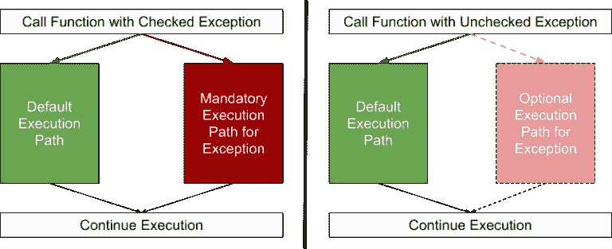

# 为什么应该忽略 Java 中的异常，以及如何正确地做到这一点

> 原文：<https://www.freecodecamp.org/news/why-you-should-ignore-exceptions-in-java-and-how-to-do-it-correctly-8e95e5775e58/>

赖纳·哈内坎普

# 为什么应该忽略 Java 中的异常，以及如何正确地做到这一点


Photo by [christoph wesi](https://unsplash.com/photos/OHoTzVyeCak?utm_source=unsplash&utm_medium=referral&utm_content=creditCopyText) on [Unsplash](https://unsplash.com/search/photos/fire-dog?utm_source=unsplash&utm_medium=referral&utm_content=creditCopyText)

在本文中，我将展示如何在 Java 中忽略检查异常。我将首先描述它背后的基本原理以及解决这个问题的常见模式。然后，我将介绍一些用于此目的的库。

### 已检查和未检查的异常

在 Java 中，一个方法可以强制它的调用者处理潜在异常的发生。调用方可以使用 try/catch 子句，其中 try 包含实际代码，catch 包含异常发生时要执行的代码。

或者，调用者可以将这个负担传递给它的父调用者。这可以一直向上，直到到达 main 方法。如果 main 方法也传递异常，应用程序将在异常发生时崩溃。

在异常的情况下，有许多应用程序无法继续运行而需要停止的场景。没有其他选择。不幸的是，这意味着 Java 迫使我们为应用程序不再运行的情况编写代码。挺没用的！

一种选择是尽量减少样板代码。我们可以将异常封装到一个 **RuntimeException** 中，这是一个未检查的异常。这样做的效果是，即使应用程序仍然崩溃，我们也不必提供任何处理代码。

我们绝不会记录异常，让应用程序继续运行，就像什么都没发生一样。这是可能的，但类似于打开潘多拉的盒子。

我们称这些异常为检查异常，为此我们必须编写额外的代码。其余的**运行时异常**类型我们称之为**未检查异常**。



Checked and Unchecked Exceptions

### 为什么要检查异常？

我们可以在第三方库中，甚至在 Java 类库本身中找到大量的检查异常。原因很简单。库供应商无法预测开发人员将在哪个上下文中使用他们的代码。

从逻辑上讲，他们不知道我们的应用程序是否有替代路径。所以他们把决定权留给了我们。他们的职责是“标记”可能抛出异常的方法。这些标签给了我们实施反制措施的机会。

一个很好的例子是到数据库的连接。库供应商将连接检索方法标记为异常。如果我们将数据库用作缓存，我们可以将查询直接发送到主数据库。这是另一条路。

如果我们的数据库不是缓存，应用程序就无法继续运行。如果应用程序崩溃也没关系:


[https://imgflip.com/i/26h3xi](https://imgflip.com/i/26h3xi](https://thepracticaldev.s3.amazonaws.com/i/600zwkafhw4pjiniwzv5.jpg))

### 丢失的数据库

让我们把理论上的例子放到实际代码中:

```
public DbConnection getDbConnection(String username, String password) {  try {    return new DbProvider().getConnection(username, password);  } catch (DbConnectionException dce) {    throw new RuntimeException(dce);  }}
```

数据库不用作缓存。如果失去连接，我们需要立即停止应用程序。

如上所述，我们将 **DbConnectionException** 包装成一个 **RuntimeException** 。

所需的代码相对冗长，并且总是相同的。这造成了大量的重复，降低了可读性。

### RuntimeException 包装

我们可以写一个函数来简化它。它应该在一些代码上包装一个 **RuntimeException** 并返回值。我们不能简单地用 Java 传递代码。该函数必须是类或接口的一部分。大概是这样的:

```
public interface RuntimeExceptionWrappable<T> {  T execute() throws Exception;} public class RuntimeExceptionWrapper {  public static <T> T wrap(RuntimeExceptionWrappable<T> runtimeExceptionWrappable) {    try {      return runtimeExceptionWrappable.execute();    } catch (Exception exception) {      throw new RuntimeException(exception);    }  }} public class DbConnectionRetrieverJava7 {  public DbConnection getDbConnection(final String username, final String password) {    RuntimeExceptionWrappable<DbConnection> wrappable = new RuntimeExceptionWrappable<DbConnection>() {      public DbConnection execute() throws Exception {        return new DbProvider().getConnection(username, password);      }    };    return RuntimeExceptionWrapper.wrap(wrappable);  }}
```

**RuntimeException** 包装已经被提取到它自己的类中。就软件设计而言，这可能是更优雅的解决方案。尽管如此，考虑到代码的数量，我们很难说情况变好了。

有了 Java 8 lambdas，事情变得更容易了。如果我们有一个只有一个方法的接口，那么我们只需要写这个方法的具体代码。编译器会为我们完成剩下的工作。不再需要创建特定或匿名类的不必要的或“语法糖代码”。这是 Lambdas 的基本用例。

在 Java 8 中，我们上面的例子看起来像这样:

```
@FunctionalInterfacepublic interface RuntimeExceptionWrappable<T> {  T execute() throws Exception;} public class DbConnectionRetrieverJava8 {  public DbConnection getDbConnection(String username, String password) {    return RuntimeExceptionWrapper.wrap(() ->      new DbProvider().getConnection(username, password));  }}
```

区别很明显:代码更简洁。

### Streams & Co .的例外情况

`RuntimeExceptionWrappable`是一个非常通用的接口。它只是一个返回值的函数。该功能或其变体的用例随处可见。为了方便起见，Java 的类库内置了一组这样的通用接口。它们在包`java.util.function`中，被称为“功能接口”我们的`RuntimeExceptionWrappable`类似于`java.util.function.Supplier<`；T >。

这些接口构成了强大的 Stream、Optional 和其他特性的先决条件，这些特性也是 Java 8 的一部分。特别是，Stream 附带了许多不同的方法来处理集合。许多这些方法都有一个“函数接口”作为参数。

让我们快速切换用例。我们有一个 URL 字符串列表，我们希望将它映射到 java.net.URL 类型的对象列表中。

下面的代码**没有编译**:

```
public List<URL> getURLs() {  return Stream    .of(“https://www.hahnekamp.com", “https://www.austria.info")    .map(this::createURL)    .collect(Collectors.toList());} private URL createURL(String url) throws MalformedURLException {  return new URL(url);}
```

当涉及到异常时，会有一个大问题。在`java.util.function` 中定义的接口不会抛出异常。这就是为什么我们的方法 **createURL** 没有与`java.util.function.Function`相同的签名，后者是 map 方法的参数。

我们可以做的是在 lambda 中编写 try/catch 块:

```
public List<URL> getURLs() {  return Stream    .of(“https://www.hahnekamp.com", “https://www.austria.info")    .map(url -> {      try {        return this.createURL(url);      } catch (MalformedURLException e) {        throw new RuntimeException(e);      }    })    .collect(Collectors.toList());}
```

这可以编译，但是看起来也不太好。我们现在可以更进一步，沿着类似于`RuntimeExceptionWrappable``的新接口编写一个包装器函数:

```
@FunctionalInterfacepublic interface RuntimeWrappableFunction<T, R> {  R apply(T t) throws Exception;} public class RuntimeWrappableFunctionMapper {  public static <T, R> Function<T, R> wrap(    RuntimeWrappableFunction<T, R> wrappable) {      return t -> {        try {          return wrappable.apply(t);        } catch(Exception exception) {          throw new RuntimeException(exception);        }      };    }}
```

并将其应用于我们的流示例:

```
public List<URL> getURLs() {  return Stream    .of(“https://www.hahnekamp.com”, “https://www.austria.info”)    .map(RuntimeWrappableFunctionMapper.wrap(this::createURL))    .collect(Collectors.toList());} private URL createURL(String url) throws MalformedURLException {  return new URL(url);}
```

太好了！现在我们有了一个解决方案，我们可以:

*   运行代码而不捕获已检查的异常，并且
*   在 Stream、Optional 等中使用抛出异常的 lambdas。

### 偷偷溜去救援

SneakyThrow 库允许您跳过从上面复制和粘贴代码片段。充分披露:我是作者。

SneakyThrow 附带了两个静态方法。一种是运行代码而不捕捉被检查的异常。另一种方法将抛出异常的 lambda 封装到一个函数接口中:

```
//SneakyThrow returning a resultpublic DbConnection getDbConnection(String username, String password) {  return sneak(() -> new DbProvider().getConnection(username, password));} //SneakyThrow wrapping a functionpublic List<URL> getURLs() {  return Stream    .of(“https://www.hahnekamp.com", “https://www.austria.info")    .map(sneaked(this::createURL))    .collect(Collectors.toList());}
```

### 替代库

#### 投掷功能

```
//ThrowingFunction returning a resultpublic DbConnection getDbConnection(String username, String password) {  return unchecked(() ->     new DbProvider().getConnection(username, password)).get();} //ThrowingFunction returning a functionpublic List<URL> getURLs() {  return Stream    .of(“https://www.hahnekamp.com", “https://www.austria.info")    .map(unchecked(this::createURL))    .collect(Collectors.toList());}
```

与 SneakyThrow 相反，ThrowingFunction 不能直接执行代码。而是要包装成供应商，事后给供应商打电话。这种方法可能比 SneakyThrow 更冗长。

如果在一个类中有多个未检查的函数接口，那么您必须为每个静态方法编写完整的类名。这是因为 unchecked 不适用于方法重载。

另一方面，ThrowingFunction 为您提供了比 SneakyThrow 更多的功能。您可以定义想要包装的特定异常。也有可能你的函数返回一个可选的，或者叫做“提升”

我将 SneakyThrow 设计为 ThrowingFunction 的自以为是的包装器。

#### 哇哦

Vavr 或“JavaSlang”是另一种选择。与 SneakyThrow 和 ThrowingFunction 相比，它提供了一整套增强 Java 功能的有用特性。

例如，它带有模式匹配、元组、自己的流等等。如果你没听说过，绝对值得一看。准备投入一些时间来了解它的全部潜力。

```
//Vavr returning a resultpublic DbConnection getDbConnection(String username, String password) {  return Try.of(() ->   new DbProvider().getConnection(username, password))    .get();} //Vavr returning a functionpublic List<URL> getURLs() {  return Stream    .of(“https://www.hahnekamp.com", “https://www.austria.info")    .map(url -> Try.of(() -> this.createURL(url)).get())    .collect(Collectors.toList());}
```

#### 龙目岛项目

不提到龙目岛，这样的库列表是不完整的。像 Vavr 一样，它提供了比包装检查异常更多的功能。它是样板代码的代码生成器，可以创建完整的 Java Beans、构建器对象、记录器实例等等。

Lombok 通过字节码操作实现其目标。因此，我们需要在 IDE 中添加一个插件。

@SneakyThrows 是 Lombok 的注释，用于将带有检查异常的函数转换成没有检查异常的函数。这种方法不依赖于 lambdas 的用法，因此您可以在所有情况下使用它。它是最不冗长的库。

请记住，Lombok 操纵字节码，这可能会导致您可能使用的其他工具出现问题。

```
//Lombok returning a result@SneakyThrowspublic DbConnection getDbConnection(String username, String password) {  return new DbProvider().getConnection(username, password);} //Lombok returning a functionpublic List<URL> getURLs() {  return Stream    .of(“https://www.hahnekamp.com", “https://www.austria.info")    .map(this::createURL)    .collect(Collectors.toList());} @SneakyThrowsprivate URL createURL(String url) {  return new URL(url);}
```

#### 进一步阅读

该代码可在 [GitHub](https://github.com/rainerhahnekamp/ignore-exception) 上获得

*   [https://docs . Oracle . com/javase/tutorial/essential/exceptions/runtime . html](https://docs.oracle.com/javase/tutorial/essential/exceptions/runtime.html)
*   [https://www.artima.com/intv/handcuffs.html](https://www.artima.com/intv/handcuffs.html)
*   http://www.informit.com/articles/article.aspx?p=2171751&seqNum = 3
*   [https://github . com/rainerhhnkamp/sneakythrow](https://github.com/rainerhahnekamp/sneakythrow)
*   [https://projectlombok.org/features/SneakyThrows](https://projectlombok.org/features/SneakyThrows)
*   [https://github.com/pivovarit/ThrowingFunction](https://github.com/pivovarit/ThrowingFunction)
*   [https://github.com/vavr-io/vavr](https://github.com/vavr-io/vavr)
*   [http://www.baeldung.com/java-lambda-exceptions](http://www.baeldung.com/java-lambda-exceptions)

*原载于 2018 年 3 月 17 日[www.rainerhahnekamp.com](https://www.rainerhahnekamp.com/en/ignoring-exceptions-in-java/)。*