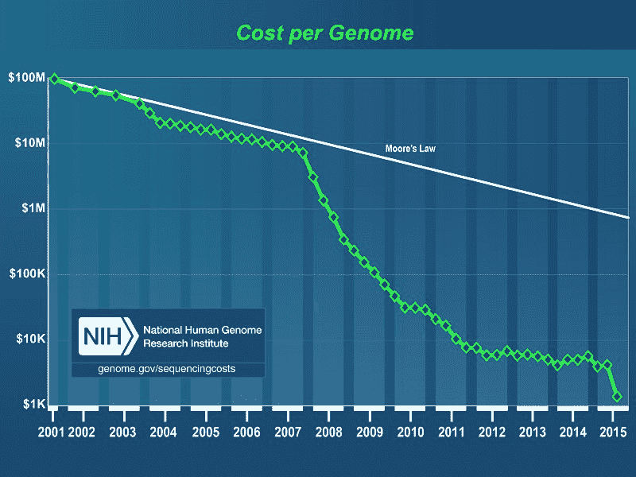

# 为什么不应该用脸解锁手机

> 原文：<https://www.freecodecamp.org/news/why-you-should-never-unlock-your-phone-with-your-face-79c07772a28/>

**2017 年 11 月 12 日更新:Face ID 被打败了！**

iPhone X 首次发布 9 天后，越南安全研究人员已经找到了一种可靠的方法来欺骗 Face ID 解锁 iPhone。他们使用一个拉伸在 3D 打印框架上的硅胶面具，上面印有眼睛和嘴巴的图片。

他们说制作这个面具只花了大约 150 美元。

以下是利用漏洞的演示(90 秒视频):

今天，苹果公司宣布了其新的 Face ID 技术。通过面部识别解锁手机是一种新的方式。你所要做的就是看着你的手机，它会识别你并自行解锁。

在撰写本文时，除了苹果公司，没有人测试过 Face ID 的安全性。所以这篇文章是关于面部识别的安全性，以及其他形式的生物特征识别。

历史上，生物特征识别是不安全的。

摄像头是可以被骗的。

声音可以录音。

指纹是可以提取的。

在包括美国在内的许多国家，警察可以合法地强迫你使用指纹解锁手机。所以他们很可能会把你的手机对准你的脸，违背你的意愿解锁。

如果你重视数据的安全性——你的电子邮件、社交媒体账户、家庭照片、你用手机去过的每个地方的历史——那么我建议不要使用生物识别。

相反，使用密码解锁您的手机。

### 改变你的脸比改变你的密码更痛苦

这是 2007 年电影《谍影重重》中的一个精彩镜头，马特·达蒙扮演的角色在保险箱上击败了双因素生物识别:

尽管这是一部 10 年前的好莱坞电影，但它说明了生物识别中固有的一些问题。

有多少张你的照片？利用红外线灯和点投影系统，这些图像能被拼接起来并三维建模到打败 Face ID 所需的精确程度吗？

如果你想知道它是如何工作的，这是完整的 Face ID 演示:

出现一种可靠的技术来击败苹果的 Face ID 和其他类似系统只是时间问题，比如三星的新面部解锁系统。

是什么让我对此如此自信？我们来谈谈虹膜扫描仪。

人类的虹膜有数百万个细胞，每个人的虹膜都是独一无二的。这似乎是生物识别的很好的候选，对吗？


好吧，这里有一些安全研究人员在 5 月份突破了三星 Galaxy 8 手机的虹膜扫描仪锁。他们最终只使用了一台打印机和一个隐形眼镜。

让我们后退一步，考虑一下你作为一个人的终极生物标识符:你的 DNA。

你的 DNA 只是一长串数据。人类基因组有 30 亿个碱基对。你可以在不到一千兆字节的空间内存储一个人的全部基因组——相当于一集《权力的游戏》的数据量。

对某人的基因组测序是很便宜的。总的来说，成本下降的速度比计算成本快得多。



如果你的 DNA 序列泄露出去，就很难改变了。

改变你的声音、指纹——或者你的脸型——也是相当困难的。

所以不要依赖生物识别。有一个更好的答案。你不会喜欢的。因为不太方便。但这很有效。

### 数字密码:难以猜测，易于更改，受法律保护

对于 iphone，你只能尝试 10 次用密码解锁手机。

假设您的密码是一个 4 位数字 PIN，有 10⁴可能的组合。这意味着有人试图解锁你的手机有千分之一的机会成功解锁你的手机。

这听起来可能不如苹果公司提出的“百万分之一”的数字安全，即某人可能与你长得足够相似以解锁你的 iPhone。但是有了数字密码，攻击者就无计可施了。他们不知道这个数字会是多少。如果它真的是随机的，这将使它比 Face ID 更安全。

因为如果 Face ID 失败了，你的密码将是它的后备，所以不管你是否使用 Face ID，你都应该让它成为一个好密码。

以下是 20 种最常见的 4 位数字密码。请务必避免使用这些，这样您可以最大限度地提高安全性。

```
+------+------+-----------+
| Rank | Code | Frequency |
+------+------+-----------+
| #1   | 1234 | 10.713%   |
| #2   | 1111 | 6.016%    |
| #3   | 0000 | 1.881%    |
| #4   | 1212 | 1.197%    |
| #5   | 7777 | 0.745%    |
| #6   | 1004 | 0.616%    |
| #7   | 2000 | 0.613%    |
| #8   | 4444 | 0.526%    |
| #9   | 2222 | 0.516%    |
| #10  | 6969 | 0.512%    |
| #11  | 9999 | 0.451%    |
| #12  | 3333 | 0.419%    |
| #13  | 5555 | 0.395%    |
| #14  | 6666 | 0.391%    |
| #15  | 1122 | 0.366%    |
| #16  | 1313 | 0.304%    |
| #17  | 8888 | 0.303%    |
| #18  | 4321 | 0.293%    |
| #19  | 2001 | 0.290%    |
| #20  | 1010 | 0.285%    |
+------+------+-----------+
```

数据来源:[数据遗传学博客](http://datagenetics.com/blog/september32012/index.html)

如果你真的想要一个随机数，把它粘贴到你的浏览器的 JavaScript 控制台(点击查看>开发者> JavaScript 控制台):

```
console.log((Math.floor(Math.random() * 10000) + 10000).toString().substring(1));
```

包括 iPhone 在内的大多数手机都支持多位数密码。每多一个数字，你就多一个数量级的安全保障。但是考虑到你一天要输入很多次，4 位数可能是更可持续的选择。

需要说明的是，美国法院不能强迫你放弃密码。密码存在于你的头脑中，只有你一个人。这是您的财产，除非您自愿放弃，否则不会被用来指控您或强制访问您的数据。

你从密码中获得的安全和安心是值得花 2 秒钟输入它的。

### 生物识别的发展方向

设备制造商应该采取分层的方法，要求不同级别的身份验证来访问不同的应用程序和数据，而不是当前的要么全有要么全无的方法——要么已经过身份验证，要么没有。

这类似于软件中传统的基于角色的访问控制。手机已经在锁屏时做到了这一点。

例如，在 iOS 上默认情况下，你可以在不解锁手机的情况下阅读收到的短信。每当你试图在 App Store 购物时，iOS 默认会要求你输入更长的密码来确认购买。

像 Face ID 这样的东西可以用来解锁你的“阅读”权限，以使用不太敏感的应用程序，比如报纸应用程序。

但是当你想获得“写”的许可，这样你就可以发短信或发微博，你的手机可能会要求你输入密码。

这将在很大程度上解决“我每天需要解锁手机 80 次”的问题，这可能是 89%的 iPhone 用户使用 TouchID 的主要原因。

这是一个软件上的改变，可能会推广到所有的 iPhones 上，包括人们已经在使用的 iPhones。这样做会让每个人都更加安全。

在安全性和便利性的统一体上有一个甜蜜点。但是，只用你的脸就能解锁你的整个手机——以及所有的数据、社交媒体账户和银行账户吗？在达到最佳状态之前，我们还有一段路要走。

目前，我的建议是继续使用密码，并确保它们是强密码。

我只写编程和技术。如果你在推特上关注我，我不会浪费你的时间。？