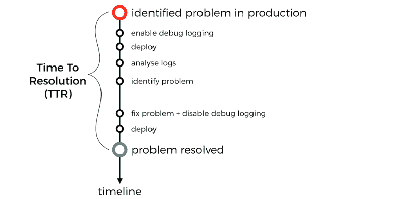
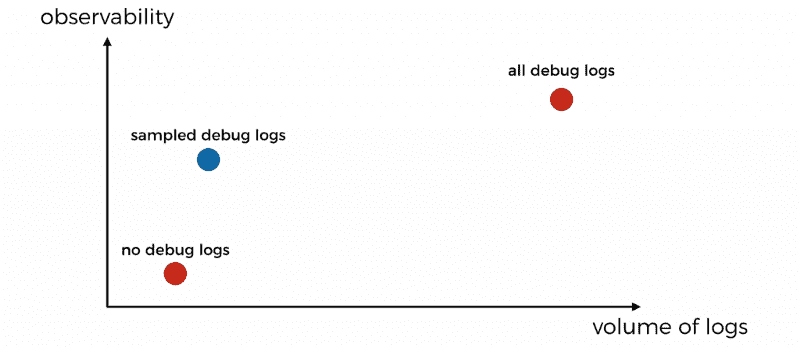
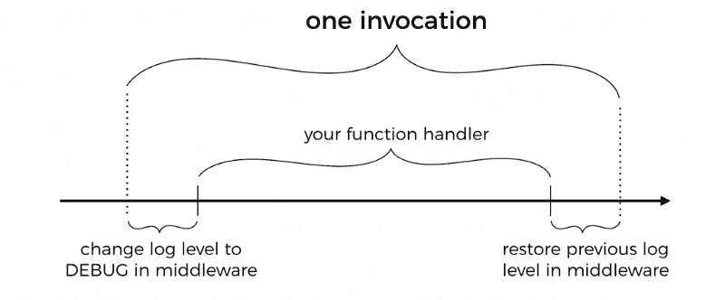
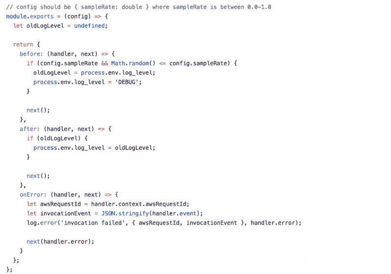
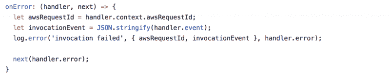

# 为什么应该在生产中对调试日志进行采样

> 原文：<https://www.freecodecamp.org/news/why-you-should-sample-debug-logs-in-production-39d78ef3968d/>

作者:崔琰

# 为什么应该在生产中对调试日志进行采样

通常的做法是将您的日志级别设置为**警告**以防止流量过大。这是因为你必须控制各种成本因素:

*   **日志记录成本** : *云观察日志*收取每 GB 0.50 美元。以我的经验来看，这通常比羔羊肉的成本要高得多
*   **存储成本** : *云观察日志*每月每 GB 收费 0.03 美元，其默认保留策略为**永不过期**！一个常见的做法是将您的日志传送到另一个日志聚合服务，并将保留策略设置为 X 天。详见[本帖](https://theburningmonk.com/2017/08/centralised-logging-for-aws-lambda/)。
*   **加工成本**:如果你用*羔羊肉*加工原木，那么你也必须计入*羔羊肉*加工成本。

但是，这样做使我们在生产中没有任何调试日志。当生产中出现问题时，您将没有调试日志来帮助确定根本原因。

相反，您必须浪费大量时间部署新版本的代码来启用调试日志记录。不要忘记，在部署修补程序时，不应该禁用调试日志记录。

对于微服务，您经常需要对多个服务执行此操作，以获得您需要的所有调试消息。

所有这些**增加了事故发生期间[恢复](https://en.wikipedia.org/wiki/Mean_time_to_recovery) (MTTR)的平均时间**。这不是我们想要的。

不一定要那样。

在没有调试日志和有所有调试日志之间有一个折中的办法。相反，我们应该从一小部分事件的调试日志中抽取样本。

我在我的视频课程[的*登录*章节演示了如何做到这一点。你需要两件基本的东西:](https://bit.ly/production-ready-serverless)

*   允许您动态更改日志级别的日志程序，例如通过环境变量
*   中间件引擎，如 [mid dy](https://github.com/middyjs/middy)

有了 *Lamb da* ，我不需要像 [pino](https://github.com/pinojs/pino) 这样的成熟日志程序的大部分特性。相反，我建议使用一个简单的日志模块，就像[这个](https://github.com/theburningmonk/manning-aws-lambda-in-motion/blob/master/lib/log.js)一样。它写在满手的线条中，给了我一些基本的东西:

*   [用 JSON 构造日志](https://theburningmonk.com/2018/01/you-need-to-use-structured-logging-with-aws-lambda/)
*   能够在不同级别记录
*   能够通过环境变量动态控制日志级别

使用*中间件*，我可以创建一个[中间件](https://github.com/theburningmonk/manning-aws-lambda-in-motion/blob/master/middleware/sample-logging.js)来动态更新日志级别到**调试**。这是针对可配置的参与年龄百分比而言的。在调用结束时，中间件将恢复以前的日志级别。

您可能会注意到，我们还有一些特殊的处理方法，用于处理交易出错的情况。

这是为了确保我们尽可能多地记录错误，包括:

*   唯一的 AWS 请求 ID
*   调用事件，因此我们可以在本地重放调用事件并调试问题
*   错误消息和堆栈跟踪

拥有一小部分参与时间的调试日志是非常好的。但是当您处理微服务时，您需要确保您的调试日志覆盖整个调用链。

这是阿尔收集整个通话链中发生的所有事情的唯一方法。否则，您将会得到来自许多调用链的调试日志的片段，但从来没有一个完整的图片。

您可以通过强制决定将调试日志记录作为更正 ID 来实现这一点。链中的下一个功能将尊重这个决定，并传递它。详见[这篇文章](https://theburningmonk.com/2017/09/capture-and-forward-correlation-ids-through-different-lambda-event-sources/)。

这就是关于如何在无服务器应用程序中构建观察能力的另一个专业技巧。如果您想了解更多关于如何使用更少服务器的信息，请点击此处查看我的 10 步指南。

下次见！