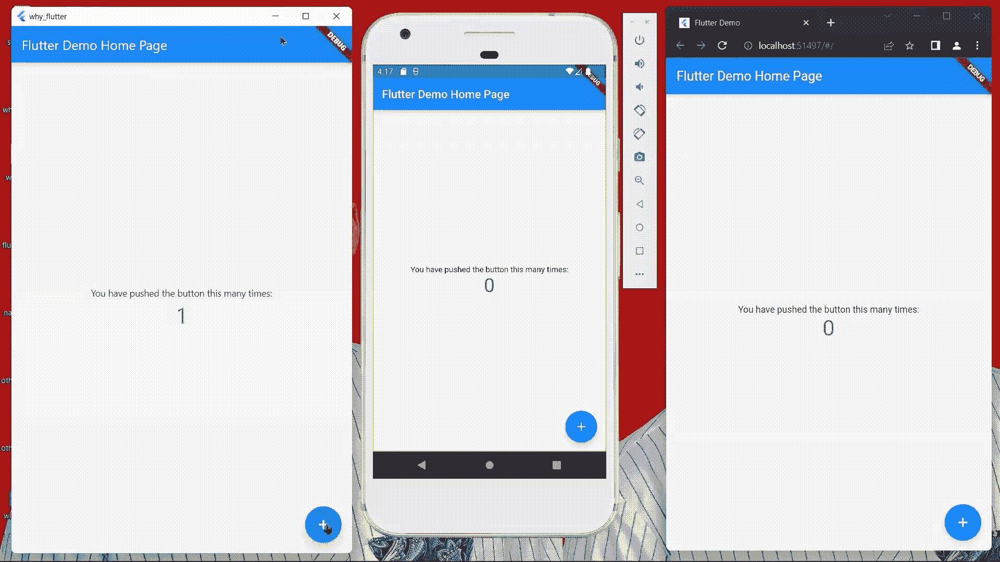
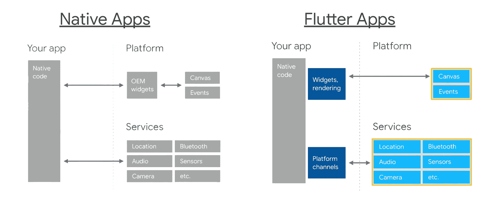
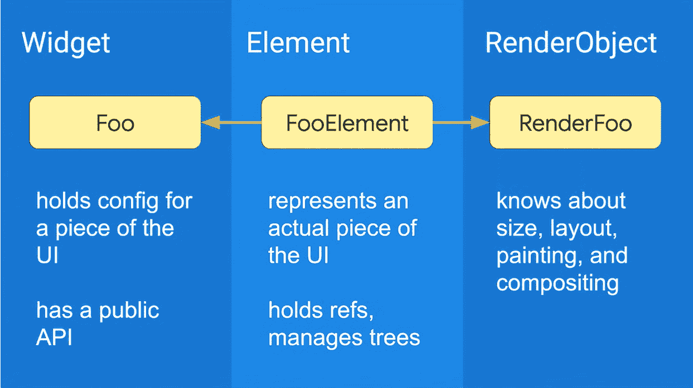
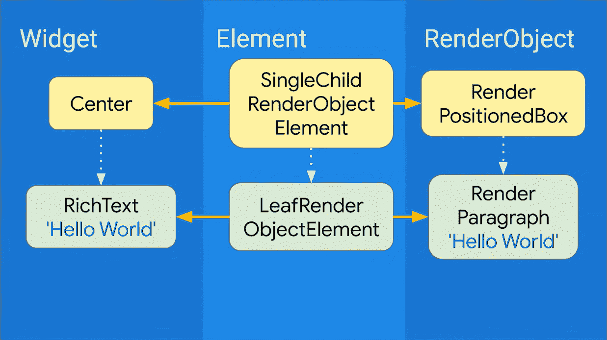
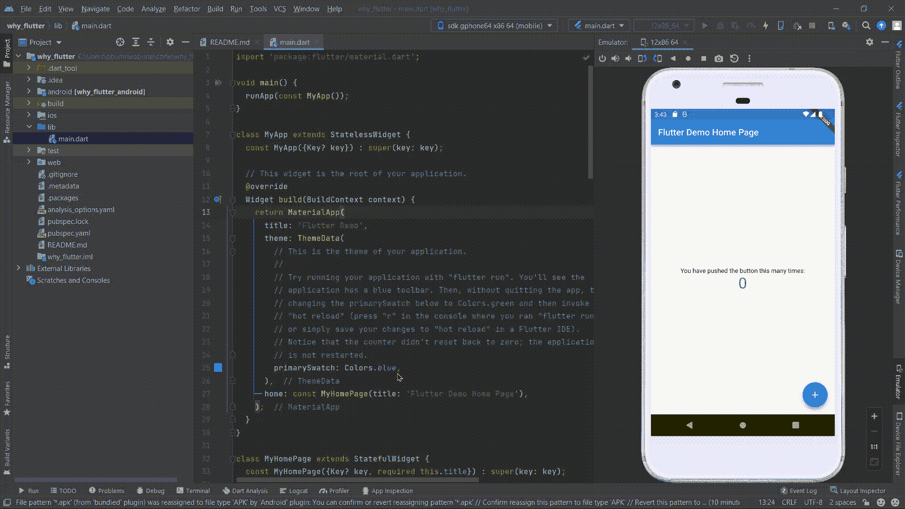
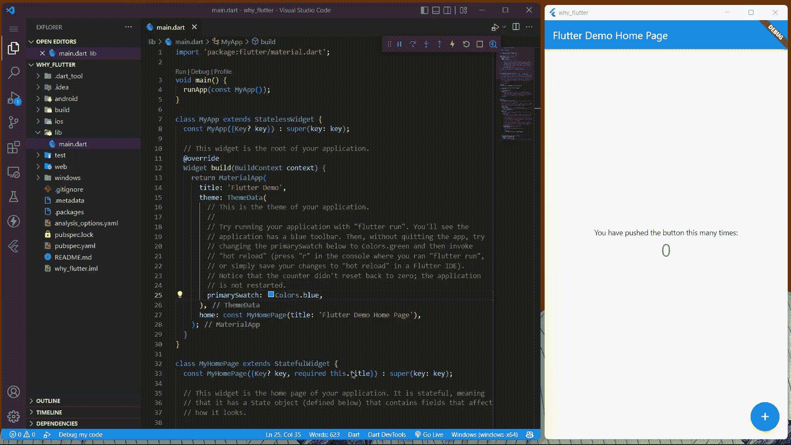
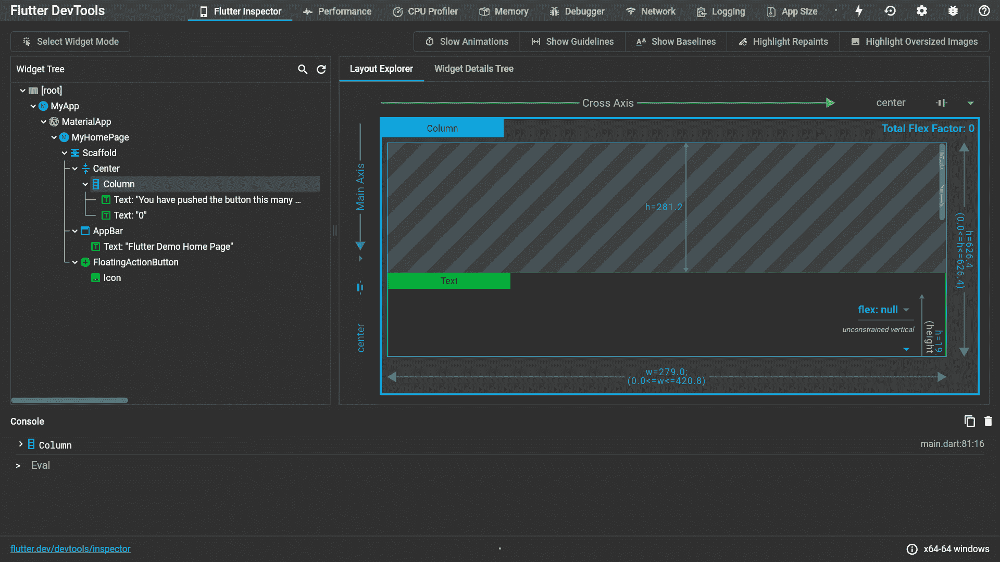
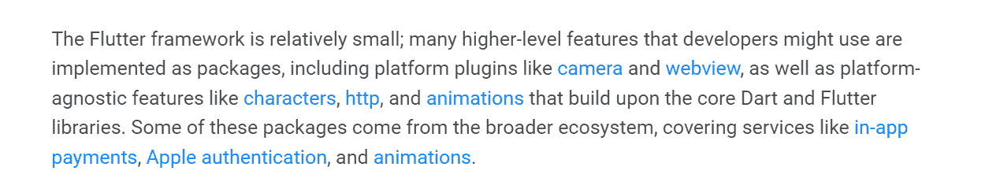

# 为什么您应该在项目中使用 Flutter

> 原文：<https://www.freecodecamp.org/news/why-you-should-use-flutter/>

Flutter 是一个 UI 工具包和 SDK，可以用来构建应用程序。Flutter 是开源的，你可以用它来构建高性能的移动和桌面应用。

在本文中，我将详细解释使用 Flutter 的各种好处，以便您可以决定是否在您的下一个项目中使用它。

## 颤振的最大好处

1.  [颤振是跨平台的](#flutter-is-cross-platform)
2.  [颤振如何跨平台](#flutter-is-cross-platform)
3.  [Flutter 拥有强大的 UI 引擎](#flutter-has-a-powerful-ui-engine)
4.  [颤振如何渲染用户界面](#how-flutter-renders-uis)
5.  [颤振有很大的状态管理](#flutter-has-great-state-management)
6.  [Flutter 提供了出色的开发者体验](#flutter-provides-a-great-developer-experience)
7.  [Flutter 有一个很棒的开发者社区](#flutter-has-a-wonderful-developer-community)
8.  [总结](#please-use-flutter)

现在让我们更详细地看一下这些特性。

## 颤振是跨平台的

当软件可用于不同的操作系统时，它就是跨平台的。您希望您的产品具有这样的跨平台能力，以便任何设备上的用户都能舒适地使用您的产品。

支持桌面、移动和网络平台是很困难的。对于桌面，你需要为 macOS(用 Swift)、Linux(用 C)和 Windows(用 C++)编写代码。对于移动，你将需要为 Android(用 Kotlin/Java 和 XML)和 iOS(用 Swift)编写代码。

为了使你的产品可以作为网站访问，你必须使用 HTML、CSS 和 JavaScript。或者，使用任何前端 JavaScript 框架，如 Angular、React 或 Vue。

为各种桌面和移动操作系统开发应用程序需要单独的 SDK 和技能组合。在过去，你需要雇佣精通每个平台的开发人员来在每个平台上实现你的应用。这个很贵。

要添加一个特性，你需要在所有这些平台上更新代码，这很繁琐。

### Flutter 是如何跨平台的

Flutter 代码可以在桌面、移动和 web 平台上运行。所以，你不需要为每个平台雇佣开发者。你只需要在 Flutter 中编写一次代码，你可以放心，这个应用程序可以在其他平台上运行。所以，Flutter 很便宜。

向你的应用添加功能很快，因为你只需要在 Flutter 中更新一次代码，仅此而已。

Same Flutter app working on desktop, mobile, and web.

Flutter 框架为您提供了绘画和事件的 API(通过小部件)。它还为特定于平台的服务提供 API(通过方法通道)。因此，Flutter *向你展示* *一切*，以你想要的任何方式构建应用。这就是跨平台的工作方式。

Adapted from https://youtu.be/l-YO9CmaSUM

不用担心性能。自然，Dart 可以编译成本机代码。因此，Flutter 应用程序的性能接近(如果不等于)本机应用程序的性能。

[Dart 的超前编译器](https://dart.dev/tools/dart-compile)用于捆绑颤振代码。它在您启动`flutter build`命令时使用。在构建阶段，只有 app 和 Flutter 引擎会发货。这使得构建的应用程序的大小很小(非常接近原生应用程序)。

## Flutter 有一个强大的 UI 引擎

Flutter 中的 UI 渲染是像素级完美的。作为一名 Flutter 开发者，你负责设备屏幕上绘制的每一个像素。

Flutter 在其引擎的帮助下实现了这一点。Flutter 引擎负责将 Flutter 代码准确地解释为设备屏幕上显示的内容。每个 Flutter 应用程序(为任何给定平台构建)都包含在运行时处理绘画的引擎。

这也解释了在 UI 渲染方面，Flutter 是如何高效地跨平台的。但这更关乎发动机的效率。颤振引擎使用 [Skia](https://skia.org/) 进行图形。Skia 是一个 2D 图形库，处理各种硬件和软件上的图形光栅化。

颤振发动机不仅仅包含 Skia。它还实现了 Flutter 的核心 API(比如文本和网络 I/O)。

颤振引擎非常强大，可以以**每秒 60 帧** (60 fps)的速度高效地重新渲染 ui。因此，当有 UI 更改或动画时，引擎会让它们变得如此之快，就好像它是一个原生应用程序一样。

### 颤振如何渲染用户界面

Flutter 积极使用构图。这里的组合意味着部件有部件，部件又有部件，以此类推。Flutter 中的所有东西都是一个小部件，而 Flutter UI 代码本质上是一个由小部件组成的大树。

在幕后，Flutter 为 UI 保留了 3 个独立的树。我们通常编码最外面的部件树。接下来，Flutter 引擎基于小部件树创建一个*元素*和一个 *RenderObject* 树。

本质上，每个小部件都有自己对应的元素和 RenderObject。这最后两个实体负责设备屏幕上小部件的实际表示。小部件本身只保存我们自己设置的 UI 属性(比如颜色、填充、阴影等等)。

当 UI 被重新渲染时，Flutter 总是破坏并重新构建任何改变的小部件(因为小部件是不可变的)。然而，如果需要，它只替换链接的元素或 RenderObject *。*

这些额外的 UI 树解释了小部件树是如何在 60 fps 渲染速度的每一帧中被破坏和重建，而 UI 却被正确地重新渲染。

The 3 UI trees, adapted from https://youtu.be/996ZgFRENMs

The 3 UI trees with the Center widget as an example. Adapted from https://youtu.be/996ZgFRENMs

## Flutter 有很棒的状态管理

状态是指您的应用程序在任何时间点呈现其 UI 所需的数据。它可能是用户生成的，也可能来自您的服务器或后端。

一般来说，Flutter 有两种类型的小部件:StatelessWidgets 和 StatefulWidgets。任何时候您需要基于状态更新 UI，只需提前使用 StatefulWidget。然后为了更新 UI，在 StatefulWidget 的 State 类中的任何地方调用`setState()`, Flutter 将重建 UI 树。

这种机制被证明是最有效的。也是基于状态更新 UI 的 React 风格。UI 编程应该是声明性的，而`setState()`只是提倡这一点。

你应该在异步代码被执行后调用`setState()`(如果有的话)。这是因为它是主 UI 线程的一部分，阻塞调用会劫持 UI 呈现过程。

如果你在一个 Flutter 应用中有高度 CPU 密集型的进程，考虑使用 [Dart 隔离](https://dart.dev/guides/language/concurrency#how-isolates-work)来执行这些进程，然后在处理完成时用你得到的数据调用`setState()`。

有时，您可能需要访问不在特定小部件范围内的状态。此时，您需要一个状态管理架构。有许多可供选择。这些架构在应用程序级别提供状态，而无需在每个小部件中重新配置。

[可用选项](https://docs.flutter.dev/development/data-and-backend/state-mgmt/options)包括 Provider、Riverpod、Redux、InheritedWidget、 [Stacked](https://filledstacks.com/) 等等。

这些架构的另一个优点是，它们中的许多允许良好的[关注点分离](https://en.m.wikipedia.org/wiki/Separation_of_concerns)和[依赖注入(或控制反转)](https://en.m.wikipedia.org/wiki/Dependency_injection)。

简而言之，关注点分离使您能够编写与特定逻辑代码分离的特定于 UI 的代码。这样，如果你想调试，或者改变你正在使用的包或 API，你可以很容易地从一个地方完成(不用担心破坏代码库)。此外，它也促进了干净的代码。

依赖注入涉及到使用服务或类似的东西来获得小部件需要什么来工作，而不需要小部件自己配置服务。有些架构，比如 Stacked，允许你在没有 BuildContext 的情况下管理应用程序范围的状态。

这种模式很有用，因为在 StatelessWidgets 中，BuildContext 只在 build 方法中可用，而您可能需要使用它之外的东西。所以您可以做其他事情，比如底部表单，导航，吐司，等等，而不需要构建上下文。

## Flutter 提供了出色的开发人员体验

开发人员对 Flutter 的体验非常棒有很多原因。以下是其中的几个例子:

### Flutter 只有一种编程语言——Dart。

编程本身是一项要求很高的活动。框架、库和工具不应该让编码变得更加困难。

当你为一些平台编码时，你通常用不止一种编程语言编写代码。例如，在为 frontend web 编写代码时，您将在 HTML、CSS 和 JavaScript 文件之间切换，以管理网页的给定部分。

Flutter 使编码变得容易，因为你只用一种编程语言编写:Dart。因此，大多数时候，Flutter 应用程序给定部分的逻辑和 UI 属性都在同一个 Dart 文件中。

还有，扑和镖是用浅显的英语写的。小部件名称及其属性反映了它们是什么。在编码 Flutter 时，理解给定的小部件和/或它的用例不太可能有任何困难。

### 颤振有热重装。

Dart 是一种现代编程语言，带有超前(AOT)和实时(JIT)编译器。

JIT 编译器给人感觉 Dart 是在运行时解释的。换句话说，它使得对 Dart 文件的更改能够立即反映出来，而不需要重新编译文件，就像 C 或 Java 等一些编程语言一样。

Flutter 利用 JIT 进行开发。Flutter 将一个 [Dart VM](https://mrale.ph/dartvm) 发布到托管应用代码的平台上。这样，当您启动`flutter run`命令时，在终端中按下`r`会在 dart 文件中传送更改，而无需重新编译整个应用程序。这种瞬时的、然而*跨平台*的反映颤振变化的特征被称为**热重装**。

Flutter 还有**热重启**。热重启是通过按`R`(这次是大写而不是小写)实现的。*热重启*完全重启 app。

如果您更改了 Flutter 代码的一些重要部分，您需要进行热重启。例如，更改`class`声明或它们的超类将需要热重启。

### 颤振是普遍现象。

每个操作系统都有 Flutter。因此，你不需要像 iOS 应用程序那样(需要苹果电脑)迁移或使用特定的操作系统来创建 Flutter 应用程序。

Flutter 可以顺利地与流行的 ide 集成。Android Studio、IntelliJ 和 VS 代码(Visual Studio 代码)都有 Flutter 的插件或扩展。因此，您可以直接在 IDE 中操作 Flutter 命令，而无需使用终端。

Editing Flutter as an Android app in Android Studio 

Editing Flutter as a Windows app in VS Code 

Android Studio 在计算资源方面要求相对较高。如果你的笔记本电脑[没有 8GB 内存](https://developer.android.com/studio#system-requirements-a-namerequirementsa)，不要觉得被忽略了。

设置 Flutter 会自动检测您的操作系统和浏览器。Flutter 可用于 web(在浏览器中运行 Flutter 应用程序)。因此，如果 RAM 或 CPU 容量可能是一个问题，你可以在你的浏览器或桌面应用程序中测试颤振代码。

还有 [dartpad.dev](https://dartpad.dev) 、 [flutlab.io](https://flutlab.io) 和 [flutterflow.io](https://flutterflow.io) 可以让你在浏览器中在线创建 Flutter 应用。你会发现这些很有用，因为它们不需要像在 Android 或 iOS 上运行 Flutter 那样多的计算资源。

### 颤振开发工具

Dart 自然附带了一组用于优化和调试 Dart 代码的实用程序。这套工具可以从您正在使用的浏览器或 IDE 中访问。在编码 Flutter 的同时，使用 DevTools 会缩短你的编码时间，让你对你的 app 有深入的洞察。

Flutter DevTools 包括不可或缺的工具，如检查器、调试器、性能监视器、网络监视器、日志记录器等等。

Flutter DevTools

## Flutter 有一个很棒的开发者社区

> 颤振框架相对较小...–[来自颤振文档](https://docs.flutter.dev/resources/architectural-overview)

颤振团队本身承认社区。与整个 Flutter 生态系统相比，Flutter 框架本身相对较小。Flutter 是开源的。

围绕着 Flutter，有如此多的开发者扩展了这个框架。这些开发者已经在 [pub.dev](https://pub.dev) 上发布了超过 24000 个包。每个包都有至少一个可以导入到 Flutter 应用程序中的小部件。

如果你有关于 Flutter 的问题，或者在使用 Flutter 时遇到错误，只要你在网上搜索一下，你就会找到解决办法。有可能在你寻找的东西上有 [GitHub 问题](https://github.com/flutter/flutter/issues)或 [Stackoverflow 问题](https://stackoverflow.com/questions/tagged/flutter)。Stackoverflow 有很多 Flutter 开发者愿意帮助你，所以不要犹豫，用 Flutter 标签提问。

颤振组织和 [GDG](https://developers.google.com/community/gdg) 是科技社区，分布在不同的国家。每年，这些社区都会组织一次只有振翅的活动，通常被称为[振翅节](https://www.flutterfestival.com/)。有些活动是面对面的，而有些是虚拟的。这些活动将社区成员聚集在一起，一起摇摆，摇摆，再摇摆。

也就是说，你应该使用 Flutter，因为你并不孤单。你相信你周围的人也同样使用它，并能在你需要的时候帮助你。

此外，颤振的维护和未来支持看起来很有希望。 [Fuchsia](https://fuchsia.dev) 是即将推出的开源操作系统。除了目前的跨平台支持，Fuchsia 的颤振是可用的。

## 摘要

总之，使用 Flutter 有很多好处。

您将拥有一个跨平台的应用程序，它的用户界面是像素完美的，状态得到适当的管理。您还将享受您的开发体验，并将利用 Flutter 社区。

为你将构建的许多令人激动的应用程序干杯。

## 有用的资源

*   [Flutter 对应用程序开发有何不同](https://youtu.be/l-YO9CmaSUM)
*   【Flutter 如何渲染窗口小部件
*   [颤振建筑概述](https://docs.flutter.dev/resources/architectural-overview)
*   [状态管理方法列表](https://docs.flutter.dev/development/data-and-backend/state-mgmt/options)
*   [如何在 Flutter 中实现任何 UI](https://www.freecodecamp.org/news/how-to-implement-any-ui-in-flutter)