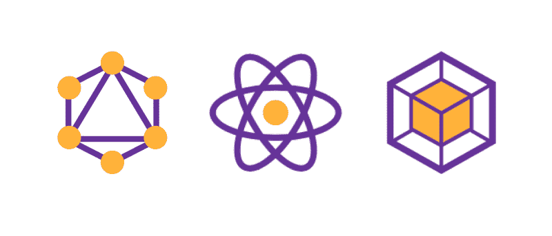
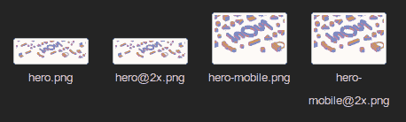
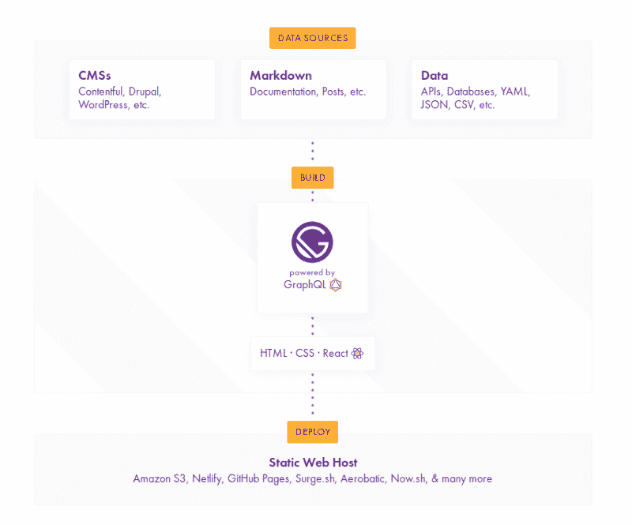

# 为什么应该使用 GatsbyJS 来构建静态站点

> 原文：<https://www.freecodecamp.org/news/why-you-should-use-gatsbyjs-to-build-static-sites-4f90eb6d1a7b/>

作者 Ajay NS

# 为什么应该使用 GatsbyJS 来构建静态站点

Gatsby 一直在成长，我很高兴看到它被大量的网站使用，比如营销网站、博客和生成的静态页面。

最初吸引我的是流畅的开发体验，不可思议的成果，以及温暖的社区。深入了解它的工作方式、生态系统，并与更多的开发者讨论它的潜力，让我想到它有多强大——比我最初想象的要多得多。

这篇文章试图让你明白为什么它会受到欢迎。如果您已经在使用它，您将会更好地了解可以用于更好的开发体验的特性。

请注意，这是我的工作，我只是分享我的观点。我并不是要告诉你你目前的工作方式已经过时了，而是想分享盖茨比对我来说是多么的伟大。

### 盖茨比是什么？

又是一个像 Hugo，Jekyll 之类的静态站点生成器。那么它有什么特别之处呢？为什么我们要特别谈论它？

Gatsby 可用于构建静态站点，这些站点是渐进式 web 应用程序，遵循最新的 Web 标准，并经过优化以实现高性能。它利用了最新的流行技术，包括 ReactJS、Webpack、GraphQL、现代 ES6+ JavaScript 和 CSS。

GraphQL + React + Webpack = ❤

这意味着许多开发人员可以在没有太多学习曲线的情况下加入进来，因为他们已经知道或者至少使用过 Gatsby 所基于的技术堆栈的一部分。

此外，我想补充一些我在与开发人员一起工作时注意到的事情，他们对最新的框架和库一无所知，只是习惯于传统的 HTML、JavaScript、CSS 文件构建网站的方式。

#### 发展途径

一方面，我们有用户期待类似应用程序的流畅网络体验。另一方面是开发人员，他们习惯于拥有页面的网站，每个页面都是 HTML 文件，或者可能使用一些模板——在最基础的地方——*网站作为带有内部链接的页面*。

如果您正在开始使用任何最新的框架，让我们以 React 为例。您可以使用 [create-react-app](https://github.com/facebook/create-react-app) 以最少的配置启动并运行应用程序。但是，如果你看一看项目结构，它可能对一个新手或者甚至一些来自其他技术堆栈的开发人员来说没有多大意义。这种模式与你以前见过的非常不同。

这是因为没有额外的设置，他们的目标是建立单页应用程序，spa。添加路由，网页或搜索引擎优化优化，这将需要更多的工具和配置。

当您需要静态站点时，这似乎不太方便，不是吗？这里我们有 Gatsby，针对这一特定用例进行了优化。这对开发人员来说可能更直观，因为有些页面是由组件创建的，这些组件遵循的基本思想是站点是具有内部链接的页面。

### 特征

#### 成分

组件是 React 的一个关键特性，现在它们是一种普遍遵循的 web 设计模式。就目前用户界面的复杂程度而言，用长页的 HTML 编写可维护的代码或者使用模板引擎并期望一致性几乎是不可能的。

因此，相反，我们构建可重用的组件，然后用它们来构造视图。这样我们就有单独的模块来处理单独的事情，并且更容易管理和维护。该组件只包含它需要的所有信息，Gatsby 由于使用了 React，所以也遵循相同的模式。

原子设计是一种处理复杂接口的好方法，我们可以将它用于 React 组件。布拉德·弗罗斯特有一篇令人惊叹的博文描述了它是什么以及它是如何工作的。

#### **Webpack 捆绑和最新工具**

Webpack 创建优化的、精简的 HTML、JavaScript 和 CSS 包。当它预配置了 Babel 和更多插件时，它允许你使用最新的 ES6+ JavaScript 和 GraphQL。

锦上添花:我们已经内置了热重装和代码分割，提供了更好的开发体验和更好的网站性能。这旨在让开发人员编写最少的工具配置，并更多地关注实际的站点开发。

#### **盖茨比插件、启动器和 React 包**

你可以使用任何你已经和 NPM 一起使用的软件包，尤其是 React，因为它是基于同样的东西构建的。但这还不是全部:盖茨比社区有大量不断增长的插件、启动器和变形金刚。

你几乎从来没有真正需要构建自己的工具或模块，社区已经提供了大量的工具和模块来满足你的需求。

使用这些，Gatsby 可以扩展附加功能。例如，一些例子包括响应图像、离线功能、来自 CMS 的源数据和数据标记格式、添加第三方服务(Google analytics 等)等等。

#### 式样

同样，复杂的用户界面意味着复杂的样式模式，样式表变得臃肿只是时间问题。您遇到了特殊性问题，滚动数百行代码试图找出问题所在，并最终使用`!important`来实际查看您添加的样式。

Gatsby 支持 SCSS、CSS-in-JavaScript 库，允许您更好、更轻松地管理样式。即使是这样的设置也很容易处理，只需安装一个插件或软件包。

#### 响应图像

在不同的设备上调整图像大小以响应，延迟加载，使用`srcsets`和`picture`……当手动完成时，听起来已经很乏味了。

Different versions of the same image for responsiveness

虽然这是性能和类似 app 的优化界面的要求，但我们并没有看到许多可以直接投入使用的工具。

与此同时，在只带有一个插件的 Gatsby 中，特别是 [gatsby-plugin-sharp](https://www.gatsbyjs.org/packages/gatsby-plugin-sharp/) ，你可以直接生成流体图像，添加滤镜，改变格式，加载时模糊等等。这节省了大量的工作和时间，手动调整图像大小和为响应图像编写显式样板代码。它也给你更好的性能和更流畅的用户体验。

#### **类似 App 的体验**

随着性能的提升和功能的增加，用户体验更加流畅，Gatsby 的目标是借鉴完整的 PWAs，提供完整的类似应用程序的体验。当使用 [gatsby-link](https://www.gatsbyjs.org/docs/gatsby-link/) 而不是超链接时，页面之间没有重新加载，并且由于延迟加载图像和代码分割，应用程序仍然看起来流畅和高性能。

对于那些遵循标准的网站，你也希望它们是高性能的，我们有很多事情要做，也有很多指南要遵循:缩小和捆绑，浏览器缓存和异步加载脚本或文件，等等。当使用像 React 这样的框架时，尽管它解决了几个问题，但您还需要担心更多的事情:代码分割、SEO、路由(如果需要的话)、响应图像，等等。

Gatsby 的目标是解决所有这些问题，用更少的时间在工具、配置和环境上，用更多的时间实际设计和开发站点。

### 盖茨比生态系统

#### 插件

Gatsby 被设计成可扩展和灵活的——使用插件是实现这一点的一种方式。它们可以直接安装，并用于各种功能，包括使网站离线，添加谷歌分析，添加对内嵌 SVG 的支持，你能想到的，不胜枚举。

在不同类型的 Gatsby 插件中，gatsby-source 插件特别从本地或远程源获取数据，并允许通过 GraphQL 使用它。这些来源可以是 CMSs，如 Wordpress、Drupal、Plone、local markdown、XML 或诸如 JSON、CSV 等文件、数据库、API 和数据格式。

这意味着几乎任何东西都可以用作与 Gatsby 一起工作并生成静态站点的源。

> 注意:GraphQL 是一种用于 API 的查询语言，它的工作原理是只问你到底需要什么。与 REST APIs 不同，您不需要寻找端点来提供您的数据，并根据它给出的结构来处理它们，而是询问您想要什么并直接使用这些数据。在他们的[文档](https://graphql.org/)中阅读更多关于它如何工作以及如何使用的信息。

安装后，一些插件可以直接使用，只需将它们列在`gatsby-config.js`中，其他的用选项对象配置。

去看看 [Gatsby 插件库](https://www.gatsbyjs.org/plugins/)，它已经有了相当多的插件，而且活跃的社区还在添加更多的插件。

#### 开胃菜

这些基本上是样板 Gatsby 站点，根据站点的类型帮助您快速启动开发。他们帮助你直接进入网站的开发工作，配置和你已经需要处理的基本功能。这意味着，开发工具的时间更少，开发的时间更多。

Gatsby 插件通常有相应的启动器，显示或提供一种快速开始使用它的方法。它们也可以作为参考，涵盖正在使用的插件的所有特性和展示配置。

[Gatsby Starter library](https://www.gatsbyjs.org/starters/?)

Gatsby themes 是一个仍在开发中的特性，它允许你打包和重用这些功能和模式，就像在 starters 中看到的那样。在盖茨比的博客中阅读更多关于正在酝酿的事情。

#### 静态站点

首先，让我们看看盖茨比内部是如何工作的。与在运行应用程序时发出 API 请求的 spa 不同，Gatsby 在构建期间执行所有的数据获取，包括从本地文件获取数据。然后，所有这些数据被用来生成静态 HTML、JavaScript 和 CSS 文件。这种静态渲染使工作速度更快。

How Gatsby works

这是很多关于盖茨比，它的生态系统，以及它如何帮助你创建惊人的静态网站。但是我们为什么想要静态站点呢？这听起来不像是从动态的倒退吗？

*   它们不需要复杂的服务器数据库设置和维护，也没有任何扩展问题。
*   数据是完全安全的。CMSs 和 API 具有私有特性，但是数据仍然存在于服务器中，可以被利用。Gatsby 只从源代码中提取需要显示的数据，私有或安全数据甚至不会出现在最终版本中。这是最安全的。
*   与其依赖服务器来动态生成页面，不如在构建时预渲染所有页面，并使用 cdn 为全球用户带来超快的流畅体验。
*   盖茨比做静态渲染。这使得内容可作为 HTML，搜索引擎优化，没有长的初始加载时间。

#### 试试吧！

这应该会让人们对围绕它的所有宣传以及为什么一些大公司选择在他们的网站上使用它有所了解。盖茨比网站展示区最近似乎增加了许多令人惊讶的东西。

也许是时候你把手伸进去四处看看了！

多亏了 [CodeSandbox](https://codesandbox.io) ，我们可以马上在浏览器中做到这一点。

如果您想在本地运行它，您应该查看一下 [gatsby-cli](https://www.gatsbyjs.org/docs/) 。这是最快捷、最简单的入门方式。他们还为你提供了令人惊叹的文档和教程，让你深入了解 gatsbyjs.org[的开发网站。](https://www.gatsbyjs.org/docs/)

希望你喜欢这篇文章，并发现它是值得的。你可以在 [Github](http://github.com/ajayns/) 或 [Dribbble](https://dribbble.com/ajayns) 上查看我的所有项目，并随时通过 [Twitte](https://twitter.com/ajayns08) r 联系我！

*你可能也想看看我的其他文章:*

[**渐进式网络应用:弥合网络和移动应用之间的鸿沟**](https://medium.freecodecamp.org/progressive-web-apps-bridging-the-gap-between-web-and-mobile-apps-a08c76e3e768)
[*除非你一直生活在岩石下，否则你可能听说过 PWAs 或渐进式网络应用。这是一个热门话题吧……*medium.freecodecamp.org](https://medium.freecodecamp.org/progressive-web-apps-bridging-the-gap-between-web-and-mobile-apps-a08c76e3e768)[**黑客马拉松报道:你能在 30 小时内编写出什么？挺多的！**](https://medium.freecodecamp.org/hackathon-report-what-can-you-code-in-30-hours-quite-a-lot-ffd7224c9745)
[*连续 30 个小时你能造出什么？作为一群工作越来越多的二年级大学生…*medium.freecodecamp.org](https://medium.freecodecamp.org/hackathon-report-what-can-you-code-in-30-hours-quite-a-lot-ffd7224c9745)[**ACM 代码月 2k17:构建 mood ify**](https://hackernoon.com/acm-month-of-code-2k17-building-moodify-d5d9e0c52ca7)
[*三月是一个收获颇丰的月份，这一切都要感谢 NIT 计算机械协会主办的这次重大活动…*hackernoon.com](https://hackernoon.com/acm-month-of-code-2k17-building-moodify-d5d9e0c52ca7)