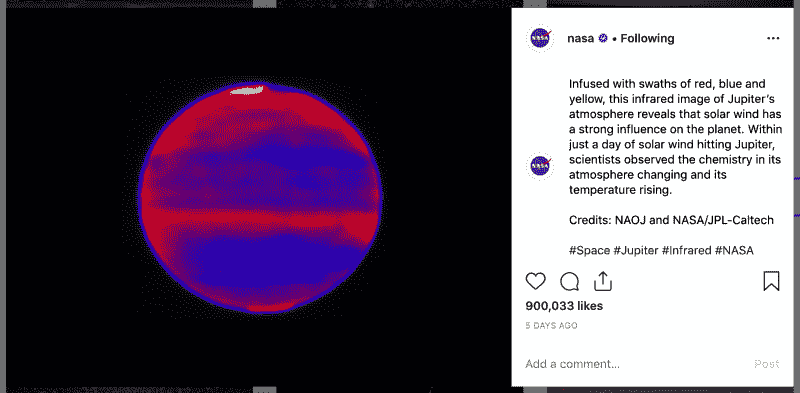
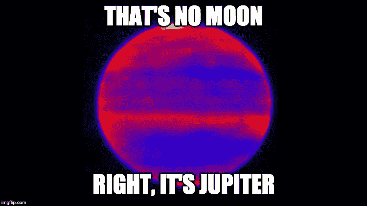

# 为什么你应该像在 Instagram 上发帖一样写合并请求

> 原文：<https://www.freecodecamp.org/news/why-you-should-write-merge-requests-like-youre-posting-to-instagram-765e32a3ec9c/>

合并请求(或拉请求)是团队开发过程中的一个重要部分。它是主要的看门人，防止开发人员将他们想要的东西扔进默认分支。它也是对历史的参考，以及对某人对应用程序所做更改的理解。它给了代码审查人员和测试人员更多的信心，让他们真正知道发生了什么。


*Gandalf: you shall not merge this code!*

那么和 Instagram 有什么关系呢？请原谅，这是有价值的。

### Instagram 帖子的基础

这可以适用于任何社交媒体平台，但我们将坚持使用 Instagram。先说一个 NASA 发的帖子的例子。这篇文章可以分成几个重要的部分:图片、描述和标签。



[*https://www.instagram.com/p/BwH0GRAjL5i/*](https://www.instagram.com/p/BwH0GRAjL5i/)

### 这和代码有什么关系？

我就要到了！查看每个部分，我们可以开始将它们与我们的合并请求联系起来。从 3 个基本要素开始:

*   图像= >代码
*   描述= >你的特点是什么？
*   Hashtags = >这会影响应用程序的哪些部分？

#### 密码

就像图片或视频是帖子最重要的方面一样，你的代码也是。这是推动对话和兴趣的主要内容。虽然它本身很强大，但如果没有上下文，它会产生自己的一系列问题。

#### 描述

在上面美国宇航局的帖子中，没有看到描述，这很可能是死星的模糊插图。相反，由于描述，我们发现它是木星。红外成像使我们能够更好地观察它的大气层。



*That’s no moon! Right, it’s Jupiter.*

不知道您正在查看的代码是做什么的，或者它会产生什么影响，对于那些不熟悉您的应用程序的人来说，会导致混乱和缺乏理解。即使对于老手来说，与庞大的代码库相比，仅仅能够看到差异的一小部分也会完全改变你所看到的。

#### 影响范围

就像标签允许人们标记内容以显示相关的主题一样，提供一个影响区域有助于让你的评论者知道他们应该注意哪里。如果审查者或测试者只知道一个被更改的组件被使用的位置(当它在整个应用程序中被更广泛地使用时)，他们可能会错过重要的用例，这些用例可能在那个实例之外有突破性的更改。

### 以史为鉴

我确信木星会在接下来的两年里一直存在。在这段时间内回顾我们的代码，感觉就像是完全不同的风景。很久以前开发人员编写的一些代码可能没有被完全理解。这对应用程序的完整性至关重要。


[*https://www.instagram.com/p/BveREmPD9Vb/*](https://www.instagram.com/p/BveREmPD9Vb/)

这些合并请求组件中的每一个都在防止丢失知识和应用程序更改的上下文方面起着关键作用。为什么要建立业务逻辑来以这种方式处理特定的情况？找到提交并将其与合并请求相关联，可以很好地防止应用程序由于一个错误而损失金钱的情况，如果没有这个上下文，您就不会想到这个错误。

### 奖励:评论

反馈对 Instagrammers 和开发者都至关重要。能够向他人学习并获得不同的视角不仅是个人成长的关键，也是能够从团队的所有部分汲取最佳片段和智慧的关键。接受并理解这些反馈对强化你的应用程序至关重要。

### [E84 团队](https://www.freecodecamp.org/news/why-you-should-write-merge-requests-like-youre-posting-to-instagram-765e32a3ec9c/undefined)如何编写合并请求？

在较大的项目中，我们会付出额外的努力来帮助指导我们的团队编写高质量的合并请求。特别是，我们使用合并请求模板来完成工作。

我们试着把它分成两个主题，工作概述和如何测试。

```
## Overview

### What is the feature?
(Describe what the feature is)

### What is the solution?
(Describe at a high level how the feature was implemented)

### What areas of the site does it impact?
(Describe what parts of the site are impacted and*if*code touched other areas)

## Testing

### What's required testing?
(Describe the prerequisites for the steps to test)

### What are the steps to reproduce?
(Describe and list the steps to reproduce - distinguish if instructions are for a developer or QA tester)

## Other Notes
(Add any additional information that would be useful to the developer or QA tester)
```

此处也有:[https://gist . github . com/colbyfayock/086038 BC 5 e 38 FD 7 EDF 4 e 73 e 1602 de 71 c](https://gist.github.com/colbyfayock/086038bc5e38fd7edf4e73e1602de71c)

自从添加了这个模板，我们已经能够看到我们的合并请求的质量有一个明显的上升趋势。随后，更好的历史参考代码的变化。

### 如何添加模板？

我们是内部项目的 Gitlab 风格的房子。大多数 Git 软件应该能够提供添加合并请求模板的选项。为了帮助开始:

*   git lab:[https://docs . git lab . com/ee/user/project/description _ templates . html # creating-merge-request-templates](https://docs.gitlab.com/ee/user/project/description_templates.html#creating-merge-request-templates)
*   github:[https://help . github . com/en/articles/creating-a-pull-request-template-for-your-repository](https://help.github.com/en/articles/creating-a-pull-request-template-for-your-repository)

[](https://twitter.com/colbyfayock)

*   [？在 Twitter 上关注我](https://twitter.com/colbyfayock)
*   [？️订阅我的 Youtube](https://youtube.com/colbyfayock)
*   [✉️注册我的简讯](https://www.colbyfayock.com/newsletter/)

*最初发布于[https://www . element 84 . com/blog/write-merge-requests-like-you-posting-to-insta gram](https://www.element84.com/blog/write-merge-requests-like-youre-posting-to-instagram)。*