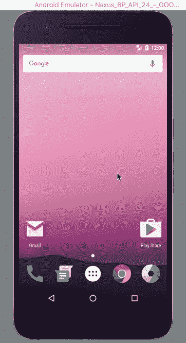
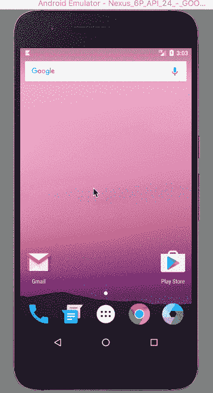
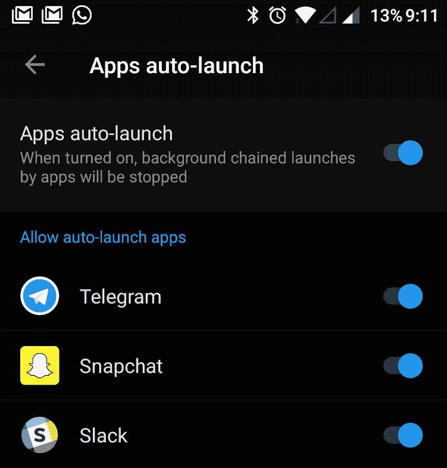
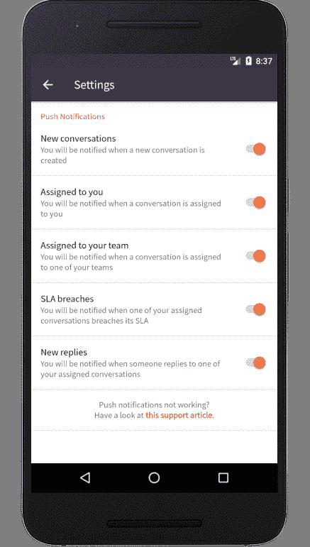

# 为什么你的推送通知从未公开

> 原文：<https://www.freecodecamp.org/news/why-your-push-notifications-never-see-the-light-of-day-3fa297520793/>

尼尔·马修

# 为什么你的推送通知从未公开

#### 推送通知在特定的 Android 手机上失败。原因如下。

我最近在[伽椰子应用](https://play.google.com/store/apps/details?id=com.kayako.android.k5)中增加了对[推送通知](https://firebase.google.com/docs/cloud-messaging/)的支持。我测试并运输了它。我觉得我做得很好。

但是一个接一个，我的用户开始评论说这个应用程序在 95%的时间里没有显示任何通知。起初，我认为这是一个错误，因为推送通知在我的模拟器和设备上正常工作。但是随着我的深入研究，这个问题变得越来越严重和有效。这只是冰山一角。近 50%的 Android 应用程序用户受到影响，但只有少数人通知我们。

### 那么，有什么问题呢？

推送通知在特定的 Android 手机上无法正常工作。

我使用“正确地”这个词是因为当应用程序打开时，用户会收到推送通知，但当应用程序关闭时，用户不会收到推送通知，这违背了推送通知的目的。

我用“特定安卓手机”这个词是因为这个问题只在小米、Oppo、一加、Vivo、联想、华为、三星等制造商的手机上出现。

### 为什么会发生这种情况，我们如何解决？

为了理解问题，我们先来了解 Android UI 和推送通知的预期行为。

在 Android 上，我们在底部有三个按钮作为导航栏的一部分。点击方形按钮，打开 **Recents** 屏幕。 **Recents** 屏幕列出了所有正在进行的任务或最近打开的应用。我们可以随时清除这些应用程序，如下所示。

Recents Screen

然而在某些[库存 rom](https://www.xda-developers.com/what-is-custom-rom-android/)(设备制造商定制的 Android 操作系统)上，清除一个应用程序会杀死该应用程序及其后台服务。这很糟糕，因为我们需要后台服务来显示推送通知。

当服务器通知 Android 设备一个新的推送通知时，它通常会重新启动应用程序的后台服务来向用户显示通知。这很好，因为后台服务会自动开始显示推送通知。

下图显示了普通 rom 的预期行为。这是不是厂商定制的安卓原版固件。

Expected Push Notification Behavior

然而尽管如此，一些使用伽椰子应用的安卓手机在应用从**最近**屏幕中清除时**没有**收到推送通知。原因是像 Oppo、小米和一加这样的手机制造商使用的是一种库存 ROM，它禁用了大多数应用程序的后台服务的重新启动。这很糟糕，因为我们又回到了没有办法显示推送通知的起点。

值得庆幸的是，这些股票光盘有一个设置页面，使后台服务的重新启动。虽然默认情况下禁用后台服务的自动启动，但用户可以按照一些说明手动启用该功能。这很好，因为现在后台服务可以自动开始显示推送通知。但是，这是一个丑陋的解决方案，因为它涉及一些用户必须做的手工工作。

制造商的意图是节省电池和提高性能。应用程序用户现在必须打开他们的设置应用程序，导航到正确的页面，滚动应用程序列表，然后启用伽椰子应用程序的功能。

#### 但是等等，为什么 Gmail 和 Slack 这样的 app 没有这些问题？

Gmail、Slack 和 Whatsapp 等最受欢迎的应用都被这些股票列入了白名单。这意味着这些应用程序在默认情况下会自动启动。

然而，我们的应用程序，以及许多其他应用程序，已经默认禁用自动启动。

One Plus ‘Apps auto-launch’ Settings page

#### 我找不到启用自动启动的设置。它们位于哪里？

对于不同的制造商，启用应用程序自动启动的步骤是不同的。这是因为这不是一个原生的 Android 功能，并且非常特定于股票 rom。

还应该注意的是，每个制造商使用的术语是不同的。自动启动功能可以称为应用程序自动启动、启动管理器、自动启动管理器、应用程序优化、受保护的应用程序或后台应用程序管理。

更糟糕的是，自动启动设置页面不容易找到。对于一加设备(使用[牛轧糖](https://www.android.com/versions/nougat-7-0/)或更低版本)，你需要打开设置，点击应用程序，然后点击工具栏上的齿轮图标，然后点击最底部高级子类别下的应用程序自动启动。

### 好吧，解决办法是什么？

最后，用户将不得不手动执行这些步骤。这不能以编程方式为所有设备启用。我们所能做的就是让应用程序用户尽可能容易地做到这一点。

#### 创建支持文章

Kelly O'Brien 和我写了一篇文章，试图找出所有存在这个问题的设备制造商，并解释在这些设备上启用推送通知的步骤。你可以在这里阅读[。](https://support.kayako.com/article/1461-why-aren-t-push-notifications-working-on-my-android-app)

#### 在应用程序中通知用户

正如我之前提到的，并不是每个人都花时间去抱怨。我不能指望用户联系支持团队或在线搜索支持文章。与此同时，当应用程序关闭时，没有简单的方法自动识别推送通知是否不起作用。

我决定在推送通知设置页面上显示一个小页脚，用户可以随时看到这篇文章。

Push Notification Settings Page

#### 在应用程序中打开相关设置页面

我发现了许多堆栈溢出的答案，像[这个](https://stackoverflow.com/questions/34149198/how-to-enable-auto-start-for-my-app-in-xiaomi-programmatically)建议通过检测你的设备制造商以编程方式打开相关的设置页面。虽然我喜欢这个想法，但我还没有实现它。我还没有机会测试特定于设备的代码是否真的能工作，这让我感到不安。

如果你有其他建议或想法，我欢迎他们。