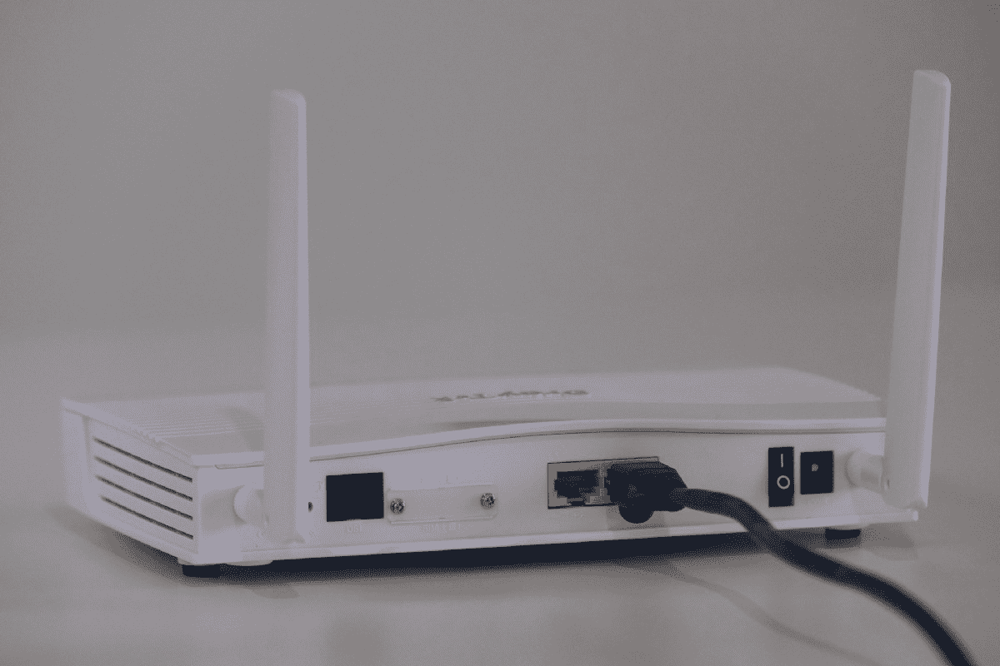
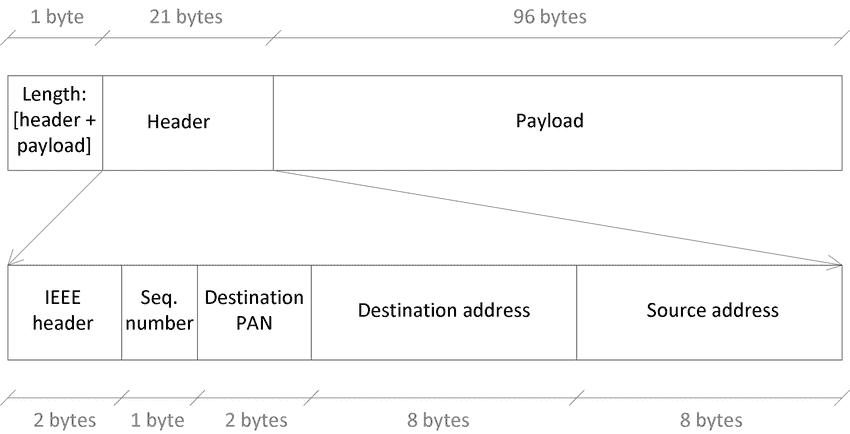
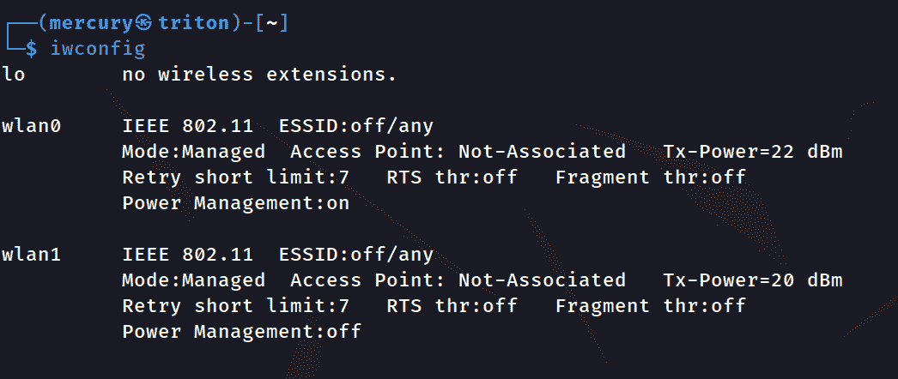
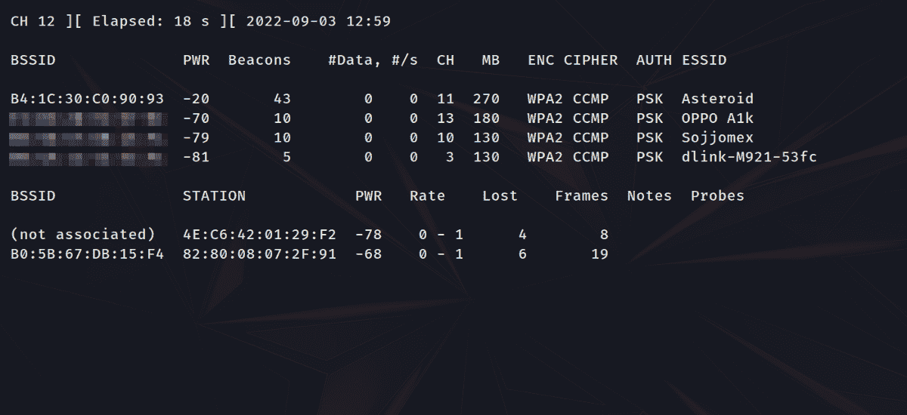
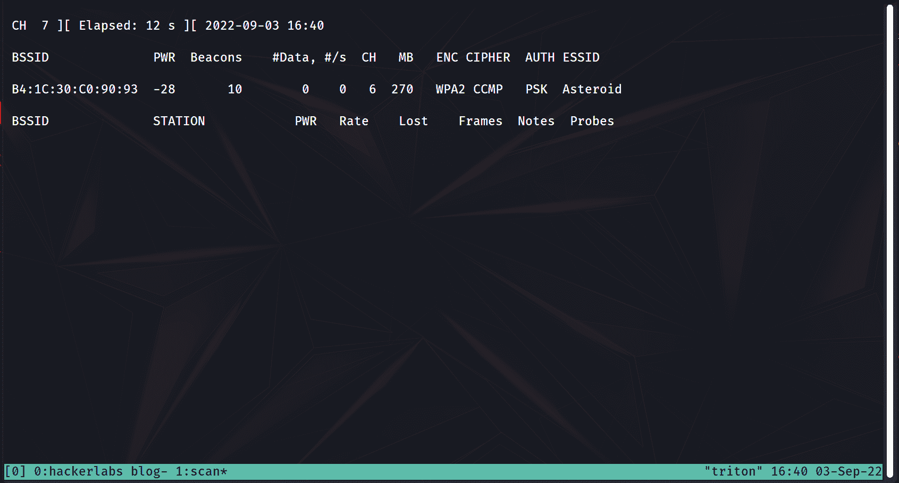
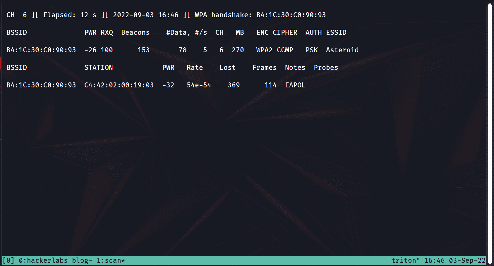
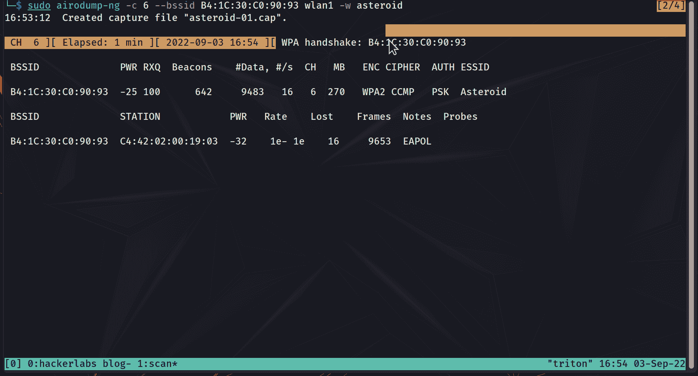
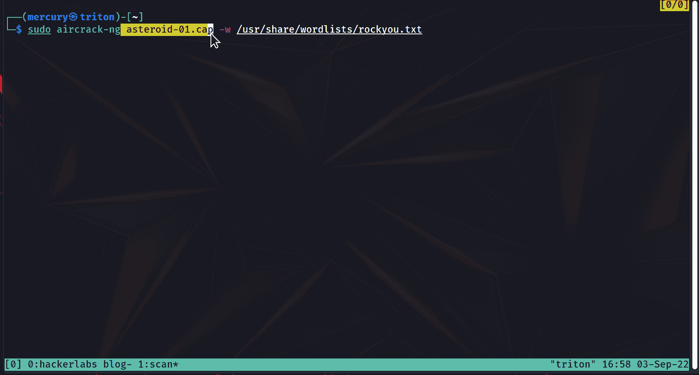

# Wi-Fi 黑客 101——如何入侵 WPA2 并防御这些攻击

> 原文：<https://www.freecodecamp.org/news/wi-fi-hacking-101/>

各位，欢迎来到 Wi-Fi 黑客的世界。💻。

在我的[上一篇文章](https://www.freecodecamp.org/news/linux-basics/)中，我们谈到了一些基本的 Linux 技巧和窍门。在这篇文章中，你将学习一个使用这些技巧的基本 Wi-Fi 黑客程序。

您将学习如何:

1.  监控您周围的 Wi-Fi 网络
2.  执行拒绝服务攻击
3.  保护自己免受 Wi-Fi 攻击

免责声明:这只是出于教育目的(当然，也是为了好玩)。不要在任何情况下，条件下，或不明智的朋友的影响下使用你在这里学到的黑客组织，个人，或你可能讨厌的邻居。你将会犯罪，你将会被罚款，被送进监狱，或者只是让你的父母感到尴尬。

既然我们已经有了那个可爱的介绍，让我们继续吧。🙃

## 我们将涵盖的内容:

以下是本教程内容的基本概要:

1.  介绍
2.  什么是数据包？
3.  如何破解 WPA2
    *   先决条件
    *   如何将网卡置于监控模式
    *   如何寻找目标
    *   如何捕获握手数据包
    *   如何执行拒绝服务攻击
    *   如何获得密码(希望如此)
4.  针对 WiFi 攻击的缓解措施
5.  结论

## 介绍



A router ¦ Credit: Unsplash.com

无线保真(Wi-Fi)是我们许多人在日常生活中使用的一项常见技术。无论是在学校、家里，还是仅仅在网飞狂欢，越来越少看到有人在没有它的情况下进行与互联网相关的活动。

但是你试过黑 Wi-Fi 吗？🤔(我肯定你已经动心了😏).

为了破解某个东西，你需要知道它是如何工作的。这意味着你首先需要了解技术是如何工作的。所以让我们从最基本的开始:包。

## 什么是数据包？



A Basic Packet. Credit: ResearchGate.com

数据包是计算机网络中数据的基本单位/构建块。当数据从一台计算机传输到另一台计算机时，它被分解并以数据包的形式发送。

想想像乐高积木一样的包裹。您(计算机)从卖方(另一台计算机)处收到完整的成套数据(完整的数据)。然后，您将根据给出的说明将积木组装在一起，构建出图形，以便欣赏它(或者在这种情况下，让整个数据有意义)。

数据包也称为数据报，由两个基本部分组成:

1.  头球
2.  有效载荷/数据

报头包含关于分组的信息。这有助于网络和接收计算机知道如何处理它，例如源和目的 IP 地址。

有效载荷是数据包包含的主要内容。同样值得一提的是，数据包可以被加密，这样如果被攻击者得到，他们的数据就不能被读取。

在网络中，分组是分组交换的要求。分组交换意味着将数据分解成包，并使用不同的路由将它们发送到不同的计算机。当收到这些信息包时，计算机就可以组合这些信息包来理解所有的信息。互联网是地球上已知的最大的分组交换网络。

现在让我们看看如何将这些知识应用到无线网络中。

## 如何破解 WPA2


A bunch of random code. Credit: Unsplash.com

Wi-Fi 可以使用许多不同的协议为您提供安全的互联网连接。从最不安全到最安全，它们是:

1.  打开
2.  有线等效保密协议
3.  WPA2(保护无线电脑网络安全系统 2)
4.  WPA3(保护无线电脑网络安全系统 3)

一个开放的网络就像它的名字所暗示的那样——开放。它没有密码，几乎任何人都可以连接到它。

WEP 是一种旧协议，很少使用，并且像它的后继协议一样需要密码。

WPA2 是全球最常用的协议。WPA3 是迄今为止已知的最新和最安全的协议。但是它很少使用，只能在新的设备上使用。

### 先决条件

Wi-Fi 的工作原理是不断向您的认证设备发送数据包。为了破解它，你需要:

1.  一台 Linux 机器(最好是 Kali Linux)
2.  无线适配器

从头开始安装 Kali，可以按照[这个教程](https://www.freecodecamp.org/news/how-to-install-kali-linux/)来。

如果你还没有，你需要在你的机器上安装一个叫做 Aircrack-ng 的工具。要安装它，只需输入下面的命令。

```
sudo apt install aircrack-ng
```

### 如何将网卡置于监控模式

你首先想要得到关于目标的信息。这就是黑客所说的侦察。

为此，您需要首先将无线网卡从“管理”模式更改为“监控”模式。这将使它从一个简单的网卡变成一个无线网络阅读器。

首先你需要找出你的无线网卡的名称。插入您的适配器并运行`iwconfig`命令来找出答案。通常是名单上的最后一个。



iwconfig. Credit: Daniel Iwugo

如你所见，我的是`wlan1`。现在运行以下命令:

```
sudo airmon-ng check rfkillsudo
airmon-ng start <network interface>
```

`sudo`表示需要 root 权限，`check rfkill`停止可能阻碍网卡进入监控模式的进程，`start`告诉 airmon-ng 在哪个网卡上执行。将`<network interface>`替换为您的无线网卡名称。

`airmon-ng`是一个脚本，可以立即将您的卡更改为监控模式。实际上，你可以手动或者自己编写一个脚本，但是我个人更喜欢简单的东西。

### 如何寻找目标

要查看您周围的网络，请运行以下命令:

```
sudo airodump-ng <network interface>
```



Airodump. Credit: Daniel Iwugo

`airodump-ng`是`aircrack-ng`套件的一部分，允许网卡查看其周围的无线流量。

正如你所看到的，我们得到了很多信息。但是让我们快速看一下 ESSID(扩展服务集标识符)列。也称为 AP(接入点)名称，这一列显示了目标网络的名称，在我的例子中是“Asteroid”。

你想专注于目标 AP，忽略其他的。为此，按 Ctrl+C 取消当前扫描，这一次，将网络的 bssid 附加到 bssid 标志，如下所示。

```
sudo airodump-ng <network interface> --bssid <AP>
```



Airodump in action. Credit: Daniel Iwugo

BSSID 代表基本服务集标识符，这是设备 MAC 地址的一个别出心裁的名字。您可以用它来识别网络上的设备，以及 ESSID(AP 的名称)。从技术上讲，您可以只使用 ESSID 标志，但是不同的 AP 可以有相同的名称。然而，没有两个接入点可以拥有相同的 BSSID。

下面是一个代码片段，您只需输入 ESSID 就可以获得 AP 的信息。

```
sudo airodump-ng <network interface> --bssid <AP ESSID>
```

注意:如果名称中有空格，请用引号括起来。比如`--bssid “Asteroid 1”`。

你会注意到我在“Station”栏下突出显示了连接到 AP 的客户端的 MAC 地址。它的左边是它所连接的 AP 的 MAC 地址。

### 如何捕获握手数据包

下一步是捕获握手包(还记得包吗？👀).当经过身份验证的设备连接到 AP 时，握手数据包是 AP 发送的前四个数据包。

这意味着我们有两个选择:

1.  等待设备连接到 AP
2.  取消设备的身份验证，然后让它连接到 AP

第二个听起来更有趣，所以让我们去做吧。


An LED keyboard. Credit: Unsplash.com

### 如何执行拒绝服务攻击

您可以使用`aireplay-ng`或`mdk4`暂时断开设备与接入点的连接。这被称为取消认证攻击或无线 DOS(拒绝服务)攻击。

游戏计划是这样的:

1.  设置 airodump-ng 以捕获数据包并保存它们
2.  当 airodump-ng 运行时，取消设备的身份验证一段时间
3.  捕捉握手

明白了吗？很好。我们走吧。👨‍💻👩‍💻

首先，运行命令来捕获和保存数据包:

```
sudo airodump-ng -c <channel number> --bssid <AP BSSID> <network interface> -w <path for saved packets file>
```



Airodump capturing packets. Credit: Daniel Iwugo

这里，我们使用`-c`标志来指定要搜索的信道，使用`--bssid`标志来指定 AP 的 MAC 地址，使用`-w`标志来指定保存捕获的数据包的路径。

快速教训:信道减少了接入点相互干扰的机会。运行`airodump-ng`时，可以识别 CH 栏下的频道号。

运行时，您将使用以下命令对与之连接的设备运行解除身份验证攻击:

```
sudo aireplay-ng -a <BSSID of the AP> --deauth <time> <network interface>
```

`-a`标志指定 AP 的 MAC 地址，`--deauth`指定您希望攻击运行多长时间(以秒为单位)，随后是网卡。

取消认证攻击包括使用您自己的网卡发送数据包来中断 AP 和客户端之间的通信。它并不完美，有时客户端可能会连接回来，但只是很短的时间。

如果您的 Wi-Fi 运行异常，并且您似乎正在断开连接，然后又随机重新连接，那么您可能遇到了去认证攻击。

在上面的命令中，您的目标是 AP 并运行攻击。请注意，您可以攻击任何连接到 AP 的设备，应该会得到相同的结果。您所需要做的就是将`-a`标志更改为任何连接设备的 MAC 地址。

当 DOS 攻击正在进行时，检查你的 airodump 扫描。你应该在右上方看到:`WPA handshake: <mac address>`。一旦您验证了这一点，您就可以停止重放攻击和`airodump-ng`扫描。



Carrying out the replay attack to get the handshake. Credit: Daniel Iwugo

### 如何获得密码(希望如此)

在最后的步骤中，您将对捕获的数据包运行一组生成的成对主密钥(pmk)来获取密码。让我来分解一下。

PMK 基本上是一个单词和 APs 名称的算法组合。我们的目的是针对握手使用单词表连续生成 pmk。如果 PMK 有效，用于生成它的字是**密码**。如果 PMK 无效，它会跳到列表中的下一个单词。

我将使用位于`/usr/share/wordlists`目录中的 rockyou 单词表。我认为这只能在 Kali 中找到，所以如果你有一个不同的操作系统，你可以手动创建一个或者使用`crunch`生成一个。

如果它还没有被提取，只需运行命令:

```
sudo gunzip /usr/share/wordlists/rockyou.txt.gz
```

快速历史课:rockyou 单词表是一串密码，来自最臭名昭著的网络安全数据泄露事件之一，该事件影响了同名公司。它包含大约 1400 万个独特的密码，这些密码在超过 3200 万个帐户中使用过，因此，它是这个星球上最可靠的单词列表之一。

现在运行命令:

```
sudo aircrack-ng <captured file with .cap> -w <path to wordlist>
```



Password cracking. Credit: Mercury

好了，各位——任务完成😎。

密码是，嗯……“密码”。从安全的角度来看，这很令人失望，但是我设置这个网络只是为了本教程的目的。实际上，根据密码的长度和强度，这可能需要几分钟到几小时。

要清理，只需删除文件捕获，关闭您的终端，并运行命令`service NetworkManager restart`将您的网卡更改回管理模式，这样您就可以连接到 Wi-Fi。

## 针对 WiFi 攻击的缓解措施


A basic personal workspace setup ¦ Credit: Wallpaperflare.com

从防御的角度来看，基本的 Wi-Fi 安全应该能够应对这种攻击。使用较新的协议 WPA3 是对抗这种攻击的最佳选择。为了减轻反认证攻击，如果可能，使用以太网连接。

假设这个选项不在桌面上，您可以使用一个强密码短语(不是密码)来最小化攻击者得到它的机会。密码短语是简单用作密码的一串单词。密码短语往往比密码更长，更容易记忆，也更少见。因此，它们很难在单词表中找到。

例如，“mercury”比“mercurylovespluto”更有可能出现在单词列表中。后者是一个由 15 个字符组成的密码，虽然简单，但攻击者很难找到、猜出或生成它。

另一个缓解措施是禁用 WPS (Wi-Fi 保护设置),并避免在任何情况下使用使用 WEP 协议的路由器。你只是在请求不必要的关注，因为这两个都比 WPA2 容易得多。

## 结论

让我们总结一下你学到的东西:

1.  使用 airmon-ng 将无线适配器更改为监控模式
2.  使用 airodump-ng 扫描目标 AP 并捕获数据包
3.  对 AP 进行 DOS 攻击以获取握手数据包
4.  一旦你确认你捕获了必要的数据包，就结束 DOS
5.  使用 aircrack-ng 生成 pmk 来运行握手数据包

有时，密码可能不在单词列表中。在这种情况下，有许多其他方式来获得密码，如邪恶的双胞胎攻击或你在这里学到的变化。我也鼓励你练习这个和你在那里发现的许多其他攻击，因为这有助于使你成为一个黑客高手。

请记住，这是**严格出于教育目的**。仅在他人同意的情况下，或在您自己的设备上执行此操作。

说到这里，我们已经到了这篇文章的结尾。希望你喜欢。正如我常说的，祝你黑客生涯愉快！🙃

### 资源

1.  [关于握手理论的更多解释](https://www.javatpoint.com/handshake-theory)
2.  [关于数据包的更多详细信息](https://www.cloudflare.com/learning/network-layer/what-is-a-packet/)
3.  [WPA2 vs WPA3](https://www.diffen.com/difference/WPA2_vs_WPA3)

### 承认

感谢[阿努洛瓦波·维克托](https://twitter.com/Anuoluwap__o?t=4Cv6VR2c2_wK5HLXwbvXCQ&s=09)、[奇纳扎·恩武克瓦](https://www.linkedin.com/in/chinaza-nwukwa-22a256230/)、[霍鲁米迪·梅茜](https://www.linkedin.com/in/mercy-holumidey-88a542232/)、[恩宠·奥乔](https://www.linkedin.com/in/favour-ojo-906883199/)、[乔治娜·阿瓦尼](https://www.linkedin.com/in/georgina-awani-254974233/)，以及我的家人在撰写这篇文章时所给予的灵感、支持和知识。你们是我的无名英雄。

封面图片来源:来自 Wallpaperflare.com 的乐高绅士们正在制作路由器