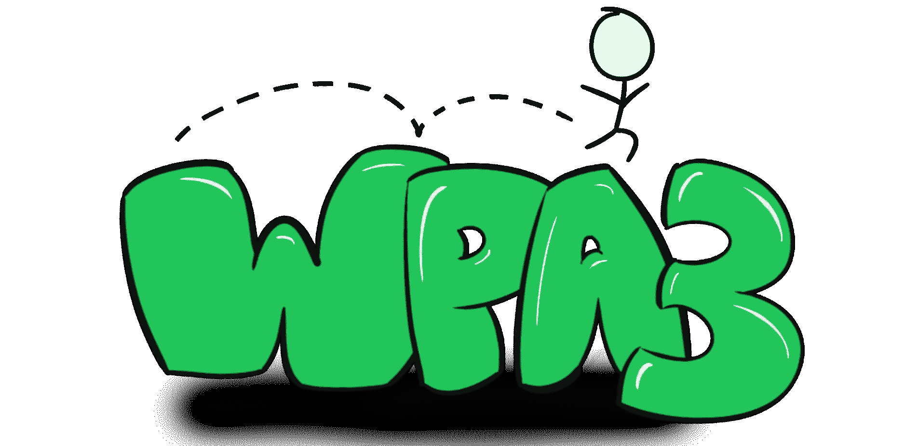
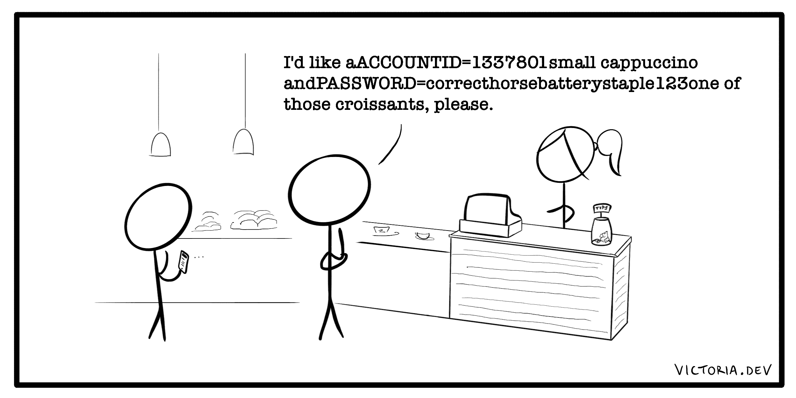

# WPA 密钥、WPA2、WPA3 和 WEP 密钥:Wi-Fi 安全说明

> 原文：<https://www.freecodecamp.org/news/wifi-security-explained/>

设置新的无线网络？挑选您需要的密码类型看起来像是一个任意的选择。毕竟，WEP、WPA、WPA2 和 WPA3 几乎都有相同的字母。

密码就是密码，有什么区别？大约 60 秒到数十亿年。

所有 Wi-Fi 加密并非生而平等。让我们来探索是什么让这四个首字母缩略词如此不同，以及如何才能最好地保护您的家庭和组织的 Wi-Fi。

## 有线等效保密(WEP)

一开始，有 WEP。

[有线等效保密](https://en.wikipedia.org/wiki/Wired_Equivalent_Privacy)是 1997 年提出的一种过时的安全算法，旨在为有线连接提供等效的安全性。“弃用”的意思是，“我们不要再那样做了。”

即使在首次推出时，它也没有达到应有的强度，原因有二:

*   其底层加密机制，以及
*   二战。

二战期间，密码破解(或密码分析)的影响[巨大](https://en.wikipedia.org/wiki/History_of_cryptography#World_War_II_cryptography)。政府的反应是试图将他们最好的秘制酱料配方留在国内。

大约在 WEP 时代，[美国政府对加密技术出口的限制](https://en.wikipedia.org/wiki/Export_of_cryptography_from_the_United_States)导致接入点制造商将其设备限制为 64 位加密。尽管后来提升到了 128 位，但这种形式的加密也只能提供非常有限的[密钥长度](https://en.wikipedia.org/wiki/Key_size)。

这对 WEP 来说是个问题。较小的密钥大小导致更容易被[暴力破解](https://en.wikipedia.org/wiki/Brute-force_attack)，尤其是当密钥不经常改变的时候。

WEP 的底层加密机制是 [RC4 流密码](https://en.wikipedia.org/wiki/RC4)。这种密码因其快速和简单而广受欢迎，但这是有代价的。

这不是最稳健的算法。WEP 在其用户中使用一个共享密钥，该密钥必须在接入点设备上手动输入。(你上次改 Wi-Fi 密码是什么时候？没错。)

WEP 通过简单地将密钥与初始化向量连接在一起也于事无补——也就是说，它在某种程度上将其秘密片段混合在一起，并希望得到最好的结果。

[初始化向量(IV)](https://en.wikipedia.org/wiki/Initialization_vector) :对一个[低级密码算法](https://en.wikipedia.org/wiki/Cryptographic_primitive)的固定大小输入，通常是随机的。

结合 RC4 的使用，这使得 WEP 特别容易受到[相关密钥攻击](https://en.wikipedia.org/wiki/Related-key_attack)。在 128 位 WEP 的情况下，你的 Wi-Fi 密码可以在大约 [60 秒](https://shawnhogan.com/2006/08/how-to-crack-128-bit-wireless-networks.html)到[3 分钟](https://www.networkcomputing.com/wireless-infrastructure/fbi-teaches-lesson-how-break-wi-fi-networks)内被公开的工具破解。

虽然一些设备开始提供 152 位或 256 位 WEP 变体，但这未能解决 WEP 底层加密机制的根本问题。

所以，是的。我们不要再那样做了。

## 保护无线电脑网络安全系统(WPA)

一个新的临时标准试图暂时“修补”WEP(缺乏)安全性的问题。保护无线电脑网络安全系统(WPA)T1(T2)这个名字听起来更安全，所以这是一个好的开始。然而，WPA 最初是以另一个更具描述性的名称开始的。

在 2004 年 IEEE 标准中批准的[，](https://en.wikipedia.org/wiki/IEEE_802.11i-2004)[临时密钥完整性协议(TKIP)](https://en.wikipedia.org/wiki/Temporal_Key_Integrity_Protocol#Beck-Tews_attack) 使用动态生成的每个数据包的密钥。发送的每个数据包都有一个唯一的临时 128 位密钥(参见？描述性的！)解决了 WEP 共享密钥混合带来的相关密钥攻击的易感性。

TKIP 还实施了其他措施，如[消息认证码(MAC)](https://en.wikipedia.org/wiki/Message_authentication_code) 。有时被称为校验和，MAC 提供了一种加密方法来验证信息没有被更改。

在 TKIP，无效的 MAC 也可以触发会话密钥的密钥更新。如果接入点在一分钟内两次收到无效的 MAC，可以通过更改攻击者试图破解的密钥来应对入侵企图。

不幸的是，为了保持与 WPA 旨在“修补”的现有硬件的兼容性，TKIP 保留了与 WEP 相同的底层加密机制 patch 流密码。

虽然它确实改进了 WEP 的弱点，但 TKIP 最终被证明容易受到新的攻击，这些攻击扩展了以前对 WEP 的攻击。

相比之下，这些攻击需要更长的时间来执行:例如，在一种情况下[12 分钟](http://dl.aircrack-ng.org/breakingwepandwpa.pdf)，而在另一种情况下 [52 小时](https://www.rc4nomore.com/)。然而，这足以让我们认为 TKIP 不再安全。

WPA，即 TKIP，也已被弃用。所以我们也不要再这样做了。

这就把我们带到了…

## 保护无线电脑网络安全系统二世(WPA2)

改进后的保护无线电脑网络安全系统 II (WPA2)标准没有花费精力想出一个全新的名字，而是专注于使用一种新的底层密码。

代替 RC4 流密码，WPA2 采用了一种称为[高级加密标准(AES)](https://en.wikipedia.org/wiki/Advanced_Encryption_Standard) 的分组密码来形成其加密协议的基础。

该协议本身，缩写为 [CCMP](https://en.wikipedia.org/wiki/CCMP_(cryptography)) ，其安全性大部分来自其相当长的名字的长度(我是开玩笑的):计数器模式密码块链消息认证码协议，简称为计数器模式 CBC-MAC 协议，或 CCM 模式协议，或 CCMP。？

CCM 模式本质上是几个好主意的结合。它通过 [CTR 模式，或计数器模式](https://en.wikipedia.org/wiki/Block_cipher_mode_of_operation#Counter_.28CTR.29)提供数据保密性。非常简单地说，通过加密不重复的计数序列的连续值，这增加了明文数据的复杂性。

CCM 还集成了 [CBC-MAC](https://en.wikipedia.org/wiki/CBC-MAC) ，这是一种用于构建 MAC 的分组密码方法。

AES 本身有很好的基础。AES 规范由美国国家标准与技术研究所(NIST)于 2001 年制定。他们经过五年的竞争性选择过程做出了选择，在此过程中，对 15 个算法设计提案进行了评估。

作为这个过程的结果，一个被称为 Rijndael(荷兰语)的密码家族被选中，其中的一个子集成为 AES。

在过去二十年的大部分时间里，AES 一直被用于保护日常的互联网流量以及美国政府的某些级别的机密信息。

虽然已经描述了对 AES 的可能攻击，但是还没有一个被证明在现实世界中是可行的。众所周知，对 AES 最快的[攻击是](https://web.archive.org/web/20141230025103/http://research.microsoft.com/en-us/projects/cryptanalysis/aesbc.pdf)[密钥恢复攻击](https://en.wikipedia.org/wiki/Key-recovery_attack)，它将暴力破解 AES 提高了大约四倍。需要多长时间？有的[几十亿年](https://web.archive.org/web/20150108165723/https://blog.agilebits.com/2011/08/18/aes-encryption-isnt-cracked/)。

## 保护无线电脑网络安全系统协议三(WPA3)

自 2020 年 7 月 1 日起，WPA 三部曲的下一部[已被新设备](https://www.wi-fi.org/download.php?file=/sites/default/files/private/Certification_Overview_v5.2_0.pdf)要求。期望进一步增强 WPA2 的安全性， [WPA3 标准](https://www.wi-fi.org/news-events/newsroom/wi-fi-alliance-introduces-wi-fi-certified-wpa3-security)寻求通过对单词列表或[字典攻击](https://en.wikipedia.org/wiki/Dictionary_attack)更具弹性来提高密码安全性。

与其前身不同，WPA3 还将提供[前向保密](https://en.wikipedia.org/wiki/Forward_secrecy)。这增加了保护先前交换的信息的相当大的好处，即使长期秘密密钥被泄露。

像 TLS 这样的协议已经通过使用非对称密钥建立共享密钥来提供前向保密。你可以在这篇文章中了解更多关于 TLS 的信息。

由于 WPA2 没有被否决，所以 WPA2 和 WPA3 仍然是你的 Wi-Fi 安全的首选。

## 如果其他的不好，为什么他们还在？

你可能想知道为什么你的接入点甚至允许你选择一个选项，而不是 WPA2 或 WPA3。可能的原因是你正在使用传统的硬件，也就是技术人员所说的你妈妈的路由器。

由于 WEP 和 WPA 是最近才被弃用的，因此在大型组织以及您父母的家中，都有可能找到仍在使用这些协议的旧硬件。甚至较新的硬件也可能有支持这些旧协议的业务需求。

虽然我可能能够说服你投资一个闪亮的新的顶级 Wi-Fi 设备，但大多数组织是一个不同的故事。不幸的是，许多人还没有认识到网络安全在满足客户需求和提高底线方面的重要作用。

此外，切换到更新的协议可能需要新的内部硬件或固件升级。尤其是在大型组织的复杂系统中，升级设备在经济上或战略上都很困难。

## 提高您的 Wi-Fi 安全性

如果可以的话，选择 WPA2 或者 WPA3。网络安全是一个日新月异的领域，固步自封会带来可怕的后果。

如果你不能使用 WPA2 或 WPA3，尽你所能采取额外的安全措施。

最划算的方法是使用虚拟专用网络(VPN)。无论你有哪种类型的 Wi-Fi 加密，使用 VPN 都是一个好主意。在开放的 Wi-Fi(咖啡店)和使用 WEP 时，不使用 VPN 显然是不负责任的。

这有点像你点第二杯卡布奇诺时喊出你的银行信息。

选择一个 VPN 提供商，如果您的 VPN 断开连接，该提供商可以提供类似切断开关的功能来阻止您的网络流量。这可以防止您在不安全的连接(如开放的 Wi-Fi 或 WEP)上意外传输信息。在这篇文章中，我写了更多关于[选择 VPN 的三大考虑因素。](https://victoria.dev/blog/vpn)

如果可能，请确保只连接到您或您的组织控制的已知网络。

许多网络安全攻击是在受害者连接到一个模仿的公共 Wi-Fi 接入点时执行的，这也称为邪恶的孪生攻击，或 Wi-Fi 网络钓鱼。

这些虚假热点很容易使用公共程序和工具创建。VPN 也可以帮助减轻这些攻击带来的损害，但是最好不要冒这个风险。

如果你经常旅行，考虑购买一个使用蜂窝数据计划的便携式热点，或者为你的所有设备使用数据 SIM 卡。

## 不仅仅是首字母缩写

WEP、WPA、WPA2 和 WPA3 的含义远不止一堆相似的字母——在某些情况下，这是几十亿年减去大约 60 秒的差别。

从更长远的角度来看，我希望我已经教了你一些关于 Wi-Fi 安全性的新知识，以及如何提高它！

如果你喜欢这篇文章，我很想知道。在 victoria.dev 上加入成千上万和我一起学习的人吧！通过 RSS 访问或[订阅更多编程、网络安全和卡通爸爸笑话。](https://victoria.dev/index.xml)