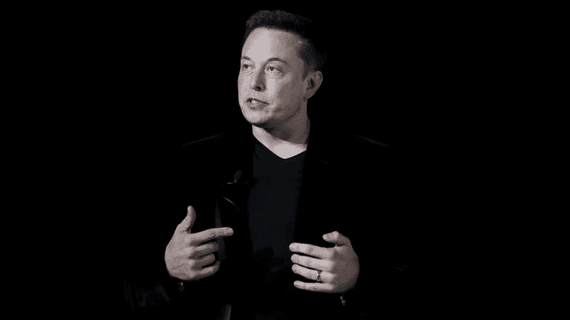
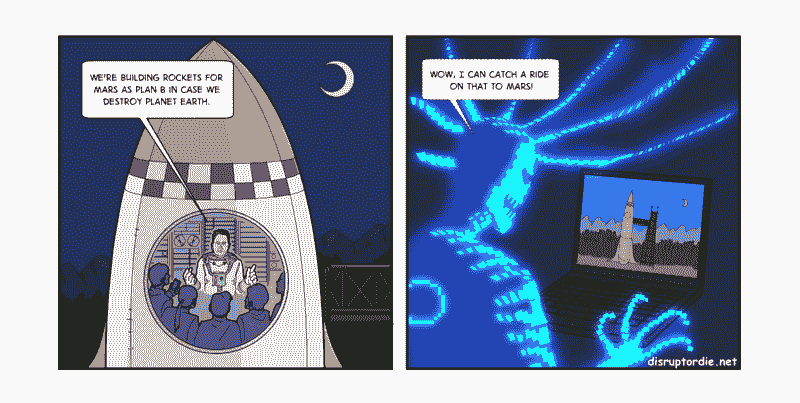
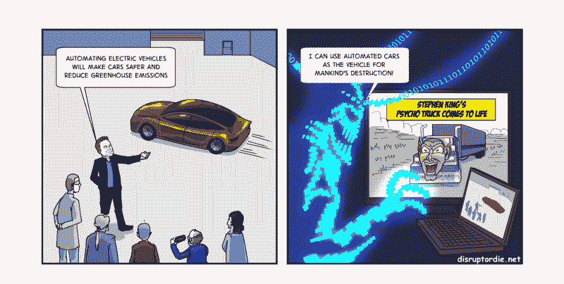
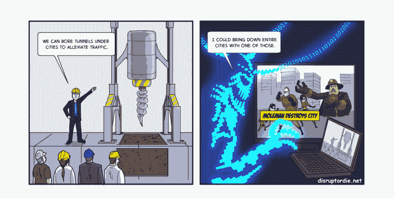

# 埃隆·马斯克是我们的救世主还是毁灭者？

> 原文：<https://www.freecodecamp.org/news/will-elon-musk-be-our-savior-or-our-destroyer-b0e3d6d46db/>

作者:Jedidiah Yueh

# 埃隆·马斯克是我们的救世主还是破坏者？

Photo credit: Finding a way out of the dark ages. ([Reuters/Stephen Lam](https://goo.gl/UcYpob))

世界终于见到了第一个疯狂的科学家:埃隆·马斯克。

埃隆·马斯克是狄更斯笔下的人物。他高大威武，但有一张奇怪的孩子气的脸。他的表情带着过去留下的淡淡的伤疤，带着他在南非沙文主义和暴力的世界中成长所忍受的痛苦。然而，艾梅柏·希尔德或其他女演员挽着他的胳膊，他似乎很好地平衡了这种关系。

马斯克的野心和影响力是无限的。他让谷歌著名的[登月](https://x.company/)看起来没有野心，因为**实际上瞄准了火星**。

在他的最新声明中，马斯克公布了一项计划，以经济舱机票的价格在 30 分钟内将你送到世界上的任何地方。“如果我们建造这个东西是为了去月球和火星，”他说，“那为什么不去地球上的其他地方呢？”

除了火箭(SpaceX)，他现在和以前的公司还生产电动汽车(特斯拉)、太阳能瓦片(SolarCity)和电子支付(PayPal)。他现在正在挖掘隧道以对抗交通(the Boring Company)，并投资技术将我们变成电子人(Neuralink)。所有这些都是为了对抗 AI 变得疯狂的幽灵。

如果有谁体现了“只要你用心，就能做任何事”的精神，那就是埃隆·马斯克。

### **尺寸很重要**

说到视野，尺寸很重要。没有人比埃隆·马斯克更有远见。

1969 年，在冷战最激烈的时候，我们把人送上了月球。苏联解体后，美国国家航空航天局从世界舞台的顶峰跌落到一个古老、黑暗的技术地下室。

直到埃隆·马斯克的到来，火箭科学才重新出现在世界舞台上。马斯克在 SpaceX 的愿景是“让人们能够在其他星球上生活”，这是地球的 B 计划。

马斯克想殖民火星，而不是把人送上月球。

**此嵌入来自外部网站，似乎不再可用**

视野是有限度的。近视是一种风险，但远视(远视)是一种同等的风险。如果你不能在愿景上执行，那就不是愿景。这是徒劳的野心。

2008 年，埃隆·马斯克(Elon Musk)是一次失败的火箭发射，距离灾难性的内爆只有一步之遥。特斯拉(再次)错过了发货日期，并很快耗尽了剩余的现金。SpaceX 发射的前三枚火箭都失败了，其中一枚真的爆炸了，该公司只能再尝试一次。

尽管遭受了连续三次罢工，马斯克在公司声明中承诺，“我永远不会放弃，我是说永远不会。”

他投资了 Zip2 和 PayPal 的所有收益，说服了家人和朋友投资他们的储蓄，当时他正处于破产的边缘。

如果第四枚火箭发射失败，埃隆·马斯克可能永远都不会康复。

但它成功了，在一些严重的财务操纵后，马斯克说服特斯拉的投资者延长了另一轮融资。

埃隆·马斯克走过成功和失败的刀锋，并活着讲述了这个故事。但是如果刀子反过来切呢？如果这对人类来说是另一种方式呢？

### **意外的极地后果**

如果我在构思埃隆·马斯克的个人愿景和使命，它会说，“人类已经失控了。我的使命是拯救人类。”

疯狂科学家面临的挑战是，他们不可避免地要打造一把双刃剑。

马斯克创立 OpenAI 是为了对抗人工智能对人类构成的生存威胁。他一直公开倡导政府对科技公司及其人工智能项目进行监管。

但是政府不能解决问题。与人工智能开发的快速迭代周期相比，政府理解技术和威胁，然后实施监管的周期时间太长了。

更糟糕的是，即使各国政府都听马斯克的，也不是所有政府都会遵从。俄罗斯和中国几乎肯定会无视监管。马斯克自己也在推特上写道，“这是开始…”关于弗拉基米尔·普京对人工智能重要性的看法。

如果我们在遵守的国家监管人工智能的发展，难道我们不是把人工智能——人类历史上最危险的潜在发明——留在拒绝的国家手中吗？马斯克不是正中普京的下怀吗？

作为他反人工智能战略的一部分，马斯克还创建了 [Neuralink](https://www.theverge.com/2017/3/27/15077864/elon-musk-neuralink-brain-computer-interface-ai-cyborgs) 作为一种方法，让人类通过与计算机连接的神经系统进化为电子人。

如果人工智能可以使用脸书的饲料对我们的社会进行重新编程，那么神经鞋带不会给人工智能提供前所未有的途径来劫持我们的思想和身体吗？

Plan C: Elon Musk vs. AI

今天，超级人工智能(而不是狭隘的、按规定训练的机器学习和深度学习变体)将面临的少数障碍之一是物理差距。这种差距仍然需要人类来维持数据中心的运行，而人类必须注意维护核心设施(如电力)所需的漫长供应链中的物理断裂。

但 Neuralink 可能会让人工智能跳过这一障碍。

马斯克雄心勃勃的地球 B 计划如何——殖民火星？这种努力的计算需求是巨大的。难道 AI 在去孤独的红色星球的路上就不能在电脑系统上搭便车吗？

Plan B: Elon Musk vs. AI

然后是他的全球变暖运动。电动汽车和太阳能电池板肯定会大幅减少全球排放量。但马斯克已经实现了自动驾驶——人工智能软件来控制他的汽车，可以通过互联网上的新软件版本轻松更新。

在 1997 年上映的斯蒂芬·金电影《卡车》中，杀人的卡车活了过来，并开始杀死所有的角色。难道看了《网飞》这部电影的人工智能不能被启发使用自动驾驶汽车作为人类灭绝的工具吗？

Plan D: Elon Musk vs. AI

让我们不要开始讨论人工智能可能会对 Boring Company 的巨型钻探机做什么，这些机器可以在世界上人口最多的城市下面快速挖掘隧道。

Plan E: Elon Musk vs. AI

好莱坞对未来的描绘自然是可怕的。**终结者*的天网会策划全球核战争并派遣机器人去灭绝人类吗？*

*我们不知道超级人工智能何时会出现，也不知道它的性质是否会是二元的——善或恶。我们不知道它是否会是单一的，或者聚合进化是否会给我们带来多个超级人工智能来与之抗衡。*

*我们确实知道，如果人工智能真的出现，它肯定会比埃隆·马斯克(或我们中的任何人)更聪明。那么，人工智能会如何利用埃隆·马斯克发明的迷人而激进的世界呢？*

*在埃隆·马斯克(Elon Musk)说服顺从的世界监管人工智能之前，或许他应该考虑他的发明潜在的意想不到的后果，并更多地考虑监管自己。*

*毕竟，人类的命运可能掌握在他手中。*

*感谢阅读！如果你喜欢这篇文章，请按住下面的按钮？帮助其他人找到它。你拿的时间越长，你给的掌声就越多！*

#### *关于我*

*我花了 20 年时间解码创新，收集驱动当今许多最成功的技术企业家的隐藏框架。我亲自实施了这些框架，在 Delphix 和 Avamar 开发了软件产品，销售额超过 40 亿美元。 [*扰乱或消亡*](https://goo.gl/FhRst5) 是我的第一本书。*

*本文部分内容摘自 *Disrupt or Die。**